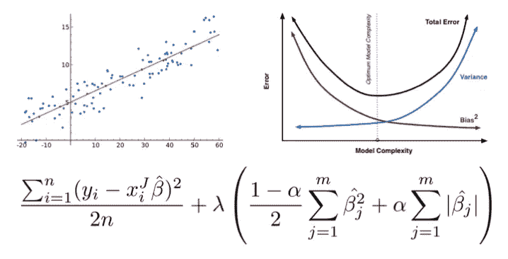
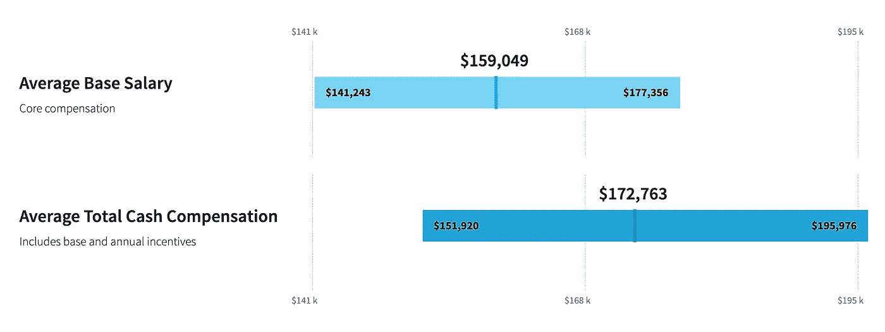
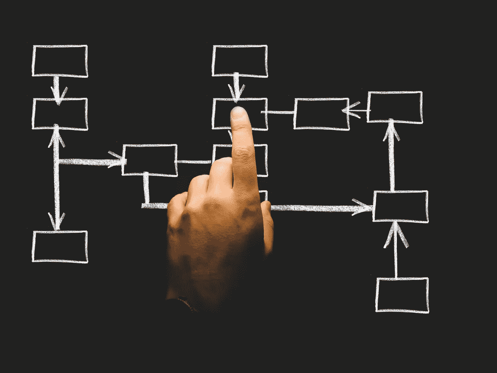
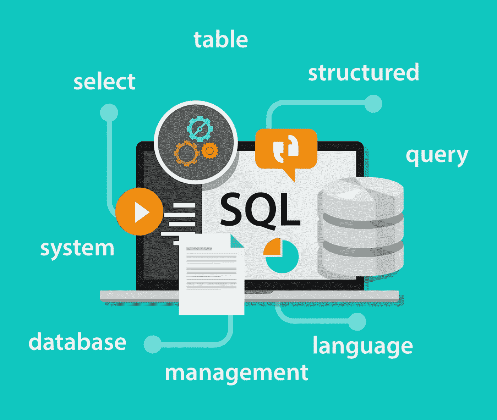
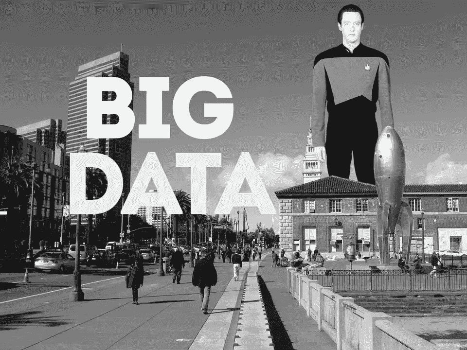
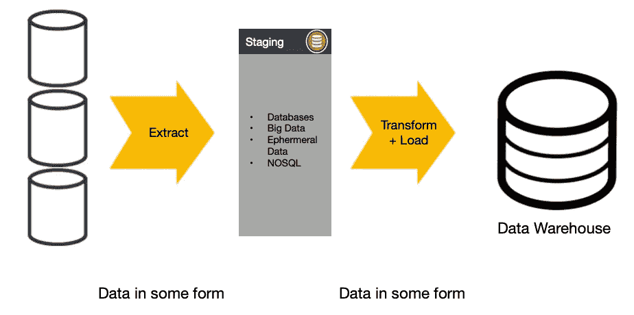

# 你在数据科学训练营中学不到的东西

> 原文：<https://towardsdatascience.com/what-you-dont-learn-in-data-science-bootcamps-abfd1af60a9e?source=collection_archive---------10----------------------->

## 之后要学习的五件事

作为大会数据科学沉浸式的前讲师，我教了一千多名学生如何用数据解决问题，并有幸从一开始就创作和策划了相当大一部分学校的课程。声明一下，目前我不支持任何可用的数据科学训练营或教育项目。然而，我对那些参加过数据科学训练营、不知道下一步该学什么的人(或者有抱负的数据科学家)有一些建议。

# 为什么是训练营？

让我们以一个受欢迎的大学项目为例，比如加州大学伯克利分校的信息和数据科学硕士。要获得 UCB 大学的数据科学硕士学位，需要超过 6 万美元，微积分、线性代数的先决条件，一张相关定量领域的学士学位证书，以及大学水平的基础工程课程的良好成绩。这是当今大多数大学课程的反映。如果你是自学的，或者没有更正规的数学、统计学和工程学背景，上大学就不那么容易了。

事实上，如果你想走大学路线(例如佐治亚理工学院的在线分析科学硕士)，有更好的选择。

数据科学训练营通常分为两种类型:

*   兼职:10-12 周，每周晚上约 6 小时
*   全职:10–12 周，每周 40 小时，上午 9 点至下午 5 点

向潜在学生推销(有时是强烈暗示)的想法是，一个人可以在短期的专门学习中成为数据科学专家。你花 2-6 万美元参加一个业余班，或者花 16 万美元以上参加全日制班，但仍然要投入相当多的时间和资源，无论哪种情况，都比你花在全日制硕士项目上的钱要少。此外，许多数据科学训练营提供融资，因此参加训练营的先决条件较少；当你权衡这样一个机会的成本效益时，这些都是令人信服的理由。

数据科学训练营的软先决条件也是这条路线提供的一个方面，它既有优势，又保证了你潜在同学的知识和能力的差异。主要是，根据学校的不同，提供的是某种形式的评估，衡量先决知识和你的数学、统计和基本 Python 或 R 基础知识的能力。评估的结果对你需要学习的特定科目的材料清单和简短形式的课程是权威的。这种招生过程将学生引导到特定的学习领域，与传统的大学课程形成对比，训练营招生过程允许你根据自己的评估学习一组非常简明的主题，为第一天的课程做准备。归根结底，训练营是一所私立的营利性学校，对你的入学感兴趣。

通常，没有完成前提工作的学生，一旦他们意识到课程的节奏和广度比他们预期的更激烈，他们就会在两周后为了退款而退出训练营。在我看来，上课的节奏就像用消防水管喝水一样。然而，课程很简洁，重点是实践应用。概念非常快地建立在彼此之上；然而，它留下了很小的空间来放慢速度或错过任何课程。

未来的学生会问我的最普遍的问题是，在为期 12 周的紧张课程后，他们是否真的可以“受雇”成为分析师或数据科学家。我会说是的，但这取决于你以前的背景。没有任何编程、统计、数学或机器学习经验的人毕业后，如果简历上只有一个数据科学项目，而没有任何其他与数据科学相关的内容，将会很艰难。

完成毕业设计后找工作并不是一件不可能的事情，我见过很多学生在充满挑战的就业市场中找到工作的方法，但大多数都有成功的结果。学生接受像数据科学家、数据工程师、分析师和其他数据科学角色这样的工作。

## 你班上有谁？

你的同学是定量金融分析师、生物学家、精算师、以前的高中数学老师、风险投资家、会计师、工程师或任何与工程或数据无关的人。这些学生中的大多数要么有质量学位，要么有应用工程背景，与那些两者都没有的学生混在一起。

作为一名教师，最难解决的一个问题是给一个班的学生上课，他们在统计学、数学和工程学方面的能力各不相同。尽管我确实认为学生知识和编程能力的总体平均水平在一定程度上影响了教学质量，但如果你有成长意识，这也是向更博学的同学学习的绝佳机会。

由于每个群组都包含了各种各样的人，他们有着不同的背景、信仰和能力，每个人都面临着各种各样的挑战。一般来说，学生们要么更容易理解所介绍的理论概念，要么更容易理解编程方面。一些学生在两者都没有背景的情况下挣扎，但我倾向于相信这些学生接受了一种向未知学习的纪律，因此生存得很好。

一般来说，有定量背景的学生帮助更多有工程头脑的学生，反之亦然。在训练营式的项目中，每个人都有一个共同的经历，那就是在这一点或那一点上与一两个概念进行实质性的斗争。学生们苦苦挣扎的想法对每个人来说都是独特和不同的。

You will learn these concepts within the first few weeks in a data science bootcamp class.

刚学会线性回归？很好，现在让我们学习线性回归许多正则化形式，共线性如何影响模型的质量，以及您刚刚学习的建模领域中隐含的偏差-方差权衡的影响。我刚才提到的这些概念是在传统环境下几个月或几年的学习，但如果学生在训练营式的课堂上集中注意力，他们可以在大约一周内获得所有内容的“要点”。

## 你学到了什么？

您将获得经典机器学习算法的精彩概述，以及如何实现这些算法的基本理解。如果您参加兼职课程，您将学习如何:

*   导入库
*   用某种形式的数据框清理和转换数据
*   训练和评估模型
*   使用数据库(最低限度)

您还将学习如何应用最基本的 ML 领域，包括:

*   监督和非监督学习
*   回归
*   分类
*   NLP 贝叶斯
*   时间序列
*   神经网络
*   “注意”一些大数据工具集

全职“沉浸式”与兼职课程的最大区别是更多的从头开始编写 ML 模型，更多的动手项目，更多的讲座，以及更多的整体实践。如果你看一下每小时的成本，全日制课程会更有价值，但特别是因为你可以向导师要求一对一的时间和可能的工作安排(成果)支持，这取决于学校。

你会学习如何做机器学习吗？是的。你会学习如何更好地编码吗？是的。你对统计学的理解是否足够有用？很有可能。你能学到足够的知识来继续自学并跟上时代吗？绝对的。这也将是你一生中最艰难但最值得的教育经历之一。这只是众多途径中的一种，取决于你对压力和成长的承受能力，以及上大学的成本节约选择。

Salary.com report on data scientist salaries in the San Francisco Bay Area, Sept. 2019.

你会知道如何有效地面试吗？不太可能，因为大多数项目的这一领域不够严格。在 12 周结束时，现实生活中的数据科学工资和训练营后的候选人之间的差距将会小得多，但门控因素可能不仅仅是了解足够的统计学、数学或机器学习。你还必须能够编写一个中级工程师水平的代码(我的观点)，但这在正确的专注和准备水平下是可以实现的。我相信大多数学生在参加了数据科学训练营后都在数据科学领域找到了工作。尽管如此，在你第一天上课之前，你还是要付出更多的努力，而这些努力通常是不会被宣传的。

我对这类项目最重要的评估是，教授的内容与你需要做的事情之间的差距。训练营试图教你如何使用数据科学过程，但更侧重于指导你如何进行适当的 ML 实验。数据科学不仅仅是了解机器学习。数据科学就业市场仍在定义自己，但现在已经越来越清楚存在什么样的角色以及市场在这一点上的期望。企业正在招聘的候选人不仅擅长工程、统计和 ML，而且能够在与业务需求相关的同时与非技术经理沟通。

# 你学不到的

我有太多东西想写，真实世界中的数据科学是多么有趣和令人兴奋。有很多很酷的工具可以用来做有价值的模型评估，比如 scikit-learn 或 R Studio 中没有提到的。你可能会认为，经过 12 周左右的数据科学就是关于建模的，但老实说，数据科学家不会整天训练模型，除非你在做研究。建模包括大多数项目范围的 10-20 %,其余的将是查看数据，清理数据，并无情地问问题以从一组难以置信的模糊假设中定义地狱。

机器学习只会变得越来越有趣，但这不是最初在数据科学领域获得大多数工作的原因，除非职位完全是研究。几乎所有的数据科学训练营项目都有明显的盲点，因为数据科学不仅仅是建模。

## 1.如何确定展示业务影响的项目范围

让面试数据科学家职位的候选人与众不同的最大技能是，能够清楚地定义一个存在许多模糊之处的问题，同时以联系实际商业价值的方式解释最终结果。数据科学是一个过程。它必须在每一步证明其方法的合理性，并倡导其在现实世界中的存在，这包括训练模型和优化超参数，以及如何检查数据并从中提出正确的问题。

在参加了为期 12 周的数据科学课程后，大多数学生认为建模是项目中最关键的一步。在现实世界中，我们必须证明数据和模型如何协同工作来可测量地解决问题。你的大部分时间应该花在查看数据、清理数据和衡量项目影响的确定性上，而不仅仅是修补机器学习模型。

当然，并不是每个人都可以将最新的集成方法或神经网络用于分类问题，并在验证时测量 80%的准确性，同时附带解释模型性能权衡的图。企业应该如何处理这些信息？假阳性在风险分类方面意味着什么？诚然，从以业务价值为中心的角度来定义数据科学问题并不容易，但考虑到潜在的错误和偏见，您必须证明您的工作是正确的，并准确报告存在的风险。

从技术上确定问题的范围，同时联系潜在的业务影响，这不是你在 12 周内就能学会的。有可能 12 个星期都没有提到通过沟通来定义非技术价值。

到目前为止，从零开始确定问题的范围是新数据科学家最难学习的技能。训练营在这方面做得不好。尽管如此，你还是可以帮自己一个忙，选择那些关注于清晰定义项目范围的最终项目，这些项目带有伴随的成功指标，同时也考虑到了业务成果。用数据讲故事，为什么重要。

企业渴望能够深入透彻地思考问题的数据科学家。企业希望有人能够解释什么是成功，证明模型选择的合理性，并向非技术观众断言确凿的事实，同时为他们的工作辩护，因为好的和坏的数据会影响它。做好这一点的唯一方法是问正确的问题，倾听关键利益相关者的意见，并向导师和更有经验的团队成员寻求帮助。

获得经验可能听起来像一个第 22 条军规，例如“我如何获得确定问题范围的经验？”。我的建议是做更多的项目，清楚地定义一个问题，设置关键指标，衡量影响，总结什么是可能的和建议的下一步行动。求助。寻求更有经验的人的智慧。

## 推荐阅读

*   [数据科学生命周期 101，像我这样的傻瓜](/data-science-life-cycle-101-for-dummies-like-me-e66b47ad8d8f)，作者 [Sangeet Moy Das](https://medium.com/u/3ee7ea680a17?source=post_page-----abfd1af60a9e--------------------------------) 。【Sangeet 提出的第一点是理解如何开始界定问题的良好开端。他的建议为" **1。业务理解**有一些很好的出发点。也是同名的章节，“ **8。业务理解**“以及在此之前发生的一切都是对数据科学团队成员整体重要性的极好介绍。
*   [数据科学流程:数据科学家的日常工作](https://medium.springboard.com/the-data-science-process-the-complete-laymans-guide-to-what-a-data-scientist-actually-does-ca3e166b7c67)，作者 [Raj Bandyopadhyay](https://medium.com/u/421e0661017f?source=post_page-----abfd1af60a9e--------------------------------) 。
    这个，1000%。这是一篇关于如何以一种非常相关的方式应用数据科学过程的非常棒的文章。我最喜欢的一段:

> 销售副总裁路过，注意到你的兴奋，问道:“那么，你有东西给我吗？”你突然说，“是的，我用逻辑回归创建的预测模型的 TPR 为 95%，FPR 为 0.5%！”
> 
> 她看着你，好像你长了几个额外的脑袋，在用火星语和她说话。

*   [Matt Warcholinkski](https://brainhub.eu/blog/how-to-approach-data-science-problem/)关于如何处理新数据科学问题
    的 5 个步骤。马特说，“问题应该**清晰、简洁、可衡量**。很多公司在定义数据问题的时候太模糊了..”。我非常喜欢读这篇文章，非常同意 Matt 在这个话题上的观点。

## 2.了解足够的 SQL 以通过工作面试

SQL 是现代商业的标准交换。为了能够与在任何级别上与数据进行交互的团队一起工作，您迟早会将数据放入数据库或从中取出。虽然不是每个人都在其应用程序或业务的每个方面采用关系数据库，但您很可能会在编辑器中编写超过 2-3 个完整页面的 SQL 查询。当涉及到足够的 SQL 来自信地通过第一次面试时，大多数训练营的广度都很小。

就 SQL 技能而言，您需要熟悉以下主题:

*   聚合和分组
*   “有”限定词
*   基本日期时间函数
*   分割
*   窗口功能
*   子查询
*   给定一个 ERD，甚至一个简单的基于文本的模式定义，派生 SQL 连接

## 一些值得自学的 SQL 资源:

*   [SQL 课程 2](http://www.sqlcourse2.com/) —很好的资源，但更高级——初级或中级。
*   [Dataflair SQL 教程](https://data-flair.training/blogs/sql-tutorial/)——这是一个很棒的资源，有很简单的例子。除了我上面提到的其他主题之外，请逐个查看**存储过程、索引、规范化和范式、约束**。当您处理现实世界中的问题时，理解关系数据库系统的这些概念是很重要的。
*   克里斯·文泽尔收集了大量的视频和 SQL 资源。

## 3.使用“大数据”

在现实世界中，数据是肮脏的，它的格式不符合你的需要，而且数据很多。我是说很多！你的笔记本电脑装不下这么多数据。大数据不仅与工具有关，还与支持它的基础设施和服务运营有关。对于大多数科技公司来说，至少知道如何在谷歌云或 AWS 生态系统中工作是最起码的期望，但对于任何拥有依赖于现代基础设施支持的数据的真实世界应用程序的公司来说也是如此。

期望新员工至少能够使用某种形式的大数据系统来采样自己的数据进行实验是足够普遍的。如今典型的是现代数据仓库系统，如 AWS 上的 [Redshift](https://aws.amazon.com/redshift/) 和 Google 上的 [Bigquery](https://cloud.google.com/bigquery/) ，或者 Apache 的众多可用工具之一，如 [Hadoop](https://hadoop.apache.org/) 、 [Spark](https://spark.apache.org/) 或 [Hive](https://hive.apache.org/index.html) 。许多大数据系统在其数据管理生命周期中都有一个仓库组件，了解它们之间的关系非常重要。

> 仅在过去的两年里，世界上 90%的数据都是由计算机生成的。— [伯纳德·马尔，2018 年福布斯](https://www.forbes.com/sites/bernardmarr/2018/05/21/how-much-data-do-we-create-every-day-the-mind-blowing-stats-everyone-should-read/)

如今，大数据生态系统中存在许多可变性。尽管如此，几乎所有的训练营都很少触及这个话题，以至于让人有足够的信心独立地端到端解决大数据问题。好的数据科学想法通常以可扩展的解决方案告终，而这通常需要大量的 ETL 和预先清理数据。

公平地说，设置大数据课程有很多障碍，但有大数据工作背景的教师就更少了。也许并非所有训练营的讲师或课程开发人员都是如此，但根据我对前 3-4 名数据科学训练营的评估，大数据内容缺乏深度，教授大数据的人才也缺乏。

从事教育工作，报酬比从事工业工作少得多。专注于大数据的数据科学领域高薪专业人士非常稀缺。这个原因可以解释为什么这个专业在教育界很难招到人。

## 关于大数据，您可以在线了解到什么

至少对于主要概念来说，这个领域并不难学，但是，学习较低层次的细节需要时间。您需要学习的大部分内容应该强化这样一个事实，即大规模基础设施和编程框架是行业实现可伸缩数据应用的方式。

下面的第一个链接是全面了解大数据世界的绝佳资源。如果你懂 Python 或者 Scala，Spark 是一个值得学习的行业标准框架。Dask 是一种新兴技术，它提供分布式数据帧，如果你熟悉 Python 的话，这对 Pandas 来说是一个很好的补充(《Pandas》的作者是 Dask 的顾问)。

*   Coursera 的大数据简介提供了一套不错的产品，可以在更深层次上对最基本的概念和工具有一个很好的概述。
*   [牛逼 Spark](https://github.com/awesome-spark/awesome-spark) ，“牛逼 [Apache Spark](https://spark.apache.org/) 包和资源的精选列表。”
*   Dask 文档，一个不错的 Dask 教程集合。

大数据超出了我能够充分传达的学习方式，但我觉得这些是很好的起点。关于如何开始使用大数据，我可能会写一篇更详细的后续文章。

## 4.通用工程和软件开发生命周期管理

冒着听起来像一个古怪的老人的风险，我发现在一些学术界对数据科学作为工程的一个功能或者至少是它的一个分支的实践有一种真正的厌恶。一些最好的工程师是最好的数据科学家。我们在 R 和 Python 中使用的模型和绘图框架是软件。将模型部署到生产系统中，使可消费应用程序中的数据预测成为可能，这就是软件。

软件开发的实践包括协作变更控制、设计模式、渐近分析、单元测试、部署、工作流、设计。能够配置和管理您的开发环境，然后在团队中有效地使用版本控制来发布代码应该是第二天性。了解大多数公司采用的版本控制的常见分支策略是什么，以及至少它们是如何和为什么被使用的，在大多数程序中甚至都没有涉及到。

*   [4 git 的分支工作流程](https://medium.com/@patrickporto/4-branching-workflows-for-git-30d0aaee7bf)作者 [Patrick Porto](https://medium.com/u/1c708339fbba?source=post_page-----abfd1af60a9e--------------------------------)
    这篇文章很好地解释了所有类型的开发团队都采用的分支策略。

就模型选择和任何数据管理管道而言，应该考虑的另一个重要方面是数据和处理数据所隐含的时间和空间效率。导入 sklearn 库太容易了，而忘记了模型在效率方面的权衡，这可能会在比笔记本电脑更大的范围内区分什么是可能的，什么是不可行的。例如，理论上看起来足够简单的 K-最近邻分类器，实际上在搜索测量距离的点时有很多复杂的优化。在课堂上，您学习了邻居搜索的强力方法，即 **O[DN ]** (D = dimension)，但不理解为什么可以设置超参数来允许更像**o[dnlog⁡(n)】**的替代搜索方法，但也知道为什么随着维度和数据的增加它们会更好。你不会知道为什么**O(N)<O(log(N)】<O(N)**是的，如果你想评估你的模型和管道的权衡和能力，这很重要。

上面提到的 O 指的是大 O 记数法。Youtube 上关于这个话题的一个很棒的简短介绍，来自 [William Fiset](https://www.youtube.com/channel/UCD8yeTczadqdARzQUp29PJw) :

*   [Big-O 简介](https://www.youtube.com/watch?v=zUUkiEllHG0&fbclid=IwAR3962FNy7BmH__xLEnwFVsMpp8YdEyZx0bfiTxIQauN9I6vo8ZimGxTI40)

虽然在实践中精通编程效率需要几个月的时间，但是如果你足够自律，你仍然可以参加一些关于这个主题的课程或者自学。我最喜欢的关于编程效率的系列之一来自麻省理工学院的埃里克·格里姆森教授。Eric 关于这个主题的讲座很吸引人，也很容易观看。

我特别推荐这些讲座:

*   [#10。理解编程效率，第 1 部分](https://www.youtube.com/watch?v=o9nW0uBqvEo&fbclid=IwAR3abJRE_IENBLefMLqJ1lT1WCIjMcAVMzFZ-9g67Xgk033U4_DF7drGUHQ)
*   [#11。理解编程效率，第 2 部分](https://www.youtube.com/watch?v=7lQXYl_L28w)
*   [#12。搜索和分类](https://www.youtube.com/watch?v=6LOwPhPDwVc)

## 5.ETL 和工作流自动化工具集

The data warehouse is the workhorse of most analytics and analysis projects. Knowing how to get your data, how to communicate within the construct of the data warehouse is an important skill to have.

在现实世界中，建模通常是拼图中简单但重要的一块。令人惊讶的是，花在项目上的大部分时间都不是用于训练模型。如前所述，数据是脏的，但它也不是您期望的形式，也不是您项目所需的新鲜程度。有点类似于一般工程，但是提取、转换和加载数据的过程是您在一定规模上花费大量时间的地方。

设计将数据格式化到一个一致性水平的过程，进而可以被建模，需要时间和思考。ETL 可能需要(但不限于)连接数据库表、合并不同格式的数据、聚合、特性工程，或者简单地为实验抽取适量的数据。当然，您可以用自己选择的语言(Python)来完成其中的大部分工作，但是考虑到 ETL 框架和工作流管理工具方面现成的选项太多，设计数据集成管道最好用专门构建的库和服务来完成。

您可能会熟悉一些在行业中使用的流行工具集，包括:

*   [阿帕奇气流](https://www.alooma.com/answers/what-is-apache-airflow)
*   [阿帕奇 Spark](https://spark.apache.org/)
*   [阿帕奇卡夫卡](https://kafka.apache.org/)
*   [阿帕奇尼菲](https://www.alooma.com/answers/what-is-apache-nifi)
*   [Pentaho 水壶](https://github.com/pentaho/pentaho-kettle)
*   [达斯克](https://dask.org/)
*   [熊猫](https://pandas.pydata.org/)
*   路易吉

*为了更好地了解现有的 ETL 工具，请查看 Github 上的这个方便的 repo:*[*超棒的 ETL*](https://github.com/pawl/awesome-etl) *。*

## 你能做些什么来弥补知识差距

幸运的是，我们生活在一个有很多学习资源的时代。许多学校也意识到自己的不足，并提供额外的课程，如高级 SQL，甚至数据工程研讨会，所以如果你发现自己在众多数据科学训练营中的一个，请在之前和之后利用这些课程。Youtube 也非常适合学习如何建立任何大数据。如果你住在世界上的任何一个大都市，聚会提供了直接向业内名人学习的机会。通过帮助文档，主动提出参与一个开源项目，并利用这个机会向更有经验的贡献者寻求帮助。学习的方式比过去任何时候都多。别等了。

直到今天，我发现我对数据工作了解得越多，我就越觉得追求这一职业道路是正确的决定，因为这涉及到跨领域的不断学习。任何拥有正确心态的人都可以在数据科学领域就业。如果你的目标是成为一名数据科学家或相关角色，不要等待机会来找你。积极主动。不要害怕失败或展示你的局限性。当你从新的机会接触新的知识时，学习是“几乎”和“不完全”的结果。要谦虚。求助。帮助他人。别等了。