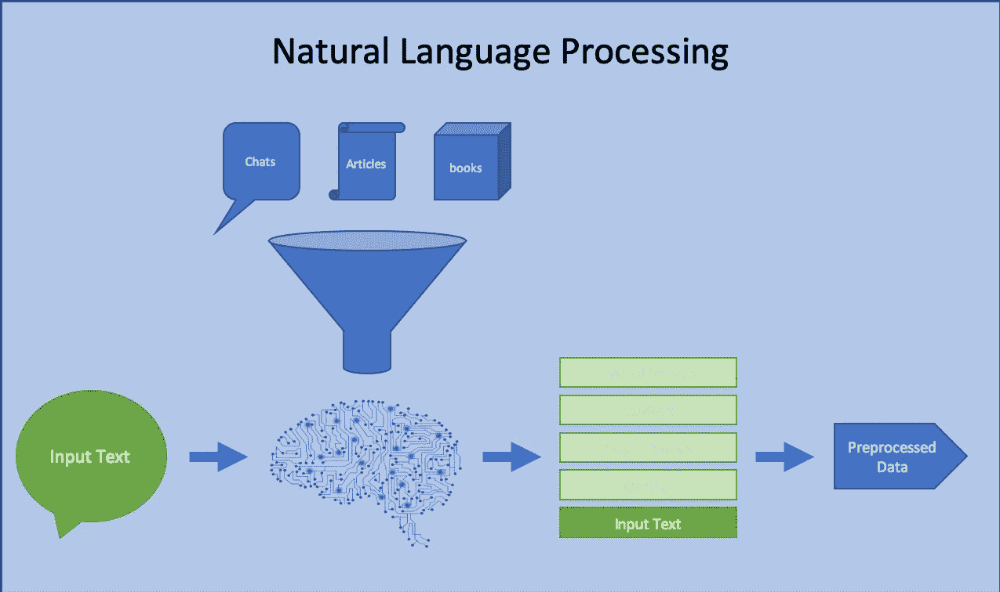
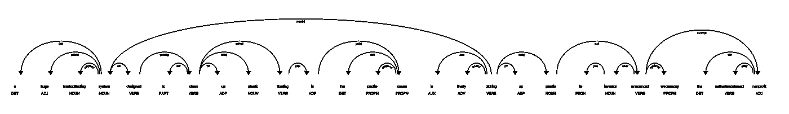
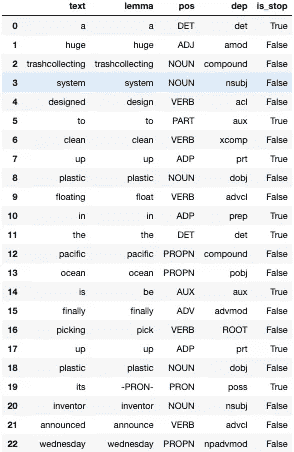
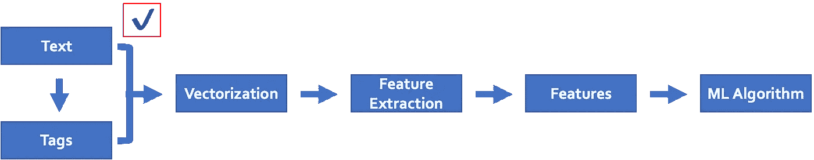

# 关于自然语言处理(NLP)的数据预处理和语言注释，您需要了解什么

> 原文：<https://towardsdatascience.com/what-you-need-to-know-about-data-preprocessing-and-linguistic-annotations-for-natural-language-439d42f2f355?source=collection_archive---------23----------------------->

## 快速浏览自然语言处理数据预处理

读者注意:Python 代码在 [GitHub](https://github.com/kevinclee26/Medium_Posts/blob/master/439d42f2f355.py) 中共享


PC: Brett Jordan from Upsplash

机器学习的进步导致了**自然语言处理(NLP)** 的显著进步，这是一个赋予计算机理解人类语言能力的人工智能领域。自然语言是指人们说的和写的语言，NLP 使用算法从单词和句子中提取信息。NLP 扩展到自然语言生成(NLG)，像人类一样表达短语的能力，以及自然语言理解(NLU)，建立对短语理解的能力。通过使用机器学习算法来训练数千年的现有文献，我们能够比手动编程更有效地开发模式和规则。此外，机器学习对于人类语言应用特别有用，因为表达(书面或口头)并不总是遵循逻辑和一致的规则。



Machine Learning is used through out the different stages of the NLP pipeline

在本文中，我们将回顾 NLP 项目中数据争论过程中经常发生的一些步骤。目标是阐明文本数据是如何被计算机处理的，这样你就知道它们如何能够并将继续在数字世界中被使用。有许多开源库使得 NLP 非常容易实现，比如 NLTK、Genism、spaCy 等。我们将举例说明空间的使用，并提供一些熟悉。

让我们来看看这篇关于[海洋清洁](https://theoceancleanup.com/)的文章的样本:

```
sample_text='A huge trash-collecting system designed to clean up plastic floating in the Pacific Ocean is finally picking up plastic, its inventor announced Wednesday.\'
```

1.将文本转换成小写的**有助于减少文本数据的词汇大小。类似地，**将重音符号**如 café转换为 café，**扩展收缩**如 won't to will not，以及**拼写检查**也可以根据您的项目进行考虑**

```
import unidecode
sample_text=sample_text.lower()
sample_text=unidecode.unidecode(sample_text)
```

2.如果**数字**和**标点符号**与分析无关，则将其删除

```
import re, string
sample_text=re.sub(r'\d+', '', sample_text)
sample_text=sample_text.translate(str.maketrans('', '', string.punctuation))
```

3.移除**空格**

```
sample_text=sample_text.strip()
```

4.**分词**是将连续文本分割成句子和单词的过程。虽然在像英语这样的语言中用空格分隔单词看起来很简单，但有时空格上的拆分可能会破坏应该被视为一个标记的内容，例如某些名称和带连字符的单词。还有一个选项是将标点符号视为单独的标记，因为标点符号也可以有意义，例如问号(？)和感叹号(！)

```
import spacy
nlp=spacy.load('en_core_web_sm')
doc=nlp(sample_text)
[token for token in doc]
```

*   **注意了。load()函数用于加载用于预测语言特征的模型**

5.去除**停用词**是去除诸如代词和介词之类的常用词的过程，因为它们广泛而频繁，因此不提供关于相应文本的太多信息。这通常通过在预定义的关键字列表中执行查找来完成，从而释放数据库空间并改善处理时间。在某些情况下，停用词列表可以定制为添加(对于“稀疏”术语)或删除

```
[token for token in tokens if not token.is_stop]
```

6.**词干**和**词汇化**是两种不同的方法，用于规范化文本数据并使单词相互匹配，即使它们不在相同的时态或形式下。一方面，词干化通过字符串操作去除单词开头(前缀)和结尾(后缀)的词缀。另一方面，词汇化通常通过查找单词的字典形式(称为词汇)来完成，并且可以进一步考虑词类以及单词的上下文。选择使用哪种方法将取决于速度和意图。词汇化需要更多的资源，可能不适合所有的 NLP 任务

```
[token.lemma_ for token in filtered_tokens]
```

7.词性( **POS** )标注是确定每个单词在句子中的作用的过程，这有助于我们理解文章在谈论什么。获取词性是通过一个预测模型来实现的，该模型已经通过足够数量的句子进行了训练，这些句子已经标记了每个单词的词性。我们通过将单词(作为输入)及其周围的单词传递给预测模型来获得单词的词性

```
[token.pos_ for token in filtered_tokens]
```

8.**命名实体识别(NER)** 指将文本中发现的命名实体分类到预定义的类别中，例如，人、日期、事件、地点、组织等。**名词组块**对于确定文本中的主语和宾语也很重要。使用统计模型比明确定义它们更有效

```
[(entity, entity.label_) for entity in doc.ents]
[noun.text for noun in doc.noun_chunks]
```

9.**依存解析**是给每个单词分配句法依存标签的过程。目标是为句子中的每个单词确定一个父单词，并预测父单词和单词之间的关系类型，如主语、定语、修饰语等。

```
[(token, token.dep_) for token in filtered_tokens]
spacy.displacy.render(list(doc.sents)[0], style**=**'dep')
```



Visualizing dependencies



Table of the preprocessed data

您还可以从文本中提取其他属性，比如**共指消解**和**搭配提取**。当构建特定应用程序的领域词汇表时，这些变得非常重要，因为上下文关系重大，例如医疗记录、系统日志、财务计划书等。这里有一个表格，包含了我们目前为止为第一句话中的每个单词定义的所有属性。

我们已经介绍了 NLP 项目的数据预处理步骤，下一步可能是对数据进行矢量化，以获得数字表示，然后是模型消费的特征提取。直到下一次…



Typical pipeline for an NLP project