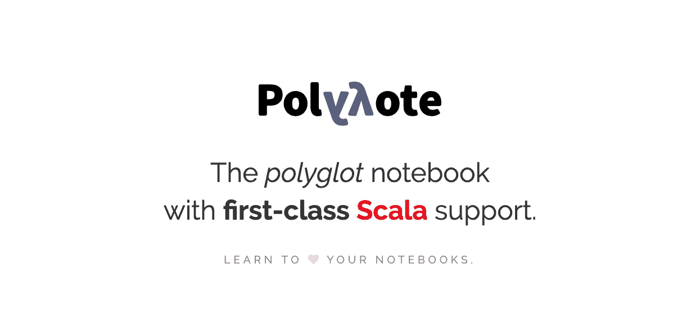
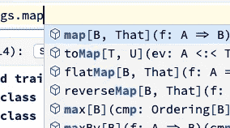
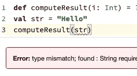
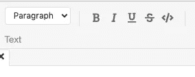
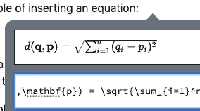
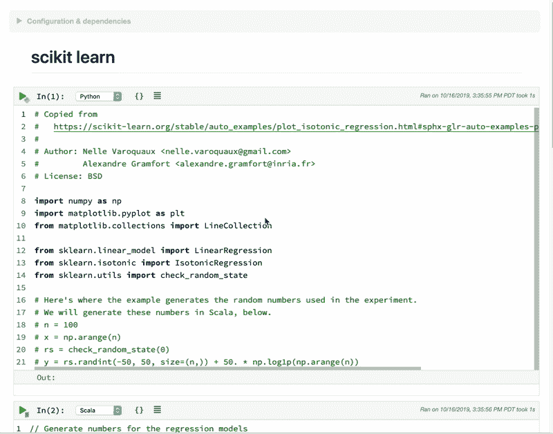
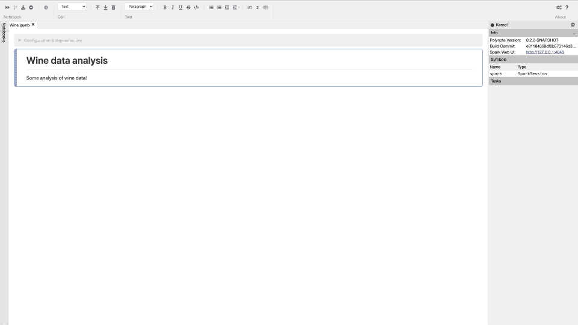
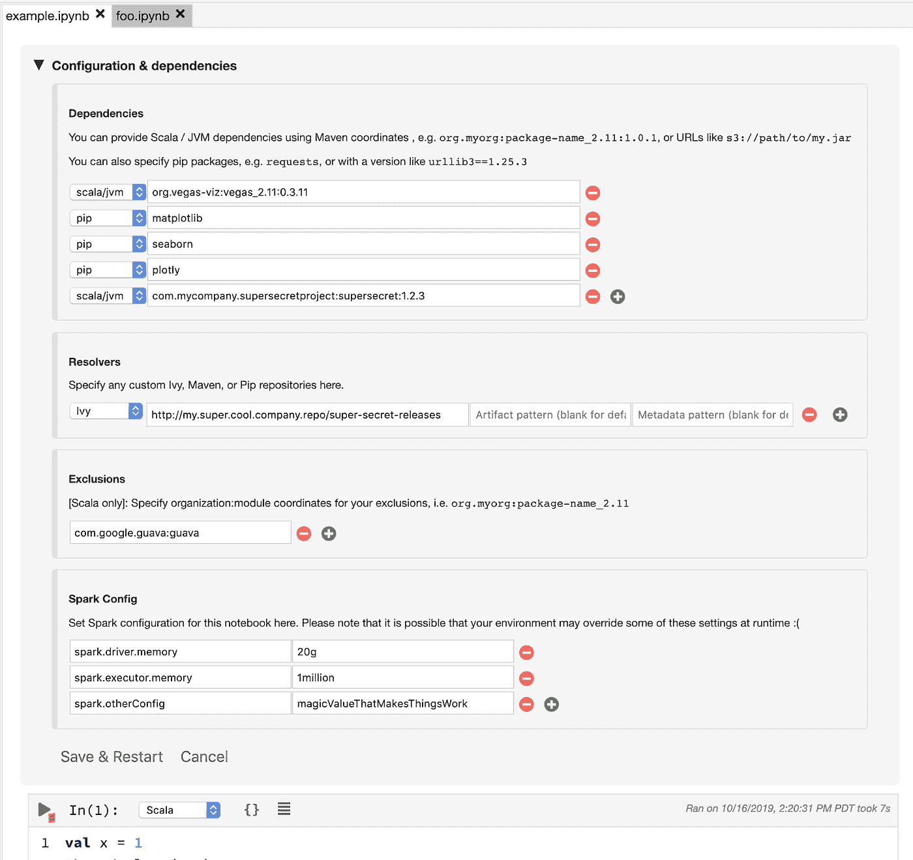
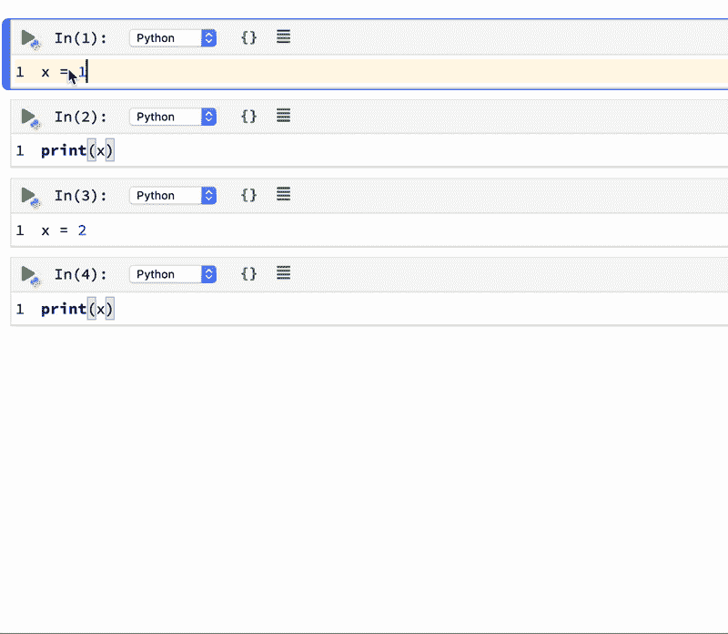

# 你需要了解网飞的“朱庇特黑仔”:冰穴📖

> 原文：<https://towardsdatascience.com/what-you-need-to-know-about-netflixs-jupyter-killer-polynote-dbe7106145f5?source=collection_archive---------1----------------------->

## 是时候让 Jupyter 笔记本有个有价值的竞争对手了



T 今天，网飞向公众开源了他们开发的内部笔记本 [Polynote](http://www.polynote.org/) 。如今，大型科技公司开源他们的内部工具或服务，然后流行起来并被业界采用的情况并不少见。亚马逊 AWS，脸书的 React.js 等是其中的两个。有道理。这些大型科技公司拥有业内最优秀的工程师，他们通常面临着推动伟大工具开发的最大挑战。网飞的 Polynote 可能是这些伟大工具中的另一个，数据科学/机器学习行业在如何编写代码、实验算法和可视化数据方面确实需要更好的工具。关于这个新工具，您需要了解以下几点。我会尽量简明扼要，以便您可以快速通读，并了解我们开发/研究环境这一新选择的利弊。

## Polynote 更像是 IDE 的简单版本，而不是 REPL 的更好版本



auto-completion, error indication, better text editor, LaTex support

Polynote 强调让笔记本工作起来更像 IDE 或者代码编辑器，比如 VS Code。它支持更好的自动完成、林挺、富文本编辑器和 LaTex。这可能有点言过其实，但这就是它的发展方向。你可以说更好的语法高亮和更好的自动完成是微不足道的，但是这些生活质量的小改进可以走很长的路，让你更专注于真正的任务。顺便说一句，大多数编辑功能由 [Monaco](https://microsoft.github.io/monaco-editor/) 编辑器提供，该编辑器增强了 Visual Studio 代码的体验，显示出甚至更好的潜力。

## 多语言支持



目前，它只支持 Python、Scala 和 SQL。你可能会说 Jupyter Notebook 也支持 Python、R 和 Julia。但是他们如何支持多语言是不同的。对于 Jupyter 笔记本，您只能为一个笔记本选择一种语言。而 Polynote 可以在一个笔记本中无缝地支持所有这些语言。它通过在细胞间共享变量来实现这一点，因此不同的语言细胞可以在相同的环境下工作。不用说，这有可能非常强大。随着它支持更多的语言，一个熟练的数据科学家可以使用最好的语言来完成正确的任务。它增加了技能上限，同时也提高了性能标准。

## 数据可视化和数据感知

在 Polynote 中，数据可视化是内置的。这意味着开发人员不需要编写任何代码来可视化他们的数据，他们只需使用 GUI 界面，并以他们想要的方式查看数据。此外，开发人员不需要输入任何代码来查看变量的值，您可以只使用 GUI。当代码运行时，在屏幕的右侧还有一个进度窗口，所以你总是知道代码的哪一部分正在运行。



这些都将增加更好的数据直觉。

## 内置配置和依赖关系管理

又一次生活质量的提高。一去不复返的日子，你必须运行的事情，如:

```
! pip install packages
```

您可以简单地指定您的代码需要哪些依赖项才能顺利运行，Polynote 会为您设置好。这将减少代码中的混乱。那有多好！



# 可复制代码

简单地说，Polynote 没有使用传统的 REPL 模型来执行代码。它使用自己的代码解释器。最大的区别是:对于使用 REPL 的 Jupyter 笔记本，你可以安全地执行不按顺序书写的单元格。您可以执行单元格 3，然后单元格 2，然后单元格 1。一切都取决于你。这带来了灵活性，但降低了笔记本的可共享性。Polynote 以不同的方式处理单元执行:

> 通过跟踪每个单元格中定义的变量，Polynote 根据在它上面运行的单元格来构造给定单元格的输入状态。使单元格的位置在其执行语义中变得重要，这加强了最小惊奇原则，允许用户从上到下阅读笔记本。

看起来更像是你在写剧本而不是笔记本。当你写的时候，你会更加注意确保事情井然有序。但是您可以获得一致的代码结果和更好的共享性。请参见下面的动画:



## 结论

我们将会看到行业将会如何采用 Polynote，但毫无疑问，它显示出了潜力，并做出了一些合理的决定。一个问题是，像 GCP、AWS 或 Azure 这样的大型云平台是否会采用它。这一点非常重要，因为如果没有这些云平台的支持，依靠它们进行研究/实验的人们将无法访问 Polynote，因此也不会使用它。

觉得这篇文章有用？在 Medium 上关注我([李立伟](https://medium.com/u/72c98619a048?source=post_page-----dbe7106145f5--------------------------------))或者你可以在 Twitter [@lymenlee](https://twitter.com/lymenlee) 或者我的博客网站[wayofnumbers.com](https://wayofnumbers.com)上找到我。你也可以看看我下面最受欢迎的文章！

[](/this-is-cs50-a-pleasant-way-to-kick-off-your-data-science-education-d6075a6e761a) [## “这是 CS50”:开始数据科学教育的愉快方式

### 为什么 CS50 特别适合巩固你的软件工程基础

towardsdatascience.com](/this-is-cs50-a-pleasant-way-to-kick-off-your-data-science-education-d6075a6e761a) [](/two-sides-of-the-same-coin-fast-ai-vs-deeplearning-ai-b67e9ec32133) [## 一枚硬币的两面:杰瑞米·霍华德的 fast.ai vs 吴恩达的 deeplearning.ai

### 如何不通过同时参加 fast.ai 和 deeplearning.ai 课程来“过度适应”你的人工智能学习

towardsdatascience.com](/two-sides-of-the-same-coin-fast-ai-vs-deeplearning-ai-b67e9ec32133) [](https://medium.com/datadriveninvestor/thoughts-on-andrew-ngs-machine-learning-course-7724df76320f) [## 我完成了吴恩达的机器学习课程，感觉棒极了！

### 好的，坏的，美丽的

medium.com](https://medium.com/datadriveninvestor/thoughts-on-andrew-ngs-machine-learning-course-7724df76320f)