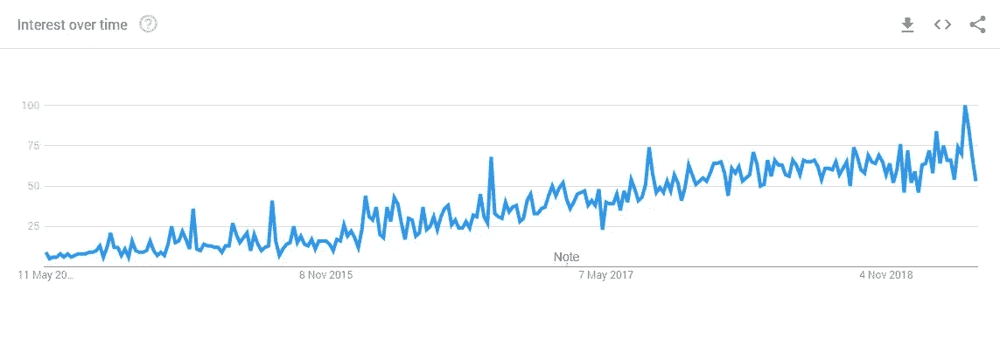

# 在雇用数据科学家之前，您应该知道什么

> 原文：<https://towardsdatascience.com/what-you-should-know-before-you-hire-a-data-scientist-45d638a13cea?source=collection_archive---------25----------------------->

Photo by [Markus Spiske temporausch.com](https://www.pexels.com/@markusspiske?utm_content=attributionCopyText&utm_medium=referral&utm_source=pexels) from [Pexels](https://www.pexels.com/photo/blue-screen-of-death-in-silver-black-laptop-177598/?utm_content=attributionCopyText&utm_medium=referral&utm_source=pexels)

你的 CEO 给你转发了一封来自流行的管理时事通讯的邮件。主题包含两个字母 A.I .你马上坐在座位上。

每个人都称赞人工智能和数据科学家是你们公司的救星。在你出去雇佣你的第一个数据科学家来运行你的人工智能项目之前，有一些事情你应该知道。

让我们后退一步。AI 到底是什么？人工智能是机器或计算机对人类智能的模拟。它是机器学习和数据科学的同义词，然而人工智能是当前的热门词汇。这些文章描述了机器人做人工任务，而实际上，它们是处理大量数据以做出自动决策的算法。

Google Search Trend: Artificial Intelligence News Articles

每个人都在谈论人工智能如何彻底改变你的公司，并声称人工智能是银弹。首席执行官们要求技术团队部署人工智能以增加销售额。首席财务官希望他们能够自动化手动任务。首席技术官希望使用最新的神经网络或深度学习。所以我们不能继续雇佣一个数据科学家吗？

## 缺失的基础

Photo by [Francesco Ungaro](https://www.pexels.com/@francesco-ungaro?utm_content=attributionCopyText&utm_medium=referral&utm_source=pexels) from [Pexels](https://www.pexels.com/photo/blue-bridge-yellow-dumbo-96944/?utm_content=attributionCopyText&utm_medium=referral&utm_source=pexels)

大多数公司可能认为他们已经为人工智能做好了准备，但他们的数据将讲述一个不同的故事。机器学习需要大量干净的历史数据。在你雇佣数据科学家之前，建立一个数据仓库或者数据湖是有意义的。这意味着他们没有四处搜寻数据。拥有一套 KPI 也是有意义的——否则，将很难衡量你的 AI 项目的影响。

## 数据科学家是缺失的一环

如果你的数据放在一个好的地方，你认为数据科学家是你的拼图中缺少的一块也是情有可原的。虽然科学家是人工智能旅程中的关键角色，但如果没有利益相关者的支持，他或她的才能将被浪费。

最成功的人工智能项目都是从一个业务或客户问题中诞生的。数据科学家的角色是用数据科学和机器学习来缓解和解决这些问题。

然而，通常情况下，数据科学家可以做的不仅仅是解决你知道的问题——他们可以找到你甚至没有意识到的问题的解决方案。

## 创建积压

Photo by [Startup Stock Photos](https://www.pexels.com/@startup-stock-photos?utm_content=attributionCopyText&utm_medium=referral&utm_source=pexels) from [Pexels](https://www.pexels.com/photo/schedule-planning-startup-launching-7376/?utm_content=attributionCopyText&utm_medium=referral&utm_source=pexels)

撇开工作角色不谈，对于数据科学家来说，没有什么比工作无聊更令人沮丧的了。数据科学积压对于确保您的科学家有足够的工作要做非常重要。它允许你回顾和优先考虑什么是重要的。这将确定什么将推动最大的投资回报。

## 特征工程

Photo by [rawpixel.com](https://www.pexels.com/@rawpixel?utm_content=attributionCopyText&utm_medium=referral&utm_source=pexels) from [Pexels](https://www.pexels.com/photo/macbook-pro-908284/?utm_content=attributionCopyText&utm_medium=referral&utm_source=pexels)

特征工程可能是数据科学中比较耗时的部分之一。不要陷入一个思维陷阱，认为一个数据科学家会立即开始构建算法。他们需要花时间询问和探索数据，以了解如何将数据输入正确的算法。这将帮助他们找到合适的要素来训练模型，他们甚至可以在数据集中构建新的要素。

## 再训练

Photo by [Lukas](https://www.pexels.com/@goumbik?utm_content=attributionCopyText&utm_medium=referral&utm_source=pexels) from [Pexels](https://www.pexels.com/photo/gray-and-black-barbell-669582/?utm_content=attributionCopyText&utm_medium=referral&utm_source=pexels)

一旦模型构建、测试并发布到生产环境，项目就不会结束。这种模型需要持续的护理和关注。随着更多数据的产生和流程的改变，它将需要重新培训、调整，有时甚至需要重建。数据科学家正在进行一场长期的游戏。

各种规模的公司都开始雇佣数据科学家或与代理机构合作来构建他们的第一个模型。在冲进去之前，

*   看看你的数据
*   让你的公司参与进来
*   创建积压
*   不要忘记考虑工程时间
*   最后——一旦你雇佣了一个——他们就永远在那里。