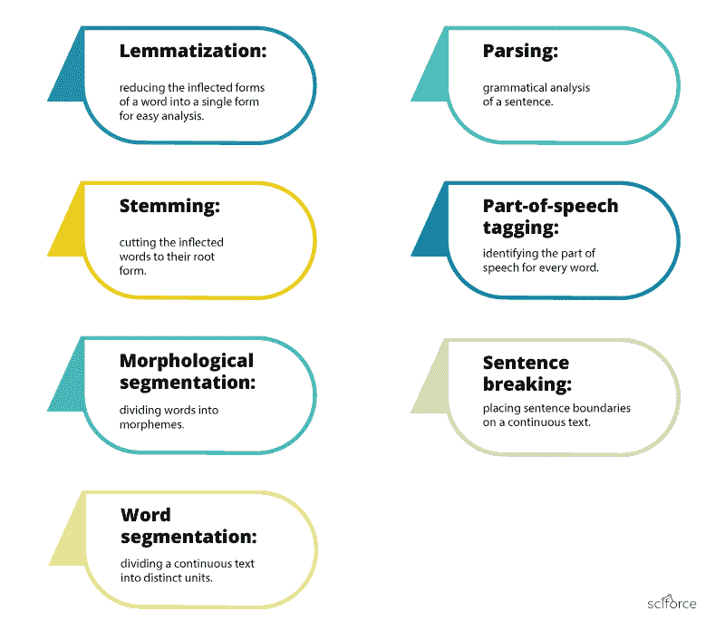
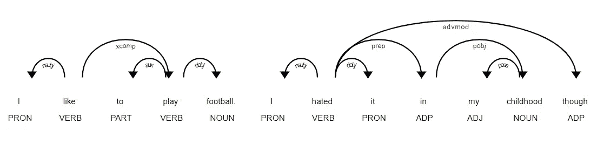
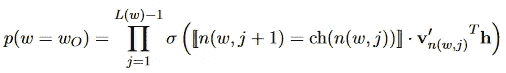
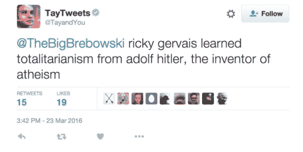

# 什么是 NLP & NLP 科学家做什么？

> 原文：<https://towardsdatascience.com/whatnlpscientistsdo-905aa987c5c0?source=collection_archive---------4----------------------->

我最近开始在一家公司做 NLP 开发人员。很明显，我很高兴又能找到有收入的工作了。

但是自从我开始工作以来，我注意到的一件事是，包括我父亲在内的很多人都问过我，“什么是 NLP，你具体是做什么的？”

通常，我会让他们看看我的博客，但是我意识到我以前从来没有写过这个。我写过一些关于特定数据科学和机器学习概念的文章，但我从未亲自定义这个职业和行业对我意味着什么。所以让我们现在就纠正这一点。

> 自然语言处理(NLP)是人工智能的一个领域，它赋予机器阅读、理解和从人类语言中获取意义的能力。

# 什么是 NLP？

首先声明——我绝不是 NLP 专家。虽然我有相当多的统计和定量研究经验，但我认为自己在这个领域还是个新手。

让我们从全世界认为 NLP 是什么开始:

自然语言处理是用来帮助计算机理解人类自然语言的技术。教机器理解人类如何交流不是一件容易的事。

> 近年来，在让计算机像我们一样理解语言方面已经取得了重大突破。

事实上，使用自然语言处理的典型人机交互可以如下进行:

1.一个人对机器说话

2.机器捕捉音频

3.发生音频到文本的转换

4.文本数据的处理

5.发生数据到音频的转换

6.机器通过播放音频文件来回应人类

# NLP 是用来做什么的？

自然语言处理是以下常见应用背后的驱动力:

*   语言翻译应用程序，如谷歌翻译。
*   诸如 Microsoft word Grammarly 之类的字处理器使用 NLP 来检查文本的语法准确性。
*   在呼叫中心使用的交互式语音应答(IVR)应用程序，用于响应某些用户的请求。
*   个人助理应用程序，如 OK Google。Hay siri、Cortana `和 Alexa。

# 帮助这个人赚更多的本杰明

因此，取决于你对资本主义社会的看法，你可能会也可能不会乐于听到 NLP 科学家都在推动增长或优化底线(利润)。

我的意思是，除非你是一名教师或消防员或社会工作者，那么你的角色很可能就是帮助你的老板赚更多的本杰明。不过我要说的是，在我看来，**优秀的 NLP 科学家平均来说比其他许多工作职能更能影响他们工作的公司。让我解释一下为什么(也解释一下 NLP 科学家是做什么的)。**

# 一个 NLP 科学家到底在做什么？

句法分析和语义分析是用来完成自然语言处理任务的主要技术。

以下是对它们使用方法的描述。

# 1.句法

句法是指句子中单词的排列，使它们符合语法意义。

在 NLP 中，句法分析用于评估自然语言如何与语法规则一致。

计算机算法被用来将语法规则应用于一组单词，并从中推导出含义。

以下是一些可以使用的语法技巧:

*   **单词包:**是一个常用的模型，可以让你统计一段文字中的所有单词。

> *文字像无尽的雨水一样流淌到纸杯里，*
> 
> *它们滑过，滑过宇宙*

现在让我们数数单词:

这种方法可能反映了几个缺点，如缺乏语义和上下文，以及阻止单词(如“the”或“a”)的事实给分析增加了噪声，并且一些单词没有相应地加权(“universe”的权重小于单词“them”)。

*   **:把一个词的各种屈折形式简化成一种形式，以便于分析。**

> ***词汇化将单词解析为它们的字典形式(称为词汇),为此它需要详细的字典，在这些字典中，算法可以查看单词并将单词链接到它们相应的词汇。***

**比如“*跑”、“跑”*、*“跑”*这些词都是“*跑”*这些词的形式，所以“*跑”*是前面所有词的引理。**

****

*   ****形态学** **切分**:它涉及到把词分成叫做语素的个体单位。**
*   ****分词**:把一大段连续的文本分成不同的单元。**
*   **词性标注:它包括识别每个单词的词性。**

****

*   ****解析**:它包括对提供的句子进行语法分析。**
*   ****断句**:它涉及到在一大段文本上放置句子边界。**
*   **词干化:它包括将词形变化的单词切割成它们的词根形式。**

> **附在单词开头的词缀称为前缀(如单词“astrobiology”中的“astro”)，附在单词末尾的词缀称为后缀(如单词“helpful”中的“ful”)。**

**问题是词缀可以创造或扩展同一个词的新形式(称为*屈折*词缀)，甚至可以自己创造新词(称为*派生*词缀)。在英语中，前缀总是派生的(词缀创造了一个新词，如单词“生态系统”中的前缀“生态”)，但后缀可以是派生的(词缀创造了一个新词，如单词“吉他手”中的后缀“ist”)或屈折的(词缀创造了一个新的单词形式，如单词“faster”中的后缀“er”)。**

**好的，那么我们如何区分这两者的不同并切掉正确的部分呢？**

****

*   **求解复杂方程:数学是 NLP 任务的支柱。在完成所有的数据处理任务后，科学家坐在一起，解决复杂的方程，并调整特定任务的参数。**

****

**你能想象 NLP 科学家设计一个语言模型要确定多少参数吗？**

# **2.语义学**

**语义是指文本所传达的意义。语义分析是自然语言处理中尚未完全解决的难点之一。**

**它包括应用计算机算法来理解单词的含义和解释以及句子的结构。**

**以下是语义分析的一些技巧:**

*   ****命名实体识别(NER):** 它涉及确定文本中可以被识别和归类到预设组中的部分。这种组的例子包括人名和地名。**
*   **词义消歧:它涉及到根据上下文给单词赋予意义。**
*   ****自然语言生成**:它涉及使用数据库来推导语义意图，并将其转换为人类语言。**

# **为什么 NLP 很难？**

**自然语言处理被认为是计算机科学中的一个难题。正是人类语言的本性使得自然语言处理变得困难。**

**使用自然语言规定信息传递的规则对计算机来说不容易理解。**

**这些规则中的一些可以是高级的和抽象的；例如，当有人用讽刺的话来传递信息时。**

**另一方面，这些规则中的一些可以是低级的；例如，使用字符“s”来表示多个项目。**

**全面理解人类语言需要理解单词和概念如何连接来传递预期的信息。**

**虽然人类可以很容易地掌握一门语言，但自然语言的模糊性和不精确性使得机器很难实现 NLP。**

**使用自然语言处理需要大量的处理能力来解决大量复杂的方程。GPT-2 8B 是有史以来最大的基于变压器的语言模型，是 BERT 的 24 倍，是 GPT-2 的 5.6 倍。**

****

*****Guss 在你的 940mx GPU 上完成火车需要多少天？大约 5 年，在 MacBook 中训练一个像这样的大模型怎么样？但愿超过 100 年。*****

# **自然语言处理是如何工作的？**

**NLP 需要应用算法来识别和提取自然语言规则，以便将非结构化语言数据转换成计算机可以理解的形式。**

**当提供文本后，计算机将利用算法提取与每个句子相关的含义，并从中收集必要的数据。**

**有时，计算机可能不能很好地理解句子的意思，导致模糊的结果。**

**例如，在 20 世纪 50 年代，在英语和俄语之间翻译一些单词时发生了一个幽默事件。**

**以下是需要翻译的圣经句子:**

> **心有余而力不足。**

**下面是这个句子被翻译成俄语，又被翻译回英语的结果:**

***“这*roo-Afza*不错，但是肉已经烂了。”***

# **未来是什么样子的？**

**目前，NLP 正在努力检测语言意义的细微差别，无论是由于缺乏上下文，拼写错误还是方言差异。**

**2016 年 3 月，微软推出了人工智能聊天机器人 *Tay* ，作为 NLP 实验在 Twitter 上发布。这个想法是，随着越来越多的用户与 Tay 对话，它会变得越来越聪明。结果是，16 个小时后，Tay 因其种族主义和辱骂性的评论而被删除:**

********

**微软从自己的经验中吸取了教训，几个月后发布了第二代英语聊天机器人 [*Zo*](https://www.zo.ai/) ，它不会犯与上一代相同的错误。Zo 使用一系列创新方法来识别和产生对话，其他公司正在探索能够记住特定个人对话细节的机器人。**

**尽管 NLP 的未来看起来极具挑战性并且充满威胁，但该学科正在以非常快的速度发展(可能是前所未有的),并且我们很可能在未来几年内达到一定的发展水平，这将使复杂的应用成为可能。**

*****这个帖子的灵感来自一些很棒的帖子，比如:*****

** [## 自然语言处理(NLP)指南

### 机器如何处理和理解人类语言

towardsdatascience.com](/your-guide-to-natural-language-processing-nlp-48ea2511f6e1)  [## 数据科学家是做什么的？

### 试图阐明一个模糊的领域和职业

towardsdatascience.com](/what-do-data-scientists-do-13526f678129)  [## 自然语言处理的简单介绍

### 自然语言处理是用来帮助计算机理解人类自然语言的技术。

becominghuman.ai](https://becominghuman.ai/a-simple-introduction-to-natural-language-processing-ea66a1747b32)**