# 名人堂四分卫值多少钱？

> 原文：<https://towardsdatascience.com/whats-a-hall-of-fame-quarterback-worth-85e123a448bf?source=collection_archive---------7----------------------->

## 使用带或不带分析的*来量化名人堂口径 QB 的真实场上价值*

几乎由[所有](http://www.espn.com/blog/pittsburgh-steelers/post/_/id/30335/with-killer-bs-done-steelers-cancel-football-version-of-kardashians) [账目](https://www.nbcsports.com/video/pittsburgh-steelers-got-best-deal-they-could-end-antonio-brown-saga)来看，匹兹堡钢人队度过了一个可怕的、不好的、非常糟糕的休赛期。他们被迫交易安东尼奥·布朗——有史以来最伟大的外接球员之一——并且不得不袖手旁观，看着 Le ' veon Bell——一代天才——在一年的合同纠纷中成为局外人后成为自由球员。在球的进攻端损失了大量的产量。或者，换句话说，匹兹堡钢人队有麻烦了。

但是事情没有这么简单。让事情变得复杂的是，布朗和贝尔都有幸与名人堂四分卫 Ben Roethlisberger 一起打球，正如对足球的分析所显示的那样，QB 比任何其他位置都更有价值。那么，谁对所有这些华而不实的统计数据负责呢？更重要的是，这对布朗和贝尔来说意味着什么，他们明年都将和更糟糕的四分卫一起打球。

似乎相当违反直觉的是，我们不能通过检查特定的传球手来回答这些问题——相反，我们必须检查四分卫，特别是类似于 Roethlisberger **和**的四分卫，那些更类似于 Brown 和 Bell 的新 QBs 的四分卫。最终，如果我们想将我们得出的任何结论推广到不仅仅是上述三个参与者，我们将最初的问题转换成这个推广的分析问题:**用 HOF QB 替换非 HOF QB 的孤立影响是什么？**通过正确提问这个问题，我们可以

1.  确定进攻生产的更重要的驱动因素(四分卫与传球接球手)
2.  量化名人堂 QB 的价值
3.  为加入或离开名人堂四分卫球队的传球手创造一个期望

为了回答上面的问题，我再次求助于[NFL scraper](http://www.stat.cmu.edu/~ryurko/project/nflscrapr/)包来收集 2009 年至 2018 年的逐场比赛数据(你可以在这里找到[这一分析的所有代码)。](https://github.com/davisj2007/nfl-hof_wowo)

一旦我清理并准备好数据，我就开始分析。虽然我们最初的问题似乎很容易回答——选择我感兴趣的 KPI，并检查这些 HOF QB 与那些非 HOF QB 的水平——但这将是错误的方法。通过这种方式来衡量产量，我们实际上不是在衡量 QB，而是 QB 的*团队*。这是所有体育分析的基本问题之一，可以说在足球中也是如此:体育是动态系统，因此会受到 [**纠缠**](https://en.wikipedia.org/wiki/Quantum_entanglement) **。**换句话说，衡量四分卫的表现只是衡量外接球手表现*和*进攻线表现*和*对方防守表现的另一种方式，反之亦然。

这在量化事物的时候显然是个问题。对于爱国者的粉丝来说，是爱国者让汤姆·布拉迪变得优秀，还是汤姆·布拉迪让爱国者变得优秀(无论哪种方式，爱国者都是优秀的！)但当我们试图确定每一块馅饼的价值时，这很重要，这样我们就可以更好地决定如何支付球员，是否交易球员，以及我们应该如何谈论游戏本身。那么，我们如何才能解开这些纠结呢？我们怎么知道是安东尼奥·布朗还是本·罗特利斯伯格推动了钢人队的进攻？当我们把一个名人堂的 QB 换成一个…正常人的时候，我们怎么知道会发生什么？

## **有无分析**

嗯，简单的回答是我们不能，至少不是真的不能。这个游戏太复杂了，有太多移动的部分，我们不能在联盟的范围内自由地运行一个实际的实验。但是我们可以用一个相对简单的分析方法来近似地分解传递者和接受者:**有无**(沃沃)分析。

那么什么是沃沃呢？这个名字相当具有描述性——在最基本的层面上，我们将检查本·罗斯利伯格(和我们其他霍夫 QB)扔给安东尼奥·布朗(或勒维恩·贝尔，或任何其他 WR / RB)的每一场比赛，以及每次*别人*扔给 AB 或贝尔或罗斯利伯格也扔给的任何其他 WR(即*带*罗斯利伯格对*不带*罗斯利伯格)。我们将对每个 WR-QB 组合重复这一过程，特别注意我们的 HOF QBs，从那里，我们可以开始概括名人堂对接收机性能的影响，因为我们在理论上控制了所有其他变量(最后这一部分不是很准确，事实上，我们做了很多假设，其中一些可能有缺陷，我会在我们进行的过程中指出)。

我的第一步是找到一组我认为合理地反映了“名人堂”级别的球员。考虑到这一点，我将 2009 年至 2018 年的所有过往剧目分离出来，用于以下 QB(尽管对我的选择吹毛求疵，但这是我们要做的):

*   本·罗特利斯伯格
*   汤姆·布拉迪
*   佩顿·曼宁
*   埃利·曼宁
*   亚伦·罗杰斯
*   菲利普·里弗斯
*   马特·莱恩
*   德鲁·布里斯
*   托尼·罗莫
*   拉塞尔·威尔逊

至少有七名入选名人堂，而罗莫、瑞安和威尔森要么有不错的投篮，要么在某种程度上被认为是精英。

当我们检查我们选择的 KPI 时，这些选择被证明是正确的:[期望点增加](http://www.advancedfootballanalytics.com/index.php/home/stats/stats-explained/expected-points-and-epa-explained)，或者 EPA(参见链接以获得详细的解释——在这个分析中我使用了 [Ron Yurko 的 EPA 模型版本](https://www.cmusportsanalytics.com/nfl-expected-points-nflscrapr-part-1-introduction-expected-points/))。在同一时间段内，我选择的名人堂成员平均每次尝试的 EPA 比非 HOF QBs 多 188%(就上下文而言，**总体平均值**为 0.14 EPA)。

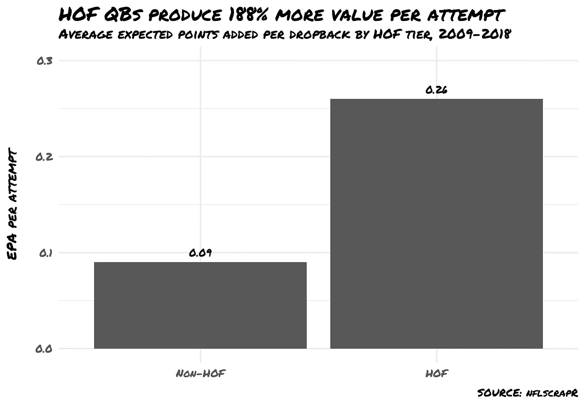

所以我们已经确定名人堂成员比非 HOF 成员产生更多的 EPA，但是这并没有真正告诉我们 QB 的质量与团队的质量。例如，环境保护局名人堂 QBs 的水平甚至可以用总体环境保护局的更大趋势来解释。让我们检查一下。

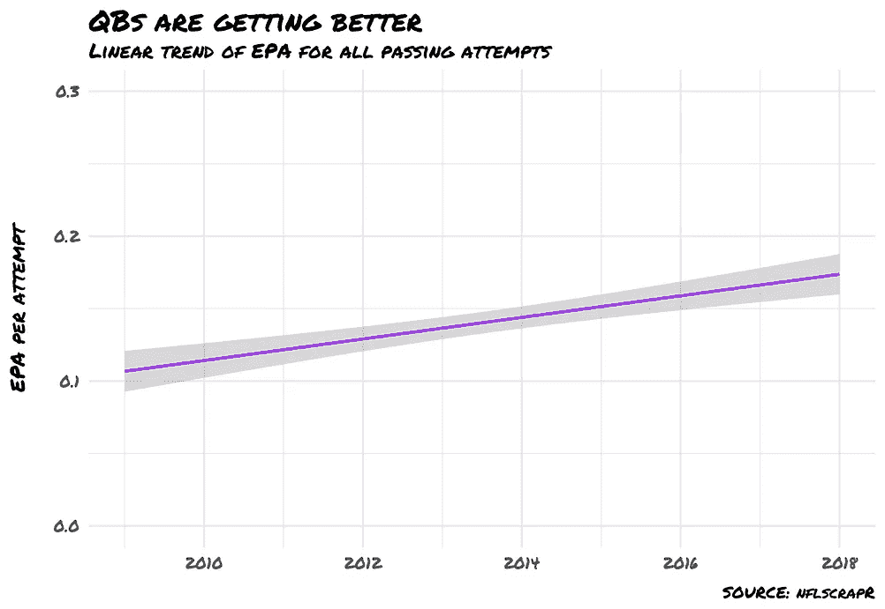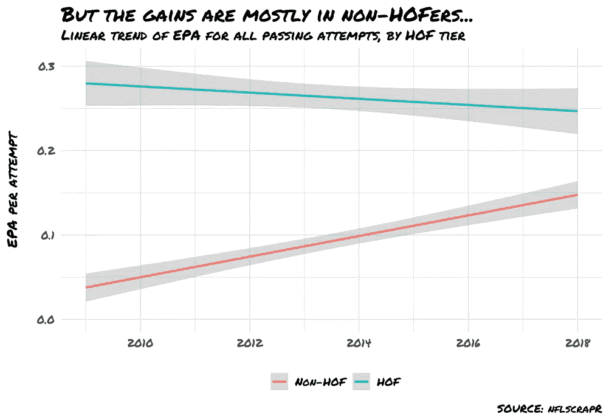

好吧，所以随着时间的推移，这种趋势实际上有利于非 HOF，但直觉上这是有道理的——我们只能根据他们过去的表现来确定名人堂成员，这固有地意味着我们的样本有点年龄偏见。事实上，在我们的研究中，有两个被选中的 QB 在经历了至少一年的[受伤](https://www.espn.com/nfl/story/_/id/17414579/nfl-tony-romo-dallas-cowboys-back-injury-why-serious-treatment-plan-long-term-effects)后退休了。因此，HOF 性能的轻微下降并不令人惊讶，而非 HOF 性能的增长虽然很大，但相比之下仍然相形见绌。

也许我们的名人堂成员更高的 EPA 可以更多地通过*他们如何*玩游戏来解释——这可能是 HOF 或非 HOF 团体更繁荣或萧条，这可能人为地帮助或伤害 EPA(取决于你对该策略的看法)而不是更一致的方法。通过检查两组的[密度图](https://serialmentor.com/dataviz/histograms-density-plots.html)，我们可以很快看出这是否属实。

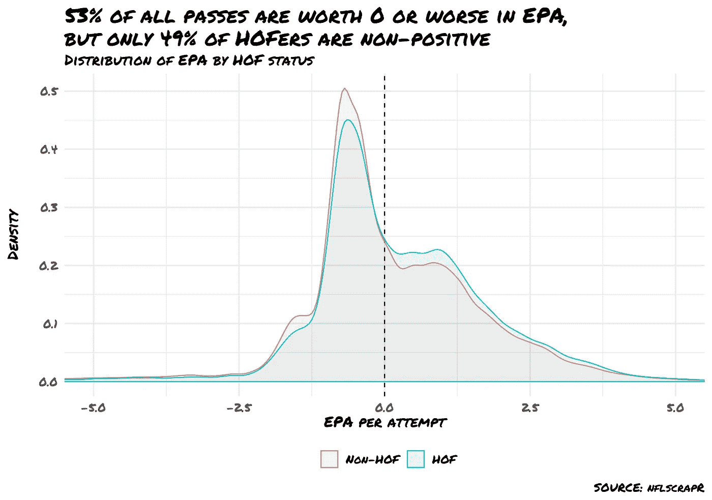

左边的图显示分布在形状上相当相似，这告诉我们总体风格不太可能有那么大的不同，但您会注意到黑线左边的峰值(零 EPA)对于红色组来说更高，而零右边的 EPA“架子”对于蓝色组来说稍高一些——我们的名人堂成员只是一直比他们的同行产生更高的 EPA。

最后，在我们开始全面分析之前，我想仔细检查一下我的选择——虽然总体上很强——在个人层面上也有意义(不要表现得好像你不好奇根据我们选择的 KPI，谁是我最好的 QB)。

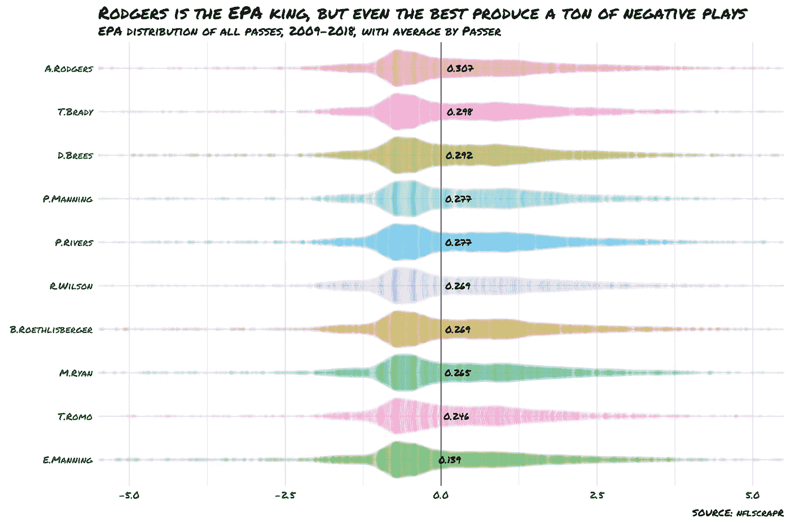

所以这些人都很可靠。嘿，即使是伊莱，他的身价也是普通非霍弗人的近两倍(加上两次超级碗 MVP 几乎保证了名人堂的破灭)。

既然我们已经确定了我们的样本组是相当合理的，那么是时候开始我们的沃沃分析了，以分离出 HOF QB 在传球比赛中的预期影响。

第一步是分离出与我选择的名人堂成员之一**和**至少一个其他 QB 一起打球的合理 WRs。我做了一个任意的决定，将样本限制在被两个 QB 投掷了至少 20 次的接收器上，其中一个是在我们的 HOF 班。这使得我们每一次传球都要投给这个数量的接球手。

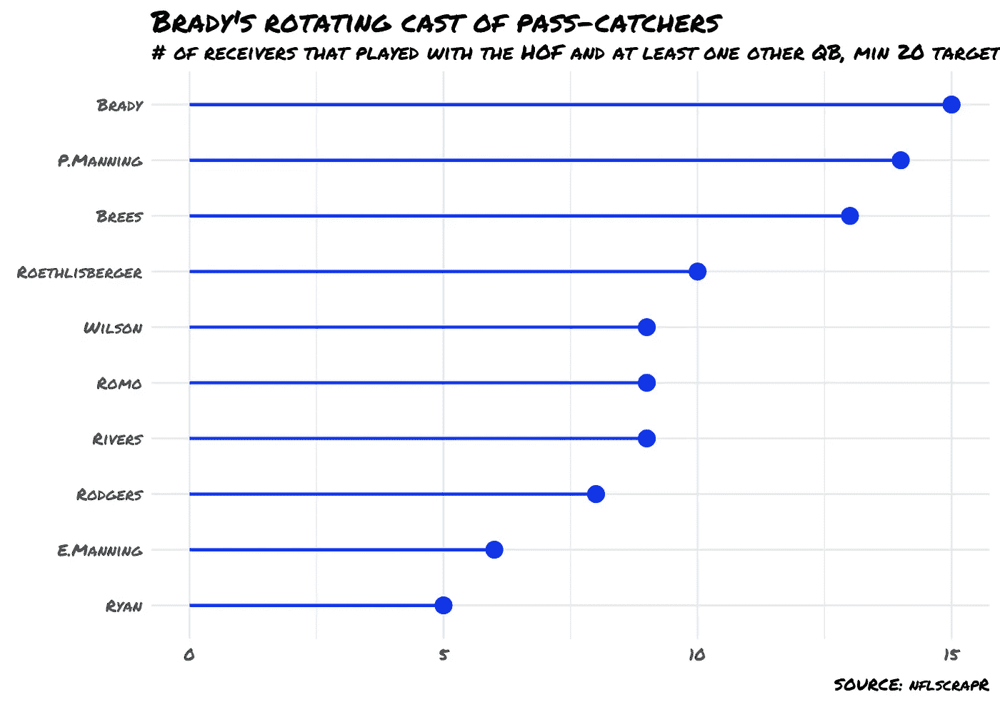

这里需要注意的一点是 QBs 和接收器之间有重叠。例如，布兰登·库克与布雷迪和布雷斯一起打球，伊曼纽尔·桑德斯与罗特利斯伯格和培顿·曼宁一起打球，以及数据集中的其他人。并且许多接收机使用多个非 HOF QBs。当我们将数据集扩展到这些接收器中的每一个时，我们剩下 **44，013** 次尝试，以及一些复制。例如，我们必须分析库克的接待*四次:*一次是“没有布雷迪”，一次是“没有布雷迪”，另外两次是“有”。

在我们开始对 HOF QBs 的影响建模之前，让我们先检查一下当我们的样本中的某个人和其他人接到传球时，接收者的平均 EPA。这些简单的结果非常有趣。

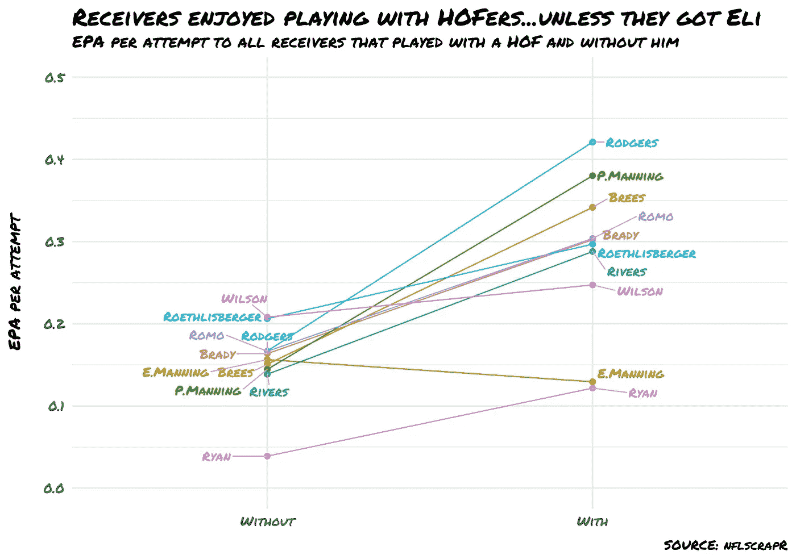

伊莱…汪汪。也许这家伙根本就不该出现在名人堂里！当接受者被伊莱瞄准时，他们的平均效率**降低了 17%，与他们一起玩的其他 QB 相比**。但是在曼宁之外，当与 HOF QB 一起玩时，接收者平均每个目标多 18%到 213%的 EPA，而不是与其他人一起玩——不算太差。

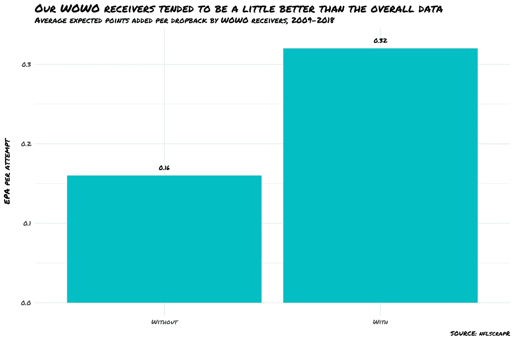

我在这些结果中注意到的一件事是，带有的*和不带*的*都倾向于偏高——除了马特·莱恩和伊莱的带有*接收器的*都高于整个研究范围的平均 EPA。*

这可能意味着一些不同的事情——最明显的是，玩 HOF 的接收者往往是伟大的，因此 HOF QB 的因果关系是接收者，而不是 QB。无 EPA 的均值*高于总体 EPA 均值，表明这种解释并非没有价值。这可能是真的！但最终，我发现有足够的证据表明，在没有名人堂成员的情况下打球，总的来说，四分卫的得分会比接球手多。如果我们真的想弄清“信用”问题的真相，我们**可以**尝试通过运行——你猜对了——另一个*方向的沃沃分析来回答前一个问题，并检查有和没有特定接收者的 QB。但那是为了另一个分析…

在这两种情况下，重要的不是观察*的生产水平*，而是观察*生产的相对差异*，不管接收器的质量如何，毫无疑问，当使用 HOF 口径 QB 时，他们的生产效率更高。这让我们进入了沃沃分析的最后一步——创建一个统计模型来量化和概括用名人堂成员取代普通 QB 的相对影响。

为了做到这一点，让我们使用一个简单的[线性回归](https://en.wikipedia.org/wiki/Linear_regression)和一个独立变量:一个指示传球是否是由一个 HOF QB 抛出的指标。现在，请注意，这是一个非常简单的模型，它忽略了大量的潜在变量:接收者的年龄，QB 的年龄，防守，赛季，周，天气…我可以继续下去，但这不是重点。一些更聪明的读者(和统计学家)可能已经根据早期的图表得出了这个模型的结果，但对于其他人来说，这就是你要做的。

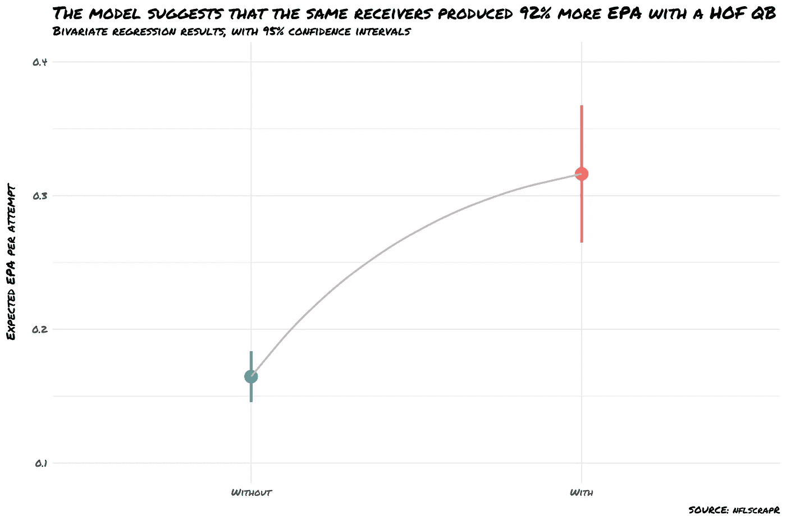

注意到点估计的位置了吗(线中间的点)？它们是之前柱形图中显示的精确平均值！因为线性回归是对我们的指标变量的*均值*效应进行建模，这与仅仅取简单平均值没有什么不同。但它确实给了我们两个重要的证据:(1)效应的显著性(p ~0)和(2)我们均值估计的置信区间(圆点周围的垂直线代表我们真实均值效应所在的 95%置信区间)。然后，我们可以将点估计值转换为相对比例，从而得出我们的沃沃结论:**数据表明，在其他条件相同的情况下，HOF QBs 每次尝试产生的 EPA 比非 HOF QBs 高 92%。**

这是一个相当明显的结论，也是一个看起来相当重要的结论……但是如果 HOF QBs 的价值几乎是非 HOF QBs 的两倍，为什么那么多[明确的非 HOF](https://youtu.be/Cak5lhnfvr0) QBs [像我们的样本组](https://www.spotrac.com/nfl/rankings/guaranteed/quarterback/)一样被支付？有一大堆原因可以解释为什么这个*可能是*的情况，我就不多说了，但是也许我们的相对估计在实际领域并没有那么有影响力**。**毕竟，在相对较低的 EPA 上提高 92%的效率看起来似乎很多，但我们仍然在谈论相当小的数字，至少是每次尝试。记住这一点，让我们将沃沃的结果转化为一个真正重要的 KPI:胜利。

## **通过 EPA 和获胜概率**

将我们的相对数字转换成成功是相当简单的——我们只需要找出通过 EPA 是如何预测成功的。首先，我收集了 2009 年至 2018 年的所有游戏结果。然后，我必须决定用什么变量来构建我的获胜概率模型。由于我们一直专注于通过 EPA，从逻辑上讲，我们将此作为我们感兴趣的主要变量是有意义的——但我们一直从 EPA per attempt 开始工作，这是一个比率统计。虽然速率统计对于比较效率很有用；数量或计数统计对于预测一个队获胜的可能性也是极其重要的。

举个例子，假设我们有两个队在比赛:**A 队**和**B 队。A 队**每 5 分钟控球时间得一分，而**B 队**平均每 15 分钟控球时间得一分。如果我们假设两个团队都模仿他们的平均水平，你会正确地得出结论:**团队 A** 是一个更有效的得分团队。但是如果 A 队**只控球 10 分钟，而 B 队**控球 50 分钟，那么 B 队**有望以 23 比 14 获胜。当游戏由统计数据(在这种情况下是点数)决定时，数量和效率都很重要。**

因此，考虑到这一点，我决定计算每场比赛中每支球队的总及格分数，并以此作为我们获胜概率模型的基础。

一旦我计算了每个团队的总通过 EPA，并考虑了他们是否赢得了比赛，我就拟合了一个简单的 [logit 模型](https://en.wikipedia.org/wiki/Logistic_regression)，仅使用这两个变量来了解通过生产对胜利可能性的影响。随着模型的拟合，我可以应用 92%的总通过 EPA 的增加来模拟用 HOF QB 替换非 HOF QB 在获胜概率方面应该做的事情。

结果是惊人的。

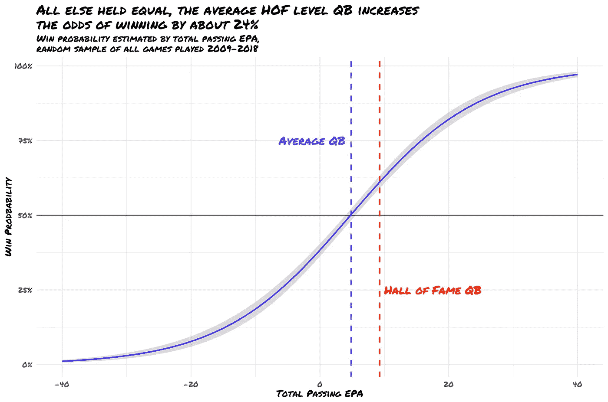

所以平均来说，QBs 从传球游戏中产生了大约 **4.8 个总期望分**，这应该大致能赢 **50%的时间**。这是有意义的，因为根据定义，平均 QB 应该正好在中间。如果我们将 92%的提升应用于 QB 表现相同的所有其他情况，我们应该**期望从过去的比赛中获得大约 9.3 分**，这应该使团队在大约 62%的时间里**获胜**——高出 12%，或者相对增加 24%的获胜概率。这表明，用名人堂 QB **取代一个普通球队的平均 QB，在一个 16 场比赛的赛季中**应该值大约 1.92 场胜利(. 62 * 16 - .5 * 16)。由于平均每支球队有望赢得 8 场比赛，这使得预期的记录达到 10-6 场。

[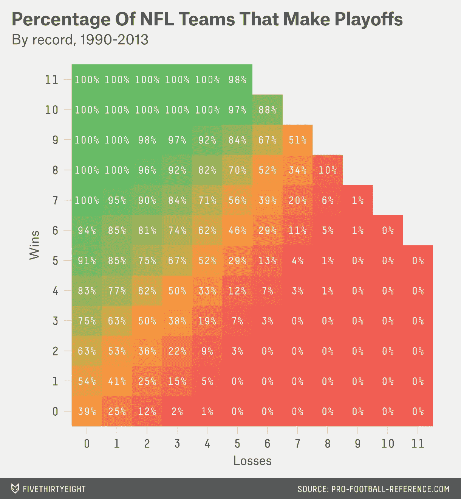](https://fivethirtyeight.com/features/skeptical-football-go-go-andrew-luck-and-a-must-win-for-the-pats/)

SOURCE: FiveThirtyEight

这是[不容忽视的](https://fivethirtyeight.com/features/skeptical-football-go-go-andrew-luck-and-a-must-win-for-the-pats/)——根据 FiveThirtyEight 的数据，8-8 支球队只有大约 10%的机会进入季后赛，而 10-6 支球队有 88%的机会进入季后赛**。这是一个巨大的增长！所以名人堂 QBs，当他们理论上取代非 HOF QBs，其他一切都保持平等(不可能，但还是！)*是否应该*以惊人的 780% 增加一支球队进入季后赛的几率**。当然，我们忽略了大量的其他变量，但这仍然是一个说明性的练习，至少对我来说，这是一个非常有说服力的论点，可以找到 HOF 人才，永远不要让他离开。****

**最后，我想指出的是，所有的非 HOF 换 HOF QB 互换并不是生来平等的。如果一个糟糕的球队(比如比尔队)把他们的 QB(乔希·艾伦)换成一个像汤姆·布拉迪这样的空前伟大的球员，他们将会在传球制作方面得到一个巨大的相对提升。但是他们仍然是一支糟糕的球队，汤姆 T20 能做的也就这么多了。所以即使阿伦和布雷迪互换，我们也不应该期望比尔队能赢得更多的比赛。如果你把贾里德·戈夫换成德鲁·布里斯，情况也是如此——公羊队已经很棒了，所以尽管布里斯可以说是有史以来最伟大的传球手，但他能给一支 13 胜球队带来的胜利是有限的。获得名人堂 QB 的最佳时机是当你已经在中间的某个地方…**

**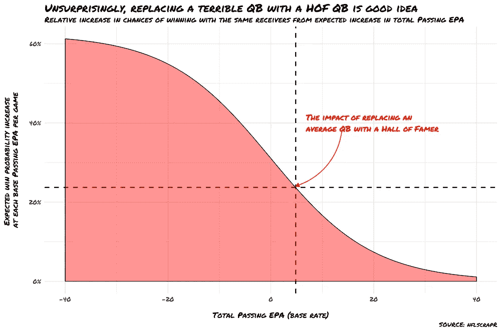****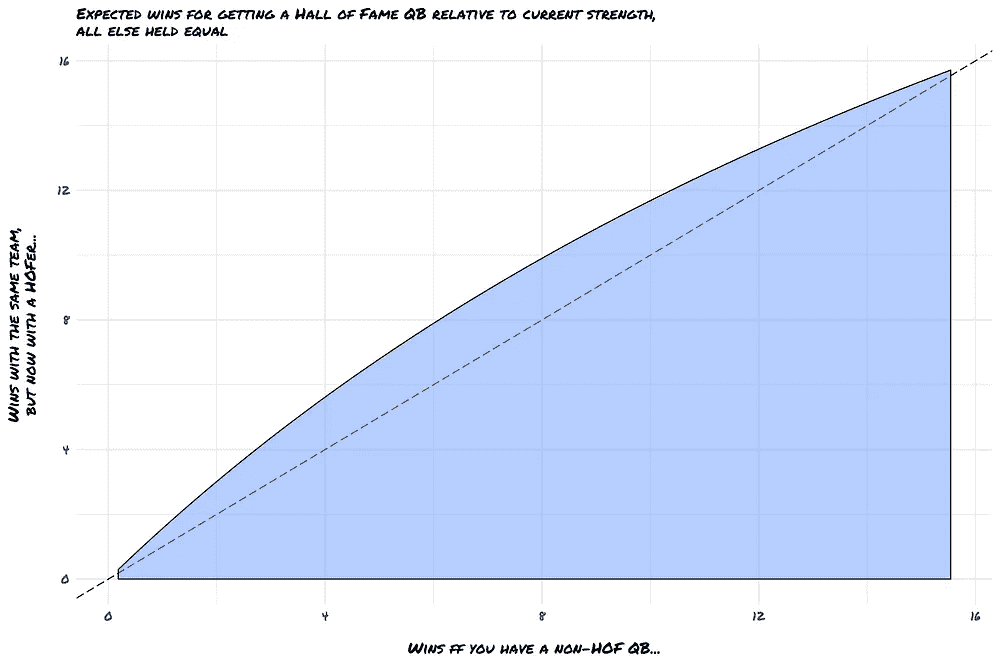**

## **结论、警告以及 2019 年对 AB 和 Bell 的期待**

**有或没有分析的**肯定是一种过于简单的技术，但这并不意味着它不是分析武库中的一个强大工具，特别是当我们处理纠缠问题时，比如我们在 NFL 逐场比赛数据中看到的。当然，我可以考虑很多变量——特别是使用其他指标控制 QBs 周围团队的人才，或者纳入关于接收者年龄的信息(也许没有的*统计数据是由已经离开的老接收者驱动的，而不是糟糕的 QB 比赛)。但最终，我对自己的假设没有任何强烈的异议，因为我的[后验信念](https://en.wikipedia.org/wiki/Posterior_probability)与我的[前验信念](https://en.wikipedia.org/wiki/Prior_probability)并没有太大的不同。我相信拥有一个优秀的 QB 是获胜的秘诀，而不是相反。至少有一些合理的证据证明这是真的。*****

**未来我可能会更新这一分析的一种方法是将它视为一项纵向或小组研究，并拟合一个混合效应模型，以更好地控制年龄、使用和赛季中期交易或受伤。但那是另一个时间，另一篇文章。**

**最后，利用我们从这一分析中得出的见解(并做出[不太疯狂的预测](https://www.footballoutsiders.com/stats/qb)德里克·卡尔和萨姆·达诺德不值得拥有)，我们明年可以从布朗和贝尔那里期待什么？**

**从 2009 年到 2018 年，布朗在每个目标的 EPA 中排名第 39 位(同时积累了高达 1234 个目标，是迄今为止最总的 EPA)，而贝尔的排名更低，为 166 位(在纯粹的及格 EPA 中，忽略拉什)。如果我们将离开 HOF caliber QB 的预期相对变化应用于每个球员的职业 EPA 平均值,“新”EPA 在同一时期只会在 NFL 中分别排名 **143** 和 **227** 。**

**这是一个令人震惊的结果，也是一个可能让[变得不可预测的结果。准备好你的爆米花——这将是一个疯狂的季节。我等不及了。](/nfl-coaches-are-so-so-predictable-3e15fa69bd32)**

**喜欢你读的书吗？请评论考虑 [*在推特上关注我*](https://twitter.com/davisj2007)**