# 蜜蜂在嗡嗡叫什么？

> 原文：<https://towardsdatascience.com/whats-buzzing-with-the-bees-99f9be0bc4c6?source=collection_archive---------11----------------------->

## 一个探索性的数据分析项目，调查美国的蜜蜂种群

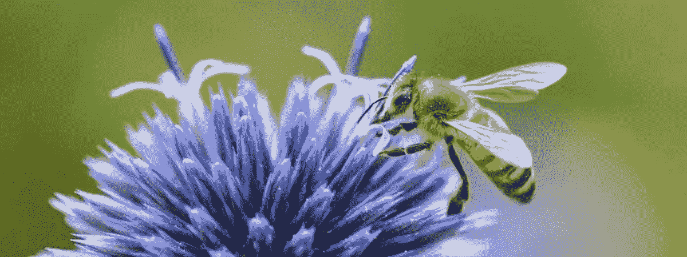

# 随着时间的推移，蜜蜂的数量发生了怎样的变化？

“拯救蜜蜂”运动已经流行了近 15 年，我们经常听到“蜜蜂正在死去！”，但这有多真实呢？

大约从 1992 年开始，蜜蜂数量急剧减少，这种趋势一直持续到 2005 年左右，但从那以后，蜜蜂数量相对稳定。

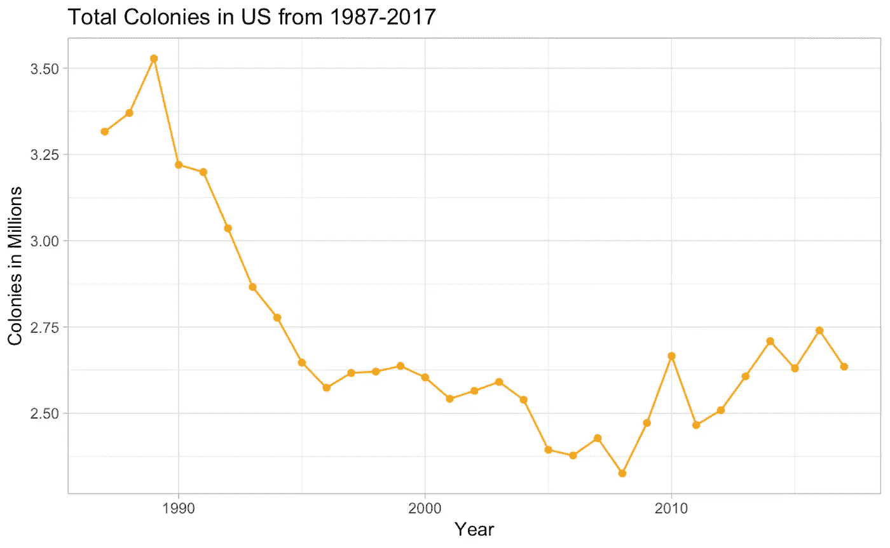

> 自 2005 年以来，美国的蜂箱数量一直相对稳定(甚至在增加)。

# 蜜蜂到处都在死亡吗？

有趣的是，没有！蜜蜂实际上在一些州有所增加。

下图显示了美国蜜蜂数量最多的 5 个州。虽然加利福尼亚的蜜蜂数量在过去几十年里一直在减少，但北达科他州的蜂群实际上有所增加，而佛罗里达州、南达科他州和明尼苏达州相对来说没有变化。

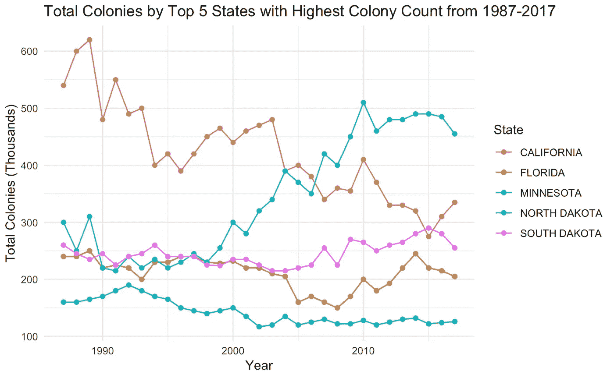

> 蜜蜂的生存能力和茁壮成长能力取决于各种因素，包括地理和各州的情况。

# 各州的殖民地损失有何不同？

仅仅从地图上看，很明显 2011 年和 2013 年的冬天并不太糟糕，但是 2012 年和 2014-2016 年对蜜蜂来说更致命。

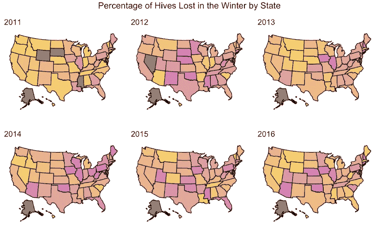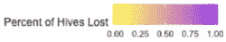

> 从地理上看，中西部和大西洋中部的州经历了蜜蜂死亡最严重的情况。

# 哪些州对蜜蜂来说最好和最差？

在冬季，蜂巢损失百分比最高的****州往往位于大西洋中部和中西部，而蜂巢损失百分比最低的****州往往位于美国西部。********

****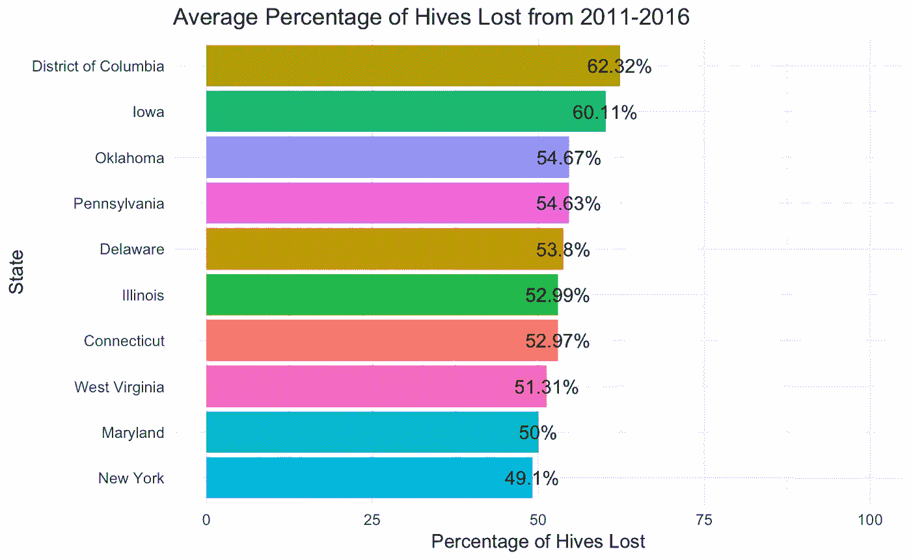****

****States with the Highest Hive Loss %****

****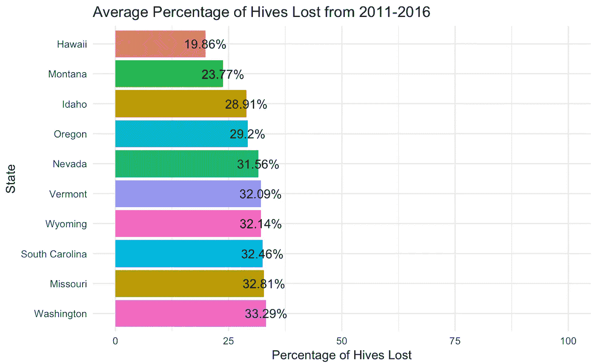****

****States with the Lowest Hive Loss %****

# ****菌落是怎么死的？****

****群体损失的两个主要原因是**死亡**和**群体崩溃失调**。****

******死亡**是指一个蜂群中的蜜蜂全部死亡时的。蜜蜂的免疫系统在冬天变弱，它们更容易感染和感染寄生虫(如瓦螨)。****

****蜂群衰竭失调或 CCD，是指一个蜂群中的大多数蜜蜂永久性地飞离蜂巢，只剩下蜂王和少数工蜂。CCD 仍在研究中，以确定是什么因素造成的。****

****不幸的是，美国农业部只授权从 2015 年开始收集 CCD 和 Deadout 损失的数据，所以没有太多数据。根据图表，我们可以看到死亡更为常见；此外，两种类型的群体损失都有季节性趋势。****

****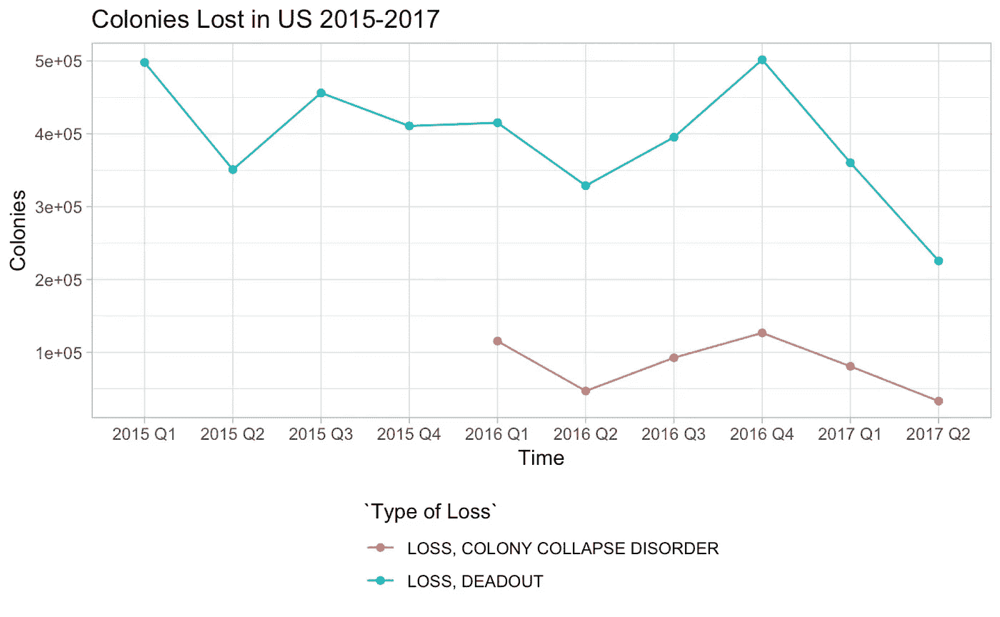****

> ****在冬天死亡的蜂巢几乎是蜂群衰竭失调的 4 倍。****

# ****低温和蜂群衰竭有相关性吗？****

****为了回答这个问题，我使用了一个按年份划分的温度异常数据集(可以追溯到 19 世纪晚期)。然后我用每年的最低温度异常值，想看看这个值是否与蜂箱每年的百分比变化有任何关联。****

****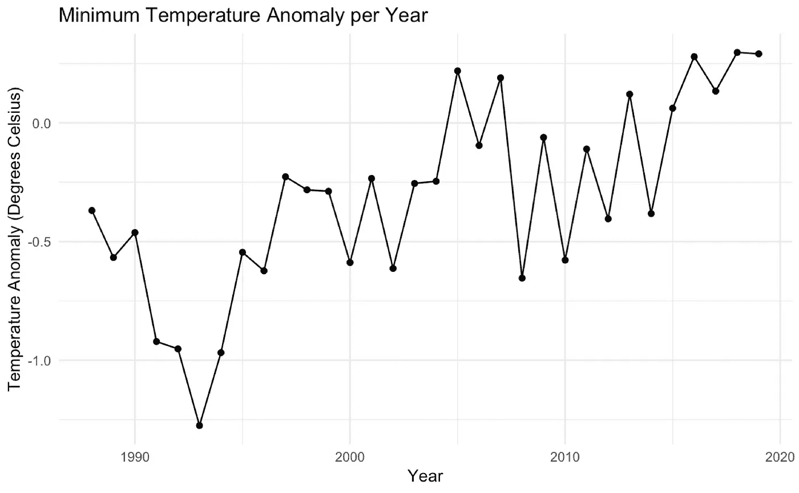********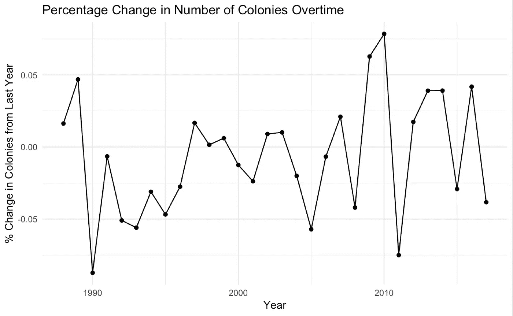****

****首先，我想看看数据，看看是否有一个总体趋势。左边是逐年的最低温度异常，下面是逐年的菌落百分比变化。数据中似乎没有任何共享模式。****

****为了量化这种关系，我发现了菌落百分比变化和温度异常之间的相关性。我期待发现一个高度正相关的现象——我的直觉是越多的负温度越多的负百分比变化。****

****我发现相关性是`0.23`****

****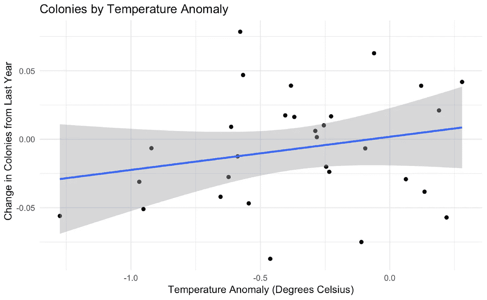****

> ****最低温度异常与前一年的菌落百分比变化之间存在轻微的正相关****

# ****菌落与消费品价格有什么关联？****

****我从弗雷德(圣路易斯的美联储银行)那里搜集了不同消费价格指数的 CSV 文件，用于各种食品。****

******我假设** `**melons**` **、** `**fruits**` **、** `**almonds**` **会和** `**colonies**`有很强的负相关。因为甜瓜、水果和杏仁主要由蜜蜂授粉，我假设随着蜂群数量的减少，这些商品的价格会上升，而其余商品的相关性为 0。****

****我观察了各种消费品的菌落变化百分比与价格指数变化百分比之间的关系(相对于绝对数字)。****

****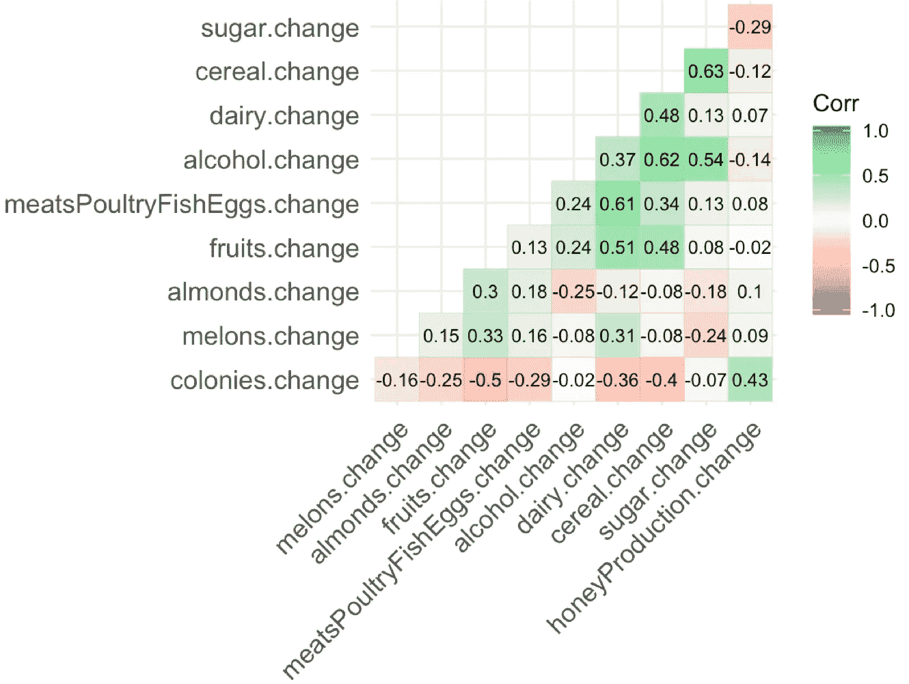****

******Correlation Table between % Change in Colonies and % Change in Price Indices of Various Consumer Goods. *Last row is the most important******

****我还尝试将群体百分比变化数据延迟 1 年，以观察价格是否会在事后受到影响，实际上相关度非常接近 0。****

> ****虽然商品价格*与蜜蜂数量相关，但可能还有无数其他因素影响它们。*****

# ****我们能预测蜂蜜价格吗？****

****平均蜂蜜价格与蜂蜜产量`[-0.8]`密切相关，与每个蜂群的蜂蜜磅数`[-0.59]` 和蜂群数量`[-0.45]`适度相关。****

****我建立了一个线性模型，试图根据其他三个变量来预测蜂蜜的价格。尽管总体模型在统计上是显著的`(p-value = 3.972e-07)` 并且 r 平方是中等的`(0.6818)`，但是没有一个变量是统计上显著的预测因子——我对模型的质量没有太大的信心，但是，我认为看起来还是很有趣的。****

```
**Coefficients:
                          Estimate Std. Error t value Pr(>|t|)   
(Intercept)              1474.2895   524.7439   2.810  0.00895 **
`Colonies (Thousands)`     -0.3806     0.1895  -2.008  0.05435 . 
`Yield (lbs per colony)`  -15.9264     8.1140  -1.963  0.05967 . 
`Production (Millions)`     4.0934     2.9445   1.390  0.17542   
---
Signif. codes:  0 ‘***’ 0.001 ‘**’ 0.01 ‘*’ 0.05 ‘.’ 0.1 ‘ ’ 1

Residual standard error: 36.04 on 28 degrees of freedom
Multiple R-squared:  0.6818, Adjusted R-squared:  0.6477 
F-statistic: 19.99 on 3 and 28 DF,  p-value: 3.972e-07**
```

> ****我使用的数据集没有足够的数据来预测蜂蜜的价格。****

# ****数据****

****[*Kaggle:蜂群统计*](https://www.google.com/url?q=https%3A%2F%2Fdata.world%2Ffinley%2Fbee-colony-statistical-data-from-1987-2017&sa=D&sntz=1&usg=AFQjCNEsp3bsA0QK9rsstV6-PiG1EXSrGA)****

****[*弗雷德:CPI 数据*](https://www.google.com/url?q=https%3A%2F%2Ffred.stlouisfed.org%2Fseries%2FCUSR0000SAF113&sa=D&sntz=1&usg=AFQjCNEBcqJWP3OE1sCJSn89IHH5V4MaDQ)****

****[*美国宇航局:1880 年至今气温异常*](https://www.google.com/url?q=https%3A%2F%2Fsvs.gsfc.nasa.gov%2F4626&sa=D&sntz=1&usg=AFQjCNH6AjVTeQ1KMyzEKcOtyPWMmi2Scw)****