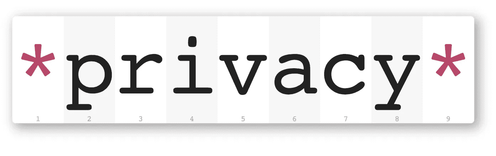

# 今年数据世界将会发生什么。

> 原文：<https://towardsdatascience.com/whats-going-to-happen-this-year-in-the-data-world-9fc065ac3870?source=collection_archive---------15----------------------->

## 如果我们希望预见数学的未来，我们应该研究这门科学的历史和现状。亨利·庞卡雷。

# 介绍

如果你沉浸在数据世界中，很可能你已经看到了一堆关于今年和未来几年将要发生的事情、趋势和期望的文章、博客帖子和新闻。

我读了很多，如果你想读，可以去文章的结尾，你会在那里找到。但是在这里，我想快速概述一下现在正在发生的事情，并分析人们正在谈论的不同趋势，看看更有可能发生什么。

# 最常见的趋势

如果你搜索“数据科学”这个词，你会找到大约 5400 万个结果，这是一个很大的数字。多年来，人们对这一领域的兴趣一直在增长:

但是数据科学现在很重要，它对不同的人有不同的意义。如果你看一看文章和新闻，最大的趋势是:

还有更多，但这些是最大的。关于它们中的每一个都有很多要说的，但是我现在想集中讨论其中的两个。自动化和图表。

# 自动化和图表(数据结构)

[https://towardsdatascience.com/the-data-fabric-for-machine-learning-part-1-2c558b7035d7](/the-data-fabric-for-machine-learning-part-1-2c558b7035d7)

如果您一直在关注我的研究，我现在最感兴趣的事情之一就是数据结构。请记住，我对数据结构的定义是:

> *数据结构是支持公司所有数据的平台。它是如何被管理、描述、组合和普遍访问的。该平台由企业知识图构成，以创建统一的数据环境。*

这里我想强调两点，数据结构是由企业知识图构成的，应该尽可能自动化。

Gartner 的一篇文章非常清楚地提到了这一点:

 [## Gartner 确定了 2019 年十大数据和分析技术趋势

### 增强分析、持续智能和可解释的人工智能(AI)是……

www.gartner.com](https://www.gartner.com/en/newsroom/press-releases/2019-02-18-gartner-identifies-top-10-data-and-analytics-technolo) 

他们说:

> 到 2022 年，图形处理和图形数据库管理系统的应用将以每年 100%的速度增长，以不断加快数据准备，实现更复杂和适应性更强的数据科学。

此外:

> 到 2022 年，定制数据结构设计将主要作为静态基础设施进行部署，迫使组织投入新一轮成本来彻底重新设计更动态的数据网格方法。

很明显，对于数据公司来说，图表概念和数据结构将会越来越普遍。但是自动化呢？

在机器学习、深度学习和部署方面，自动化有很多进步。但正如我之前所说，数据是公司目前的重要资产(可能是最重要的资产)。所以在你可以应用机器学习或深度学习之前，你需要拥有它，知道你拥有什么，理解它，治理它，清理它，分析它，标准化它(也许更多)，然后你才能想到使用它。

我们需要数据存储、数据管理、数据探索、数据清理以及所有我们实际上花费大量时间做的事情的自动化。你可以说像 [DataRobot](https://www.datarobot.com/) 这样的工具可以给你提供这些东西，但是根据我的经验，在这个领域还有很多事情要做。

这就是为什么我打赌语义技术是发展的方向。有了它们(像 [Anzo](https://www.cambridgesemantics.com/product/) )你可以自动生成查询(是的，这是一件事),用它们来处理复杂的图形使提取特征变得容易，并最终完全自动化。

在我关于这个主题的第一篇文章中，我也提出了这个架构:

[https://towardsdatascience.com/deep-learning-for-the-masses-and-the-semantic-layer-f1db5e3ab94b](/deep-learning-for-the-masses-and-the-semantic-layer-f1db5e3ab94b)

到处都有自动化。而且很容易在旅途中添加更多功能，如**可解释的人工智能**、**持续智能**等等。在同一篇文章中，Gartner 的人员提到:

> 持续智能是一种设计模式，其中实时分析被集成到业务运营中，处理当前和历史数据以规定响应事件的操作。它提供决策自动化或决策支持。

如果我们考虑流分析，这不是一个新术语，但我喜欢这个名字。实际上，正在发生的事情可以分为两件:**语义技术和自动化。**

这是语义技术在过去 5 年中引起的兴趣:

正如我们所看到的，数据结构并没有那么高，但我认为这种情况很快就会改变。

# 结论

因此，如果您想要跟上时代，您最好开始考虑如何将您的数据湖改进为智能数据湖，您还希望自动化您的流程，从数据摄取到模型部署和监控，并利用图表技术。

同样，正如我之前提到的，在以下情况下，您应该使用图形数据库而不是其他数据库:

*   你有高度相关的数据。
*   你需要一个灵活的模式。
*   您希望有一个结构并构建更接近人们思维方式的查询。

相反，如果您有一个高度结构化的数据，您希望进行大量的分组计算，并且您的表之间没有太多的关系，那么您可能更适合使用关系数据库。

剑桥语义公司的人创建了这个伟大的信息图，让你了解更多关于数据结构世界的信息:

感谢您阅读本文，希望这篇文章能让您了解作为数据科学家在个人业务和生活中应该做些什么。

# 参考资料:

 [## Gartner 确定了 2019 年十大数据和分析技术趋势

### 增强分析、持续智能和可解释的人工智能(AI)是……

www.gartner.com](https://www.gartner.com/en/newsroom/press-releases/2019-02-18-gartner-identifies-top-10-data-and-analytics-technolo)  [## 2019 年数据科学趋势

### 今年可以被认为是人工智能(AI)的蓬勃发展。只要看看有多少创业公司拥有…

towardsdatascience.com](/data-science-trends-for-2019-11b2397bd16b)  [## 2019 年数据科学趋势-数据大学

### 谈到 2019 年值得关注的主要数据科学趋势，去年的主要趋势从 2017 年开始延续，因为增长…

www.dataversity.net](https://www.dataversity.net/data-science-trends-in-2019/#)  [## 人工智能，数据科学，分析 2018 年的主要发展和 2019 年的主要趋势

### 和过去一样，我们为您带来专家的预测和分析综述。我们问了主要的是什么…

www.kdnuggets.com](https://www.kdnuggets.com/2018/12/predictions-data-science-analytics-2019.html)  [## 2019 年值得关注的 10 大数据趋势

### 我们寻找更多的数据有一个很好的理由:它是推动数字创新的商品。然而，把那些巨大的…

www.datanami.com](https://www.datanami.com/2019/01/21/10-big-data-trends-to-watch-in-2019/)  [## 5 2019 年数据和人工智能趋势-信息周刊

### 新的一年，新的一页。如果 2019 年看起来像 2018 年，你可以打赌，数据、分析、机器学习…

www.informationweek.com](https://www.informationweek.com/strategic-cio/5-data-and-ai-trends-for-2019/d/d-id/1333581)  [## 图形数据库。有什么大不了的？

### 继续分析语义和数据科学，是时候讨论图形数据库以及它们必须…

towardsdatascience.com](/graph-databases-whats-the-big-deal-ec310b1bc0ed)  [## 安佐

### 到目前为止，还没有任何技术能够在企业范围内提供语义层——包括安全性、治理和…

www.cambridgesemantics.com](https://www.cambridgesemantics.com/product/)