# 那里在生长什么？

> 原文：<https://towardsdatascience.com/whats-growing-there-a5618a2e6933?source=collection_archive---------8----------------------->

## 利用 eo-learn 和 fastai 从多光谱遥感数据中识别作物

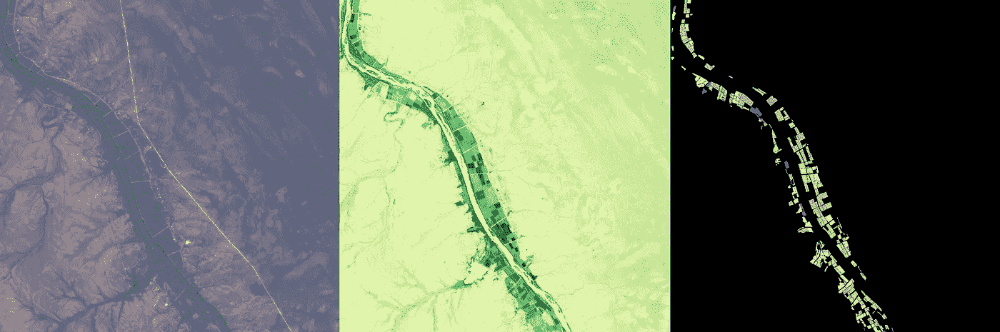

A section of the Orange River, South Africa: colour imagery and NDVI from Sentinel 2 and target masks from Zindi’s Farm Pin Crop Detection Challenge

# 介绍

这篇文章描述了我如何使用 eo-learn 和 fastai 库来创建机器学习数据管道，该管道可以从卫星图像中对作物类型进行分类。我用这个管道进入了 Zindi 的[农场 Pin 作物检测挑战赛](https://zindi.africa/competitions/farm-pin-crop-detection-challenge)。我可能没有赢得比赛，但我学到了一些处理遥感数据的伟大技术，我在这篇文章中详细介绍了这些技术。

以下是我遵循的预处理步骤:

1.  将感兴趣的区域划分成“小块”网格，
2.  从磁盘加载图像，
3.  遮住了云层，
4.  增加了 NDVI 和欧几里德范数特性，
5.  按照固定的时间间隔对图像进行重新采样，
6.  添加了具有目标和标识符的栅格图层。

我将作物类型分类的问题重新定义为一项语义分割任务，并使用图像增强和混合对多时相多光谱数据训练了一个带有 ResNet50 编码器的 U-Net，以防止过度拟合。

我的解决方案在很大程度上借鉴了 [Matic Lubej](https://medium.com/u/fe489d29ae67?source=post_page-----a5618a2e6933--------------------------------) 在他的[三篇](https://medium.com/sentinel-hub/land-cover-classification-with-eo-learn-part-1-2471e8098195) [优秀](https://medium.com/sentinel-hub/land-cover-classification-with-eo-learn-part-2-bd9aa86f8500) [帖子](https://medium.com/sentinel-hub/land-cover-classification-with-eo-learn-part-3-c62ed9ecd405)中概述的关于土地覆盖分类与 [eo-learn](https://github.com/sentinel-hub/eo-learn) 的方法。

我创建的 python 笔记本可以在这个 github 资源库中找到:[https://github . com/Simon grest/farm-pin-crop-detection-challenge](https://github.com/simongrest/farm-pin-crop-detection-challenge)

# 挑战

Zindi 是一个非洲竞争性数据科学平台，致力于利用数据科学造福社会。在 Zindi 的 2019 年[农场 Pin 作物检测挑战赛](https://zindi.africa/competitions/farm-pin-crop-detection-challenge)中，**的参与者使用**[**sentinel 2**](https://sentinel.esa.int/web/sentinel/missions/sentinel-2)**图像训练机器学习模型，以便对南非奥兰治河沿岸**的农田中种植的作物进行分类。

提供给参赛者的数据由两个形状文件组成，其中包含训练集和测试集的场边界，以及 2017 年 1 月至 8 月期间 11 个不同时间点的感兴趣区域的 Sentinel2 影像。

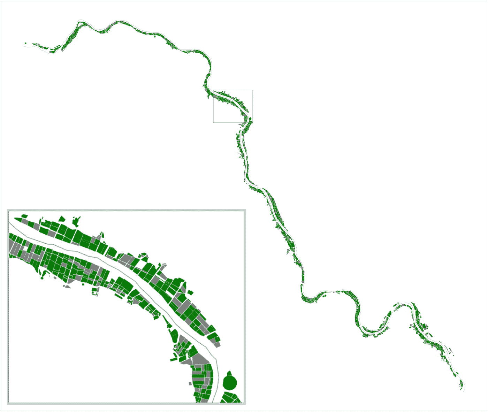

The section of the Orange River — grey test set fields interspersed amongst green training set fields

训练集和测试集分别由 2497 个字段和 1074 个字段组成。训练集中的每个田地都标有九个标签中的一个，指示该田地在 2017 年期间种植的作物。

作物类型有:

```
Cotton
Dates
Grass
Lucern
Maize
Pecan
Vacant
Vineyard
Vineyard & Pecan (“Intercrop”)
```

参赛者只能使用提供的数据，并且(由于在比赛期间发现数据泄露)禁止使用 Field_Id 作为训练功能。

# 使用 eo-learn ( [笔记本](https://github.com/simongrest/farm-pin-crop-detection-challenge/blob/master/notebooks/Process%20Satellite%20Imagery.ipynb))进行数据预处理

eo-learn 库允许用户将感兴趣的区域划分为补丁，定义工作流，然后在补丁上并行执行工作流。

## 1.分割感兴趣的区域

使用`sentinelhub`库中的`BBoxSplitter`,我将河流分成了 12 块:

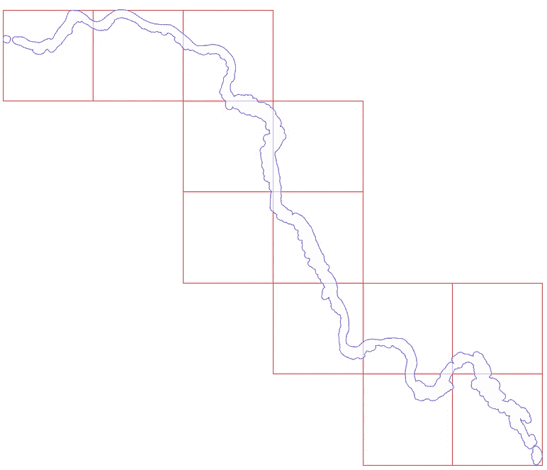

The area of interest partitioned into a grid of ‘patches’

## 2.从磁盘加载图像数据

比赛图像数据以 JPEG2000 格式在标准 [Sentinel2 文件夹结构](https://sentinel.esa.int/web/sentinel/user-guides/sentinel-2-msi/data-formats)中提供，如下图所示:


Sentinel2 folder structure

eo-learn 库提供了许多有用的预定义任务，用于从 Sentinel Hub 加载影像、处理影像和生成要素。在撰写本文时，它还没有以上述格式从磁盘加载图像的任务。然而，定义我自己的`EOTask`类来做这件事被证明足够简单。`EOTask`类需要一个`execute()`方法，该方法可以选择接受一个`EOPatch`对象作为参数。

`EOPatch`对象本质上只是`numpy`数组和元数据的集合。我自己定制的`EOTask`加载的`EOPatch`对象看起来是这样的:

```
data: {
    BANDS: numpy.ndarray(shape=(11, 1345, 1329, 13), dtype=float64)
  }
  mask: {}
  mask_timeless: {}
  scalar_timeless: {}
  label_timeless: {}
  vector_timeless: {}
  meta_info: {
    service_type: 'wcs'
    size_x: '10m'
    size_y: '10m'
  }
  bbox: BBox(((535329.7703788084, 6846758.109461494), (548617.0052632861, 6860214.913734847)), crs=EPSG:32734)
  timestamp: [datetime.datetime(2017, 1, 1, 8, 23, 32), ..., datetime.datetime(2017, 8, 19, 8, 20, 11)], length=11
)
```

我们可以通过使用波段 4、3 和 2(红色、绿色和蓝色)为每个斑块生成彩色图像来可视化斑块:

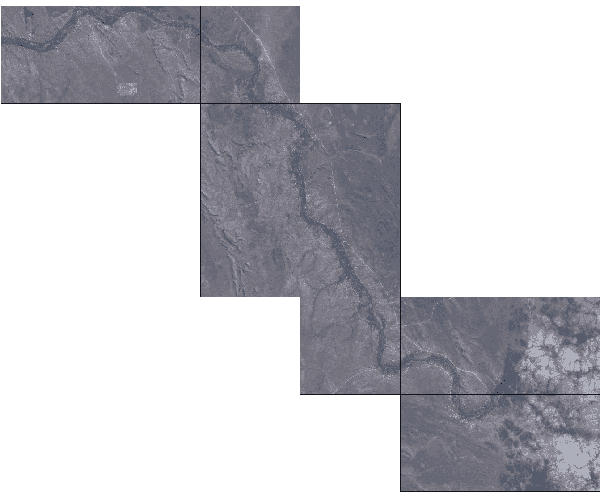

Colour images of the 12 patches made with the red, green and blue bands

## 3.遮蔽云层

在上面图像的右下角有一些云层。eo-learn 库提供了一个预训练的像素级云探测器模型。此功能可通过`S2PixelCloudDetector` 和*`AddCloudMaskTask`类获得。*

*`S2PixelCloudDetector`来自一个单独的库[sentinel2-云探测器](https://github.com/sentinel-hub/sentinel2-cloud-detector)，使用 sentinel 2 图像的所有 13 个波段进行预测。通过设置概率阈值，可以将云概率预测转化为云掩膜。*

*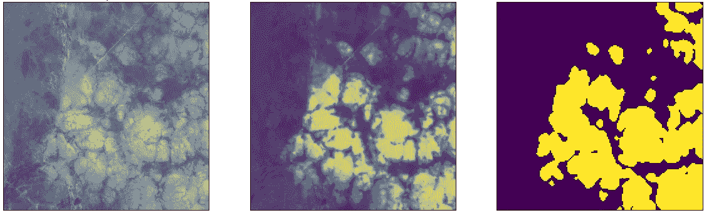*

*Colour image with clouds, cloud probabilities and resulting cloud mask*

*我使用这个云检测功能向我的数据添加了一个云遮罩。*

## *4.随时间重新采样*

*删除云会在每个时间片上有云覆盖的区域的数据中留下间隙。填充这些间隙的一种可能的方法是在前面和后面的时间片之间进行插值。*

*已经为此定义了一个`LinearInterpolation` `EOTask`。类要求您指定要插值的波段和重新采样的间隔。我决定将我的数据平均到大约每月一个时间片，这将我的时间维度从 11 个时间点减少到 8 个。*

*此外，为了处理时间段开始或结束时的任何间隙，我使用了一个`ValueFilloutTask`进行简单的外推，即根据需要从之前或之后的时间点复制值。*

## *5.添加 NDVI*

**归一化差异植被指数* (NDVI)是卫星图像中植物生命存在的简单指标。该指数是使用红色和近红外(NIR)波段计算的。*

*NDVI =(近红外光谱-红色)/(近红外光谱+红色)*

*维基百科上关于 NDVI 的文章对这个指标背后的基本原理有一个很好的解释。基本的想法是，植物物质吸收大部分可见的红色光谱光，而它反射近红外光，这不能用于光合作用，NDVI 在比率中捕捉这种反射率的差异。*

*方便的是，eo-learn 提供了一个`NormalizedDifferenceIndex`任务，允许我轻松地计算和添加每个补丁的 NDVI。*

*对于不同的作物，NDVI 随着时间的推移会有不同的演变。不同的作物在不同的时间种植和收获，生长速度也不同。下面的动画展示了 NDVI 在邻近油田的不同发展。*

*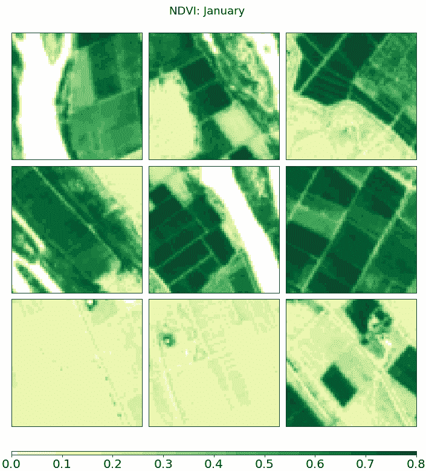*

*NDVI through time (in March you can see artefacts that result from the cloud masking and interpolation)*

## *6.添加目标遮罩*

*为了将作物识别挑战视为语义分割任务，我需要为我们的图像创建目标遮罩。eo-learn 中的`VectorToRaster`任务获取矢量几何图形并创建光栅化图层。我使用此任务来添加指示作物类型的栅格图层。我还添加了一个带有字段标识符的层，用于推理。*

*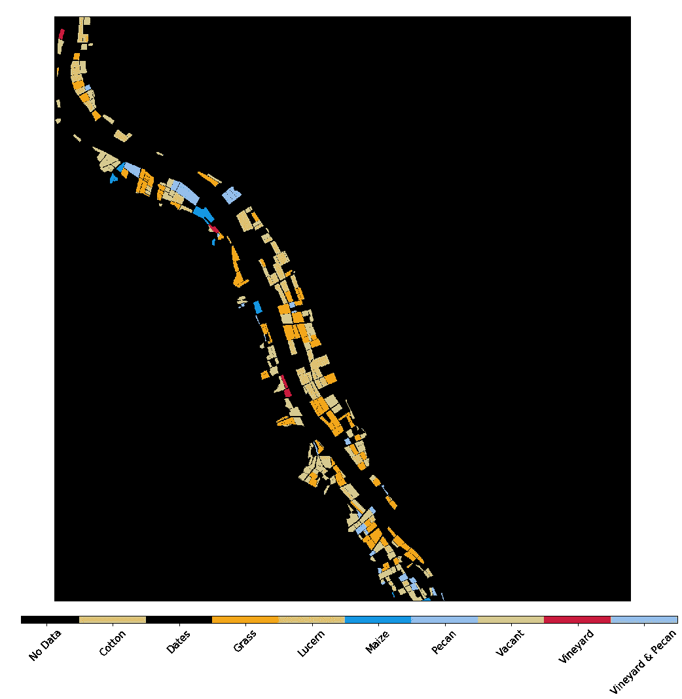*

*Crop type raster layer for patch number 6*

## *创建工作流并执行它*

*为了运行上述每个预处理步骤，我将所有任务放入一个工作流中。一般来说，eo-learn 工作流可以是任何在每个节点都有`EOTask`对象的无环有向图。我只是使用了一个线性工作流程，看起来像这样:*

```
*LinearWorkflow(
 add_data,           # load the data
 add_clm,            # create cloud mask
 ndvi,               # compute ndvi
 norm,               # compute the euclidean norm of the bands
 concatenate         # add the ndvi and norm to the bands
 linear_interp,      # linear interpolation
 fill_extrapolate,   # extrapolation
 target_raster,      # add target masks
 field_id_raster,    # add field identifiers
 save                # save the data back to disk
)*
```

*为了执行这个工作流，我为每个补丁创建了执行参数，然后使用一个`EOExecutor`以分布式方式在所有补丁上运行整个工作流。*

```
*execution_args = []
for patch_idx in range(12):
    execution_args.append({
        load: {'eopatch_folder': f'eopatch_{patch_idx}'},
        save: {'eopatch_folder': f'eopatch_{patch_idx}'}
    })

executor = EOExecutor(workflow, execution_args, save_logs=True)
executor.run(workers=6, multiprocess=False)*
```

# *构建预测模型*

## *语义分割*

*语义分割是给图像的每个像素分配类别标签的过程。通过将这次挑战中的作物识别问题重新构建为语义分割任务，我可以利用每个领域的局部空间上下文中的信息，如下所示，这还允许我通过重复采样生成更多的训练数据。*

## *1.生成训练集([笔记本](https://github.com/simongrest/farm-pin-crop-detection-challenge/blob/master/notebooks/Create%20Unet%20Features.ipynb))*

*从我的 12 个小块中，我随机抽取了 64 x 64 像素的小块来训练我的模型。我保持小块的大小，因为这些区域本身相对较小，并且提供的 Sentinel2 影像的最大空间分辨率为 10 米。这意味着一个 1 公顷大小(10，000 平方米)的正方形区域在影像中显示为 32 x 32 像素的面积。*

*我以确保每个小块至少包含一部分训练字段的方式对小块进行了采样。对于每个 patchlet，我保存了两个 pickle 文件，一个包含输入影像，另一个包含作物类型的栅格图层。*

*对于输入图像，我选择包括六个通道，三个可见波段(红色、绿色和蓝色)，近红外和计算的 NDVI 和欧几里德范数。当我通过时间插值对图像进行重新采样时，我得到了八个不同的时间点。为了得到一个秩为 3 的张量，我简单地在八个时间点的每一个点上叠加六个通道，得到一个 48 通道的图像。*

**

*NDVI and visible images at a single time point along with the corresponding target crop types for nine randomly sampled 64x64 training ‘patchlets’*

## *2.数据扩充*

*竞争中可用的相对较小的数据集和我选择的网络架构中的大量参数意味着我需要特别小心过度拟合。为了避免这一点，我使用了图像放大和混合。*

*fastai 库提供了一系列图像增强技术。我使用了:*

*   *垂直翻转*
*   *水平翻转*
*   *旋转*
*   *嗡嗡声*
*   *翘曲*
*   *和剪切*

*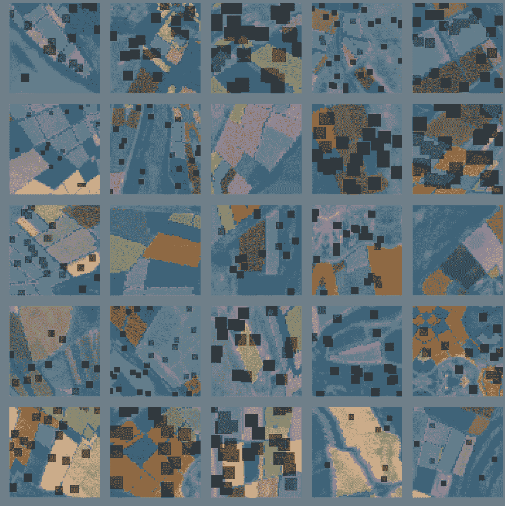*

*A batch of training images with image augmentations applied*

## *3.创建 fastai U-Net 模型([笔记本](https://github.com/simongrest/farm-pin-crop-detection-challenge/blob/master/notebooks/Train%20Unet%20Model.ipynb))*

*[fastai](https://docs.fast.ai/) 库通过允许用户从现有卷积网络编码器动态构建 U-Net 来提供语义分段。我选择了一个在 [ImageNet](/www.image-net.org) 上预先训练的 ResNet50 作为我的编码器网络。为了处理我的输入张量的形状，我将 ResNet50 网络的第一个卷积层(采用 3 个通道)替换为采用 48 个通道的卷积层。*

*我不会试图在这里解释 U-网或残差神经网络，因为已经有很多很好的解释了。例如，这里有一个[帖子](/understanding-semantic-segmentation-with-unet-6be4f42d4b47)解释 U-net，这里有[另一个](/introduction-to-resnets-c0a830a288a4)解释 ResNets。*

*我创建了`SegmentationPklList`和类`SegmentationPklLabelList`来实现加载 pickle 文件‘图像’的功能，这样我的数据就可以与 fastai 的数据块 API 一起工作。*

*fastai `MixUpCallback`和`MixUpLoss`也需要一些小的调整来处理语义分割。*

## *4.损失函数*

*我用一个修改过的`CrossEntropyFlat`损失函数来给我的模型打分。我将其实例化为:*

*`CrossEntropyFlat(axis=1, weight=inv_prop, ignore_index=0)`*

*不同作物类型在训练集中的出现是不平衡的，某些作物类型只出现少数几次。我通过使用损失构造函数的`weight`参数，将我的损失函数与每种作物类型的逆频率成比例加权。*

*训练图像的大部分区域没有作物类型，或者该区域没有田地，或者如果有田地，它也不是训练集的一部分。通过使用 loss 构造函数的`ignore_index`参数，我忽略了没有作物类型标签的预测。*

## *5.培养*

*fastai 库提供的最大优势之一是灵活的训练循环，以及通过[单周期训练策略](https://arxiv.org/pdf/1803.09820.pdf)等技术控制训练参数的强大开箱即用支持。我使用`fit_one_cycle`函数训练我的 U-Net 五个时期，保持预训练的编码器参数不变，然后再训练十个时期，允许更新编码器权重。*

*在训练过程中，验证集的损失持续下降，而我的自定义像素精度度量稳步上升。*

*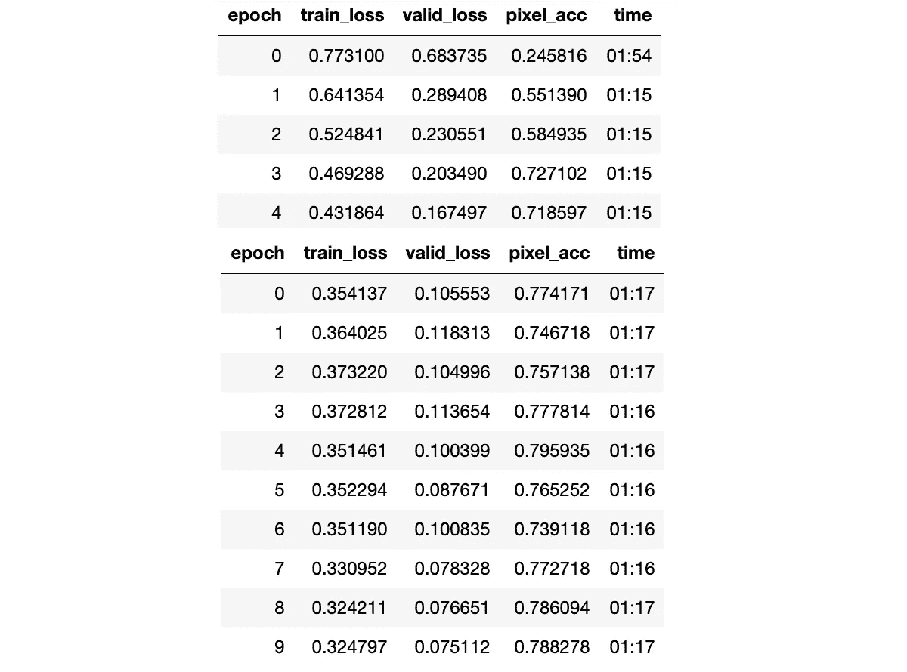*

*Training results from 5 frozen and 10 unfrozen epochs*

*对于验证集中的示例，将预测的像素掩膜与目标掩膜进行比较似乎表明网络工作正常，但是存在少数类和具有非标准形状的字段性能较差的示例。*

***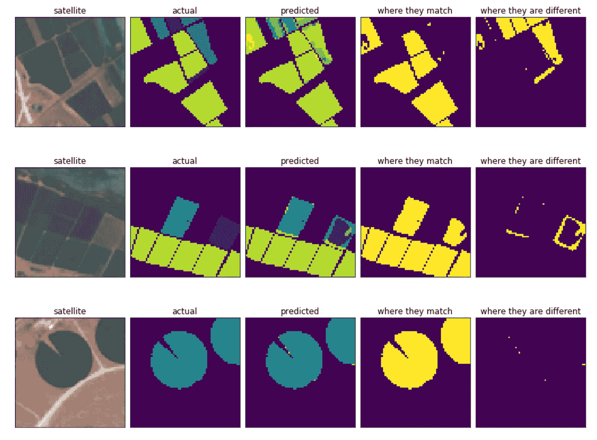*

*More predictions on examples from the validation set*

# *成果和有待改进的领域*

*为了对测试集进行推断，我将每个补丁分成一个 64x64 的“小补丁”网格，并保存每个小补丁的 pickle 文件。我对整个测试集进行了预测，并通过`Field_Id`对结果进行了分组。对每个像素的预测由来自 U-Net 的十个最终激活组成。我取了每个类的中值激活值，然后应用一个 softmax 函数来得到测试集中每个`Field_Id`的单个概率。*

*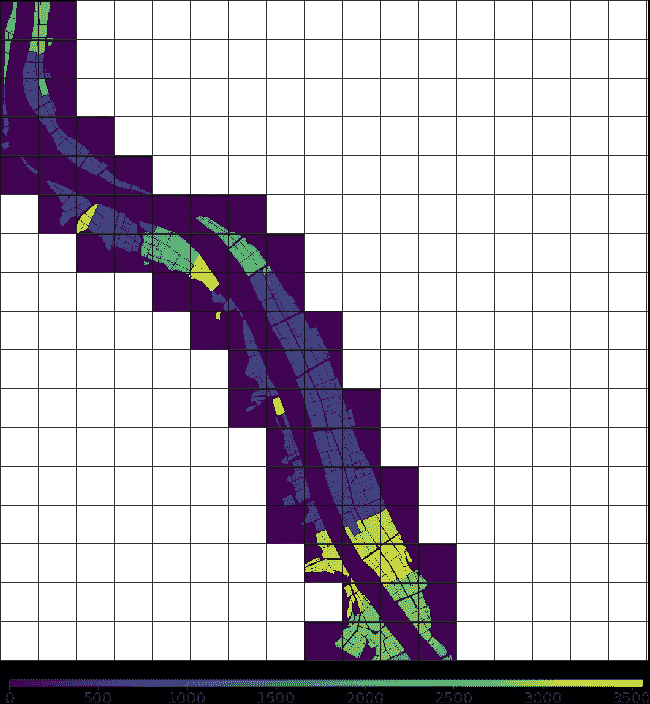*

*sample grid of ‘patchlets’ for inference — colouring by Field_Id clearly shows the data leak*

## *利用时间模式*

*反思我的方法，我认为最可以改进的地方是对时间维度的处理。我在 48 个通道中堆叠所有时间点的天真方法不允许我的模型通过时间从图像中正确地学习模式。我很想探索使用循环网络来学习这些时间模式。*

*eo-learn 背后的团队自己提出了使用一个*时间全卷积网络* (TFCN)来实现这个目的:[https://sentinel-hub . com/sites/default/LPS _ 2019 _ eol learn _ tfcn . pdf](https://sentinel-hub.com/sites/default/lps_2019_eolearn_TFCN.pdf)。TFCNs 以秩为 4 的张量作为输入，并使用 3D 卷积来同时捕获空间和时间中的模式。*

## *使用无监督学习构建潜在表示*

*如果竞赛允许使用外部数据，那么探索本文【https://arxiv.org/abs/1805.02855[中描述的 *Tile2Vec* 技术将会很有趣。这里的想法是通过使用三重损失设置无监督学习任务，从卫星图像生成区域的潜在向量表示。](https://arxiv.org/abs/1805.02855)*

*我很想知道其他竞争对手采用了什么方法。*

# **感谢**

**我要感谢* [*Zindi*](http://zindi.africa) *的团队组织了如此有趣的挑战。我还要感谢 eo-learn 团队提供了如此有用的库，以及关于如何使用它的如此引人入胜的帖子。也感谢 fastai 社区为让深度学习变得更加平易近人和广泛可用所做的所有工作。最后，我要感谢*[*Stefano Giomo*](https://forums.fast.ai/u/ste/summary)*对这个项目的所有投入。**