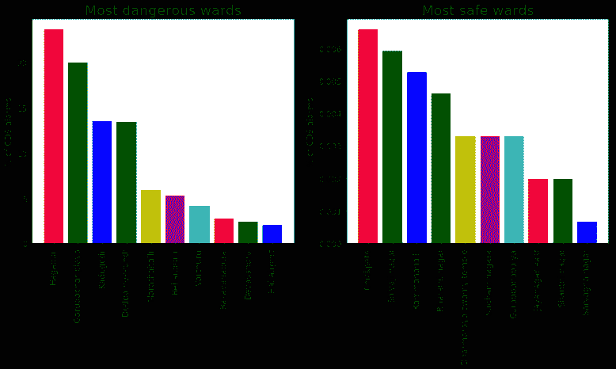
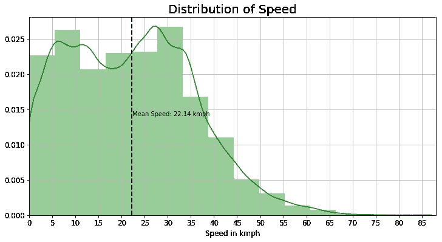
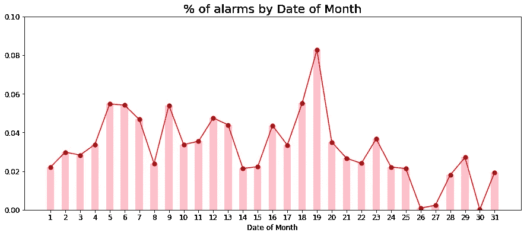
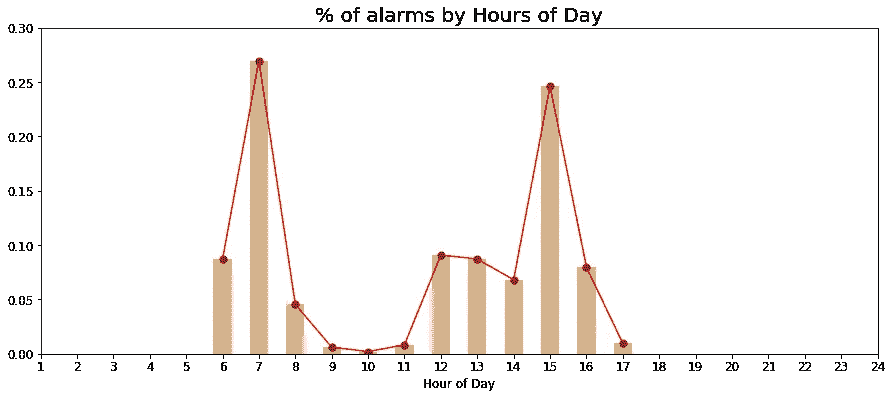
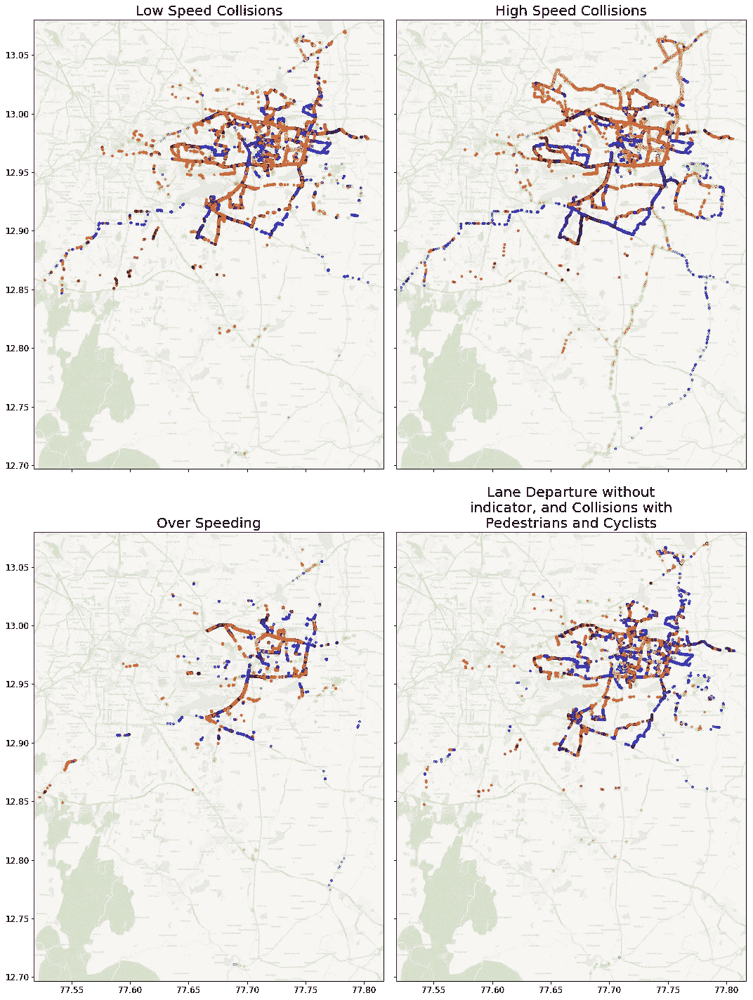
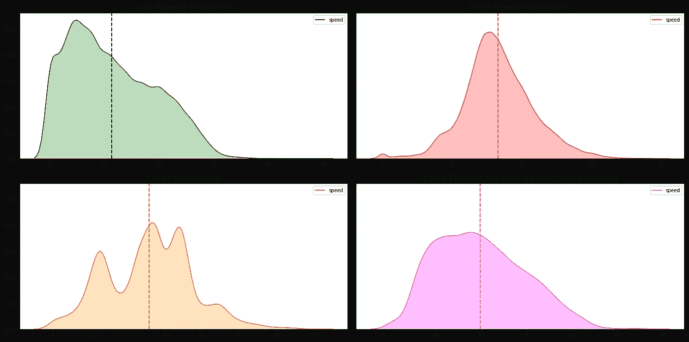
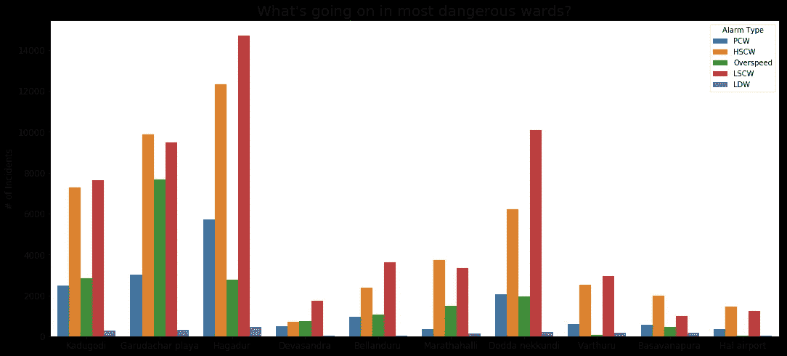
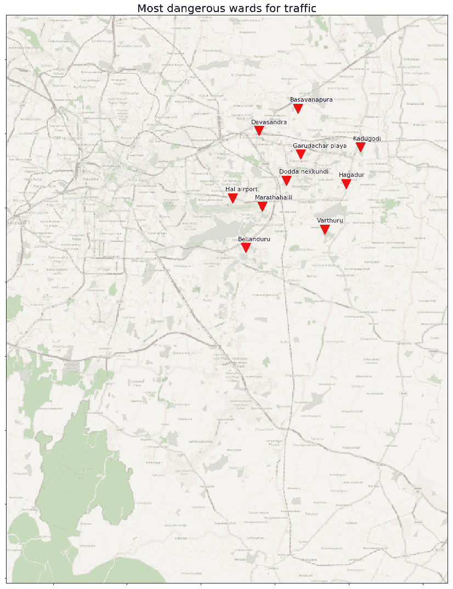

# 班加罗尔道路上的交通是怎么回事？

> 原文：<https://towardsdatascience.com/whats-happening-on-the-roads-of-bangalore-2fd5b7a6c54c?source=collection_archive---------12----------------------->

## 印度班加罗尔道路交通事故和其他事件的可视化分析。

**Image:** High speed traffic on NICE Road, Bangalore.
**Copyrighted Source:** [https://500px.com/photo/12002497/speed-by-supratim-haldar](https://500px.com/photo/12002497/speed-by-supratim-haldar)

# 目标

我们花很多时间在路上，陷入交通堵塞，这通常是由一天中特定时间的车辆溢出或一天中任何随机时间的意外事件造成的。但是所有这些都有一个模式吗？在本文中，让我们深入研究班加罗尔的交通数据，目的是获得有助于我们更好地规划通勤的见解。

# 介绍

T 班加罗尔的道路交通状况在印度城市中并不算最好，Ola Cabs 最近的一项研究也证实了这一点——高峰时段的平均车速约为 15.5 公里/小时，在印度城市中排名倒数第三。但是也有交通高速行驶的区域，城市的某些地方事故或潜在事故的数量很高，而在其他地方事故或潜在事故的数量却很低。通过对[这个公共数据集](https://www.kaggle.com/apoorvwatsky/bangalore-accident-data/)的探索性分析，让我们尝试解开一些关于班加罗尔道路和交通的有趣观察。

# 关于数据

这些数据(从 Kaggle 中的[公共数据集下载)由安装在公交车上的**防撞系统**收集，并绘制了班加罗尔市内即将发生碰撞的数据。](https://www.kaggle.com/apoorvwatsky/bangalore-accident-data/)

数据集中可用的信息:

> **设备代码**:安装在车辆上的 CAS 的唯一设备代码
> 
> **纬度**:产生碰撞警告的位置的纬度
> 
> **经度**:产生碰撞警告的位置的经度
> 
> **病房名称**:该位置(纬度，经度)所属的 BBMP 病房
> 
> **报警类型**:防撞系统产生的碰撞报警类型(详见下文)
> 
> **记录的日期和时间**:生成警报的日期和时间
> 
> **速度**:产生碰撞警报时的车速。所有的速度值都以千米/小时为单位

## 以下是分析所遵循的步骤:

1.  读取数据。
2.  数据的预处理和清理。
3.  通过可视化进行数据分析。

*完整的源代码在* [*这里*](https://github.com/SupratimH/learning-data-science/blob/master/project-playground/bangalore-road-accident-eda.ipynb) *都有，万一你想看的话。请在下面的评论部分提供您的宝贵反馈和建议，或者通过最后提供的电子邮件地址给我写信。*

# 放弃

对数据集的基本分析揭示了一些局限性，如下所示:

1.  只有 2018 年的数据。
2.  在 2018 年，仅提供 2 月、3 月、4 月、6 月和 7 月的数据。
3.  在任何一天，只有早上 6 点到下午 6 点之间的数据可用。在像班加罗尔这样的城市的道路上，下午 6 点以后和深夜的数据是重要的，这是缺失的。
4.  总之，这是一个很好的开始基本分析，并了解班加罗尔道路相关事件的高水平趋势。

# 背景资料

在进一步深入研究之前，了解 CDS 或 CAS 捕获的警报类型非常重要。更多详情请点击[这里](http://www.munichreamerica.com/site/mram-mobile/get/documents_E1566884367/mram/assetpool.mr_america/PDFs/1_Business_Solutions/Innovation/smart-mobility/Mobileye-FAQ_121217.pdf)。

*   **前方碰撞警告(FCW)**
    一辆 FCW 提醒司机即将与一辆汽车、卡车或摩托车追尾。
*   **城市前方碰撞警告(UFCW)**
    UFCW 在与前方车辆可能发生低速碰撞之前发出警告，从而在交通密集拥挤的情况下以低速辅助驾驶员。这通常适用于车速低于约 30 公里/小时的情况。
*   **车头时距监控警告(HMW)**
    车头时距监控警告(HMW)通过在距离变得不安全时提供视觉和听觉警告，帮助驾驶员与前方车辆保持安全的跟车距离。当车速超过 30 公里/小时时，该传感器发出警报，并以秒为单位显示距离前车的时间，当该时间变为 2.5 秒或更短时。
*   **车道偏离警告(LDW)**
    当车辆在没有使用转向灯的情况下意外偏离车道时，LDW 会发出警报。如果变道时使用转向信号灯，则不会产生警报。LDW 通常在 55 公里/小时以上行驶，如果车道没有标志或标志不良，它可能无法正常行驶。
    这进一步分为:(a) LDWL，用于向左车道偏离的车道，以及(b) LDWR，用于向右车道偏离的车道。
*   **行人和骑自行车者检测和碰撞警告(PCW)**
    PCW 通知司机危险区域内有行人或骑自行车者，并警告司机即将与行人或骑自行车者发生碰撞。当车速低于 50 公里/小时时，PCW 工作良好。
*   **超速**

# 探索性分析的观察和结果的可视化

通过大量的数据清理、处理和探索性分析，很少出现非常有趣的观察结果。这里有几个例子。

L 让我们从班加罗尔/孟加拉鲁鲁地图上的所有 CAS 警报数据开始，通过指定的坐标，生成警报生成时车辆位置和速度的热图。

在这张热图中，速度的大小由色温表示——较冷(带蓝色)的曲线表示速度较低，而较暖(带红色)的颜色表示速度较高。

An interactive accident heatmap of city of Bangalore. Hover on and zoom in the map for more details.

上面是一个交互式地图，所以悬停在上面可以看到病房，并放大以找出特定位置的车辆速度。

一些速度相对较高的领域:

*   旧马德拉斯路/班加罗尔-蒂鲁帕蒂公路
*   萨尔贾布尔路
*   外环线的部分路段
*   Anekal 主干道等。

# 事故的区域分布

# 事故发生时的车速

数据集中可用的速度数据是警报生成时公共汽车记录的速度，而不是班加罗尔道路上车辆/公共汽车的总体速度。记录的最高速度是 **83 公里每小时**，然而平均速度只有 **22 公里每小时**。

# 日期和时间

在这个月的 19 号有一个高峰，但是可能那是一个噪音。

> 就一天中的时间而言，清晨(早上 7 点)和下午(下午 3 点)看起来不是旅行的最佳时间。

但是，需要记住的是，数据集只包含一天中 12 个小时的数据。因此，我们看不到傍晚繁忙时间的情况。

## 到目前为止，我们已经探索了一些单独的功能。现在，让我们通过将两个或更多特征结合在一起，来尝试解开一些有趣的观察结果。

## (1)按警报类型划分的班加罗尔位置热图

注意，在这里，一天中的*小时被表示为颜色图，使得早期的小时以冷色(浅蓝色)表示，并且随着一天的进行，暖色表示一天中的较晚部分*。

**观察:**上面的热图清楚地表明，班加罗尔各地都发出了各种警报。因此，即使某些类型的事故在某些地区更频繁(例如，超速在高速公路上更普遍)，事故在整个城市都有可能发生。

## (2)每种事故/警报类型的速度分布

**观察:**

1.  低速碰撞的平均速度为 11-12 公里/小时。
2.  高速碰撞发生的平均速度约为 35 公里/小时，许多情况下速度更高。
3.  超速被报告为平均 25 公里/小时的速度(这不是真正的超速)。这让人对超速报警器的质量产生了怀疑。
4.  没有指示灯的车道偏离以及与行人和骑自行车者的碰撞的平均速度为 20 公里/小时。

# (3)哪些地区因哪种事故而臭名昭著？

**观察:**

1.  大多数高速和低速碰撞事件都发生在**哈加杜尔**。
2.  超速在嘎鲁达查尔半岛最常见。
3.  Hagadur 因与行人和骑自行车的人相撞而臭名昭著，更不用说没有指示灯的变道了。

# (4)了解班加罗尔地图上最危险的 10 个病房

# 摘要

上述分析为我们提供了不少关于班加罗尔道路交通的有趣观察。例如，每个病房有多安全或不安全，一天中什么时间最适合旅行，路上车辆的平均速度等等。最有趣的是，一个带有速度分布的交互式地图让我们可以找到事件发生的确切位置，以及 BBMP 区的名称和当时的车速。

**感谢您的阅读！你同意这些观点吗？请在下面的评论区分享你的想法，或者给我发邮件。**

对于我曾经做过或者目前正在做的其他项目，请到[http://supra timh . github . io](http://supratimh.github.io)处停止。