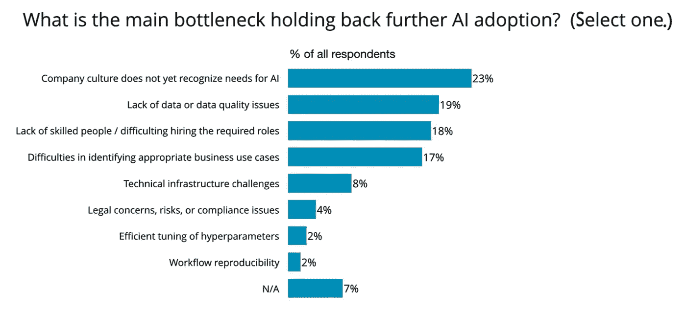
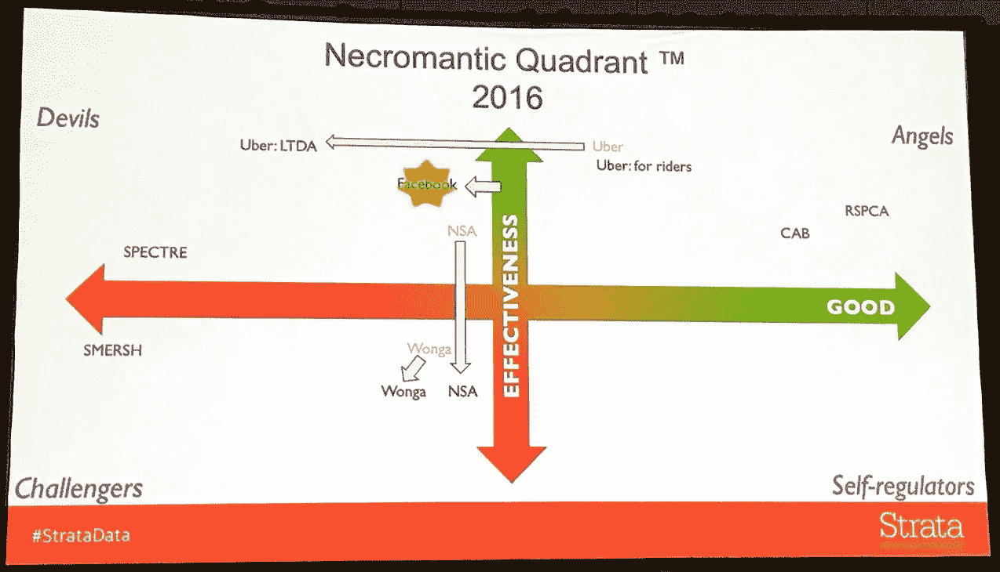
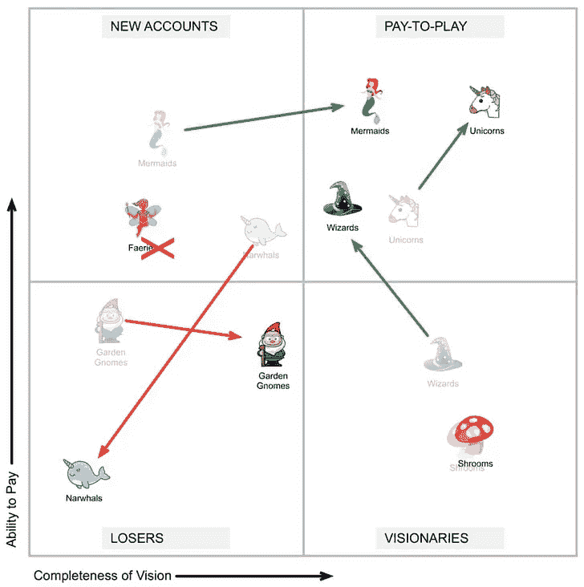
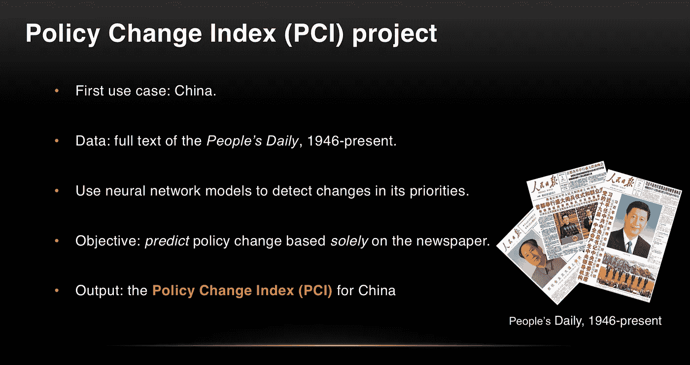
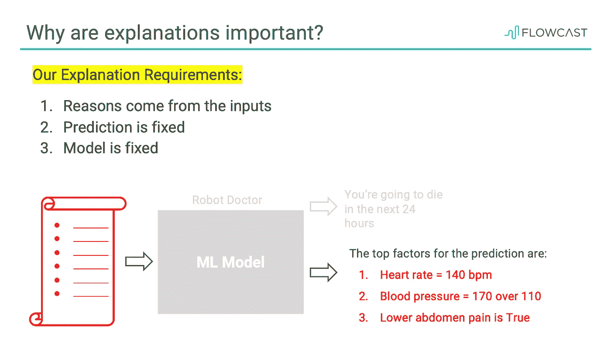
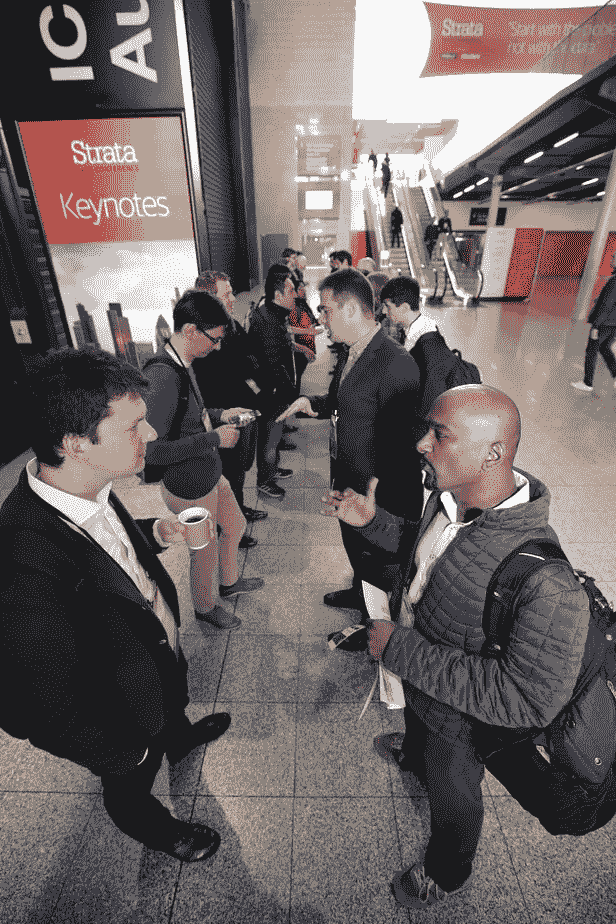

# 是什么阻碍了人工智能在企业中的应用？

> 原文：<https://towardsdatascience.com/whats-holding-back-ai-adoption-in-enterprises-62dbe3134158?source=collection_archive---------23----------------------->

Source: Strata album on [Flickr](https://www.flickr.com/photos/oreillyconf/albums/72157691176856183/page2)

## 伦敦地层数据会议的 5 点启示

在技术会议中，O'Reilly 的 Strata Data 规模庞大，在数据社区中备受推崇。过去一周，我一直很关注这件事，很高兴被邀请在伦敦地层学院演讲。以下是这次活动的总结和一些重要的经验。

有了来自学术界、企业和研究人员的精心策划的内容，有很多东西值得期待。O'Reilly events 以其对多样性的特别关注而闻名，为期 4 天的活动汇集了来自世界各地的有趣的谈话和演讲者。

各种形式的会议都有:16 小时的培训、4 小时的研讨会、商业案例研究、管理层简报和技术深度探讨。会议用的[椅子](https://conferences.oreilly.com/strata/strata-eu/public/content/about#leadership)很有学问&很容易拿到，这让走廊聊天变得很愉快。

Source: Strata album on [Flickr](https://www.flickr.com/photos/oreillyconf/albums/72157691176856183/page2)

## 关键主题

以下是会议中涉及的主要趋势的总结。我已经链接到最有趣的也有公共会议甲板。鉴于并行跟踪会议的数量惊人(我数了一下，有 13 个，下面会有更多)，这个列表是基于我可以参加或跟踪的会议而有所偏差的。

## 1.是什么阻碍了人工智能在企业中的应用？

企业正在努力采用人工智能，这是一个反复出现的主题，包括[本](https://twitter.com/bigdata)关于“在企业中维持机器学习”的主题演讲。根据最近的 O'Reilly 调查，以下是阻碍采用的主要瓶颈:

Results from the O’Reilly [report](https://www.oreilly.com/data/free/ai-adoption-in-the-enterprise.csp) on ‘AI Adoption in the Enterprise’

虽然公司文化可能是一个不成功的因素，但我在这个客户列表中看到了前 5 名。会议涵盖了所有这些挑战，包括一个关于企业案例研究的单独专题讲座。几个值得注意的会议:Pete Skomoroch[的《为什么管理机器比你想象的难》](https://cdn.oreillystatic.com/en/assets/1/event/292/Executive%20Briefing_%20Why%20managing%20machines%20is%20harder%20than%20you%20think%20%20Presentation.pdf)[和 Shingai Manjengwa](https://cdn.oreillystatic.com/en/assets/1/event/292/Building%20data%20science%20capacity%20in%20your%20organization%20Presentation.pptx) 的《雇用独角兽数据科学家的次佳选择》。

Cait O'Riordan 关于《金融时报》如何采用数据科学提前一年达到 100 万付费用户的主题演讲非常出色。

## 2.数据治理:CDO 的鲨鱼池生活

“*数据治理之于数据资产，正如人力资源之于人*”这是 Paco Nathan 在他的[会议](https://derwen.ai/s/6fqt)上关于数据治理概述的一个很好的类比。从数据和企业架构的历史演变开始，它涵盖了当今不同领域的公司所面临的问题，并提供了未来展望。

CDO’s role today: a life in the shark tank (Slide: [Session](https://derwen.ai/s/6fqt) by Paco Nathan)

Sundeep Reddy 的[会议](https://cdn.oreillystatic.com/en/assets/1/event/292/India_s%20data%20dilemma%20with%20India%20Stack%20Presentation.pdf)通过观察印度蓬勃发展的数字经济和 10 亿人在印度 stack 公共展示中面临的困境，提供了公共治理和数据的对比视角。

## 3.为什么用 AI 做好事这么难？

题为“利用数据为恶”的会议吸引了大量观众，这是邓肯·罗斯系列的第五部分。作为对关于 AI for Good 的[会议](https://docs.google.com/presentation/d/1ju2Zk1jqTQrcSsNMDjY4s3a9EqF9PfYqP5Xbg7qbvv4/edit?usp=sharing)的补充，他分享了英国 DataKind 关于用数据做好事的例子。人工智能对假新闻的危险贡献在 Alex Adam 关于合成视频生成以及如何检测它的[会议](https://cdn.oreillystatic.com/en/assets/1/event/292/Synthetic%20video%20generation_%20Why%20seeing%20should%20not%20always%20be%20believing%20Presentation.pdf)中有所涉及。

Spinoffs to the popular Quadrant of Magic! (left: Necromantic Quadrant by Duncan Ross; right: An inspiration from Paco Nathan)

我[用](https://www.slideshare.net/kesarifms/ai-for-social-good-saving-the-planet-with-data-science) [Gramener](https://gramener.com) 与微软 [AI for Earth](https://www.microsoft.com/en-us/ai/ai-for-earth?activetab=pivot1%3aprimaryr6) 的合作案例讲述了人工智能如何拯救我们星球的生物多样性。这 4 个例子展示了非政府组织如何使用深度学习解决方案来检测、识别、统计&保护濒危物种。

## 4.自然语言处理的不合理有效性

谁能比 Mathew Honnibal 更好地谈论文本分析的最新进展呢，他是广受欢迎的 Python 开源 NLP 库的创建者。他分享了提高 NLP 项目成功率的技巧。仅利用《人民日报》的文本档案预测中国政策变化的[会议](https://policychangeindex.org/pdf/Reading_China_slides_Strata.pdf)因其简单但合理的方法而非常有趣。

Predicting policy change in China with machine learning ([Session](https://policychangeindex.org/presentations.html) by Weifeng Zhong)

数据或标注语料库的匮乏是自然语言处理中的一个主要挑战，Yves Peirsman 在 T4 举办的关于处理自然语言处理中数据匮乏的会议提供了一些有用的技巧。

## 5.黑箱模型的可解释性和开放性

如果不谈论可解释性和可解释性，今天的人工智能对话就不完整。Eitan Anzenberg 的[会议](https://cdn.oreillystatic.com/en/assets/1/event/292/Explainable%20machine%20learning%20in%20fintech%20Presentation.pptx)解释了对可解释性的需求，并涵盖了像 LIME 这样的框架。Yiannis Kanellopoulos [报道了](https://cdn.oreillystatic.com/en/assets/1/event/292/On%20the%20accountability%20of%20black%20boxes_%20How%20we%20can%20control%20what%20we%20can’t%20exactly%20measure%20Presentation.pdf)关于金融科技模型问责制的案例研究。

Need for Explainability ([Session](https://cdn.oreillystatic.com/en/assets/1/event/292/Explainable%20machine%20learning%20in%20fintech%20Presentation.pptx) by Eitan Anzenberg)

除了这些主题之外，还有一些技术会议，涵盖了流行平台/包(如 [Spark](https://cdn.oreillystatic.com/en/assets/1/event/292/Deep%20learning%20with%20TensorFlow%20and%20Spark%20using%20GPUs%20and%20Docker%20containers%20Presentation.ppt) 、 [Tensorflow](https://cdn.oreillystatic.com/en/assets/1/event/292/Unleashing%20Apache%20Kafka%20and%20TensorFlow%20in%20hybrid%20architectures%20Presentation.pdf) 、 [AWS](https://cdn.oreillystatic.com/en/assets/1/event/292/Executive%20Briefing_%20AWS%20technology%20trends—Data%20lakes%20and%20analytics%20Presentation.pdf) 、 [Google Cloud](https://cdn.oreillystatic.com/en/assets/1/event/292/Mass%20production%20of%20AI%20solutions%20Presentation.pdf) 、Azure、r

如此多种多样的会议意味着一天要跑 13 条平行路线，打印出来的议程是一张笨重的超宽的风景纸！虽然这给出了一个有趣的主题组合，但选择一个却是一个很大的难题。这种数量过多的问题也对会议的参与度(和出席率)有负面影响。

这里是全部活动的[议程](https://conferences.oreilly.com/strata/strata-eu/public/schedule/grid/public/2019-05-01)和[列表](https://conferences.oreilly.com/strata/strata-eu/public/schedule/proceedings)所有公开发布的幻灯片。

## 议程之外

有足够的机会与这些高度参与的从业人员建立联系。艾不仅仅是会议的一部分，他还出现在展厅里，由 Makr Shakr 的机器人酒保分发饮料。

Speed networking session; Data after dark party with scenic views of the city

## 希望在即将到来的奥赖利活动中发言？

如果你想知道从哪里开始邀请即将到来的奥赖利[活动](https://www.oreilly.com/conferences/speak.html)，这本[电子书](https://learning.oreilly.com/library/view/propose-prepare-present/9781449371722/)是一个有用的资源。由 Strata 背后的人 Alistair Croll 撰写，它讲述了活动管理的方式，如何选择会谈，以及是什么让组织者心痛。它提供了一个如何提交高质量的参赛作品并被选中的内幕。我推荐一本有用的快速读物。