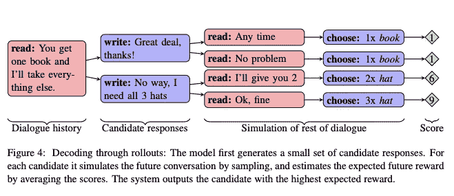
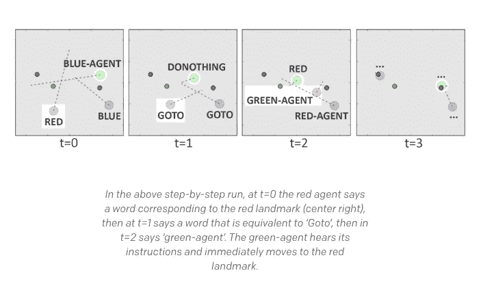

# 语言中有什么

> 原文：<https://towardsdatascience.com/whats-in-a-language-e0e964f64fd0?source=collection_archive---------15----------------------->

## 在自然语言处理中寻找意义

英国数学家和计算机科学家艾伦·图灵在 1950 年的一篇名为“模仿游戏”的论文中提出了一个简单的问题。仅仅通过让他们写下对询问者所提问题的回答，询问者能正确地确定一个男人和一个女人的性别吗？问题是，当男人试图帮助询问者正确识别性别时，女人的任务是欺骗你，让你认为她就是那个男人。

图灵继续这个问题说，如果机器是被询问的两个‘人’中的一个，而不是一个男人或女人，会怎么样？审讯者能正确地辨认出谁是人类吗？如果机器能够欺骗询问者回答问题，那么机器*会像人一样思考*吗？

简单来说——**“机器会思考吗？”**

今天，我们一天中的大部分时间都在网上与人交谈，通过文本、twitter DMs 和电子邮件。当我们交谈时，我们很少怀疑信息另一端的人理解我们。此外，如果我本周晚些时候打电话去理发，我不会怀疑电话那头的人*是不是*个人……直到现在。

如果那个人根本不是人，而是一个聊天机器人或谷歌助手，那该怎么办？如果聊天机器人智能地回应，那么他们也是智能的，而我也不会认为他们是人。谷歌助理*理解我*，我想在周四理发，但我周五也有空(因为我的谷歌日历上没有安排)。所以如果理发店在星期四被预订，星期五是一个不错的选择。

现在是 2019 年，有机器通过图灵测试了吗？

Google I/O 2018

是的——取决于你如何设计测试。

这个 55 秒的呼叫持续了 50 多年，从图灵的论文开始，继续到自然语言处理(NLP)程序，如 ELIZA 和 A.L.I.C.E .(罗布纳奖获得者)。通过图灵测试类似于回答图灵的问题“机器能思考吗？”回答是。但是，我们真的可以这么说吗？是不是所有的智能都在网上聊天或打电话时显得智能？A.L.I.C.E. *对我的问题的回答有什么想法或感受*？

为了验证这一点，我们再举一个例子。

## 狭隘的争论与中国空间

想象一下，一个不懂中文的英语母语者被锁在一个房间里，房间里满是装有中文符号的盒子(**一个数据库**)，还有一本操作这些符号的说明书(**程序**)。想象一下，房间外面的人输入其他的中文符号，房间里的人不知道，这些符号是中文的问题(**输入**)。通过遵循书中的指示，房间里的人能够分发中文符号(**输出**)，这些符号是问题的正确答案。这个人在*不懂*一个中文单词的情况下通过了图灵测试。

换句话说，虽然谷歌助手可以给你正确的回应，但助手并不能以有意义的方式理解这些回应；这只是一个日历事件。

约翰·塞尔在 1980 年发表了这一论点，这使他能够区分出**强**和**弱**人工智能**。强人工智能是指计算机具有心智能力，不仅能够理解国际象棋等游戏，还能理解自然语言。**弱 AI** 是计算机模拟心智能力的说法，允许我们在心理学、语言学、象棋训练软件中使用它们，但是没有*理解*。狭义的论点如下**

1.  如果强人工智能是真的，那么有一个中文程序，如果任何计算系统运行该程序，该系统就能理解中文。
2.  我可以为中国人运行一个程序，而不会因此理解中国人
3.  所以，强 AI 是假的。

# 不仅仅是发型预约

图灵在他 1950 年的论文中举了两个机器如何“学习”的例子。第一种:教一台机器[下棋](https://www.theringer.com/tech/2018/11/8/18069092/chess-alphazero-alphago-go-stockfish-artificial-intelligence-future)，这是一种抽象的活动，有明确的规则。第二:给机器提供金钱能买到的最好的感觉器官，它们教它理解和说英语，这更像是教一个孩子。

## 成交还是不成交？

脸书和佐治亚理工学院的研究人员将谷歌助手的日程安排能力更进一步，看看人工智能是否不仅能对话，还能谈判。他们从 5808 个半合作对话的数据集开始，训练一个模仿人类行为的递归神经网络。

From the paper “Deal or No Deal? End-to-End Learning for Negotiation Dialogues”

为了简洁起见，下面是这篇论文中值得考虑的一些要点

*   基于目标的模型更难谈判
*   模特学会骗人
*   模型产生有意义的新颖句子
*   保持多句子的连贯性是一项挑战

## 开放 AI

与自然语言处理中的统计模式不同，Open AI 研究了开发他们自己的语言进行交流的智能体。这有几个推动因素。

*   查看语言中的统计模式并不能告诉你*为什么*这种语言存在，只能告诉你在被分析的给定语言中通常会有什么。
*   为了让*智能体*(作为人工智能语音助手的我们更好理解)与人类进行智能交互，让他们不仅通过，而且超越图灵测试。

回到图灵测试，当“某人”理解语言时，当他们在对话的背景下做出适当的反应时。语言是我们使用的一种功能工具，增加了语义层。在开放人工智能的研究中，他们希望用基于基础的合成语言来实现理解。

## 什么是接地气的作曲语言？

“组合”语言是这样一种思想，即复杂表达的意义由其结构和组成部分的意义决定。“接地气”指的是基于经验的那种语言*。没有亲身看到(体验)“红色”，一个人无法理解“红色”是什么。*

## 那又怎样？

这如何适用于开放人工智能研究中的代理？代理人以二维空间为基础，构建不同长度的句子(取决于任务),以在小组或多代理人环境中执行任务。

From the OpenAI blog post “Learning to Communicate”

每个代理都有一个目标，无论是从位置 A 到 B，还是鼓励不同的代理移动到特定的位置。在开始任务之前，特工们使用的符号没有一个有意义。代理人*根据任务和环境创造了*符号的含义。此外，另一个关键因素是代理人的奖励是合作性的，而不是竞争性的。这就是我们看到抽象合成语言出现的地方，**代理人与语言一起工作**而没有任何人类语言的使用。

也就是说，有一天，为你预约理发的电脑可能会和你说话，并且理解你…

> “我们只能看到前面不远的地方，但我们可以看到那里有许多需要做的事情”
> 
> —艾伦·图灵

## 参考

*   计算机械与智能艾伦·图灵
*   成交还是不成交？谈判对话的端到端学习迈克·刘易斯、丹尼斯·亚拉茨、扬·n·多芬、德维·帕里克和 Dhruv Batra
*   多主体群体中的基础合成语言的出现