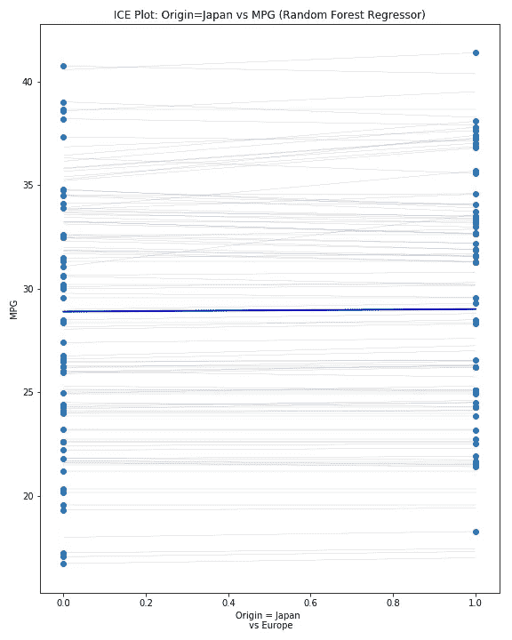

# 黑盒子里有什么？

> 原文：<https://towardsdatascience.com/whats-in-the-black-box-8f36b262362e?source=collection_archive---------26----------------------->

## 赵、著[“黑箱模型的因果解释”精华。](http://web.stanford.edu/~hastie/Papers/pdp_zhao_final.pdf)


Photo by [Christian Fregnan](https://unsplash.com/@christianfregnan?utm_source=medium&utm_medium=referral) on [Unsplash](https://unsplash.com?utm_source=medium&utm_medium=referral)

你可能熟悉《黑箱模型的因果解释》的作者——赵清源和特雷弗·哈斯蒂——特别是特雷弗·哈斯蒂。也许这个能让你想起什么？：


James, Gareth, et al. *An Introduction to Statistical Learning: with Applications in R*. Springer, 2017.

对我来说确实如此，因为这篇文章是我学习数据科学的第一个切入点。当你试图找出你的 R 代码到底出了什么问题时，你可能还会在阅读`glmnet`包的[文档](http://ww.web.stanford.edu/~hastie/Papers/Glmnet_Vignette.pdf)时想起 Hastie 的名字。或者那可能只是我。

正因为如此，我很好奇的看了赵和哈斯蒂的论文。以下是我了解到的！

## 黑匣子

机器学习(ML)模型虽然在预测性能上已经超过了参数模型，但也有被非技术用户认为是黑箱的缺点；它们的相对不透明性使它们难以解读。考虑下图:


Zhao & Hastie. 2018\. Causal Interpretations of Black-Box Models. [http://web.stanford.edu/~hastie/Papers/pdp_zhao_final.pdf](http://web.stanford.edu/~hastie/Papers/pdp_zhao_final.pdf)

模型的“本质”是“封闭的”,不为用户和客户所知。这很重要，因为一个核心问题是:什么样的**特性**对模型的输出很重要？当你不容易“看到”你的模型中发生的事情时，很难搞清楚这一点。

赵和 Hastie 谈论与**特性**重要性**相关的三个想法:**

1.  我们可以将 ML 模型视为一个函数，并询问哪个特性对输出的影响最大。想想回归模型的β系数。
2.  如果我们没有系数，那么也许我们可以[通过对模型预测准确性的“贡献”来衡量一个特征的“重要性”](https://christophm.github.io/interpretable-ml-book/feature-importance.html)。
3.  第三个是赵和哈斯蒂关注的，他们称之为**因果关系**。他们是这样描述的:

> 如果我们能够对 Xj 进行干预(在其他变量不变的情况下，将 Xj 的值从 a 改为 b)，Y 的值会改变多少？

他们论文的目标是:

> …解释在拟合黑盒模型后，我们何时以及如何进行因果解释。

## 因果关系

赵和哈斯蒂用**的成绩**和**的学习时间**来论证因果关系的概念。让我们考虑一个公式，其中:

```
Grade = [Some Constant Factor] 
        + (Some Multipicative Factor)x(Hours Studied) 
        + (Random Error)
```

这对我们来说有直观的意义:一般来说，你学习的时间越多，成绩越好。换句话说，有人可能会说**学习更多的时间** *会导致* **更高的分数**。

反过来呢？如果我们只有学生得到的分数会怎么样？通过对上述内容进行一些处理，我们可以得出如下结论:

```
Hours Studied = [Some Other Constant Factor] 
                + (Some Other Multipicative Factor)x(Grades) 
                + (Random Error)
```

这是否意味着如果老师给学生一个 A 而不是 B，学生将学习更多的时间？当然不是！

例如，在上面的**等级**公式中，也许我们添加了另一个特征，**工作时间**(在校外工作)。如果我们广泛地假设工作时间对于财政支持是必要的，那么工作时间可能会对学习时间产生因果影响，而不是相反。因此，学习时间是工作时间的必然结果。

## 部分相关图

因果解释的一个有用工具是[部分相关图](https://christophm.github.io/interpretable-ml-book/pdp.html) (PDP)。它们用于收集特性对模型预测结果的边际影响。为了大规模简化，我们可以认为它只是绘制一个特性的每个潜在值(横轴)的平均预测结果(纵轴)。为了使 PDP 对因果推理有用，所讨论的变量之间不能有任何其他变量，并且目标变量是因果后代。否则，与任何后代的互动都会影响解释。

例如，下面的 PDP 显示，平均预测自行车租金通常随着气温的升高而上升。


I too don’t like to bike when it’s humid, or windy. [https://christophm.github.io/interpretable-ml-book/pdp.html](https://christophm.github.io/interpretable-ml-book/pdp.html)

让我们用这个古老的例子来看另一个例子，波士顿房屋数据集。该数据集提供了波士顿(MEDV)中值住宅的目标和几个特征，如城镇人均犯罪率(CRIM)和氮氧化物浓度(NOX，以每 1000 万分率(pp10m 万)表示)。检查这些和[剩余的可用特征](https://www.kaggle.com/c/boston-housing)并不需要太多领域的专业知识，就可以得出结论，没有一个可以合理地成为 NOX 的因果后代。*更有可能的是*氮氧化物受一个或多个其他特征的影响——比如“每个城镇非零售商业英亩数的比例”(INDUS)——而不是氮氧化物影响 INDUS。这个假设允许我们使用 PDP 进行因果推断:


When nitric oxide concentration increased past 0.67 pp10m, Bostonians said [**NO**](https://en.wikipedia.org/wiki/Nitric_oxide) to higher house prices. Groan.

注意，该图以垂直轴为中心，表示=0。从上面我们可以推断出，中等住宅价格似乎对氮氧化物水平不敏感，直到大约 0.67 pp10m 万，中等住宅水平下降约 2000 美元。

## 个体条件期望图

但是如果我们不确定我们特征的因果方向呢？一个有用的工具是[个人条件期望](https://christophm.github.io/interpretable-ml-book/ice.html) (ICE)图。它不是根据某个特性的值绘制平均预测值，而是针对该特性的可能值为每个观察值绘制一条线。让我们通过重新查看我们的 NOX 示例来深入研究 ICE 图。


Nice ICE, baby. Please stop.

这个 ICE 图似乎支持我们在 PDP 中看到的情况:各个曲线在形状和方向上看起来都相似，并且像以前一样，在 NOX = 0.67 附近“水平”下降。

但是我们之前已经建立了理论，NOX 是数据集中一个或多个其他特征的因果衍生，因此 ICE 图仅用于确认 PDP 显示的内容。

如果我们探索一个不同的特性，“到五个波士顿就业中心的加权距离”(DIS)会怎么样？有人可能会争辩说，一个特征，如卷曲，可能是疾病的因果后代。如果我们看一个冰图:


我们发现了混合模式！在较高水平的 MEDV，随着 DIS 的增加有下降的趋势。然而！在较低水平的 MEDV，我们观察到一些曲线显示 DIS 对 MEDV 有短暂的正面影响，直到 DIS=2 左右，然后变成负面影响。

要点是，ICE 图帮助我们识别该特征可能**间接影响目标**，因为**与一个或多个其他特征**相互作用。

对于 ICE 图的另一个应用，让我们考虑一个使用无处不在的" [auto mpg](https://archive.ics.uci.edu/ml/datasets/auto+mpg) "数据集的例子。下面的图显示了**加速度**对 **MPG** 有一些因果影响，但很可能是通过与其他特征的相互作用。


请注意图中顶部(MPG 略微增加)、中间(减少)和下三分之一(再次增加)的线条的行为差异！

如果我们查看数据集中的其他要素，我们会发现其中一个要素对应于**原点**，即汽车的地理原点。这个特性可以说是*所有*特性的因果祖先——你需要有一个地方来建造汽车，然后你才能建造它！(我知道这过于简单化了，但仍然如此)。正因为如此，它很可能会与 **MPG** 产生因果关系。

冰图在这里仍然有用吗，即使这个特征是“远上游”？你打赌！让我们先来看一个可信的箱线图:


American cars guzzle gas. At least in this dataset.

该图显示了这三个地区的汽车在 **MPG** 方面的显著差异。但这能说明全部情况吗？

考虑下面两个冰图。第一个显示**【美国(1)或欧洲(0)】**对 **MPG** :


US (1) vs. Europe (0)

…第二个显示**【日本(1)或欧洲(0)】**对 **MPG**



Japan (1) vs. Europe (0)

起初，通过箱线图，似乎由于**来源**而在 **MPG** 中存在显著差异，ICE 图显示，当考虑到与其他特征的相互作用时，纯粹的影响可能会小一些:这些线中的大多数线的斜率比箱线图让我们想象的要平缓。

## 装箱

在处理所谓的黑盒算法时，我们需要使用聪明的方法来解释结果。一种观点是通过推断因果关系。一些工具可以对此有所帮助:

*   部分相关图
*   个体条件期望图(ICE 图)
*   您或您的团队自己的领域知识！虽然我们越来越多地以数据科学的名义使用许多花哨的工具，但它不能取代来之不易的领域知识和经过良好磨练的批判性思维技能。

感谢阅读！

工作文件[此处](https://github.com/MangrobanGit/blog_black_box)。

*请随意伸手！|*LinkedIn|[GitHub](https://github.com/MangrobanGit)

**来源:**

布莱曼。*统计建模:两种文化。统计科学，16(3):199–231，2001b。*

统计学习导论:在 R 中的应用。斯普林格，2017。

莫尔纳尔。*可解释的机器学习。*[https://christophm.github.io/interpretable-ml-book](https://christophm.github.io/interpretable-ml-book/)2019 年 6 月接入。

珍珠，1993 年。*图形模型、因果关系和干预*。统计科学，8(3):266–269。

赵&哈斯提。2018.*黑盒模型的因果解释*。[http://web.stanford.edu/~hastie/Papers/pdp_zhao_final.pdf](http://web.stanford.edu/~hastie/Papers/pdp_zhao_final.pdf)