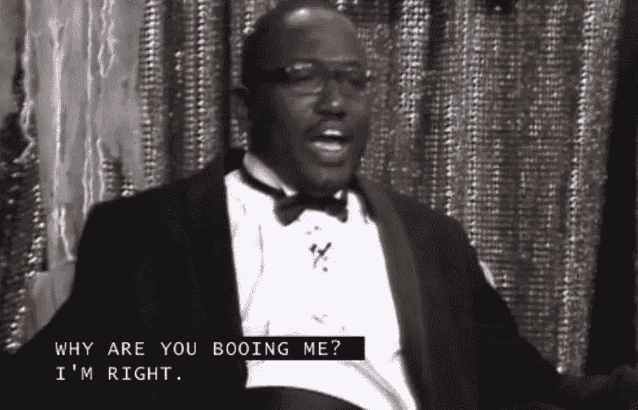

# 盒子里有什么？在我们信任它之前，AI 需要解释它的决定。

> 原文：<https://towardsdatascience.com/whats-in-the-box-ai-will-need-to-explain-its-decisions-before-we-can-trust-it-5c175224651f?source=collection_archive---------36----------------------->

## XAI 可以允许人工智能技术在需要更大责任的领域扩散，但我们需要看到黑匣子的内部。

去年 12 月初，我发现自己回到了就业市场，在大学圣诞假期期间寻找一些临时的季节性工作。我对这个职位的要求并不苛刻:开始时间最好在早上 8 点以后(我刚刚结束了一项为期 5 年的轮班工作，我并不急于续约)；薪酬不一定超过法律规定的最低水平，工作地点位于我所居住城市的地理范围内。除此之外，我什么都愿意做。我回复了一份网上的招聘启事，应聘一家知名高街时尚零售商的初级零售助理职位。没有任何不合理或不谦虚的期望，我真诚地开始了申请过程。

在提交任何求职信或简历之前，我需要完成一份简短的问卷。这很大程度上是由 50 个模糊不清、毫无意义的问题组成，显然是为了评估候选人的态度和对该角色的适合性。我被要求诚实地使用一个 5 分等级量表来同意或不同意一系列陈述，例如:

*“有些人让我感到紧张”*，

*“我比大多数人获得更多的好运”。*

*“我倾向于假设更糟糕的事情可能会发生”。*

我不知道这些分数是如何计算出来的，但我相信任何按照指示作答的候选人都不会准确描述他们的“态度”。当明确指出申请人不应该通过选择“既不同意也不反对”的选项来对冲他们的赌注时，任何明智的人如何能够回答像“当事情出错时，我总是看到光明的一面”这样的绝对主义问题？这个问题唯一合理的答案是“强烈反对”,因为即使是宇宙中最乐观的人也不可能“总是”看到光明的一面。就连基督本人在被流放到沙漠中时也感到绝望。然而，在这种情况下，“强烈反对”显然不是正确的答案，因为问一系列 50 个语义不明确的问题来评估某人是否适合一份主要职责是折叠运动衫的兼职工作是没有任何价值的。尽管这个问题的措辞很荒谬，但它显然是为了衡量候选人面对困境时的应变能力。那么申请人应该提交他们知道不正确的答案吗？

I **was** right.

我没有得到那份工作。我甚至没有机会提交我的简历，因为自动表格制表机立即认定我在气质上不适合折叠运动衫的角色。我抱怨选拔标准的不公平。我很愤怒，因为我没有得到任何关于我的答案的解释，也没有得到任何关于为什么我的答案不正确的解释。不公正令人愤怒。

对我来说，这是一个小挫折。不久之后，我找到了另一份(更好的)工作。我赚了足够的零花钱来确保圣诞节早上圣诞树下有礼物，还有足够的钱来买节日啤酒。圣诞节得救了。但对其他人来说，可能没有这么整齐的决议。越来越多关于就业、贷款申请、住房合适性以及其他方面的重大决策正由自动化系统做出，而这些决策无法提供解释或理由。在人工智能应用的背景下，这被称为[‘黑盒’问题](https://www.kdnuggets.com/2019/03/ai-black-box-explanation-problem.html)，并引发了严重的道德和法律问题。

Luckily for me, Christmas was saved

黑盒指的是在人工智能算法中发生的神秘、隐秘和不可知的过程。[大多数人工智能系统](https://ujjwalkarn.me/2016/08/09/quick-intro-neural-networks/)遵循程序分析的输入层(可能是一系列数据点或图像)的一般路径，遵循由算法本身组成的中间层(这是进行分析的部分)。最后，我们有输出层——程序做出的决定。现代深度学习应用的中间层或“隐藏”层中的复杂机制本质上是不透明和不可理解的。它们可能由隐藏层中的许多子层组成，在它们之间来回传递信息，直到程序找出如何处理数据。因为算法随着每一次新的迭代或数据点“学习”,所以外部观察者无法跟踪隐藏层内发生的情况。

例如，你可以教机器学习算法识别猫的图片，方法是在不同的猫图像上训练它，直到它有足够的数据来正确分类新图像。然而，它不能告诉你新图片有什么特别像猫的地方。它可能是耳朵的形状，或者是皮毛，或者是胡须，这些都可以让算法识别出猫，或者是许多东西的组合。或者它可能是某种无形的“猫性”的例子，人眼察觉不到，算法已经发现了。如果是这样的话，我们将永远不会知道。人类能够毫无困难地解释为什么他们能够识别猫，但是机器却不能。

Cat or not-cat?

随着人工智能应用的使用变得越来越广泛，我们理解系统为什么在特定环境下做出决策变得越来越重要。如果一种算法在没有任何解释的情况下将一只猫误认为一条鱼，那么如果动物收容所决定自动执行收容程序，它可能会导致一只不开心的猫被关在鱼缸里。随着自动化系统进入医疗保健应用领域，机器可能会出现误诊的风险，这可能是由不完整的训练数据或其他故障造成的。如果不正确的人工智能决策无法解释，程序的人类设计者将无法理解为什么会做出不正确的决策或防止它再次发生。在这些情况下，人工智能决策过程的重要人类监督是必要的。

有人可能会认为，对于任何做出对人类有直接影响的决定的人工智能应用程序，都应该有合理的人类监督。事实上，今天有大量的自动化过程在运行，决策完全由无监督的算法做出，这些算法具有严重的现实世界影响。自动化程序用于计算罪犯重新犯罪的可能性，这可能会影响他们的判决或假释条件。[大学正在使用预测算法](https://slate.com/business/2016/09/how-big-data-made-applying-to-college-tougher-crueler-and-more-expensive.html)来决定是否为潜在学生提供课程名额。当这些自动决定背后的原因无法得到充分解释时，人们就很难对他们认为不公平的决定提出上诉。

What **is** in the box?

如果算法使用的输入数据不完整，或者是劣质或不可靠的收集方法的结果(就像我写得很差的工作问卷一样)，并且这导致了有争议的结果，那么决策主体必须有适当的上诉渠道。

诸如此类的担忧导致了欧盟复杂的 G.D.P.R .立法第 22 条的发布，该立法涉及自动决策:

> “数据主体应有权不受制于仅基于自动处理(包括特征分析)的决定，该决定对其产生法律效力或对其产生类似的重大影响”。

这意味着，银行、政府或任何利用人类行为预测模型为决策提供信息的组织等机构，在个人是决策主体的情况下，不能仅仅依赖自动化流程。换句话说，每个人都有解释的权利。如果自动化过程是不透明和不可解释的，就像大多数传统的人工智能过程一样，那么在发生纠纷的情况下，机构就很难依靠强大而有用的工具。

例如，当一个人决定进行金融投资或终止雇佣合同时，他们在法律上和道德上都要对这个决定负责。自动化人工智能系统独立于建造它的人类设计师运行；一旦开始运行，它就自己做决定，没有任何责任或义务。当我们考虑更广泛的正义或民主问题时，这是一个非常有问题的概念。

What’s in the box?

这些考虑促成了最近人工智能的一个子类的发展，称为[可解释的人工智能](https://www.forbes.com/sites/cognitiveworld/2019/07/23/understanding-explainable-ai/#44f09e7c7c9e)(或 XAI)，它涉及开发允许机器学习过程变得更加透明的技术。这一概念仍处于相对初级阶段，但随着时间的推移，它可能允许在问责制和可解释性受到严重关注的领域更广泛地采用人工智能过程。

在我的下一篇文章中，我将关注一些 XAI 技术，这些技术可能会在未来几年内开始出现，它可能会特别有用的一些领域，以及一些推动该领域进步的推动者和震动者。我还将谈到这项技术的局限性及其面临的挑战。

*所有观点都是我自己的观点，甲骨文公司不同意。* [请随时在 LinkedIn 上联系我](https://www.linkedin.com/in/mark-ryan101/)