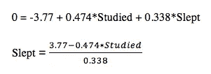

# 逻辑回归的线性是什么

> 原文：<https://towardsdatascience.com/whats-linear-about-logistic-regression-7c879eb806ad?source=collection_archive---------6----------------------->

## 在逻辑回归中，我们如何从决策边界到概率？

已经有很多关于逻辑回归的令人惊讶的文章和视频，但我很难理解概率和逻辑线性之间的联系，所以我想我应该在这里为自己和那些可能经历同样事情的人记录下来。

这也将揭示逻辑回归的“逻辑”部分来自哪里！

这篇博客的重点是对逻辑模型和线性模型之间的关系建立一个直观的理解，所以我只是做一个什么是逻辑回归的概述，并深入这种关系。为了更完整地解释这个令人敬畏的算法，这里有一些我最喜欢的资源:

*   [https://www.youtube.com/watch?v=-la3q9d7AKQ](https://www.youtube.com/watch?v=-la3q9d7AKQ)
*   [https://towards data science . com/logistic-regression-detailed-overview-46 C4 da 4303 BC](/logistic-regression-detailed-overview-46c4da4303bc)
*   [https://ml-cheat sheet . readthedocs . io/en/latest/logistic _ regression . html](https://ml-cheatsheet.readthedocs.io/en/latest/logistic_regression.html)
*   [https://christophm . github . io/interpretable-ml-book/logistic . html](https://christophm.github.io/interpretable-ml-book/logistic.html)

现在让我们来看看逻辑回归的要点。

> **什么是逻辑回归？**

与线性回归一样，逻辑回归用于建模一组自变量和因变量之间的关系。

与线性回归不同，因变量是分类变量，这就是它被视为分类算法的原因。

逻辑回归可用于预测:

*   电子邮件是垃圾邮件还是非垃圾邮件
*   肿瘤是不是恶性的
*   一个学生将通过或不通过考试
*   我会后悔在凌晨 12 点吃饼干

上面列出的应用是**二项式/二元逻辑回归**的例子，其中目标是二分的(2 个可能的值)，但是你可以有 2 个以上的类(多项逻辑回归)。

这些分类是基于模型产生的概率和某个阈值(通常为 0.5)进行的。如果一个学生通过的概率大于 0.5，则她被预测为通过。

让我们开始探究这些概率是如何计算的。

> **乙状函数**

如果我们可视化一个带有二进制目标变量的数据集，我们会得到这样的结果:


这里有几个原因可以解释为什么拟合直线可能不是一个好主意:

1.  在线性回归中，因变量的范围可以从负 inf 到正 inf，但是我们试图预测应该在 0 和 1 之间的概率。
2.  即使我们创建了一些规则来将这些越界值映射到标签，分类器也会对离群值非常敏感，这会对其性能产生不利影响。

因此，我们用在 0 和 1 附近变平的 S 形来代替直线:


[source](https://cvxopt.org/examples/book/logreg.html)

这被称为 sigmoid 函数，其形式如下:


此函数根据某些因素的组合返回某个观察值属于某个类的概率。

如果我们求解线性函数，我们会得到几率的对数或者是 **logit:**


注意当 p(x) ≥0.5，βX ≥ 0 时。

但是等一下，这个神奇的函数是从哪里来的，线性模型是怎么进去的？为了回答这个问题，我们来看看逻辑回归是如何形成其决策边界的。

> **决定边界**

每个伟大的逻辑回归模型背后都有一个不可观察的(潜在的)线性回归模型，因为它真正试图回答的问题是:

"给定一些特征 x，一个观察值属于第一类的概率是多少？"


让我们看一个例子。

假设我们想根据一个学生花了多少时间学习和睡觉来预测她是否能通过考试:


**Source:** [scilab](https://www.scilab.org/tutorials/machine-learning-%E2%80%93-logistic-regression-tutorial)

让我们通过绘制针对 Slept 的 Studied 来更好地理解我们的数据，并对我们的类进行颜色编码以可视化这种分离:

```
import pandas as pd
import matplotlib
import matplotlib.pyplot as pltexams = pd.read_csv('data_classification.csv', names=['Studied','Slept','Passed'])fig = plt.figure()
ax = fig.add_subplot(111)colors = [‘red’, ’blue’]ax.scatter(exams.Studied, exams.Slept, s=25, marker=”o”,  c=exams[‘Passed’], cmap=matplotlib.colors.ListedColormap(colors))
```


看着这个图，我们可以假设一些关系:

*   花足够的时间学习并且睡眠充足的学生很可能通过考试
*   睡眠少于 2 小时但花了 8 小时以上学习的学生可能仍然会通过(我肯定在这个组里)
*   偷懒不睡觉的学生可能已经接受了他们通不过的命运

这里的想法是，这两个类别之间有一条清晰的分界线，我们希望逻辑回归能为我们找到这一点。让我们拟合一个逻辑回归模型，并用模型的决策边界覆盖这个图。

```
from sklearn.linear_model import LogisticRegressionfeatures = exams.drop(['Passed'],axis=1)
target = exams['Passed']logmodel = LogisticRegression()
logmodel.fit(features, target)
predictions = logmodel.predict(features)
```

您可以打印出参数估计值:


利用这些估计，我们可以计算出边界。因为我们的阈值设置为 0.5，所以我将 logit 保持在 0。这也允许我们在 2d 中查看边界:



```
exams['boundary'] = (-logmodel.intercept_[0] - (logmodel.coef_[0][0] * features['Studied'])) / logmodel.coef_[0][1]
```

在我们的散点图上看起来是这样的:

```
plt.scatter(exams['Studied'],exams['Slept'], s=25, marker="o", c=exams['Passed'], cmap=matplotlib.colors.ListedColormap(colors))plt.plot(exams['Studied'], exams['boundary'])plt.show()
```


这看起来很合理！那么 Logistic 回归是如何利用这条线来分配类标签的呢？它着眼于每个单独的观察和线性模型之间的距离。它会将这条线以上的所有点标记为 1，下面的所有点标记为 0。这条线上的任何点都可能属于任何一类(概率为 0.5)，所以为了将一个点分类为 1，我们感兴趣的是这条线和我们的观察之间的距离大于 0 的概率。

事实证明，在逻辑回归中，这个距离被假定为遵循**逻辑**分布。

换句话说，逻辑回归中潜在线性回归模型的误差项被假定为服从逻辑分布。

这意味着当我们问:


我们真的在问:


为了计算这种概率，我们对逻辑分布进行积分，以获得其累积分布函数:


哦嘿！是乙状结肠函数:)。

Tada！您现在应该能够更直观地在 sigmoid 函数和线性回归函数之间来回走动了。我希望理解这种联系能让你和我一样对逻辑回归有更高的评价。