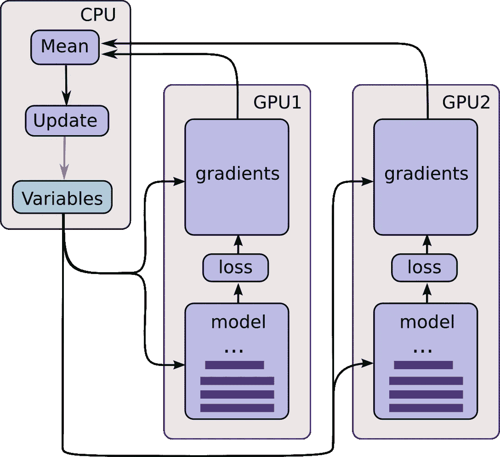
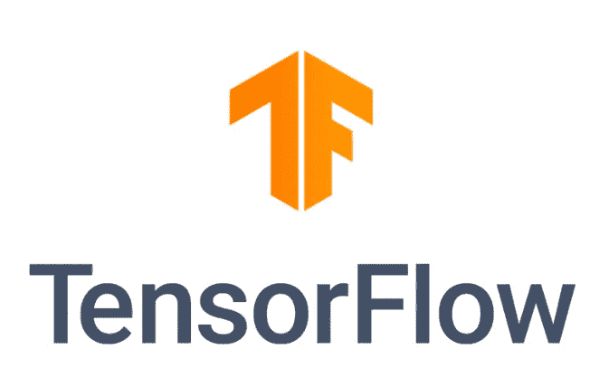

# TensorFlow 2.0 有什么新功能？

> 原文：<https://towardsdatascience.com/whats-new-in-tensorflow-2-0-ce75cdd1a4d1?source=collection_archive---------5----------------------->

从 2015 年 11 月谷歌大脑团队的最初开源发布开始，机器学习库 TensorFlow 已经有了很长的发布历史。TensorFlow 最初在内部开发，名为**dist faith**，很快成为当今使用最广泛的机器学习库。不是没有原因的。

Number of repository stars over time for the most widely used machine learning libraries

# 张量流 1。XX —我们今天在哪里？

在我们讨论 TensorFlow 2.0 最重要的变化之前，让我们快速回顾一下 TensorFlow 1 的一些基本方面。XX:

## 语言支持

Python 是 TensorFlow 支持的第一种客户端语言，目前支持 TensorFlow 生态系统中的大多数功能。如今，TensorFlow 可以在多种编程语言中使用。TensorFlow 核心是用纯 C++编写的，以获得更好的性能，并通过 C API 公开。除了与 Python 2.7/3.4–3.7 的绑定，TensorFlow 还提供对 JavaScript([Tensorflow . js](https://www.tensorflow.org/js))、Rust 和 r 的支持。尤其是语法简单的 Python API，与 C/C++脆弱的显式性相比，tensor flow 迅速超越了早期的竞争对手 Caffe 机器学习库。

## **计算图**

从一开始，TensorFlow 的核心就是所谓的**计算图**。在这个图模型中，每个操作(加、乘、减、取对数、矩阵向量代数、复函数、广播……)以及变量/常数都由有向图中的一个节点定义。图的有向边将节点相互连接，并定义信息/数据从一个节点流向下一个节点的方向。存在从外部将信息输入到计算图中的输入节点，以及输出经处理的数据的输出节点。

定义图表后，可以对输入图表的数据执行该图表。因此，数据' ***'流经图中的*** '，改变其内容和形状，并转化为图的输出。数据通常可以表示为多维数组，或 ***张量*** ，因而得名 ***TensorFlow*** 。

使用该模型，很容易使用这些节点来定义神经网络的架构。神经网络的每一层都可以理解为计算图中的一个特殊节点。TensorFlow API 中有许多预定义的操作，但用户当然可以定义自己的自定义操作。但是请记住，可以使用计算图来定义任意计算，而不仅仅是机器学习环境中的操作。

图形由 as **TensorFlow 会话** : *tf 调用。会话()*。一个会话可以将运行选项作为参数，例如图形应该在多少个 GPU 上执行，GPU 上内存分配的细节等等。一旦必要的数据可用，就可以使用 tf 将其输入到计算图中。Session.run()方法，所有神奇的事情都发生在其中。

## 梯度

为了使用诸如随机梯度下降的优化算法来训练神经网络，我们需要网络中所有操作的梯度的定义。否则，不可能在网络上执行反向传播。幸运的是，TensorFlow 为我们提供了自动微分，因此我们只需定义信息通过网络的前向传递。自动推断误差通过所有层的反向传递。这个特性并不是 TensorFlow 独有的——所有当前的 ML 库都提供自动区分。

## 库达

从一开始，TensorFlow 的重点就是让计算图在 GPU 上执行。它们的高度并行架构为训练机器学习库所必需的过量矩阵向量算法提供了理想的性能。NVIDIA CUDA(**C**computer**U**nified**D**device**A**architecture)API 允许 TensorFlow 在 NVIDIA GPU 上执行任意操作。

还有一些项目的目标是将 TensorFlow 暴露给任何兼容 OpenCL 的设备(即 AMD GPUs)。然而，英伟达仍然是深度学习 GPU 硬件的明确冠军，这不仅仅是因为 CUDA+TensorFlow 的成功。

在您的机器上获得 CUDA 的工作安装，包括 CuDNN 和适用于您的 GPU 的正确 NVIDIA 驱动程序可能是一种*痛苦的*体验(尤其是因为并非所有 TensorFlow 版本都与所有 CUDA/CuDNN/NVIDIA 驱动程序版本兼容，并且您懒得看一下[版本兼容性页面](https://www.tensorflow.org/install/source#linux))，但是，一旦 TensorFlow 可以使用您的 GPU，您将会发现性能有了显著提升。

## 多 GPU 支持

大规模机器学习任务需要访问多个 GPU，以便快速产生结果。足够大的深度神经网络有太多的参数，无法将它们全部放入单个 GPU 中。TensorFlow 让用户可以轻松地声明应该在哪些设备(GPU 或 CPU)上执行计算图。

Multi-GPU computation model (source: [https://www.tensorflow.org/tutorials/images/deep_cnn](https://www.tensorflow.org/tutorials/images/deep_cnn))

## 急切的执行

张量流计算图是处理信息的强大模型。然而，从一开始批评的一个要点就是调试这样的图形的困难。有这样的陈述

变量 c 的内容并不像预期的那样是 4.0，而是一个 TensorFlow 节点，还没有给它赋值。只有在调用图形并在图形上运行会话之后，才能测试这种语句的有效性(以及该语句可能引入的错误)。

于是，TensorFlow 发布了急切执行模式，为此每个节点在定义后立即执行。因此，使用 *tf.placeholder* 的语句不再有效。导入 TensorFlow 后，只需使用 *tf.eager_execution()* 调用急切执行模式。

TensorFlow 的急切执行是一个命令式编程环境，它立即计算操作，而不构建图形:操作返回具体值，而不是构建一个计算图形供以后运行。这种方法的优点是更容易调试所有计算，使用 Python 语句而不是图形控制流的自然控制流，以及直观的界面。渴望模式的缺点是性能降低，因为图形级优化(如公共子表达式删除和常量折叠)不再可用。

## 调试器

TensorFlow 调试器( ***tfdbg*** )允许您在训练和推理过程中查看运行 TensorFlow 图的内部结构和状态，这是使用 Python 的 *dbg* 到 TensorFlow 的计算图范式等通用调试器难以调试的。它被认为是对调试 TensorFlow 程序困难的批评的回答。TensorBoard 有一个命令行界面和一个调试插件(下面有更多信息),允许你检查调试的计算图。详细介绍请找[https://www.tensorflow.org/guide/debugger](https://www.tensorflow.org/guide/debugger)。

## 张量板

您可以使用 TensorBoard 来可视化您的 TensorFlow 图形，绘制有关图形执行的量化指标，并显示其他数据，如在训练或推断过程中通过它的图像。如果您希望在计算图中可视化任何类型的可用数据，这绝对是一个不错的选择。虽然 TensorBoard 最初是作为 TensorFlow 的一部分引入的，但它现在位于自己的 GitHub 存储库中。但是在安装 TensorFlow 本身的时候会自动安装。

TensoBoard 不仅可用于可视化训练或评估数据，例如作为步数函数的损失/准确度，还可用于可视化图像数据或声音波形。了解 TensorBoard 的最佳方式是看一看 https://www.tensorflow.org/guide/summaries_and_tensorboard。

## TPU 支持

TPU(张量处理单元)是高度并行的计算单元，专门设计用于高效处理多维数组(也称为张量)，这在机器学习中特别有用。由于其[专用集成电路](https://en.wikipedia.org/wiki/Application-specific_integrated_circuit) (ASIC)设计，它们是当今机器学习应用中速度最快的处理器。截至今天，谷歌的 TPU 是专有的，不为任何私人消费者或企业所用。它们是谷歌计算引擎的一部分，在那里你可以租用能够访问 TPU 的计算实例，以满足你的大规模机器学习需求。不用说，谷歌的目标是让每一个 TensorFlow 操作都可以在 TPU 设备上执行，以进一步加强其在不断增长的云计算市场的地位。

但是，您可以在 Google Colab 中亲自测试单个 TPU 的性能，这是一个可以托管和执行 Jupyter 笔记本的平台，可以免费访问 Google 计算引擎上的 CPU/GPU 或 TPU 实例！小介绍，点击[这里](https://medium.com/@jannik.zuern/using-a-tpu-in-google-colab-54257328d7da)。

## 滕索特

虽然神经网络训练通常发生在有时具有多个 GPU 的强大硬件上，但神经网络推理通常发生在本地消费设备上(除非原始数据被传输到另一个云服务，并且推理发生在那里)，例如自动驾驶汽车的车载计算机甚至手机。NVIDIA 提供了一个名为[tensort](https://developer.nvidia.com/tensorrt)的模块，该模块采用 TensorFlow API 表示的训练过的神经网络的张量流图，并将其转换为专门针对*推理*优化的计算图。与 TensorFlow 本身的推理相比，这通常会带来显著的性能提升。关于 TensorRT 的介绍，[点击这里](https://medium.com/@jannik.zuern/exploring-the-new-tensorflow-integration-of-nvidias-tensorrt-148ee0d95cd5)。

## tf .贡献

TensorFlow 在 GitHub 上有一个充满活力的社区，为 TensorFlow 的核心和外围设备添加了相当多的功能(显然是谷歌开源 TensorFlow 的一个有力论据)。这些模块大部分都收集在 [tf.contrib 模块](https://www.tensorflow.org/api_docs/python/tf/contrib)中。由于 TensorFlow 的高市场份额，在这里可以找到相当多的模块，否则您必须自己实现。

## 张量流集线器

> TensorFlow Hub 是一个用于发布、发现和消费机器学习模型的可重用部分的库。一个*模块*是一个张量流图的独立部分，以及它的权重和资产，可以在一个称为迁移学习的过程中跨不同的任务重用。[【0】](https://www.tensorflow.org/hub)

## 更多，更多，更多

有太多要谈的了。TensorFlow 生态系统的哪些组件至少应该提及？

*   **TensorFlow Docker 容器:**包含预装 TensorFlow 的 Docker 容器，包括 Docker 容器内图形处理器上图形执行的 CUDA 兼容性
*   **tensor flow Lite**:tensor flow Lite 是一个开源的深度学习框架，用于嵌入式系统和手机等设备上的设备上推理。
*   **TensorFlow Extended(TFX):**TFX 是基于 tensor flow 的 Google 量产级机器学习平台。它提供了一个配置框架和共享库来集成定义、启动和监控机器学习系统所需的通用组件。[【1】](https://www.tensorflow.org/tfx)

## 什么糟透了？

TensorFlow 的优势之一，即**计算图**，可以说也是它的弱点之一。虽然静态计算图无疑提高了性能(因为图级优化可能发生在图构建之后和执行之前)，但它也使调试图变得困难和繁琐——即使使用 TensorFlow 调试器这样的工具也是如此。此外，基准测试表明，其他几个框架可以与 TensorFlow 在同等条件下竞争，同时保持更简单的语法。此外，首先构建一个图，然后使用 *tf 实例化它。Sessions* 不是很直观，肯定会让一些没有经验的用户感到害怕或困惑。

TensorFlow API 可能也有弱点，即这里讨论的。一些用户抱怨使用 TensorFlow API 时的低级感，即使是在解决高级任务时。对于简单的任务，比如训练线性分类器，需要很多样板代码。

# TensorFlow 2.0 —新增功能？

在深入研究了 TensorFlow 1 之后。XX，大 2 会有什么变化？TensorFlow 团队对过去的一些批评做出回应了吗？有什么理由称之为 2.0 版，而不是 1.14 版呢？

Image source: [https://www.tensorflow.org/](https://www.tensorflow.org/)

在多个博客帖子和公告中，已经揭示了 TF2.0 的一些未来特性。此外，TF2.0 API 参考列表已经公开发布。虽然 TF2.0 仍处于 alpha 版本，但预计官方测试版、候选发布版和最终发布版将于今年晚些时候推出。

让我们仔细看看 TF2.0 的一些新奇之处:

*   **再见 *tf* ，你好*TF . keras***

一段时间以来，TensorFlow 已经提供了 *tf.keras* API 作为 TensorFlow 模块的一部分，提供了与 keras 机器学习库相同的语法。Keras 因其用于定义网络架构和训练网络架构的简单而直观的 API 而广受好评。Keras 与 TensorFlow 的其余部分紧密集成，因此您可以随时访问 TensorFlow 的功能。Keras API 使 TensorFlow 易于上手。重要的是，Keras 提供了几个模型构建 API(顺序的、功能的和子类化的)，因此您可以为您的项目选择正确的抽象级别。TensorFlow 的实现包含增强功能，包括用于即时迭代和直观调试的急切执行，以及用于构建可扩展输入管道的 tf.data。

*   **tf.data**

训练数据通过使用 *tf.data 创建的输入管道读取。*这将是声明输入管道的首选方式。为会话使用 *tf .占位符*和 *feed dicts* 的管道仍将在 TensorFlow v1 兼容模式下工作，但将不再受益于后续 tf2.0 版本的性能改进。

*   **急切执行默认**

TensorFlow 2.0 默认以急切执行方式运行(前面讨论过)，以便于使用和顺利调试。

*   **RIP tf.contrib**

tf.contrib 中的大部分模块将在 tf2.0 中贬值，要么被移到核心 TensorFlow 中，要么被一起移除。

*   tf.function 装饰师

**tf.function** 函数装饰器透明地将你的 Python 程序翻译成张量流图。这个过程保留了 1.x TensorFlow 基于图形的执行的所有优点:性能优化、远程执行以及序列化、导出和部署的能力，同时增加了用简单 Python 表达程序的灵活性和易用性。在我看来，这是 v1 最大的变化和范式转变。x 到 v2.0。

*   **不再 tf。会话()**

当急切地执行代码时，将不再需要会话实例化和运行计算图。这简化了许多 API 调用，并从代码库中删除了一些样板代码。

*   **张量流 1。XX 遗留代码**

仍然可以运行 tf1。tf2 中的 XX 代码没有任何修改，但这并不能让您利用 TensorFlow 2.0 中的许多改进。相反，您可以尝试运行一个自动转换旧 tf1 的转换脚本。XX 呼叫到 tf2 呼叫，如果可能的话。如果需要，从 tf1 到 tf2 的详细的[迁移指南](https://www.tensorflow.org/alpha/guide/migration_guide)将为您提供更多信息。

我希望你喜欢这个小概述，下次再见！

快乐张量流！

# 进一步阅读

*   有效的 https://www.tensorflow.org/alpha/guide/effective_tf2:
*   TF2 有什么新鲜事？:[https://medium . com/tensor flow/whats-coming-in-tensor flow-2-0-d 3663832 e9 b 8](https://medium.com/tensorflow/whats-coming-in-tensorflow-2-0-d3663832e9b8)