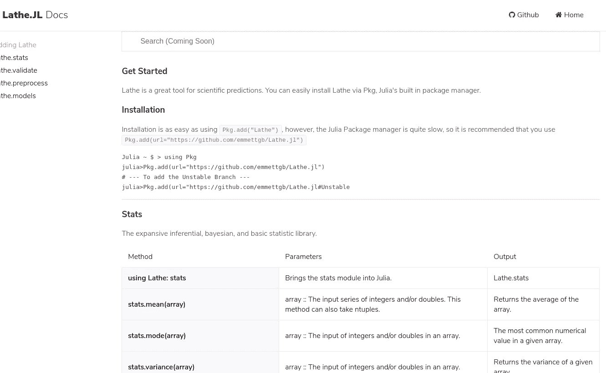
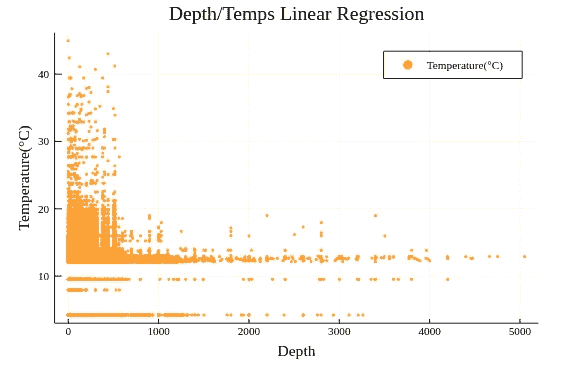
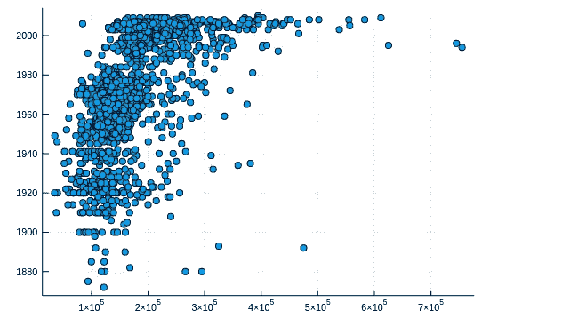
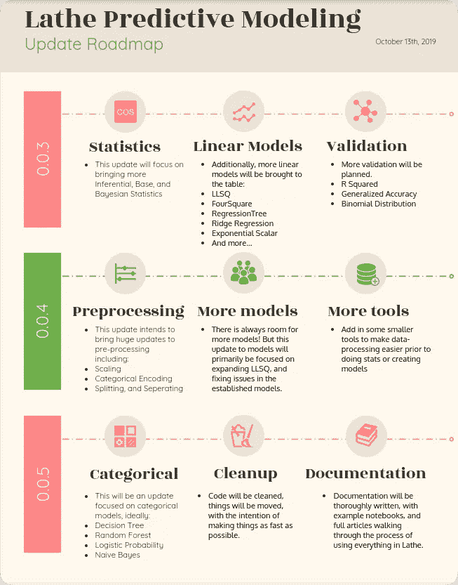

# 车床 0.0.3 有什么新看点？

> 原文：<https://towardsdatascience.com/whats-new-to-see-in-lathe-0-0-3-78b2623bc135?source=collection_archive---------23----------------------->


这是官方的，[车床 0.0.3](http://lathe.emmettboudreau.com/) 已经发布，是非常有用的一个非常基本的阿尔法建设。我想我会给出一个新功能的运行，并给出对未来的洞察力。我已经在几个 ML 项目中使用过 Lathe，目前我正在为用 Julia 构建的人工智能驱动的网络应用程序开发一个重要的 Genie 实现，这对任何想学习 Julia 的人来说都是令人兴奋的。



# 证明文件

[软件文档](http://lathe.emmettboudreau.com/doc.html)是开发一个伟大产品最不可或缺的一部分，没有开发者债务。优秀的文档可以成就或毁灭一个模块、应用程序或网站。该文档仍处于早期阶段，但将来肯定会很快得到改进。包含并链接了信息文章和走查笔记本，以提供准确的实际使用和应用示例。


# 新执照

许可证对于软件的成功也非常关键，这就是为什么 Lathe 从 GNU 通用许可证转换到 MIT 许可证的原因。大部分的许可模型被保留，然而，MIT 许可允许更好的发布和合法使用车床。如果你想了解更多关于麻省理工学院许可证的信息，请点击维基百科上的[。](https://en.wikipedia.org/wiki/MIT_License)

# 更多预处理

这是官方的，车床比以往任何时候都更可用，提供了预测建模的基本要素，如 *TrainTestSplit、*和功能标量，以提高您的模型的性能。

```
using Lathe.preprocess: TrainTestSplit, StandardScalar
train,test = TrainTestSplit(data)
trainx = StandardScalar(train.Feature)
```

此外，现在已经实现了 SortSplit，以及一些不太突出的特性标量的一些错误。现在，要拆分数组，而不是数据帧，可以使用 Lathe.preprocess.ArraySplit。

# 更多统计数据

已经实现了一个更大的统计库，现在允许执行 f 检验和条件概率。相关系数(r)的基本数学也已经实现。此外，还概述了未来实施统计的路线图，如皮尔逊相关、符号检验、Wilcoxon 检验、方差分析、配对 T 检验以及最后但并非最不重要的；卡方检验。

# 更多验证

很明显，车床 Alpha 0 . 0 . 3–0 . 0 . 4 的主要目标是回归，简单的 MAE 并不能完全解决这个问题..结果，我们现在有了 r 分数。未来的实现旨在以广义准确度、二项式分布、ROC/AUC 和混淆矩阵的形式提供您可能想要的所有验证。

# 新型号

很少有什么能像新模型那样让我兴奋，我们将能够在 Julia 的车床内部使用这些新模型。

*   多数类基线

当然，这不一定是一个模型，但这可以作为一个单一的分类很快来到车床说明。多数类基线类似于分类数据的模式，是构建和验证模型之前的基线步骤。

*   四方形

四方形模型基于四分位数拟合您的数据，对于快速拟合包含多个部分的数据非常有用。虽然 Four-Square 已经享受了这个生态系统一段适中的时间，但是模型本身已经从简单的线性回归器变成了线性最小二乘回归器。



*   线性最小二乘法

线性最小二乘法是一种简单的线性模型，可通过以下任何类型参数进行更改:

*   :注册
*   :OLS
*   :WLS
*   :GLS
*   :GRG

如果你想了解更多关于这些的意思，以及它们之间的区别，你可以查看维基百科对它们的描述。

*   指数标量

该模型使用值差异进行随机猜测。这个模型的用例当然是在业务分析中。



# 接下来会发生什么？

*   更多统计数据
*   更多验证
*   更多预处理包括:
*   单位 L 标度
*   任意重新标度
*   更多型号包括:
*   逻辑回归
*   里脊回归
*   回归树



总的来说，我对这个模块的未来感到非常兴奋。我预计，对于像我这样的数据科学家来说，这会让朱莉娅变得更加迷人。目前，这些包是无组织的，分散在 Github 中，通常都没有什么文档。我希望更多的人会考虑使用它，也许会尝试将它作为 Julia 1.2 的首选模块。