# 地图应用的下一步是什么？途中旅程规划。

> 原文：<https://towardsdatascience.com/whats-next-for-mapping-apps-on-route-journey-planning-918763239f6f?source=collection_archive---------21----------------------->

Photo by [Nic Y-C](https://unsplash.com/@themcny?utm_source=medium&utm_medium=referral) on [Unsplash](https://unsplash.com?utm_source=medium&utm_medium=referral)

想象一下。你在路上——你收到一条消息，你的会面地点改变了。但是你已经在火车上了——你需要找到去新地点的路线。但是问题出现了，应用程序没有意识到你已经在火车上了！建议的步骤 1——走回你刚来的车站…

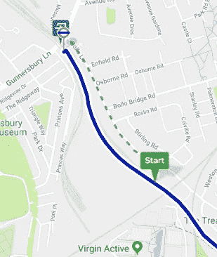

Typical situation when setting a new destination whilst on route.

## 这个博客上的一些笔记

这篇博客的目的是概述这个问题，并通过数据科学的方法来解决它。

为了提高可访问性，这个博客的大部分内容将会考虑到普通读者；标有“向上”和斜体的部分将涉及更多的技术细节——所以如果你不喜欢，请跳过其余的部分，它们仍然有意义！理解博客的其余部分没有先决条件！

# 我们开始吧！

问题大纲；如果你现在改变你的目的地，起始位置将作为你当前的位置，因为你在火车上，应该在一条铁路线(希望)上，如果你还没有在火车上，这是一个非常奇怪的开始旅行的地方。您有用的地图应用程序将为您提供从最近的步行点出发的路线，但没有考虑到您可能在火车上，第一步很可能是步行/乘坐交通工具到最近的车站-尽管事实上您目前正在它提议的线路上的火车上。

我们要使用的示例是从阿克顿镇到国王十字车站的更新目的地的路线。

现在你的地图应用程序告诉你，你需要步行 11 分钟回到阿克顿镇，才能在你目前所在的线路上赶上火车！(反正你也不可能下火车去做这件事)。

所以你认为；啊，我会把我的位置设置到我的下一站(哈默史密斯)，然后按照那里的指示走——首要建议:乘环线到国王十字车站。完美…或者不完全完美。

Circle Line from Hammersmith to King’s Cross

如果站在哈默史密斯，这个应用程序是绝对正确的，而不是现在在火车上，下一趟火车是环线，那么很可能最快的方式是这样。然而，你的情况并非如此。

从哈默史密斯到国王十字车站有两种直接选择，皮卡迪利线和环线——都需要 26 分钟。

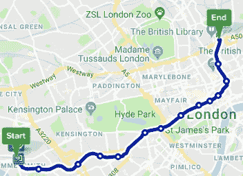

Piccadilly Line from Hammersmith to King’s Cross

这里重要的是上下文；将你的位置设置为哈默史密斯，应用程序并不知道你实际上已经在开往国王十字车站的皮卡迪利线上。由于哈默史密斯站分为两个部分，在两个站台之间步行 4-5 分钟，您可能需要等待长达 5 分钟的环线列车。乘坐环线列车比留在皮卡迪利线列车上至少多花 5 分钟，可能多花 10 分钟——相当于多花 40%的时间！

# 能做些什么？

这似乎是一个极好的数据科学问题；我们需要使用可用的数据为最终用户提供洞察力！

这里提供了一个关于如何着手解决问题的可能解释；有许多挑战——这篇博客并没有暗示这个问题的解决方案是容易的！

为了构建思维过程，我们将遵循 OSEMN 数据科学结构(获取、筛选、探索、建模、解释)。

# 获得

这里需要两个关键信息流:

1.  用户的位置
2.  用户当前可能乘坐的潜在交通方式(火车线路、公共汽车线路、电车线路等)

问题的关键是能够将用户与该交通模式的特定实例(火车、公共汽车或电车)相匹配。

让我们先来看看关于每一项的可用信息:

用户:

*   GPS 信息(将给出位置、时间)

传输实例:

*   途径
*   日程表/时间表
*   实际到达/离开时间是站/站

我们想要匹配什么:

*   位置
*   方向
*   时间

在本次讨论中，我们将采用一个简单的(通过比较)例子，我们将使用从南阿克顿到阿克顿中心的一段里士满/斯特拉特福德地上线路。

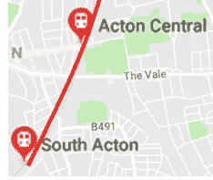

是什么让这个例子变得更简单？我们将在后面的探索阶段讨论是什么使这个例子变得更简单——现在我们只是直观地将其与国王十字车站及其众多的交通线路进行比较。

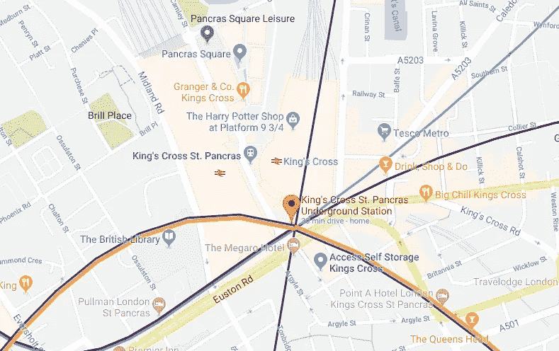

对于用户来说，主要信息将是 GPS 馈送；以下是用户的典型数据集，包括时间、纬度和经度。

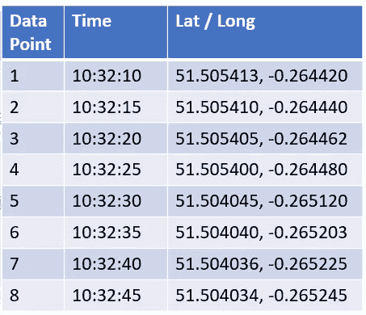

对于地上列车，主要的数据馈送将是提供关于列车的实时信息的 TfL API。在列车双向通过的情况下，线路至少应具备以下条件。为了提高认识，需要考虑更大部分的生产线:

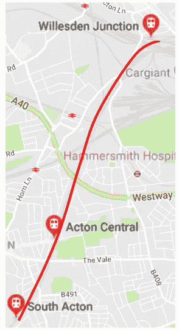

作为实时时刻表，不是所有的“实际”信息都是可用的，无论信息是从左到右还是从右到左填充，都指示列车的方向。

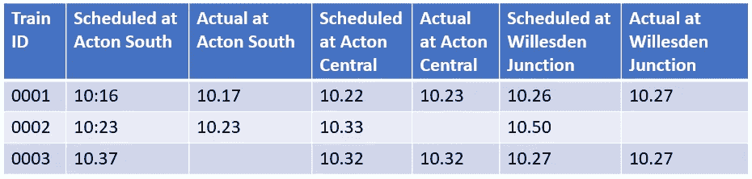

# 矮树

两个数据集都可能出现错误，我们将简要了解如何识别这些错误。

## 用户

对于用户提供的数据，使用标准异常值分析技术，例如分析点的分布，误差最有可能在 GPS 位置(而不是时间)。

## 升级

可以相当安全地假设 GPS 定位中的误差将遵循正态分布。值得注意的是，由于这两个分量是通过相同的机制(手机中的 GPS 芯片)生成的，因此误差相关的概率很高；即经度上的误差更有可能也看到纬度上的误差。因此，这应被视为多变量异常值检测，Z-Score 将是此问题的合适选择。

## TfL — API

对于用户来说，应用程序接收的信息来自安装它的手机(即直接来自 GPS 芯片)——因此信息源可能非常稳定(如果不是可变的话)。TfL 数据的主要挑战之一是获取数据并确保获取的数据是预期的数据。

本例中的简单方法如下:

*   检查数据类型；它在应该在的地方是字符串还是整数
*   检查年表；所有数据点是否都按照适当的顺序排列
*   检查规律性；一个旅程的站与站之间的时间是否比其他所有旅程都要短

该数据集具有更高程度的稀疏性-对于用户 GPS 数据，站点之间可能有数百个数据点，而对于 TfL 数据，每个站点可能只有一个数据点。考虑这一点的一种机制是查看旅程之间的分布，而不是每个旅程。

## 映射数据

除了知道火车什么时候会在特定的点，我们还需要知道这些点在哪里，对用户来说也是一样；在这一点上，我们可能需要匹配不同的数据源，这可能是一个挑战。我们将在探索阶段更详细地讨论这一点。XX —可能更新

# 探索

在这个阶段，重要的是要记住，我们遵循这个过程是为了让我们能够建立一个模型；这不一定是建模过程中实际遵循的过程。因此，我们能够收集额外的数据，帮助我们了解正在发生的事情——这通常太具挑战性/劳动密集型，或者在实施模型时根本不可用。

因此，首先为了更好地理解，我们将在地图上绘制用户 GPS 数据。

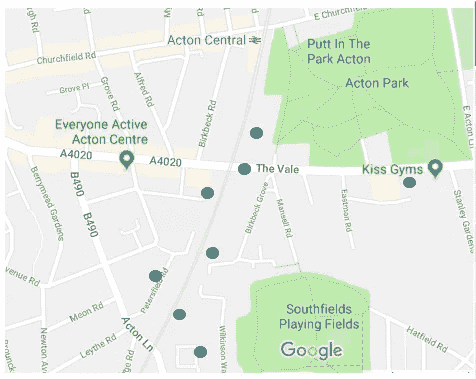

这使我们能够识别出大致沿着铁路线的点，对于这种情况，在同一路线上没有可比较的其他交通模式路线，但是也显示出可能至少有一个异常值。

首先回顾一下我们试图确定的内容:

*   位置
*   方向
*   时间

如果我们可以为用户和列车识别这些，我们可以“匹配”它们，并且根据数据的变化和其他可能匹配的接近程度，说出用户在该列车上的可能性有多大。

通过本探索部分，我们将回顾如何为用户和培训实现这两个目标。

## 用户

位置——幸运的是，大部分预处理发生在芯片/手机中，以提供已经相对准确的点测量(我们不太可能提高点定位的准确性)。

## 等级上升

为什么我们使用位置而不是路线，这样会更准确？简单地说，是的——我们稍后将首先研究近似路线的好处。

方向——这个更复杂；然而，幸运的是，对于这个例子，我们不需要高水平的方向精度，简单地说，我们需要知道用户是向北还是向南行进..移动平均线可能会处理数据集中的任何自然变化，并在经度/纬度上提供足够准确的值变化，由此可以得到矢量(下面的红色部分),即方向。

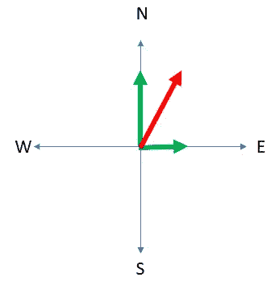

严格地说，这也给出了一个指示或速度，但是我们不能从列车数据中获得足够的数据来利用速度作为预测。

时间——很简单，这是由电话提供的。

## 火车

位置-列车具有高度精确的路线，但是相对于时间数据具有稀疏的位置(即，相对于时间的位置仅在车站是已知的)。

在路线上的某些点(即车站),火车的位置是高度确定的。相对于火车的时间来近似位置的简单方法是假设时间和距离之间的线性关系。

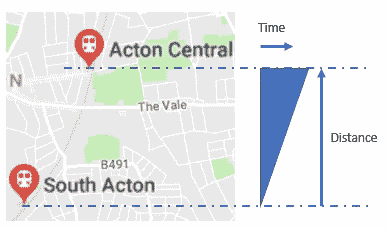

Assuming travel from South Acton to Acton Central

## 等级上升

这是一个非常简单的假设；并且在很多情况下都不成立——我们将在后面研究其影响和可能的缓解措施。

# 模型

主要的建模限制之一是速度；用户期望非常高的响应水平，因此模型必须保持足够简单以快速运行(这也将降低处理成本)。当考虑更复杂的路线时，这将成为一个特别的挑战。

让我们快速回顾一下这两个数据集及其属性:

**列车**

*   高度精确的路线和车站位置数据
*   稀疏但相对精确的时间数据

**用户**

*   频繁、可变精度的位置数据和高精度的时间数据

该模型的目的是确定数据点属于哪一类，这可以在下图中看到。还包括另一种可能的运输方式，模型需要在这两种方式之间进行识别。

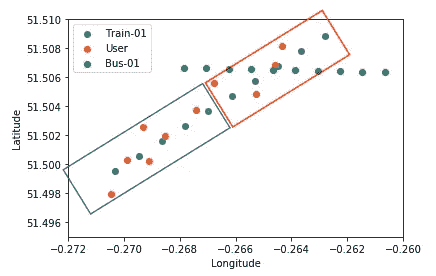

在这个简单的例子中，通过简单地将用户数据点序列与相似位置的交通模式进行比较，可以很容易地看出如何在不同的模式/路线之间进行识别。蓝框中的数据点很容易标记，但红框中的数据点更具挑战性，这就是模型调整变得非常重要的地方，尤其是在使用较小数据集的情况下。

## 向上-模型选择

*可用于这种简单情况的简单但有效的模型是 k-最近邻分类模型——将数据点与其最近的数据点进行比较，并标记为数量较大的类别(更多信息* [*此处*](https://www.analyticsvidhya.com/blog/2018/03/introduction-k-neighbours-algorithm-clustering/) *)*

## 向上级别—更高的维度

*这是一种过度简化，因为为了能够获得实例(即特定列车)而不仅仅是模式(路线),实际模型上方显示的二维图将至少有 5 个维度(长、横、变长、变横、时间),这允许模型考虑到我们目前使用的三个预测特征；地点、方向&时间。*

*该模型可以在分类器 user - > transport instance 或 transport instance - > user 中配置；在这种情况下，传输实例是带标签的数据集，因此用户应该与传输实例匹配。*

*下面是一个示例数据集，它可能是这个简单模型的输入。*

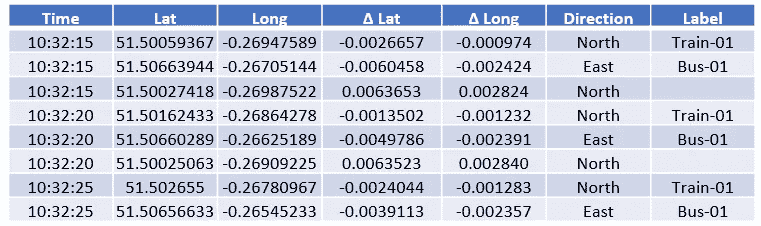

Example data input into model

## 升级—模型验证

*改进该模型的挑战之一是缺乏标记的用户数据——该应用程序不一定会得到任何验证，即预测用户乘坐的火车实际上就是用户乘坐的火车；换句话说，数据集没有被“标记”。该模型为单个用户运行的时间越长，该模型可以确定其预测是否准确的概率水平越高-例如，如果用户乘坐 10 站，并且用户的轨迹与每一站的火车匹配，则用户更有可能乘坐该火车。这个提高的概率可以用来给出一个假定的标签。*

# 口译

因此，我们已经成功地识别了用户是在哪个运输模式实例上(简单地说，在这种情况下，用户是在哪个列车上)——我们如何使用它呢？

用户可能对他们是在火车上而不是在公共汽车上不感兴趣(希望他们已经意识到这一点)——但是我们能做的是开始解决突出的问题；为已经在运动中的用户生成路线计划。通过使用我们已经收集、探索和建模的数据，我们能够指示用户已经在皮卡迪利线上，并且可以给出更有用的线“在哈默史密斯站继续在皮卡迪利线上”，而不是“在哈默史密斯站登上下一趟环线列车”；阻止比最佳时间长 40%的建议！

# 改进的关键机会

## 机会 1

预测车站间列车相对于时间的位置的过于简单的模型。实际上不太可能是线性的，因为火车的速度可能在站与站之间变化。

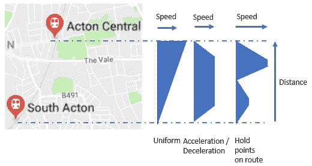

克服这一点的一种机制是相对于站之间的时间来改进位置模型；这可以在用户数据的帮助下(当然是在许可的情况下)完成，以提供额外的数据。也有可能从 TfL 获得额外的数据，即路段而不仅仅是车站的数据。

## 升级—机会 2

*改进模型；虽然 k-最近邻对于简单的低维情况是一个很好的模型，例如对于更高级的高维模型(为了提高精度，可能需要至少首先增加信息量，从而增加维数)。逻辑回归是一个很好的举措，但是依赖于能够线性分离标签类-这不是不可能的，但是随着维度的增加可能意味着使用主成分分析(PCA)或另一种降维技术来减少维度的数量而不丢失其中包含的信息-我们毕竟增加了维度的数量是有充分理由的。*

*使用决策树(作为集成方法或梯度推进方法)具有明显的优势，因为它可以处理非线性可分类以及分类预测变量；适用于处理大型输入数据集和高维数据。然而，由于需要优化大量超参数，实施起来会变得更加困难。*