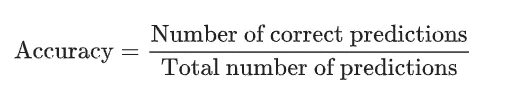
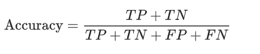
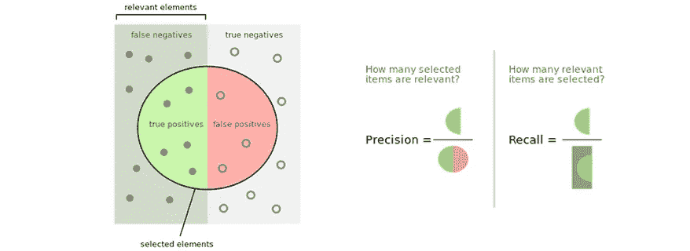
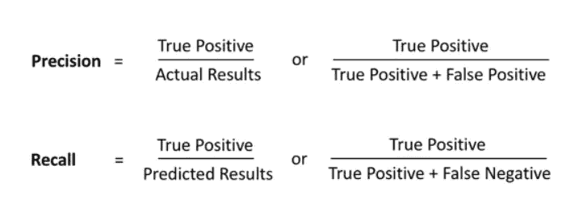
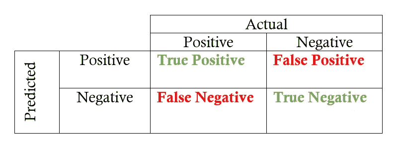
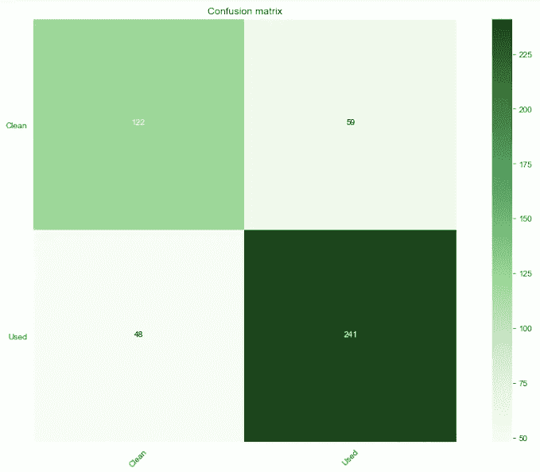
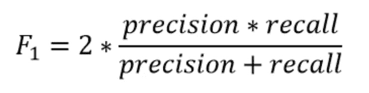

# 准确度、精确度、召回率和 F1 有什么关系？

> 原文：<https://towardsdatascience.com/whats-the-deal-with-accuracy-precision-recall-and-f1-f5d8b4db1021?source=collection_archive---------1----------------------->

它经常出现在数据科学职位的常见面试问题列表中。解释精确度和召回率之间的区别，解释什么是 F1 分数，精确度对分类模型有多重要？很容易混淆和混淆这些术语，所以我认为将每个术语分解并检查它们为什么重要是个好主意。

# 准确(性)

精确度的公式非常简单。

但是在处理分类问题时，我们试图预测二元结果。到底是不是诈骗？这个人会不会拖欠贷款？等等。因此，除了这个总体比率之外，我们关心的是被错误地归类为积极和消极的数字预测，特别是在我们试图预测的背景下。如果我们试图预测像信用卡欺诈这样的事情，99%的准确率可能是相当不错的，但是如果假阴性代表某人患有易于快速传播的严重病毒呢？还是一个得了癌症的人？这就是为什么我们必须进一步分解精度公式。

其中 TP =真阳性，TN =真阴性，FP =假阳性，FN =假阴性。

# 精确度和召回率

在讨论精度和召回之前，先简要说明一下第一类和第二类错误。这些术语并不是机器学习中分类问题所独有的，当涉及到统计假设检验时，它们也非常重要。

***第一类错误*** :假阳性(拒绝真零假设)

***第二类错误*** :假阴性(不拒绝假零假设)

记住这一点，我们可以将精确度定义为相关结果的百分比，而召回率的特征是被您正在运行的模型正确分类的相关结果的百分比。显然，这些定义并不那么直观，所以让我们来看看一些形象化的东西，看看我们是否能理解它。

好的，我想这开始有点道理了。当谈到精度时，我们谈论的是真阳性，而不是真阳性加上假阳性。与回忆相反，回忆是真阳性的数量超过真阳性和假阴性的数量。下面是公式，正如你所看到的，它们并不复杂。

我认为解释统计分类模型性能的最直观的可视化方法是混淆矩阵。这是一个 2 乘 2 的表，其中每行代表预测类中的一个实例，而列代表实际类的实例。

下面是一个实际的混淆矩阵，来自我做的一个项目，该项目是基于使用几种分类模型(包括逻辑回归、XGBoost 和随机森林)的调查数据来预测硬性毒品的使用。这是我的 GitHub 上那个项目的链接。

# f1-分数

最后，我们有 F1 分数，它将精确度和召回率都考虑在内，以最终衡量模型的准确性。但是这个度量和准确性有什么区别呢？正如我们在开始时谈到的，假阳性和假阴性对研究来说绝对是至关重要的，而真阴性对于你试图解决的问题来说往往不那么重要，尤其是在商业环境中。F1 分数试图考虑这一点，给予假阴性和假阳性更多的权重，同时不让大量的真阴性影响你的分数。

希望这篇博客可以消除你在这四个指标上可能有的任何困惑，并且你会意识到准确性不一定是机器学习分类模型的最终衡量标准。这真的取决于你想解决什么样的问题。