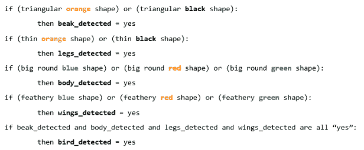
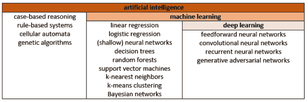
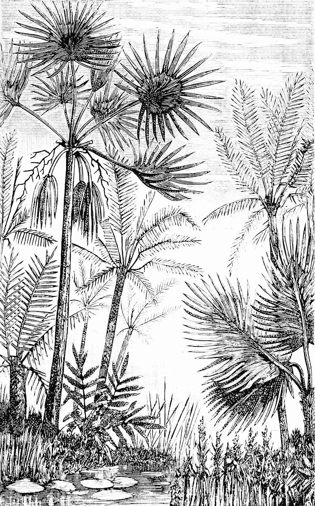

# AI、机器学习、深度学习有什么区别？

> 原文：<https://towardsdatascience.com/whats-the-difference-between-ai-machine-learning-and-deep-learning-54d0528a8ed1?source=collection_archive---------21----------------------->

在许多流行的新闻文章中，“人工智能”、“机器学习”和“深度学习”等术语似乎可以互换使用。这些不同技术之间的区别是什么？

**人工智能**

[维基百科](https://en.wikipedia.org/wiki/Artificial_intelligence)将人工智能定义为

> *机器展示的智能，与人类和动物展示的自然智能形成对比*

因此，“人工智能”是一把宽泛的伞，包含了所有让机器看起来聪明的计算技术。

“强 AI”和“弱 AI”还有进一步的区分:

*   *强人工智能:*具有感知、意识和/或思维的机器，例如来自*星际旅行*的数据。这仍然是科幻小说的领域——没有人构建过强大的人工智能系统。关于创造强大的人工智能是否可能*(例如*见[中文房间争论](https://www.iep.utm.edu/chineser/))或者是否可取(例如*人工智能接管世界)有很多争论。*
*   *弱人工智能*(又名*狭义人工智能*):“无感知”人工智能专注于特定任务，*例如*医学应用，人脸识别，[人工智能艺术](https://glassboxmedicine.com/2019/04/06/machine-art/)。今天开发的所有人工智能都是“狭义人工智能”。

人工智能包括机器学习作为一个子领域。人工智能还包括非机器学习技术，如基于规则的算法。

用于检测鸟类的基于规则的算法可能如下所示:

当然，从这个伪代码示例中可以看出，基于规则的算法很难正确。在你真正确信你看到的是一只鸟之前，你需要具体说明鸟的多少特征？有多少种形状和颜色？(这也掩盖了让计算机识别特定形状和颜色的挑战。)你如何具体说明一根“羽毛”到底长什么样？您可能需要编写数百条不同的规则。因此，对于绝大多数人工智能任务来说，基于规则的方法已经失宠了。

**机器学习**

Arthur Samuel 是早期人工智能研究人员之一，他对机器学习的定义如下:

> *人工智能的一种应用，它赋予计算机无需显式编程就能学习的能力*

机器学习算法旨在从数据中学习。例如，如果你想建立一个机器学习算法来识别鸟类，你不需要写下鸟类的任何特定特征，或任何规则。相反，你会收集成千上万张鸟类和非鸟类的照片，然后用“鸟”(1)和“非鸟”(0)的标签将它们输入到你的机器学习算法中。机器学习算法会自己找出哪些特征有助于区分鸟类和非鸟类。

最近的预印本《[This Looks That:Deep Learning for Interpretable Image Recognition](https://arxiv.org/pdf/1806.10574.pdf)》给出了一个机器学习算法的例子，该算法解释了它正在查看鸟类照片的哪些部分，以确定鸟类物种。

**深度学习**

深度学习是指一种机器学习，在这种机器学习中，计算机学习将世界理解为一个概念层次。深度学习模型是一种特定的机器学习算法，称为神经网络，它被设计成具有许多层，即它是“深度的”较低层学习简单的概念如边，较高层学习复杂的概念如面。

[这篇关于前馈神经网络的早期帖子](https://glassboxmedicine.com/2019/01/17/introduction-to-neural-networks/)定义了神经网络模型的“层”，而[这张图片](https://cdn-images-1.medium.com/max/600/1*2ns4ota94je5gSVjrpFq3A.png)显示了一个具有许多层的神经网络的示意图。

深度学习是最近围绕人工智能的许多兴奋的原因。随着比以往任何时候都更大的数据集和更好的计算机，深度学习算法可以展示在现实世界中有用的令人印象深刻的性能。深度学习已经成功应用于[语音识别](https://developer.amazon.com/alexa-skills-kit/asr)、[语音合成](https://goo.gl/oxGXAi)、[语言翻译](https://translate.google.com/)、[图像字幕](https://www.captionbot.ai/)、[人脸识别](https://www.pyimagesearch.com/2018/06/18/face-recognition-with-opencv-python-and-deep-learning/)。

**总结**

正如你所看到的，神经网络模型是一种“机器学习”，但如果它们有许多层，它们也是“深度学习”。其他方法，如支持向量机，被认为是“机器学习”，但不是“深度学习”；基于规则的系统被认为是“人工智能”，但不是“机器学习”。

**关于特色图片**

专题图片是艺术家绘制的 6600 万年至 260 万年前的树木，“中第三纪欧洲的[棕榈树和苏铁树”我认为它们看起来有点像向日葵，当然也不同于现代的树木。260 万年后人工智能会是什么样子(如果它还在的话)？](https://en.wikipedia.org/wiki/Tree#/media/File:PSM_V16_D476_Principal_palms_and_cycadeae_of_middle_tertiary_europe.jpg)

还有，有一种机器学习方法叫做“[决策树](https://en.wikipedia.org/wiki/Decision_tree)”；如果你同时使用许多决策树，这是另一种叫做“[随机森林](https://en.wikipedia.org/wiki/Random_forest)的机器学习方法

*原载于 2019 年 4 月 19 日*[*http://glassboxmedicine.com*](https://glassboxmedicine.com/2019/04/19/whats-the-difference-between-ai-machine-learning-and-deep-learning/)*。*