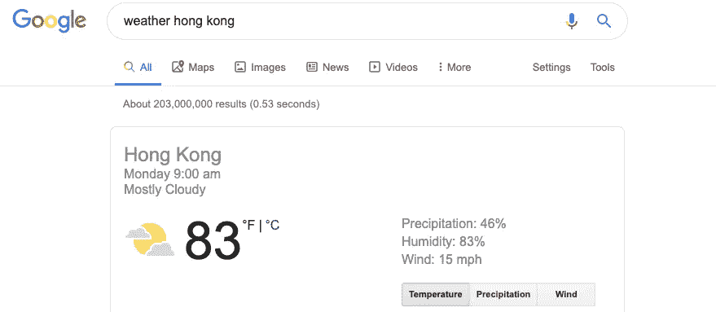

# 分析和统计有什么区别？

> 原文：<https://towardsdatascience.com/whats-the-difference-between-analytics-and-statistics-cd35d457e17?source=collection_archive---------2----------------------->

## 理解两种完全不同职业的价值

[统计学](http://bit.ly/quaesita_statistics)和[分析](http://bit.ly/quaesita_analysts)是[数据科学](http://bit.ly/quaesita_datasci)的两个分支，它们分享了许多[早期的英雄](http://bit.ly/quaesita_history)，所以偶尔的啤酒仍然致力于热烈讨论它们之间的界限在哪里。然而，实际上，带有这些名字的现代训练项目强调的是完全不同的追求。虽然[分析师](http://bit.ly/quaesita_analysts)专门探究你的[数据](http://bit.ly/quaesita_hist)中有什么，但[统计学家](http://bit.ly/quaesita_fisher)更专注于推断数据之外的东西。

***免责声明:*** *这篇文章讲述的是典型的培训项目毕业生，他们只教授* ***的*** *的统计学或* ***的*** *的分析学，它丝毫没有贬低那些设法增肥了***两套肌肉的人。事实上，* [*精英数据科学家*](http://bit.ly/quaesita_bubble) *被期望成为分析和统计方面的完全专家(以及* [*机器学习*](http://bit.ly/quaesita_roles)*)……奇迹般地，这些人确实存在，尽管他们很少。**

**

*Image: [SOURCE](https://www.nec.edu/importance-leadership-data-analytics/).*

## *人肉搜索引擎*

*当你掌握了与你的努力相关的所有事实时，常识是你用[数据](http://bit.ly/quaesita_hist)提问和回答问题的唯一资格。简单地查找答案。*

*想现在就看[基础分析](http://bit.ly/quaesita_roles)在行动*？试试谷歌一下天气。每当你使用搜索引擎时，你都在做基本的分析。你正在调出天气数据并观察它。**

****

**即使是孩子也可以毫不费力地在网上查找事实。这就是数据科学的民主化。好奇想知道今天的纽约是不是比雷克雅未克还冷？你可以获得近乎即时的满足感。它太简单了，我们甚至不再称它为[分析](http://bit.ly/quaesita_analysts)，尽管它确实如此。现在想象一下一个世纪前试图获取这些信息。(正是。)**

> **当你使用搜索引擎时，你是在做基本的分析。**

**如果报道原始事实是你的工作，你就相当于在做一个人肉搜索引擎的工作。不幸的是，人肉搜索引擎的工作保障取决于你的老板永远不会发现他们可以自己查找答案，并省去中间人……特别是当闪亮的分析工具最终使查询你公司的内部信息像使用谷歌搜索一样容易的时候。**

## **灵感勘探者**

**如果你认为这意味着*所有的* [分析师](http://bit.ly/quaesita_analysts)都失业了，那你还没见过专家那种。用数据回答一个特定的问题比[首先启发](http://bit.ly/quaesita_inkblot)哪些问题值得问要容易得多。**

**我已经写了一整篇关于专家分析师做什么的文章，但是简单地说，他们都是关于获取一个巨大的未被探索的数据集并从中挖掘灵感。**

> **“这是整个互联网，去找点有用的吧。”**

**你需要快速的编码技能和敏锐的感觉，知道你的领导会发现什么是鼓舞人心的，以及在对地下有什么一无所知的情况下勘探新大陆的人的所有性格力量。数据集越大，你对它可能出现的[事实类型](http://bit.ly/quaesita_di)了解得越少，就越难不浪费时间地在其中漫游。你需要不可动摇的好奇心和情绪弹性来处理在你想出某样东西之前发现的一大堆东西。说起来总是比做起来容易。**

****

**Here’s a bunch of data. Okay, analysts, where would you like to begin? Image: [Source](http://mentalfloss.com/article/51788/62-worlds-most-beautiful-libraries).**

**虽然分析培训项目通常用查看海量数据集的软件技能来武装他们的学生，但统计培训项目更有可能让这些技能成为可选的。**

## **超越已知**

**当你必须处理不完整的信息时，障碍就提高了。当你有不确定性时，[你所拥有的数据并没有涵盖你感兴趣的内容](http://bit.ly/quaesita_vocab)，所以你在得出结论时需要格外小心。这就是为什么优秀的分析师根本不会得出结论。**

**相反，如果他们发现自己超越了事实，他们试图成为思想开放的[典范](http://bit.ly/quaesita_inkblot)。保持开放的心态至关重要，否则你会陷入[确认偏差](http://bit.ly/quaesita_default)——如果数据中有 20 个故事，你只会注意到支持你已经相信的那一个……而你会错过其他的。**

> **初学者认为探索性分析的目的是回答问题，而实际上是提出问题。**

**这就是培训项目的重点所在:避免在不确定的情况下得出愚蠢的结论是每门统计学课程的内容，而分析项目几乎没有触及推理数学和认识论的细微差别。**

****

**Image: [Source](https://www.talenttalks.net/realizing-potential-part1/).**

**如果没有严格的统计数据，一个粗心的像伊卡洛斯一样的超越你的数据的跳跃很可能会以啪的一声结束。(给分析师的提示:如果你想完全避开统计数据领域，就抵制所有做出结论的诱惑。任务完成。)**

> **分析帮助你形成假设。它提高了你的问题的质量。**
> 
> **统计学帮助你测试假设。它提高了你回答的质量。**

**一个常见的错误是认为探索性分析的目的是回答问题，而实际上是提出问题。分析师的数据探索是如何确保你提出更好的问题，但他们发现的模式不应该被认真对待，直到他们在新数据上进行统计测试。分析帮助你形成假设，而统计让你测试它们。**

> **统计学家帮助你测试，如果分析师在当前数据集中发现的现象也适用于当前数据以外的情况，这种行为是否明智。**

**我观察到其他数据科学类型对分析师的欺负，他们似乎认为他们更合理，因为他们的方程更复杂。首先，专家分析师使用[所有相同的等式](http://bit.ly/quaesita_bsides)(只是出于不同的目的)，其次，如果你横向观察宽浅，它看起来就像窄深。**

**我见过很多由于[对分析师功能](http://bit.ly/quaesita_analysts)的误解而导致的数据科学有用性失败。您的数据科学组织的有效性取决于强大的分析先锋，否则您将小心翼翼地挖掘错误的地方，因此投资于分析师并欣赏他们，然后转向统计学家，对您的分析师带给您的任何潜在见解进行严格的跟进。**

****

## **你两者都需要！**

**在好问题和好答案之间做出选择是痛苦的([和通常的古旧用法](http://bit.ly/quaesita_history))，所以如果你能负担得起与这两种类型的数据专家一起工作，那么希望这是一件容易的事。可惜，代价不仅仅是人员。你还需要[丰富的数据](http://bit.ly/quaesita_history)和[数据分割的文化](http://bit.ly/quaesita_sydd)来利用他们的贡献。拥有(至少)两个数据集可以让你首先获得灵感，并基于想象之外的东西形成你的理论…然后检查它们是否成立。这就是数量的惊人优势。**

> **对这种差异的误解导致了统计学家的大量不必要的欺侮和分析师作为成品出售的大量不规范的观点。**

**拥有大量数据的人不习惯拆分数据的唯一原因是，这种方法在上个世纪的数据饥荒中不可行。很难收集到足够的数据来进行拆分。漫长的历史使分析和统计之间的墙钙化，以至于今天两个阵营都不太喜欢对方。这是一种过时的观点，它一直伴随着我们，因为我们忘记了重新思考它。遗留问题滞后了，导致统计学家大量不必要的欺凌和分析师大量作为成品出售的散漫观点。如果你关心从数据中提取价值，并且你有足够的数据，你有什么借口*而不是*在需要的地方利用你的灵感和严谨？[拆分你的数据](http://bit.ly/quaesita_sydd)！**

> **如果你能和这两种类型的数据专家一起工作，那么希望这是一件容易的事。**

**一旦你意识到数据分割允许每个学科成为另一个学科的力量倍增器，你会发现自己想知道为什么有人会以其他方式处理数据。**

# **感谢阅读！人工智能课程怎么样？**

**如果你在这里玩得开心，并且你正在寻找一个为初学者和专家设计的有趣的应用人工智能课程，这里有一个我为你制作的娱乐课程:**

**Enjoy the entire course playlist here: [bit.ly/machinefriend](http://bit.ly/machinefriend)**

**更喜欢书面媒体，想要我的另一篇文章？试试:**

** [## 分析师和统计学家能相处吗？

### 数据科学专业之间微妙的战争

towardsdatascience.com](/can-analysts-and-statisticians-get-along-5c9a65c8d056)**