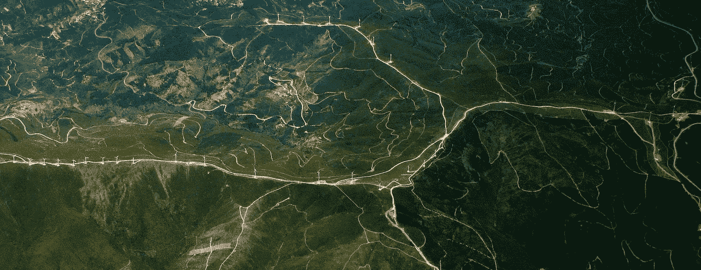
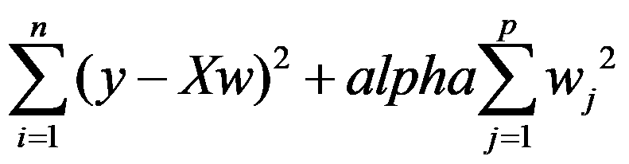
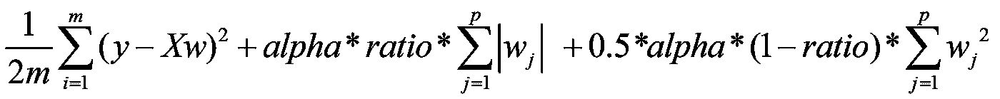

# sklearn 中的线性回归、套索、山脊、ElasticNet 有什么区别？

> 原文：<https://towardsdatascience.com/whats-the-difference-between-linear-regression-lasso-ridge-and-elasticnet-8f997c60cf29?source=collection_archive---------4----------------------->

[Image](https://pixabay.com/photos/aerial-view-mountain-range-ridge-931721/) by [Free-Photos](https://pixabay.com/users/free-photos-242387/) from [Pixabay](https://pixabay.com/)

# **它们有什么区别？**

Lasso、Ridge 和 ElasticNet 都是线性回归系列的一部分，其中 x(输入)和 y(输出)假定具有线性关系。在 sklearn 中，LinearRegression 指的是最普通的不需要正则化(权重上的惩罚)的最小二乘线性回归方法。它们之间的主要区别在于模型是否因其权重而受到惩罚。在本文的其余部分，我将在 scikit-learn 库的背景下讨论它们。

**线性回归**(在 scikit-learn 中)是最基本的形式，其中模型根本不会因为其选择的权重而受到惩罚。这意味着，在训练阶段，如果模型觉得某个特定的特征特别重要，模型可能会对该特征赋予很大的权重。这有时会导致小数据集中的过度拟合。因此，发明了以下方法。

**Lasso** 是线性回归的一种修改，其中模型因权重绝对值的和而受到惩罚。因此，权重的绝对值将(通常)减少，并且许多将趋于零。在训练期间，目标函数变成:

如你所见，Lasso 引入了一个新的超参数， *alpha* ，这个系数用来惩罚权重。

**Ridge** 更进一步，针对权重的平方和惩罚模型。因此，权重不仅倾向于具有较小的绝对值，而且实际上倾向于惩罚权重的极值，从而产生一组分布更均匀的权重。目标函数变成:

**ElasticNet** 是 Lasso 和 Ridge 的混合，其中包括绝对值惩罚和平方惩罚，由另一个系数 l1_ratio 调整:

**你的数据已经缩放了吗？**

正如你在上面的等式中看到的，权重惩罚在损失函数中被加在一起。假设我们有一个特征 *house_size* 在 2000 的范围内，而另一个特征*num _ believes*在 3 的范围内，那么我们可以预期 house_size 的权重自然会小于*num _ believes*的权重。在这种情况下，以同样的方式惩罚每个特征的权重是不合适的。因此，在将数据输入模型之前，对其进行缩放或标准化是非常重要的。**快速注意，sklearn 中这些模型的默认设置将“正常化”设置为 false。**你要么将‘正常化’打开，要么使用 ScandardScaler 缩放数据。通常，使用 ScandardScaler 是一个很好的做法，因为您可能希望使用相同的比例来缩放测试数据。

# **什么时候用哪个？**

有几件事需要记住:

(1) **当你的数据集小于 100k 行时，sklearn 的算法备忘单建议你尝试 Lasso、ElasticNet 或 Ridge。**否则，试试 SGDRegressor。

(2) **Lasso 和 ElasticNet 倾向于给出稀疏的权重(大部分为零)**，因为 l1 正则化同样关心将大权重驱动到小权重，或者将小权重驱动到零。如果你有很多预测器(特性)，并且你怀疑不是所有的都那么重要，那么 Lasso 和 ElasticNet 可能是一个很好的开始。

(3) **Ridge 倾向于给出小但分布良好的权重**，因为 l2 正则化更关心将大权重驱动到小权重，而不是将小权重驱动到零。如果您只有几个预测值，并且您确信所有这些预测值都与预测真正相关，请尝试将岭作为一种很好的正则化线性回归方法。

(4) **在使用这些正则化线性回归方法之前，您需要调整您的数据。**首先使用 StandardScaler，或将这些估算器中的“normalize”设置为“True”。

