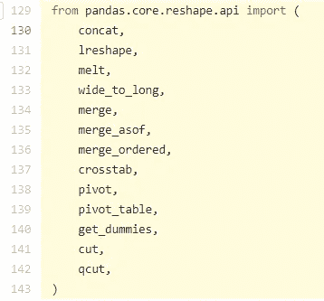
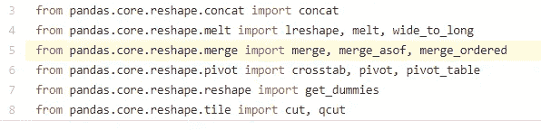
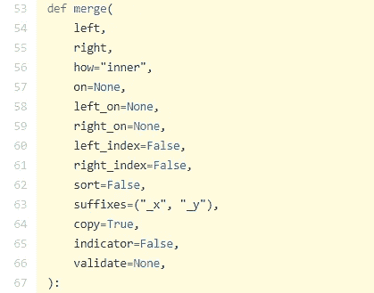
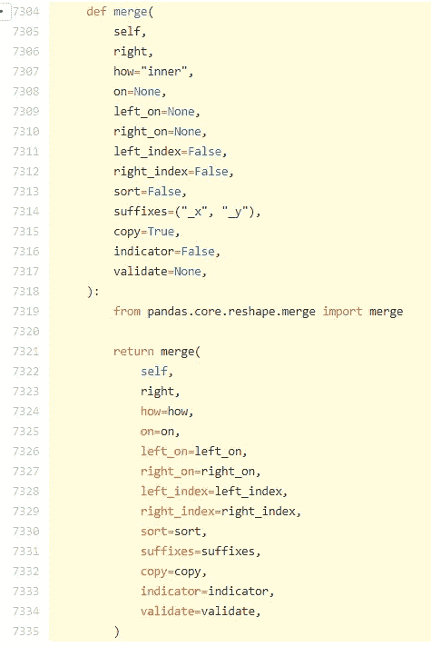

# pd.merge 和 df.merge 有什么区别？

> 原文：<https://towardsdatascience.com/whats-the-difference-between-pd-merge-and-df-merge-ab387bc20a2e?source=collection_archive---------35----------------------->

## 对源代码的深入探究，揭示导入的设计模式

Photo by [Pascal Müller](https://unsplash.com/@millerthachiller?utm_source=medium&utm_medium=referral) on [Unsplash](https://unsplash.com?utm_source=medium&utm_medium=referral)

在我为 www.dataquest.io 提供在线技术支持的志愿工作中，我遇到了许多问题，这些问题使我能够更深入地研究我通常浏览的有趣问题。

今天的问题是:
 **left _ df . merge(right_df)vs PD . merge(left _ df，right _ df)有什么区别？**

简短的回答是`left_df.merge()`呼叫`pd.merge()`。

使用前者是因为它允许方法链接，类似于 R 中的`%>%`管道操作符，允许你从左向右写和读数据处理代码，比如`left_df.merge(right_df).merge(right_df2)`。如果你不得不做 pd.merge()，这不是链接的风格，而是包装的风格，如果你明白这是怎么回事，它会以一个丑陋的`pd.merge(pd.merge(left_df,right_df),right_df2)`结束。

现在让我们到兔子洞里去看看发生了什么事。

第一，当你看到`pd.merge`的时候，其实就是`pandas.merge`的意思，也就是说你做了`import pandas`。当你`import`某个东西的时候，那个模块名的`__init__.py`文件(本问题中的`pandas`)就运行了。

所有这些`__init__.py`文件的主要目的是组织 API，并允许用户通过为您导入中间包来键入更短的导入代码，因此您可以一次编写`pandas.merge()`而不是在使用`merge()`函数之前先要求`from pandas.core.reshape.merge import merge`。

现在你打开[https://github . com/pandas-dev/pandas/blob/v 0 . 25 . 1/pandas/_ _ init _ _，看看我说的“为你导入中间包”
是什么意思。py#L129-L143](https://github.com/pandas-dev/pandas/blob/v0.25.1/pandas/__init__.py#L129-L143) ，你会看到它是如何导入很多东西的，其中一行是`from pandas.core.reshape.api`(图 1)，在那个块`merge`是导入的。

Figure 1

这就是允许你直接调用`pd.merge`的地方，但是让我们来深究一下。
走进`pandas.core.reshape.api`[https://github . com/pandas-dev/pandas/blob/v 0 . 25 . 1/pandas/core/reshape/API . py](https://github.com/pandas-dev/pandas/blob/v0.25.1/pandas/core/reshape/api.py#L5)你看`from pandas.core.reshape.merge import merge`。(图 2)

Figure 2

现在你明白了`from pandas.core.reshape.api`之前的`merge`是从哪里来的吧。

最后让我们来看一下来源，在[进入`pandas.core.reshape.merge`https://github . com/pandas-dev/pandas/blob/v 0 . 25 . 1/pandas/core/shape/merge . py # L53](https://github.com/pandas-dev/pandas/blob/v0.25.1/pandas/core/reshape/merge.py#L53)你看`def merge`。(图 4)

Figure 4

现在让我们从[https://pandas . py data . org/pandas-docs/stable/reference/API/pandas 来看看编码的链式风格`left_df.merge` 在做什么。DataFrame.merge.html](https://pandas.pydata.org/pandas-docs/stable/reference/api/pandas.DataFrame.merge.html)，点击`source`进入[https://github . com/pandas-dev/pandas/blob/v 0 . 25 . 1/pandas/core/frame . py # l 7304-l 7335](https://github.com/pandas-dev/pandas/blob/v0.25.1/pandas/core/frame.py#L7304-L7335)查看`def merge(self`(图 5)，这个`self`告诉你这是一个类(在这个例子中是 DataFrame)方法，这个方法稍后会导入`from pandas.core.reshape.merge import merge`，并将你的所有参数从`pandas.core.reshape.merge`传递回`merge`，只有

Figure 5

您可以将这里的`left_df.merge`中的`def merge` 的两个函数签名与之前的`pd.merge`讨论进行比较，以查看它们是否完全相同`merge`。

我怎么知道要从关键词`merge`开始搜索呢？实际上，我首先从`left_df.merge` 的源代码开始搜索，但我觉得最好先解释最底层的代码，然后引入用`self`替换`left`参数的想法，这样更复杂的想法就建立在更简单的想法上。

我希望这篇文章能激发其他人不要害怕源代码，而是激发他们的好奇心，去了解事情在幕后是如何工作的，API 是如何设计的，这样做可能会对熊猫的未来有所贡献。