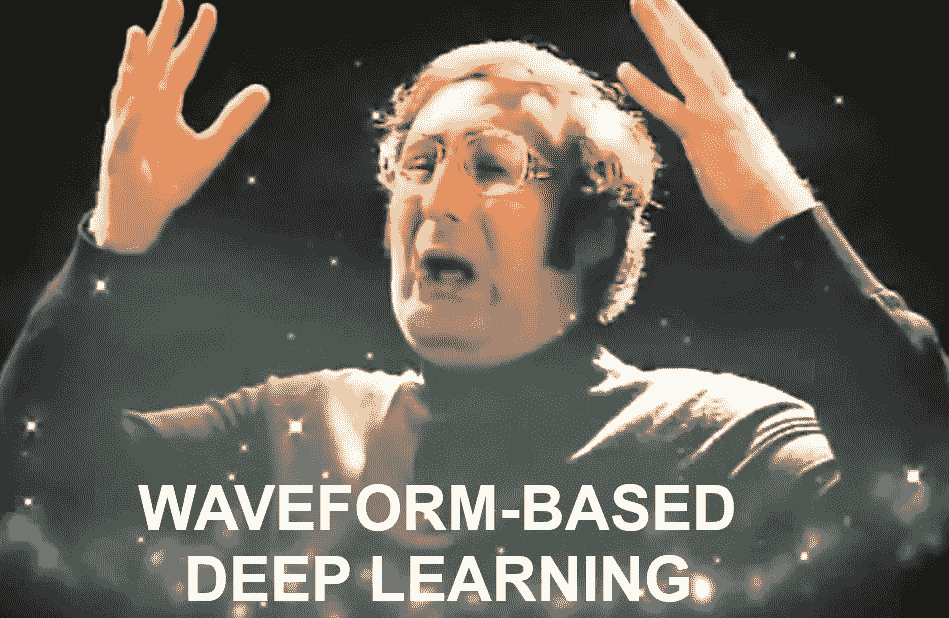

# 基于波形的 vgg 是怎么回事？

> 原文：<https://towardsdatascience.com/whats-up-with-waveform-based-vggs-15ff7c3afc28?source=collection_archive---------18----------------------->

在这一系列帖子中，我写了两篇文章讨论基于声谱图的 VGG 架构的利弊，以思考计算机视觉深度学习架构在音频领域的作用。现在是讨论基于波形的 vgg 的时候了！

*   帖子一:[为什么基于声谱图的 vgg 很烂？](/why-spectrogram-based-vggs-suck-36ca9b5b0b40)
*   帖子二:[为什么基于声谱图的 VGGs 会摇滚？](/why-do-spectrogram-based-vggs-rock-6c533ec0235c)
*   帖子三:[基于波形的 VGGs 是怎么回事？](/whats-up-with-waveform-based-vggs-15ff7c3afc28)【本帖】

在这些帖子中，我将围绕 VGG 模型展开讨论，这是一种被音频研究人员广泛使用的计算机视觉架构。简而言之，[vgg](https://arxiv.org/pdf/1409.1556.pdf)是由一个深度堆栈的非常小的过滤器与最大池相结合而形成的。

频谱图和基于波形的 vgg 之间的主要区别在于，前者执行 2D 卷积(跨时间和频率)，而后者执行 1D 卷积(跨时间)。另一个区别是基于波形的模型不会丢弃相位。相反，他们按原样使用原始信号。这是不是优势，很多任务还是要确定的！

在以前的帖子中，我解释了如何使用领域知识来[提高基于频谱图的模型的效率和性能](http://www.jordipons.me/why-spectrogram-based-vggs-suck/)，我还指出，人们使用基于频谱图的 vgg 是因为它们[非常灵活](http://www.jordipons.me/why-spectrogram-based-vggs-rock/)——基本上，它们不受任何领域知识的约束。换句话说:我揭露了在设计数据驱动模型时是否使用领域知识的永无止境的讨论。

有趣的是，基于波形的深度学习研究人员也在深入这场讨论。一些人在使用 VGGs 时发现了非常有前途的结果，但是另一些人在使用领域知识时发现了有趣的结果。然而，文献远非定论。可能是因为这些工作相对较新，没有独立的元研究来比较这些跨几个数据集的架构。

## 基于波形的 VGGs 为什么能摇滚？

重要的是要注意，波形是高维的，非常多变。这就是为什么，历史上，音频社区没有成功地建立成功的系统，直接接近原始波形。

正因为波形不直观且难以接近，所以在不利用任何领域知识的情况下解决这个问题可能是有意义的。如果很难思考如何恰当地完成任务，为什么不从数据中学习呢？因此，为此目的使用类似 VGG 的模型可能是有意义的——因为这些模型不受任何依赖于领域知识的设计策略的约束，因此具有高度的表达能力和从数据中学习的巨大能力。

此外，通过堆叠具有小滤波器的 CNN 层来构建 VGG 模型。作为使用小过滤器的结果，在不同阶段学习相同表示的可能性显著降低。此外，交错的 max-pooling 层进一步增强了相位不变性。

正如所见，使用基于波形的 vgg 似乎不是一个坏主意。与声谱图的情况不同，当处理基于波形的模型时，我们对于如何建立模型没有清晰的直觉。因此，人们开始设计基于波形的类似 VGG 的模型，这种模型的设计不依赖于任何领域的专业知识。相反，它们依赖于一组非常小的过滤器，这些过滤器可以分层组合，以学习任何有用的结构。其中一些架构是 [Wavenet](https://deepmind.com/blog/wavenet-generative-model-raw-audio/) 、 [sampleCNN](https://arxiv.org/pdf/1703.01789.pdf) 、它的[挤压和激励扩展](https://arxiv.org/pdf/1710.10451.pdf)，或者音频的 [ResNet](https://arxiv.org/pdf/1802.06424.pdf) 。

## 让我们利用领域知识来设计波形前端！

尽管一些研究人员认为不利用领域知识是基于波形的模型的发展方向，但另一些人却持相反的观点。

所有考虑领域知识而设计的基于波形的模型都从相同的观察出发:端到端神经网络在第一层学习频率选择滤波器。如果这些必须学习时间-频率分解，如果我们已经定制了网络来学习呢？也许，用那种方式，可以比使用类似 VGG 的模型获得更好的结果。

一个[第一次尝试](https://ieeexplore.ieee.org/document/6854950)是在 [STFT](https://en.wikipedia.org/wiki/Short-time_Fourier_transform) 中使用与窗口长度一样长的滤波器(例如，滤波器长度为 512，步长为 256)。如果这种设置能够很好地用 STFT 将信号分解成正弦基，也许它还能帮助学习 CNN 中的频率选择滤波器！

后来，提出了[多尺度 CNN](https://arxiv.org/pdf/1603.09509.pdf) 前端——其由具有不同滤波器大小(例如，滤波器长度为 512、256 和 128，步长为 64)的 CNN 产生的级联特征图组成。他们发现，这些不同的滤波器自然地学习它们可以最有效地表示的频率，大型和小型滤波器分别学习低频和高频。这与受 STFT 启发的 CNN 形成了鲜明对比，后者试图用单一尺寸的滤波器覆盖整个频谱。

或者最近，提出了基于参数化 *sinc* 函数(实现带通滤波器)的波形前端: [SincNet](https://arxiv.org/abs/1808.00158) 。SincNet 的每个第一层滤波器中只有两个可学习的参数，在波形方面，SincNet 可以胜过 STFT 启发的 CNN，甚至是基于频谱图的 CNN！

## 因此..什么？

尽管存在一些轶事般的[元研究](https://arxiv.org/abs/1805.00237)，但考虑到我们还处于该研究领域的早期，很难说哪种架构会在长期内流行。目前，出现了一些有影响力的想法，现在是社区尝试这些想法的时候了。

虽然当训练数据丰富时，高度表达的基于波形的 VGG 模型可能是有能力的，但是当数据稀缺时，基于领域知识的模型可能有更多的机会-仅仅因为模型的参数数量可以显著减少，就像 SincNet 一样。时间会证明一切！