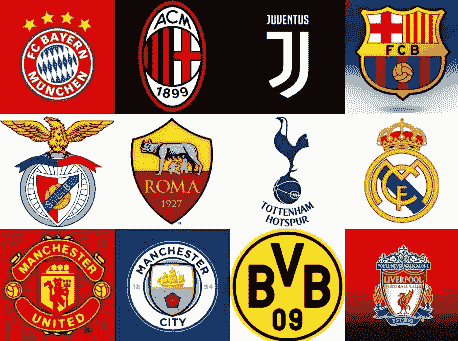

# 你的足球队的克星是什么？

> 原文：<https://towardsdatascience.com/whats-your-soccer-team-s-nemesis-30d95c4f9b15?source=collection_archive---------24----------------------->

## 巴萨真的是皇马最难对付的对手吗？史料描绘了一个有趣的故事。

皇家马德里 vs 巴塞罗那。曼联对利物浦。国际米兰对米兰。里昂奥林匹克队对马赛奥林匹克队。切尔西 vs 所有人。

**欧洲足球充满了令人惊叹的竞争。**由于球场内外的原因，这些竞争随着时间的推移而产生和演变，是球队每个赛季都必须面对的最艰难的比赛。但是这些对抗真的是赛季中最艰难的比赛吗？例如，尽管皇家马德里对巴塞罗那是世界足球最重要的比赛之一，但人们很容易忘记皇家社会或毕尔巴鄂竞技对巴塞罗那来说有多难。

在这篇文章中，我想报告我所做的数据分析的方法和结果，以查看欧洲主要联赛 8 个赛季的所有比赛数据，并找出哪个对手对每个球队造成的损害最大。又名，**寻找各队的克星。**

我在这篇文章的最后描述了数据和方法，以便立即深入研究结果(请随意查看，然后返回结果！).要了解结果，你需要知道的主要事情是，我使用的**指标是一个团队从对手那里获得的最大可能分数的百分比。**最大可能点数是游戏次数的 3 倍。因此，举例来说，如果切尔西与利物浦比赛 10 次，总共得到 15 分，那么切尔西得到 30 分中的 15 分，即 50%。

*为了保持列表简短，我只报告了(几乎)有 16 次相遇的团队配对的结果。这是最大可能的比赛次数，因为每对球队每年比赛两次，我们有 8 年的数据。*

# 结果呢

被研究的各**大团队**的*克星*。

*数字越低，该队在对抗对手时表现越差。*

## **英超联赛**

*   **阿森纳** : 25% vs *切尔西*
*   **阿斯顿维拉:** 14.6% vs *曼联*
*   **切尔西:** 40% vs *利物浦*
*   **埃弗顿:** 19% vs *阿森纳*
*   **利物浦:** 29% vs *阿森纳*
*   **曼城:** 38% vs *利物浦*
*   **曼联:** 38% vs *切尔西*
*   **斯托克城:** 17% *曼联*
*   **桑德兰:** 19% vs *切尔西*
*   **热刺:** 29% vs *曼联*

## 西班牙 La Liga

*   **毕尔巴鄂竞技俱乐部:**12%vs*巴塞罗那*
*   **马德里竞技:**17%*巴塞罗那*
*   **巴塞罗那:**53% *皇家社会*
*   **赫塔菲:** 13% *皇家马德里*
*   **马拉加:**8% *巴塞罗那:*
*   **西班牙人:**6%vs*皇家马德里*
*   **皇家马德里:** 29% vs *巴塞罗那*
*   **塞维利亚:**13%vs*巴塞罗那*
*   **瓦伦西亚:**23%vs*巴塞罗那*

## 意大利 Serie A

*   **切沃·维罗纳:**6%vs*米兰*
*   **热那亚:** 20% *尤文图斯*
*   **国际米兰:**29% vs*尤文图斯*
*   **尤文图斯:**47%*那不勒斯*
*   **米兰:**29% vs*尤文图斯*
*   **那不勒斯:**40%vs*罗马*
*   **罗马:**25%vs*尤文图斯*
*   **乌迪内斯:**29% vs*尤文图斯*

## 德国 Bundesliga

*   **拜耳 04 勒沃库森:**29%vs*多特蒙德*
*   多特蒙德(Borussia Dortmund):40%vs*拜仁慕尼黑(T75)*
*   **Borussia Monchengladbach:** 31% vs. *Borussia Dortmund*
*   **拜仁慕尼黑:**50% vs*Borussia Monchengladbach*
*   **沙尔克 04:**19% vs*拜仁慕尼黑*
*   **汉堡 SV:** 21% vs*拜仁慕尼黑*
*   (T92) 韦尔德不来梅(T93):13% vs. 拜仁慕尼黑(T94)
*   **TSG 1899 霍夫恩海姆:** 8.3% vs*拜仁慕尼黑*
*   **VfB Stuttgard:**11% vs*拜仁慕尼黑*
*   **VfL 沃尔夫斯堡:** 15% vs*拜仁慕尼黑*

## 法国 Ligue 1

*   **AS 圣艾蒂安:**20% vs*巴黎圣日耳曼*
*   **FC 洛里昂:** 21% vs*巴黎圣日耳曼*
*   **波尔多吉伦丁斯:** 38% vs *马赛奥林匹克运动会*
*   **LOSC 里尔:**27%vs*巴黎圣日耳曼*
*   **OGC Nice:** 29% vs *Montpellier Herault SC*
*   **奥林匹克里昂:**31%vs*巴黎圣日耳曼*
*   **马赛奥林匹克:**31% vs*巴黎圣日耳曼*
*   **巴黎圣日耳曼:** 28% vs *作为摩纳哥*
*   **伦奈斯球场:** 27%对*波尔多吉伦特派*
*   **图卢兹足球俱乐部:** 29% vs *巴黎圣日耳曼*

# 突出

*好的，这已经很多了。我们来加工一些高光。*

**切尔西是阿森纳的克星。鉴于该数据集基于 8 个季节，这可能并不令人惊讶。迪迪埃·德罗巴和他的蓝色队友已经威胁阿森纳的防线一段时间了。**

**利物浦是切尔西和曼城的克星。但是谁能忘记杰拉德的失误，让切尔西进球，也让利物浦的夺冠希望破灭？**

阿森纳是利物浦的克星。切尔西>阿森纳>利物浦>切尔西。这是一个有趣的循环，表明在足球中事情没有等级之分:任何球队都可以赢任何球队！

英格兰超级联赛是最平等的联赛。有很多关于西甲 vs 英超的讨论，这篇博文可以增加一个数据点。在这里研究的 9 支西班牙球队中，巴塞罗那队是 6 支的克星，而在英超联赛中，没有哪支球队像巴塞罗那队那样占据统治地位。在被调查的 10 支球队中，切尔西和曼联各是 3 支球队的克星。

当然，另一方面，在研究的 8 个赛季中，英超有 10 支球队从未降级，但西甲只有 9 支。所以我们先不要急着判断哪个联赛是最有竞争力的。

皇家社会是巴萨的克星。这是一个意想不到的结果的很好的例子，因为大部分的媒体报道通常都是关于 El Classico 的。但密切关注巴萨的球迷知道“阿诺埃塔诅咒”以及皇家社会对巴塞罗那来说是一个多么困难的对手。

**巴萨几乎是西班牙各大球队的克星。对于许多人来说，这可能并不奇怪，因为巴塞罗那在过去的 8 年里一直在国内联赛中占据统治地位(他们赢得了所研究的 8 个赛季中的 6 个赛季)。皇家马德里是西班牙两支主要球队的克星，赫塔菲(一支同样位于马德里大都会区的球队)和西班牙人。**

尤文图斯一直统治着意大利联赛。他们是 8 支意大利球队中 5 支的克星。那不勒斯是尤文图斯的克星。

**PSG 和拜仁慕尼黑分别称霸法德联赛。他们是联盟中 10 支被研究球队中 7 支的克星，是所有被研究球队中比例最高的。正如摩纳哥是巴黎圣日耳曼的克星，门兴格拉德巴赫是拜仁慕尼黑的克星。**

巴塞罗那是研究中最有韧性的球队。与劲敌皇家社会队的比赛中，巴萨设法获得了 **53%** 的最大可能积分。这是所有团队/复仇女神组合中最高的。这是对阵强敌时表现最好的球队名单。

1.  巴塞罗那，53%对皇家社会
2.  拜仁慕尼黑，50% vs 门兴格拉德巴赫
3.  尤文图斯，47%对那不勒斯
4.  多特蒙德，40%对拜仁慕尼黑
5.  切尔西，40%对利物浦
6.  那不勒斯，40%对罗马
7.  曼联，38%对切尔西
8.  曼城，38% vs 利物浦

# 结论

这种分析真的能帮助巴萨球迷在他们的球队对阵皇马时放松下来吗？大概不会。足球对抗不仅仅是一场比赛，也不仅仅是国内联赛的 3 分。

然而，这种分析和其他类似的分析可以帮助整理噪音和人为偏见，以向球员和教练指出他们应该更加关注的一些球队。

你的团队不在上面的名单里吗？别担心，你可以在这里看到(并修改)产生所有结果的笔记本[或者在下面留下评论！](https://github.com/yortos/european-soccer-nemesis)

*感谢阅读！*

# 附录:数据集和方法

## 数据集

我使用了欧洲足球比赛的 Kaggle 数据集。这是一个非常棒的数据库，包含了大量欧洲国内联赛的比赛以及球员和球队的属性。

## **方法论**

我做的第一件事是查询数据集，以获得西班牙、英格兰、法国和意大利国内联赛的所有比赛结果。数据集包括更多的联赛，所以如果你真的想从这四个联赛之外的联赛中找到你球队的克星，请随意看看代码或者告诉我。

一些直接的基本调查显示有 8 个季节:从 2008/9 的**到 2015/6 的**直到**。**我们每个联赛都有 20 支参赛队，每支参赛队都有两次比赛，因此每支参赛队每个赛季都应该有 38 次观察。欧洲联赛实行降级和升级制度，因此并非所有球队都会成为每个赛季数据的一部分，因为有些球队会降级。

数据集看起来非常完整，几乎记录了所有匹配；有一小部分比赛缺席(大部分是意大利联赛)，但是因为很少，我选择忽略它。

一旦所有的原始记录都准备好了，我会浏览每个队的完整比赛列表，记录对手和他们在比赛中得到的分数:如果他们赢了，3 分；如果他们输了，0 分；如果他们打平，1 分。然后，可以将这个数据集按每个团队和对手对分组，计算他们得到的分数总和，然后除以可能的最大分数。因此，对于每支球队，我们可以找到对手，他们得到了最小百分比的可能分数。我们称那个对手为**克星！**