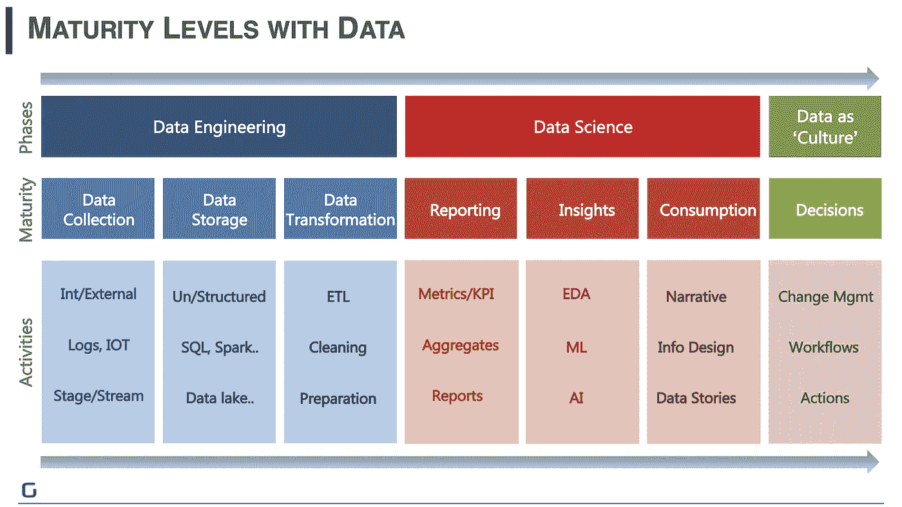
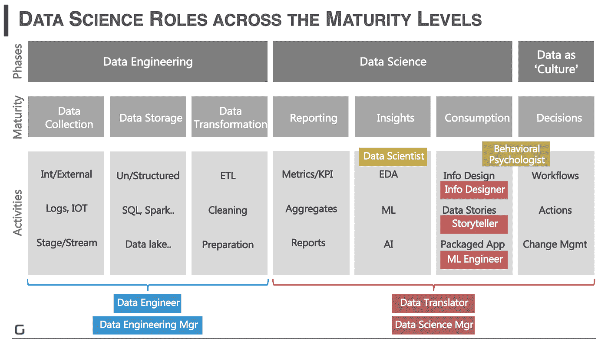
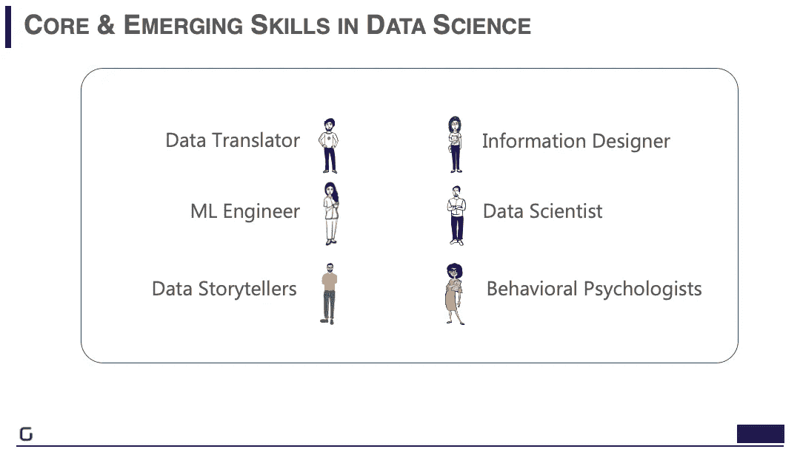

# 何时以及如何组建您的数据科学团队

> 原文：<https://towardsdatascience.com/when-and-how-to-build-out-your-data-science-team-157b977e4c31?source=collection_archive---------18----------------------->

## 评估您的成熟度，找到您需要的技能，并创建数据文化

**越来越多的初创公司正在寻求人工智能(AI)来帮助他们解决业务问题和提高效率。在你的初创公司中建立人工智能能力的众多好处不应该让任何人感到惊讶。**

事实上，商业优势是如此深远，以至于普华永道预测，到 2030 年，人工智能将为全球经济增加[15.7 万亿](https://www.pwc.com/gx/en/issues/data-and-analytics/publications/artificial-intelligence-study.html)美元。与流行的观点相反，成功实施人工智能来推动有影响力的决策需要一个多元化的团队，他们拥有多种技能组合的专业知识。

启动你的人工智能之旅不是一件简单的事情——你需要提出探索性的问题，以确保相关的数据科学项目在正确的时间开始。此外，你需要确保建立一个高效的团队，将数据转化为决策。

## **企业应该在什么时候实现人工智能飞跃？**

大多数初创公司已经在使用数据来了解他们的业务绩效并做出运营决策，无论是通过 MIS 报告还是 Excel 电子表格中跟踪的 KPI。但是什么时候应该升级到高级分析呢？你应该在什么时候开始利用人工智能技术并建立你的数据科学团队？

Pic: Scaling the 7 levels of maturity with data

任何希望在数据科学领域成熟的初创公司都需要获得可靠的数据源和干净的数据。因此，先决条件是利用工程实践来获取数据，然后构建和存储它。

数据科学的第一步是查看描述性分析以了解过去发生的事情，这通常通过 KPI 报告和业务指标的简单摘要来实现。

在进行描述性分析之后，你应该使用探索性数据分析来理解事情为什么会这样。这被称为诊断分析，由统计和业务分析提供支持。

一旦您发现自己在寻求从数据中提取更多价值，您就应该为前瞻性分析做好计划。在这里，使用人工智能和机器学习(ML)对于深入研究更深层次的、预测性的、数据驱动的见解至关重要。

数据科学之旅的下一步是消费这些数据洞察，并将它们与业务决策联系起来。数据消费由叙述、信息设计和数据故事驱动。

组织的最终数据成熟度是数据成为一种文化的时候。这是组织中每个人的第二天性，使用数据并利用探索性见解、ML 和 AI 等技术，直接或间接为决策提供动力。

## **数据科学什么时候合适？**

Photo by [Kevin Ku](https://unsplash.com/@ikukevk?utm_source=unsplash&utm_medium=referral&utm_content=creditCopyText) on [Unsplash](https://unsplash.com/?utm_source=unsplash&utm_medium=referral&utm_content=creditCopyText)

但是刚刚起步的创业公司呢？在深入了解之前，您应该花六个月的时间来构建您的数据湖吗？不会。无论你手头有什么数据，开始训练人工智能和人工智能算法都不会太早——只要确保你有来自内部或外部来源的相关、精选数据。

在旅程的早期，在开始将数据输入数据科学层之前，实施清理和转换数据的流程至关重要。例如，假设一家最近推出的电子商务初创公司希望利用人工智能和人工智能来更好地了解观众的购买行为。数据科学团队可以从事务日志中收集数据，对其进行处理和清理。

他们可以分析这些数据，然后了解人们为什么购买某些商品，并预测他们未来可能会购买什么。这为组织提供了尽早了解其消费者基础的关键可行见解，而不必等待。

所以，你已经决定向人工智能迈进，你已经确定了你的人工智能愿景和可能的用例。然后，您如何构建您的团队来实现收益并扩展成熟阶段？

## **什么造就了一个全面发展的数据科学团队？**

如果你从报告和描述性分析开始，那么你将需要一个数据翻译器。这些人在技能上最接近商业智能(BI)团队中的“商业分析师”。除了敏锐的商业嗅觉，他们还擅长处理数据，熟悉分析，并有设计眼光。

Pic: Roles mapped to the Data maturity levels

数据翻译者帮助确定最有影响力的项目，因为他们将业务挑战塑造成可以通过数据解决的形状。凭借对领域和数据流畅性的深刻理解以及有效沟通的能力，他们充当了业务用户、数据工程师以及数据科学家和信息设计师等角色之间的桥梁。

这一角色在致力于推动业务成果的数据科学团队中至关重要— [麦肯锡](https://www.mckinsey.com/~/media/mckinsey/business%20functions/mckinsey%20analytics/our%20insights/the%20age%20of%20analytics%20competing%20in%20a%20data%20driven%20world/the-age-of-analytics-full-report.ashx)估计，到 2026 年，仅美国对翻译的需求就可能达到 200 万到 400 万。

数据科学家将利用他们在统计学、ML 和 AI 技术方面的知识，找到从数据中发掘最重要见解的方法。你还需要信息设计师来使这些见解变得可消费。

信息设计师能够赋予洞察力的视觉智能层以生命，并使用数据可视化和视觉设计从洞察力中编织引人入胜的商业故事。

机器学习工程师(ML 工程师)是精通数据的程序员，在 ML/AI 模型的生产中至关重要。他们将数据科学解决方案与后端的正确见解和前端的正确叙述相结合，以支持业务决策。

这个拥有不同技能的团队最好由数据科学经理来管理。这些人同样理解数据、见解和故事，以及他们在人员和项目管理方面的核心专业知识。

许多组织正在将数据讲述者的额外角色制度化。这些人通过从数据洞察中精心制作清晰的叙述，超越了可视化仪表板。它们提供了背景，使企业中的每个人都能理解这些见解。

根据这份 [Gartner](https://www.gartner.com/en/conferences/apac/data-analytics-india/gartner-insights/gc-research-foster-data-driven-culture) 报告，我们，人类，天生就有抑制我们有意义地参与事实的能力的机制。故事是感性的，难忘的，可操作的。如果没有吸引人的数据故事，你可能会疏远你的非数据科学团队成员。

组织也转向艺术和社会学科，为数据科学增加人文因素。例如，行为心理学家能够更好地揭示客户决策背后的潜在原因，如流失、购买和参与。

当与数据洞察相结合时，这种人的视角使组织能够更深入地了解他们的客户群，并做出真正有影响力的决策。

## **构建业务以培养健康的数据文化**

Photo by [Edvard Alexander Rølvaag](https://unsplash.com/@edvardr?utm_source=unsplash&utm_medium=referral&utm_content=creditCopyText) on [Unsplash](https://unsplash.com/s/photos/hierarchy?utm_source=unsplash&utm_medium=referral&utm_content=creditCopyText)

对于任何刚刚开始数据科学之旅的初创公司来说，建立一个多功能的数据科学团队并产生有影响力的见解不会在一夜之间发生。许多在这条道路上迈出第一步的组织努力提出正确的分析计划，并确定深刻的业务见解。

他们发现很难使见解具有可消费性，并且不总是能够确保数据科学解决方案被目标用户采用。这就是为什么分析的采用需要行政命令和领导层的共同努力才能取得成功。

规划变革管理计划以实现其团队接受数据的行为变化至关重要。您可以通过流程干预将数据驱动的决策构建到团队成员的业务工作流程中来实现这一点。

健康的数据文化还需要得到正确的组织结构的支持，以促进数据科学团队和业务团队之间的协作。一个由数据科学冠军组成的跨职能核心团队应该领导该计划，并与终端用户保持联系。

应通过提醒团队许多业务优势来确保组织的采用和认可——与同行相比，数据驱动型公司每年平均增长超过 30 %。最终，每个组织都应该将数据文化视为其最终目标。当数据为深入洞察提供动力并被整个组织使用时，这种情况就会发生，从而使每个决策都具有潜在的影响力。

这不仅改变了团队内部日常运作的方式，也改变了商业运作的方式。将数据文化制度化可以为组织转型和市场竞争优势铺平道路。

*这篇文章最初是在 TechCrunch 的会员计划 ExtraCrunch 上* [*发表的*](https://techcrunch.com/2019/12/13/when-and-how-to-build-out-your-data-science-team/) *。增加了插图。封面图片由* [*法布里齐奥*](https://unsplash.com/@fabrizioverrecchia?utm_source=unsplash&utm_medium=referral&utm_content=creditCopyText) *组成。*