# 什么时候进行 A/B 测试，什么时候不进行

> 原文：<https://towardsdatascience.com/when-and-when-not-to-a-b-test-c901f3ad96d9?source=collection_archive---------4----------------------->

## 分裂测试与多臂土匪:模拟，源代码和现成的应用程序


Photo by [Daniil Vnoutchkov](https://unsplash.com/@daniilvnoutchkov?utm_source=medium&utm_medium=referral) on [Unsplash](https://unsplash.com?utm_source=medium&utm_medium=referral)

本文讨论了 A/B 或分裂测试和多臂土匪对于变体测试的区别。它可以用于例如为数字营销活动选择最佳表现的广告集。在各种实验中模拟和测量两种方法的性能表明**在大多数情况下，Bandit 控制分割，并且应该是首选的**。除了模拟结果之外，还提供了所有必需的源代码，以及一个使用 Bandit 方法进行变量优化的简单 web 应用程序。

app:【optimizer.stagelink.com
代码:[github.com/kinosal/optimizer](https://github.com/kinosal/optimizer)

# 故事大纲

1.  什么是 A/B 测试，有什么问题？
2.  另一种选择是:多股武装匪徒
3.  实验:分裂与强盗
4.  参数+结论

所以让我们开始吧:

# 什么是 A/B 测试？


Photo by [Robert Anasch](https://unsplash.com/@diesektion?utm_source=medium&utm_medium=referral) on [Unsplash](https://unsplash.com?utm_source=medium&utm_medium=referral)

A/B、A/B/n 或分割测试----我们将这样称呼它们----用于通过测试、测量和比较每个场景中的行为(即成功率)来确定几个备选场景或变体中的哪一个更有可能产生预期的成功结果或响应。这种测试有各种各样的用例。本文将重点关注转化率的最大化，例如，从用户看到在线广告到点击此类广告，或者用户在访问网站后完成购买。

分割测试的结果可以用一个 *NxM* 矩阵来描述，其中 *N* 行包含所有测试场景中*成功*和*失败=试验-成功*的数量。在一个示例中，广告(场景或变体)1 已经显示给 1，000 人(试用)，其中 10 人点击了广告(成功)，广告 2 已经显示给不同的 1，000 人，其中 20 人点击了广告，这个矩阵也称为列联表，如下所示:

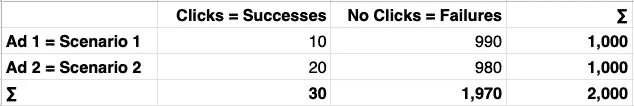

现在的目标是确定两个广告(场景)中的一个的成功率(点击可能性)是否“显著”高于另一个广告(场景)。这将意味着在所有场景中抽取的样本很有可能不是来自同一个群体(或具有相同分布的群体，在我们的情况下是[二项式](https://en.wikipedia.org/wiki/Binomial_distribution))，这是我们的零假设 *H0* 的成功率独立于我们试图使之无效或反驳的观察到的场景。这一点很重要，因此我们最终可以得出结论，场景中的差异实际上是不同成功率的原因，而不仅仅是这些场景中的随机性。统计显著性或置信水平可以解释为独立概率=错误拒绝低于预定义 p 值的*H0*(a[I 型误差](https://en.wikipedia.org/wiki/Type_I_and_type_II_errors))的概率。检验显著性的方法有多种，我们将重点关注不带( [Yates](https://en.wikipedia.org/wiki/Yates%27s_correction_for_continuity) ')校正的(Pearson’s)[卡方检验](https://en.wikipedia.org/wiki/Pearson%27s_chi-squared_test)。p 值可以通过卡方统计从列联表中显示的观察数据中导出，卡方统计定义为

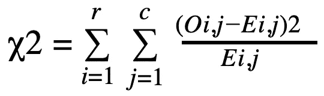

其中 *Oi，j* 是观察到的成功和失败，而 *Ei，j* 是它们各自的期望值，如果基础分布是相同的，即在上面的例子中有 15 次成功和 985 次失败。因此，如果在观察到的情景中没有差异，则统计表明两种情景的不同之处。p 值现在可以根据卡方统计值(稍后在进行实验时会详细介绍)计算为具有适当[自由度](https://en.wikipedia.org/wiki/Degrees_of_freedom_(statistics))的[卡方分布](https://en.wikipedia.org/wiki/Chi-squared_distribution)的曲线(积分)下的右尾面积(在两种可能结果的情况下，场景数减一)。如果 p 值低于先前定义的值(如期望的置信度或显著性水平)，则可以拒绝零假设，并且认为结果取决于观察到的情况。在上面的例子中，卡方等于 3.3841，p 是 0.0658(这可能不足以否定独立性的概念)。

# 那么问题出在哪里？

正如我们已经看到的，我们需要对我们期望的结果(上面例子中的成功或点击)达到一定程度的信心，以依赖于所提供的场景。只有这样，我们才能“安全地”忽略劣势场景或变体，例如 ad，从而最大化积极结果。

> 这里的问题是一个探索和剥削的问题。

为了通过完全转移到最佳场景来利用这种情况(例如，只显示那个广告)，我们需要投资探索这种情况，直到我们足够自信。这可能是昂贵的，因为我们可能要支付投放广告的费用，和/或由于“糟糕”的场景选择而没有最大化我们的回报所导致的机会成本。因此，在我们对完全转移到指定的高级场景的决策达到期望的信心之前，我们纯粹是花钱去探索；在我们达到这一点后，我们可以充分利用这种情况(假设场景不会随着时间的推移而改变)。这听起来不像是最佳解决方案，对吗？

如果我们能够更渐进、更早地走向我们认为可能更优越的情景，从而降低勘探成本并增加开采回报，尤其是在短期内，会怎么样？

很高兴你问了。

# 另一种选择是:多股武装匪徒

在进入细节之前，让我们快速讨论一下统计的频率主义和贝叶斯方法之间的斗争:


Source: [https://www.xkcd.com/1132](https://www.xkcd.com/1132), also compare the heated debate about this comic at [https://stats.stackexchange.com/questions/43339/whats-wrong-with-xkcds-frequentists-vs-bayesians-comic](https://stats.stackexchange.com/questions/43339/whats-wrong-with-xkcds-frequentists-vs-bayesians-comic)

直到现在，我们一直过着频繁的生活。然而，由于我们不想成为超新星，这种情况将会改变。[贝叶斯主义者](https://en.wikipedia.org/wiki/Bayes%27_theorem)通过获得与这些信念有条件相关的额外信息，更新他们关于(随机)世界(从前到后)中(事件的概率)的现有信念:

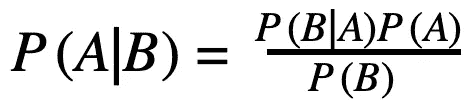

其中 A 和 B 是事件，P(A)和 P(B)是观察到这些事件的(边际)概率(其中 P(B) ≠ 0)，P(A|B)和 P(B|A)是条件概率(例如，给定 B 为真的 A 的可能性)。

“经典的”频率主义者 A/B 测试有许多替代方法，本文将重点介绍一种特定的贝叶斯方法，它可以标准化和自动化，类似于分裂测试:

> “A/B 测试的更智能版本”

[据《远见》中的 Kai Rikhye 所说](http://www.invisionapp.com/inside-design/let-go-a-b-testing)。

# 多臂土匪简介


Photo by [Steve Sawusch](https://unsplash.com/@stevesawusch?utm_source=medium&utm_medium=referral) on [Unsplash](https://unsplash.com?utm_source=medium&utm_medium=referral)

请记住，我们希望更逐步、更早地向我们认为可能更好的方案发展，从而降低勘探成本并增加开采回报——这是一个经典的权衡。这就像我们想知道在赌场玩哪个老虎机(独臂强盗)；如果我们知道每台机器的成功率，我们只会将资金投入到获胜概率最高的机器中，而完全忽略所有其他选项。然而，如果我们不知道这一点，我们需要探索各种选项，以估计所有机器的成功率，同时最大化我们可以从游戏中预期的总体(累积)回报。这个优化问题可以通过测试不同的选项并在可以观察到回报时强化它们来解决(因此出现了一个[强化学习](https://en.wikipedia.org/wiki/Reinforcement_learning)的问题)。然而，找到精确的解决方案是困难的。幸运的是，对于我们的用例来说，有足够的近似值。在本文中，我们将重点介绍一种叫做"[汤普森抽样](https://en.wikipedia.org/wiki/Thompson_sampling)"的方法，该方法由 William R. Thompson 早在 1933 年提出，其基础是从每个期权的[贝塔分布](https://en.wikipedia.org/wiki/Beta_distribution)中随机抽取样本，贝塔分布由每个期权过去的成功 *α* 和失败 *β* 的密度函数来参数化

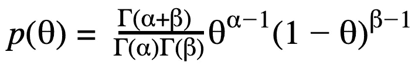

其中 *θ* 等于相应选项的成功率，*γ*表示[γ函数](https://en.wikipedia.org/wiki/Gamma_function)。贝塔分布的重要特性是平均值等于 *α / (α + β)* (成功率=成功/试验次数)，并且随着 *α + β* (试验次数)的增加，分布变得更加集中。因此，在给定抽取轮次中具有最高抽取样本的选项将被选择用于下一次试验，该选项可能具有高置信度的高成功率，并且可以被利用，或者它具有低置信度的任何成功率，并且仍然需要被探索。

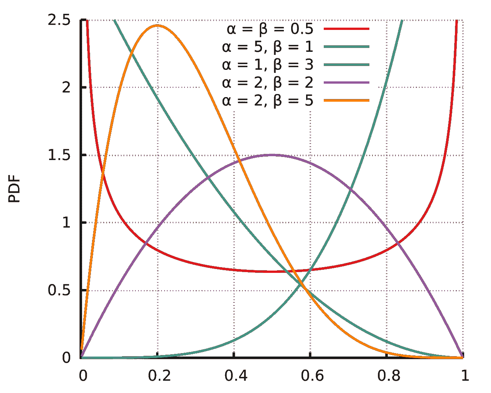

Probability Density Functions, Source: [https://en.wikipedia.org/wiki/Beta_distribution](https://en.wikipedia.org/wiki/Beta_distribution#/media/File:Beta_distribution_pdf.svg)

建立了一些理论之后，我们现在可以继续实际模拟测试不同变体的性能时的分割测试和多臂强盗的行为。

# 实验:分裂与强盗

# 设置

我们将测试两种不同的方法(卡方分割测试，以下称为“分割”和 Thompson beta bandit，以下称为“bandit”)，目的是通过从多个选项(例如不同的广告创意)中顺序地(在几个时期内，例如几天内)选择试验(例如向用户展示广告)，来最大化累积的成功(例如广告点击)。基于上述这些算法的不同性质，我们预期不同的结果取决于由以下变量控制的不同环境:选项的数量、这些选项的真实成功率、每个周期的试验、置信水平(最大 p 值)和成功率不稳定性(标准偏差)。在探索替代方案之前，我们将从一个有两个选项和固定成功率(无偏差)的简单环境开始。

# 基本模拟

基本实验甚至可以在[电子表格](https://docs.google.com/spreadsheets/d/1a2ss3cepB6apQTH16uDwIo3gZ9kWBSxQD7ijM3vbcp0)中模拟:

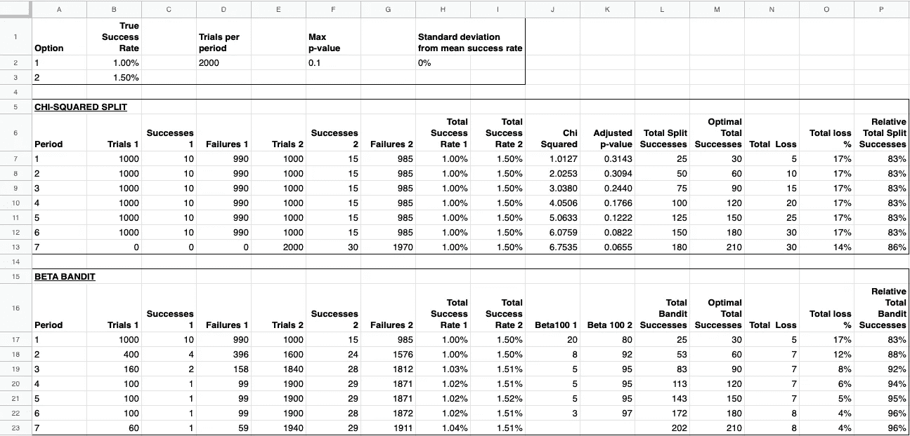

[https://docs.google.com/spreadsheets/d/1a2ss3cepB6apQTH16uDwIo3gZ9kWBSxQD7ijM3vbcp0](https://docs.google.com/spreadsheets/d/1a2ss3cepB6apQTH16uDwIo3gZ9kWBSxQD7ijM3vbcp0/edit#gid=0)

在该表中，环境参数设置在单元格 A1:I3 中。基于这些，在单元格 A5:P13 中计算拆分和前 7 个期间的决策和结果。如前所述，每个周期的所有试验将平均分布在选项上，直到可以宣布具有统计显著性的获胜者。对于具有两个选项的场景，真实成功率为 1%和 1.5%，没有偏差，每个周期 2，000 次试验，最大 p 值为 0.1 (90%置信度)，该方法在周期 6 之后检测选项 2 的更高成功率，并且从那时起仅试验该选项。L:P 列显示了总的、累积的成功以及与最佳情况的绝对和相对差异(损失),在最佳情况下总是选择了最佳选项。

单元格 A15:P23 用类似的方法计算强盗的这些值。为了可比性和实用性，该方法不是一次抽取一个样本并选择一个选项，而是通过周期性决策来实施，其中周期 t 中显示的选项的百分比等于它被基于周期 1 至 t-1 的数据构建的贝塔分布的 100 个随机样本选择的次数(所有周期的每个单独样本和选择可以在单元格 A25:R126 中看到)。有了上面描述的样本环境变量，我们应该找到更多的累积成功，因此与 Bandit 的最优选择相比，损失更小。这也可以通过分别绘制所有时期的绝对和相对成功来可视化:

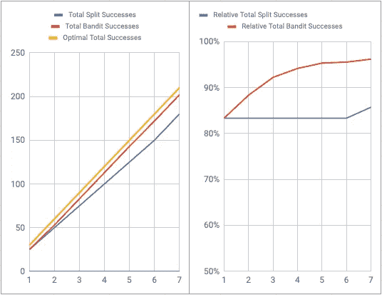

这里变得明显的是——至少在这个基本的模拟中——强盗在所有时期都支配着分裂。因此，让我们通过改变不同的参数来检验这一结果的弹性。您可以在提供的电子表格中按顺序完成这项工作，但由于我们想要应用的这种和未来的变化更容易用 Python 模拟编码，我们现在将转向这一点。

分割类以可用选项的数量、试验、成功和失败向量作为 [Numpy](https://www.numpy.org) 数组以及(当前)p 值开始:

```
class Split():
  def __init__(self, num_options):
    self.num_options = num_options
    self.trials = np.zeros(shape=(self.num_options,), dtype=int)
    self.successes = np.zeros(shape=(self.num_options,), dtype=int)
    self.failures = np.zeros(shape=(self.num_options,), dtype=int)
    self.p_value = 1.0
```

然后，我们需要一种方法将一个时期的结果(试验、成功和失败)添加到一个分割实例中:

```
def add_results(self, option_id, trials, successes):
  self.trials[option_id] = self.trials[option_id] + trials
  self.successes[option_id] = self.successes[option_id] + successes
  self.failures[option_id] = \
    self.failures[option_id] + trials - successes
```

最后，我们将重新计算当前状态的 p 值:

```
def calculate_p_value(self):
  observations = []
  for i in range(self.num_options):
    observations.append([self.successes[i], self.failures[i]])
  self.p_value = \
    chi2_contingency(observed=observations, correction=False)[1]
```

*chi2_contingency* 函数可以在 [SciPy 库](https://docs.scipy.org/doc/scipy/reference/stats.html)的 stats 模块中找到，它使用与上述电子表格相同的过程从给定的列联表中计算 p 值。

类似地初始化 bandit，只是我们不需要 p 值或故障向量，而是包括先验元组，该先验元组可用于利用现有先验信息创建 Bandit，以构建上述 Beta 分布:

```
class BetaBandit():
  def __init__(self, num_options):
    self.num_options = num_options
    self.prior = (1.0, 1.0)
    self.trials = np.zeros(shape=(self.num_options,), dtype=float)
    self.successes = \
      np.zeros(shape=(self.num_options,), dtype=float)
```

可以用与分割相同的方式添加结果(只是没有失败)。

现在，我们可以从所有选项的基本 beta 分布中选择一个选项作为最高采样值:

```
def choose_option(self):
  sampled_theta = []
  for i in range(self.num_options):
    dist = beta(self.prior[0] + self.successes[i],
                self.prior[1] + self.trials[i] - self.successes[i])
    sampled_theta += [dist.rvs()]
  return sampled_theta.index(max(sampled_theta))
```

beta 函数也是 SciPy 库的 stats 模块的一部分， *rvs()* 根据底层分布返回一个随机变量。

对于批量模拟，我们需要重复选择选项:

```
def repeat_choice(self, repetitions):
  option_counts = np.zeros(shape=(self.num_options,), dtype=int)
  for _ in range(repetitions):
    option = self.choose_option()
    option_counts[option] += 1
  return option_counts
```

然后，基本模拟充分运行到上面的电子表格示例:

1.  初始化分裂和强盗
2.  添加第一阶段的结果，并在所有选项中平均分配试验
3.  重新计算拆分的 p 值
4.  如果 p 值< max p-value: Add results to Split with equal distribution of trials over all options, else: Add results to Split with all trials for best option (with most successes)
5.  Choose batch options for Bandit and add results with distribution of trials as in choices
6.  Start again from 3.

The results are (almost, accounting for the randomness of the beta sampling) the same as already seen above:

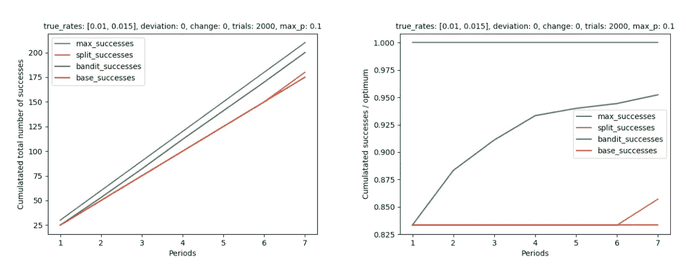

Before we continue with the elasticity experiments, let us examine 28 instead of 7 periods:


The long term differences between Split and Bandit are smaller since the Split finds the optimal option after the 6th period and after that allocates all trials to that option where the Bandit still occasionally tries the weaker option (although very sparsely). Still, also after 28 periods the Bandit has outperformed the Split.

Okay, you want to know if that changes after 100 periods? It does not:

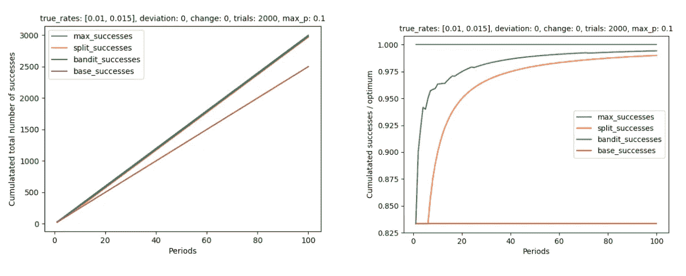

After this basic experiment, we want to take a final closer look at how the various simulation parameters affect the results before coming to a conclusion about when and when not to A/B test.

# **参数弹性**

## p 值

我们想分析一些环境参数对实验结果的影响，从不同的 p 值开始(回到 28 个周期的默认观察长度):

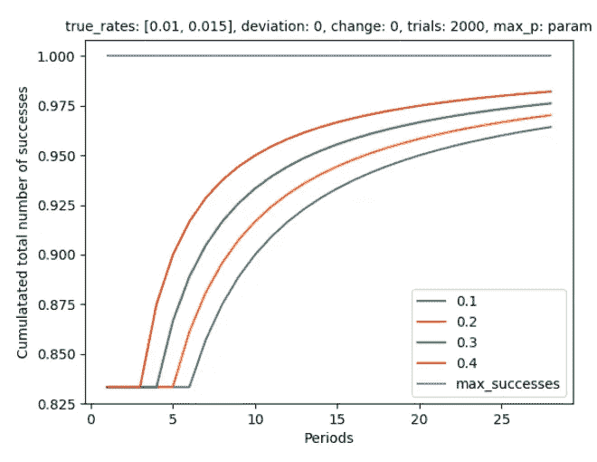

我们可以看到，p 值越高，结果越好(越接近最优值)。不过，我们必须小心，在我们的模型中使用更高的 p 值来得出结论，因为这将导致更多的假阳性(I 类错误)，从而增加选择次优选项作为“赢家”的风险。对于剩余的实验，我们将 p 值设置为 0.1，因为我们可以错误地拒绝变量之间无显著差异的零假设 10%。

## 审判

看看 Split(左)和 Bandit(右)的不同试验编号:

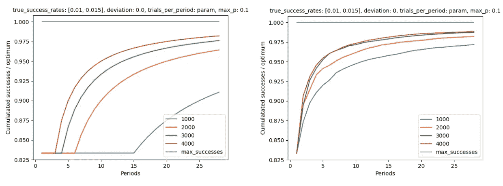

正如我们所预料的，更多的试验会导致对分割测试结果更高的信心，从而更快地找到最佳选择。对于这两种方法，我们可以观察到一个看似渐进的行为(更多试验的边际改善减少)。

## 成功率

虽然我们能够影响 p 值，也可能影响在现实世界中试图找到实现我们目标的最佳选项时的试验次数，但真正的成功率通常与我们的行动无关(这里不涉及 Schroedinger)。因此，这两种方法的区别在这里更为重要(同样，左边是分裂，右边是 bandit):

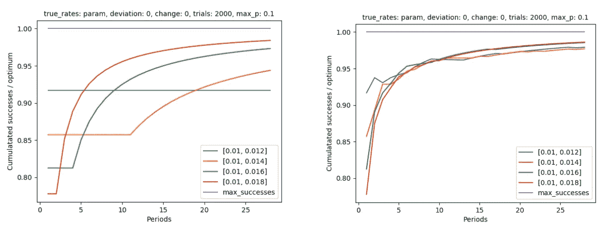

同样，这种分割是由强盗控制的，如果可用选项的实际成功率差异很小，情况就更是如此。在[0.01，0.012]的情况下，Split 甚至在 27 个周期之后都没有找到最优选项。

## 不确定

当真正的成功率不是完全不变的(在“真实世界”环境中很可能不是这样)，而是正态分布，标准偏差为平均值的 50%时，结果会发生相当大的变化:

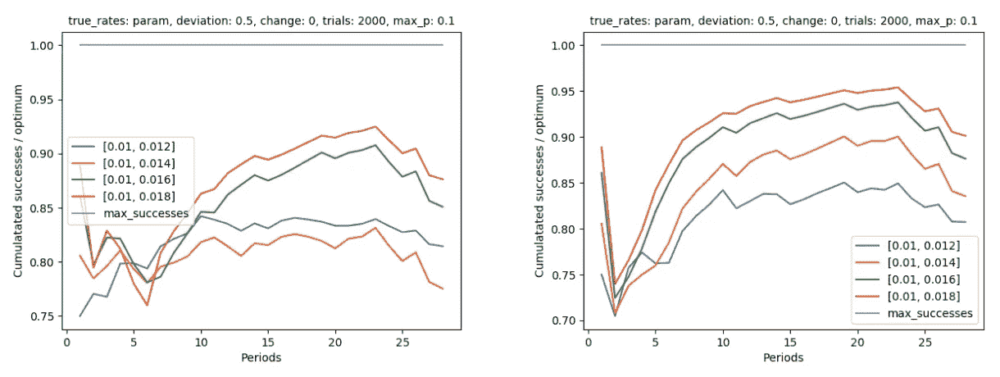

这些结果显然取决于诱发的[随机状态](https://docs.scipy.org/doc/numpy/reference/generated/numpy.random.RandomState.html)，在不同的状态下，它们可能看起来非常不同:

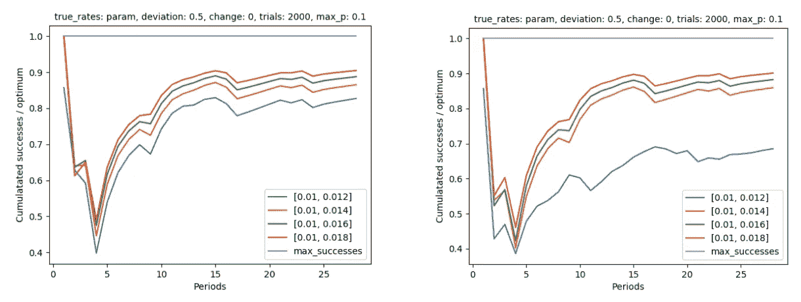

一般来说，在概率更大的环境中，强盗的优势不太明显。

现在让我们比较两种方法在不同不确定性水平(成功率标准偏差)下的结果:

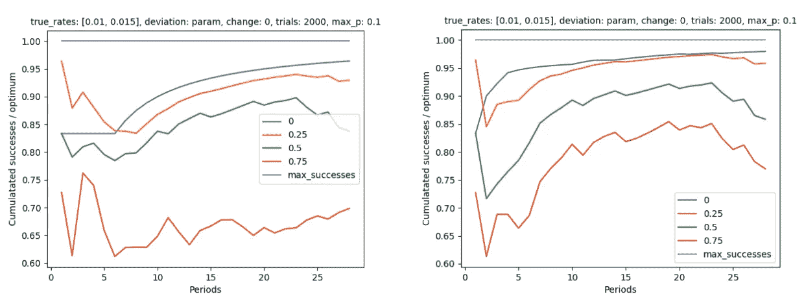

## 更多选项

最后但同样重要的是，我们想看看有两个以上竞争选项的场景。有 11 个不同的选项，平均分布的真实成功率在 1%和 2%之间，相对于最佳成功率的 Bandit 结果如下所示(左边是成功率无偏差，右边是平均值的 25%标准偏差):

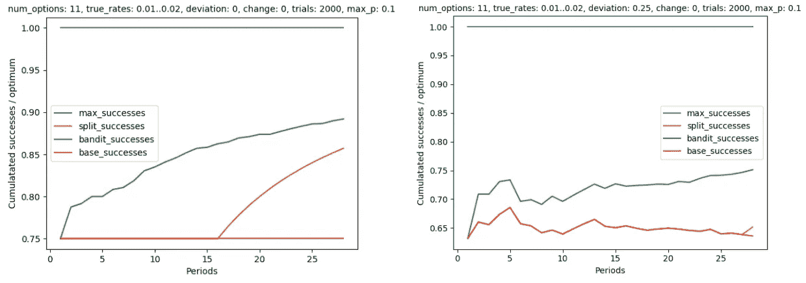

当有更多选择时，这两种方法都做得更差。不过，在 Split 找到最佳选择之前，Bandit 的表现远远超过它。然而，当实验运行的时间足够长时，最终结果看起来完全不同:

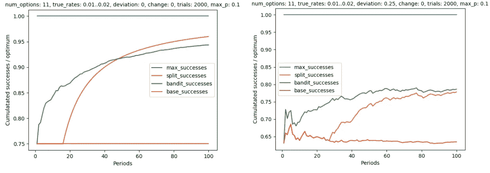

虽然分裂在确定性环境中击败了强盗，但强盗似乎更少受到引入的不确定性的影响，即使从长期来看也是如此。

# 真实世界的例子

这里的场景是一个数字广告活动，有 50 个不同的广告组合(选项)，随机(统一)分布的点击率(真实成功率)在 1%到 4%之间。点击率的标准差是它们各自平均值的 50%。将有 5000 个试验，每个试验将持续 28 个周期。我们将分割的 p 值保持在 0.1。结果如下:


从 8904 个可能的成功中，分裂得到 4346 个，强盗得到 3968 个。坏消息是，与每个时期的真实成功率已知的情况相比，这两种方法都留下了超过 50%的可能性。好消息是，这两种方法都将基本比率(3137 次成功)提高了至少 26%。

# 结论

要回答最初的问题“何时不使用 A/B 测试”:特别是当勘探成本高且短期开采重要时，和/或当处理不确定(即概率性)环境时，Bandit 在寻找和使用最佳选项并最大化效率方面提供了一个非常好的、更优越的选择。然而，当分割(A/B 测试)确信已经确定了最佳选项时，它可能会产生更好的结果。

因此，一个明显的结论和进一步研究/测试的开始可以是在混合模型中结合两种方法，使用 Bandit 直到分割置信度足够大(p 值小于定义的最大值)，然后利用分割将选项集减少到成功率最高的较少“赢家”,之后再次使用 Bandit 为下一期选择选项，直到分割的 p 值再次足够小，以此类推…

不过，还有一个我们尚未涉及的警告:期权的成功率及其分布可能会随着时间的推移而发生变化。如果是这种情况，我们可能根本不想减少可能的选项集，而是用任何新的观察结果灵活地调整我们的决策过程。由于分割的基础是基于限制选项，即确定赢家，这将极大地影响这种方法在这种环境下的拟合度。然而，Bandit 在每个新的观察(集合)之后更新其关于世界的信念，可以被构造来处理这样的行为，例如，通过引入折扣函数，当选择下一时段的优选选项时，减少旧结果的影响。为了简要强调拆分在改变成功率方面的缺陷，看一下比率意味着每周期增加或减少 5%的场景(实际上，例如，你可以想象由于受众发展，显示给一个特定受众的广告的点击率随着时间增加，例如，通过重新定位，而显示给另一个受众的广告的点击率由于饱和而下降):

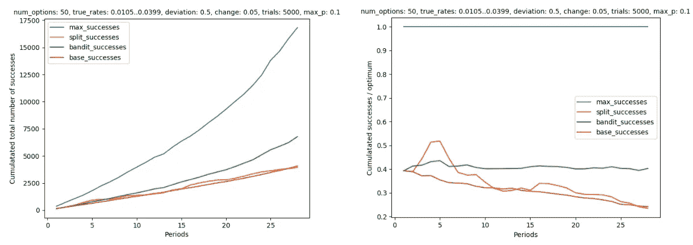

正如你所看到的，分割现在甚至不能超过随机基础分配了。土匪似乎几乎不受影响，虽然它可能会得到进一步改善，提到折扣旧的结果。

所以总而言之，

> 在测试不同变体或场景的性能时，Bandits 提供了您的首选方法

如果你还在使用 A/B 测试，你至少应该考虑转换。

在我离开你并期待收到你的反馈、评论和想法之前，我想感谢你陪我看了这么长而激烈的文章。作为一个小玩意，我为你们中任何想使用 Bandit 进行数字营销活动的人制作了一个广告优化工具:[**【optimizer.stagelink.com】**](https://optimizer.stagelink.com)

除此之外，你可以在我的 Github 上找到所有用于讨论模拟的代码:[**github.com/kinosal/optimizer**](https://github.com/kinosal/optimizer)

再次感谢，并尽快与您联系！