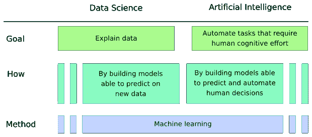

# 当商业分析遇到机器学习

> 原文：<https://towardsdatascience.com/when-business-analytics-meets-machine-learning-10ecaada9d8?source=collection_archive---------8----------------------->

## 对你的第一个数据科学项目有什么期望？商业指南。第三部分

Photo by [Olav Ahrens Røtne](https://unsplash.com/@olav_ahrens?utm_source=medium&utm_medium=referral) on [Unsplash](https://unsplash.com?utm_source=medium&utm_medium=referral)

*这是“从你的第一个数据科学项目中期待什么——企业指南”系列的第 3 部分。你可以在这里* *和* [*阅读之前的部分*](/data-science-vs-business-intelligence-same-but-completely-different-1d5900c9cc95) [*在这里*](/data-science-and-ai-for-business-data-analysts-64f28a5d7ff2)

> 在一家大公司听到的对话:
> 
> PMO:嘿，John，我们正在使用敏捷方法启动一个新项目，你愿意管理它吗？
> 
> IT 项目经理约翰:当然，没问题。你已经有所有的规格了吗？

商业惯例和习惯很难改变，尤其是在成熟的大公司。引入新的工作方式极其困难，但让人们以不同的方式工作几乎是不可能的。这些公司和商业行业普遍存在巨大的文化惯性。

使用机器学习是那些将使人们以不同方式工作并将在未来使商业环境不同的变化之一。此外，这是数据科学和业务数据分析之间的另一个巨大差异，因此对话很好地从[上一部分](/data-science-vs-business-intelligence-same-but-completely-different-1d5900c9cc95)开始。

今天，人们倾向于交替使用数据科学、人工智能和机器学习，因为我们生活在这些概念一起使用的历史时刻。但这并不意味着它们是一样的。其实都是不同的概念。

数据科学和人工智能是两个有自己实际目标的领域:首先寻求解释数据，而后者则自动化需要人类认知努力的任务。数据科学为企业提供了洞察力，并用于决策。AI 更多的是业务运营的自动化或者业务系统的维护。他们可能共享相同的模型，只是结果的使用使他们成为数据科学或人工智能。

机器学习本身不是数据科学或人工智能的一部分——只是一种让现代数据科学和人工智能发光的方法。这是一个通用的数学和软件开发概念，有些人将其视为[软件 2.0](https://medium.com/@karpathy/software-2-0-a64152b37c35) ，但我更愿意称之为示例驱动编程。

> 机器学习是一种对算法进行编程的方式，以我们想要的方式进行预测或行动，而不提供算法应该遵循的规则。相反，我们提供数据和期望的响应，并让计算机从提供的示例中自己学习这些规则。
> 
> **就是这样！这就是机器学习的整个概念。**

它与基于规则的编程完全相反，基于规则的编程主导着公司的 It 环境(以及一般的软件开发)。它是一种编程范式，其中程序被构建为计算机应该遵循以实现期望结果的配方。在商业环境中，这些配方被称为业务规则，它们通常由业务分析师设计和维护。

基于规则的方法有许多优点:规则可以被记录、审查，它们对人类来说是自然的，并且它们给人一种安全感。多年来，它一直很好地服务于大多数场景，包括商业智能。典型的 BI 报告是根据业务分析师设计的业务规则计算的，并在报告规范中明确列出。

Photo by [Nicolas Thomas](https://unsplash.com/photos/3GZi6OpSDcY?utm_source=unsplash&utm_medium=referral&utm_content=creditCopyText) on [Unsplash](https://unsplash.com/@nicolasthomas?utm_source=unsplash&utm_medium=referral&utm_content=creditCopyText)

然而，当没有人知道如何找出计算机要遵循的规则时，这种方法并不奏效。或者随着时间的推移，规则变得如此复杂，以至于失去控制，这种情况也经常发生。

> **在机器学习范式下，数据本身成为一种规范。**

这就是机器学习发挥作用的地方。代替规则，商业必须提供(通常，许多！)真实数据的例子。他们必须对数据进行预处理，通常包括基本的过滤和标记。例如，如果一个企业想要建立猫和狗的图像分类器，他们必须提供几千张来自他们真实业务实践的图像。他们还必须手动标记这些图像，告诉每张图像上是猫还是狗。

示例选择和标记是为 ML 算法指定期望行为的方式。这两者和为基于规则的解决方案设计规则一样重要，比如 BI。

> **“垃圾进，垃圾出”的概念也同样适用于机器学习。**

为训练机器学习模型准备数据仍然是人类的任务。在未来 ML 驱动的组织中，这将是业务分析师的新职责。他们将不再自己设计业务规则——他们将为机器学习算法设计训练场景，以学习这些规则。像以前一样，他们还将负责验证测试结果并签署解决方案以投入生产。

这一职业的变化将类似于几十年前商业分析师的情况，当时计算机取代了他们的手工计算。过去，有人担心公司不需要那么多分析师，但看看发生了什么——业务分析变得越来越复杂，现在需要更多的分析师。他们中没有一个人像前计算机时代的同事那样使用纸笔。这正是机器学习即将发生的事情。

> **机器学习不会让商业分析师变得多余，但会让他们与众不同。**

在引入人工智能和数据科学之前，这是商业领袖必须在整个组织中传达的一个非常重要的信息。

# 黑盒

还有一个重要的问题让人们对机器学习感到焦虑:大多数时候，通过机器学习计算的规则无法转换回人类可以理解的格式。这些规则只是数字的数组，可以是巨大的，达到数百万个值。这对人类来说太多了，难以消化，也看不到它们背后的任何意义，这就是为什么大多数机器学习算法被视为黑盒。

Photo by [Christian Fregnan](https://unsplash.com/photos/ewiYQxLTGEU?utm_source=unsplash&utm_medium=referral&utm_content=creditCopyText) on [Unsplash](https://unsplash.com/search/photos/box?utm_source=unsplash&utm_medium=referral&utm_content=creditCopyText)

在 XAI(可解释的人工智能)倡议下，人们试图使它们更加透明，但它们往往有一个根本的缺点:

> **为了解释机器学习，XAI 的方法使用了更多的机器学习。**

这些技术更多的是描述而不是解释。正如 [Cassie Kozyrkov](https://hackernoon.com/explainable-ai-wont-deliver-here-s-why-6738f54216be) 精彩指出的那样——可解释的人工智能只是提供了一个不完整灵感的良好来源。在复杂的 ML 算法中建立信任的唯一方法是仔细测试，而不要求完全理解它是如何做出决策的。因此，从 ML 算法中获取业务规则是没有希望的。

> **企业喜欢他们的规则！他们不喜欢用信任来取代它们的想法，即使这种想法得到了全面测试的支持。**

希望将数据科学，尤其是人工智能引入其业务的领导者必须考虑到这一点。机器学习很可能会随之而来，当人们不信任算法并希望大量手动控制破坏人工智能自动化的整体理念时，它可能会在内部遇到阻力。

要求明确的规则只是商业运作中的习惯和传统，从人类执行商业规则的时候就出现了。今天，业务操作基本上是自动化的，它们以人类可读的格式编写的唯一原因是它们是由人类设计的。随着机器学习的采用，商业规则不再必须是人类可读的。这将只是一个信任的问题，企业必须学会赢得人工智能竞赛。

The remains of the Roman Forum, the birthplace of the modern civilisation. These structures were built without structure analysis theory. They were built on trust in the architect’s practical experience and best practices of the time. Image by [jacqueline macou](https://pixabay.com/users/jackmac34-483877/?utm_source=link-attribution&utm_medium=referral&utm_campaign=image&utm_content=2364234) from [Pixabay](https://pixabay.com/?utm_source=link-attribution&utm_medium=referral&utm_campaign=image&utm_content=2364234)

还有许多其他重要的领域，在那里实践先于理论，在那里人们习惯于在找到所有为什么的答案之前相信测试:土木工程、制药工业、神经科学等等。例如，在 20 世纪结构分析的理论模型被广泛采用之前，土木工程是基于建筑师几千年的实践经验。归根结底，神经科学仍然无法解释我们的大脑是如何做出决定的。

# 摘要

机器学习与数据科学和人工智能密切相关，这意味着也必须考虑它的影响。当人工智能和机器学习被引入商业运营时，这些影响可能会对既定的商业文化构成挑战:

1.  机器学习不是基于规则的，因此传统的商业规则在基于机器学习的解决方案中不起作用
2.  机器学习是示例驱动的。为了“训练”算法以期望的方式运行，企业必须提供一组来自其真实实践的相关数据示例。
3.  大多数机器学习算法缺乏商业规则的透明性
4.  机器学习不会让商业分析师变得多余，但会让他们与众不同

这些暗示在使用机器学习时自然会造成一种对商业运作失去控制的感觉。商业中的下一个自然反应将是通过放置多个手动“旧式”控制来破坏人工智能自动化的整个想法，从而补偿这种损失。

避免这种情况的最佳方式是通过仔细和多样的测试来培养对机器学习解决方案的信任。对于商业和数据科学家来说，这都是一项艰巨的工作，尤其是在人工智能旅程的开始，但为了在商业中成功采用人工智能和数据科学，需要完成这项工作。

就像几十年前计算机被引入工作场所一样，将人工智能自动化成功引入商业运营不会对商业分析师构成威胁。这将使他们变得与众不同，更有效率…最终

*你可以在*[*LinkedIn*](https://www.linkedin.com/in/maxim-scherbak/)*[*Twitter*](https://twitter.com/MaximScherbak)*[*脸书*](https://www.facebook.com/MaxScherbak/) 上找到我**