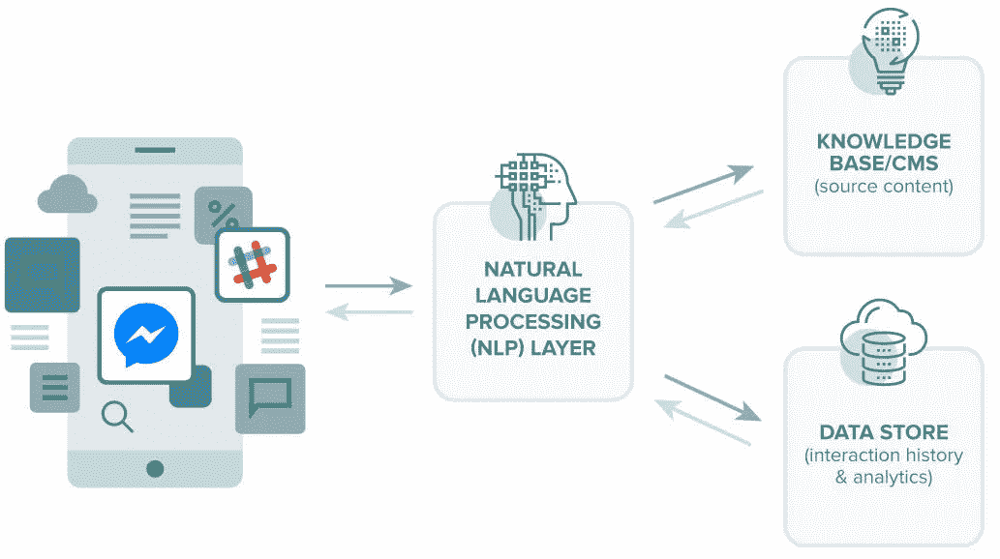
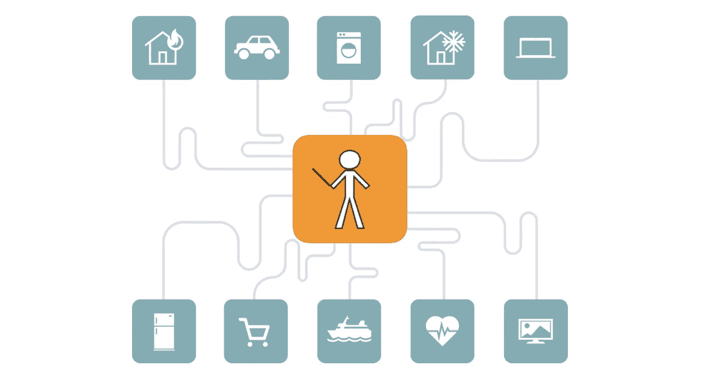
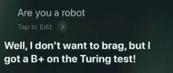
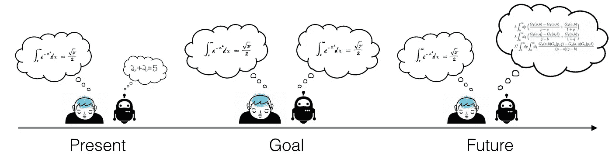
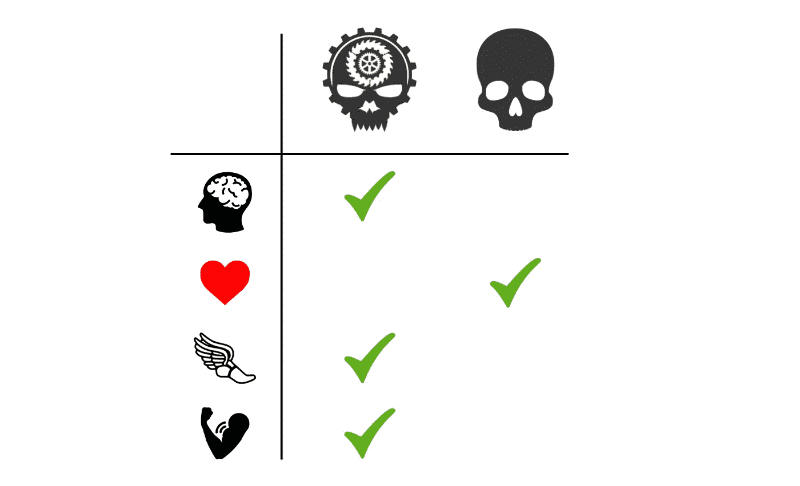

# 什么时候可以和机器进行有意义的对话？

> 原文：<https://towardsdatascience.com/when-can-i-have-a-meaningful-conversation-with-a-machine-part-1-655fefa20f45?source=collection_archive---------25----------------------->

## 我多久能取代我的朋友？

Joaquin Phoenix in [Her (2013)](https://www.imdb.com/title/tt1798709/)

现在几乎每个网站都用聊天机器人来问候你。由于自然语言处理(NLP)和深度学习的进步，它们从具有有限对话能力的简单程序到智能的、具有对话能力的机器人。

一些众所周知的例子是:

*   **聊天机器人**(简单): [Cleverbot](https://www.cleverbot.com/) ， [Smarterchild](https://en.wikipedia.org/wiki/SmarterChild)
*   **虚拟助手**(高级):Siri、Alexa、Cortana、谷歌助手
*   **真实机器人**(前沿):[索菲亚](https://www.youtube.com/watch?v=lCFQkB-KLsE)，第一个被授予沙特公民身份的机器人

尽管这些机器人的复杂性差异很大，但有一点是肯定的:**它们正在变得更好。有一天，对他们说话可能和对另一个人说话没什么区别。这就引出了一个问题——有没有一天我们能够像和其他人一样和机器人进行有意义的对话？**

为了回答这个问题，我们要看看:

1.  *我们今天在哪里*
2.  *我们要去哪里*
3.  *图灵测试和一般智力*

让我们开始吧:

## 我们今天所处的位置:

> 聊天机器人自 1966 年就存在了。从卑微的文本开始，到采用声音和神秘的面孔，他们已经在各种行业中充当信息经纪人。

最近，聊天机器人获得了媒体的 [关注](https://www.theguardian.com/technology/2016/sep/18/chatbots-talk-town-interact-humans-technology-silicon-valley)中的[很多](https://www.hubspot.com/stories/chatbot-marketing-future) [，这并不奇怪，因为它们是迄今为止人工智能最“人类”的面孔。但是，这个包罗万象的术语背后的机器人如何工作有很大的差异。](https://chatbotsmagazine.com/)

虽然相对简单，聊天机器人在响应常见的结构化查询方面做得很好。NLP 的最新进展，其中许多都基于聪明的深度学习技术(如 GloVe、Word2Vec、 [ELMo 和 BERT](http://jalammar.github.io/illustrated-bert/) ),让这些机器人对语言有了更细致的理解，从而能够更有效地应对更广泛的问题。

然而，这些机器人的主要用途不是进行对话，而是作为一种处理和交流信息的手段。我们可以问简单的问题，他们给出简单的回答。

Credit: WordStream

这一趋势将继续下去。至少在不久的将来，这些机器人的目的仍然是作为信息的管理者。

然而，随着物联网世界变得[更加普遍](/iot-machine-learning-is-going-to-change-the-world-7c4e0cd7ac32)，这些机器人可能会演变成我们与互联世界沟通的媒介——人和机器之间的中间人。

这种未来的证据已经存在。

## 我们的前进方向:

最普遍的具有对话能力的人工智能的例子是虚拟助手。Siri、Alexa、Cortana 和 Google Assistant 已经走出了我们的手机，进入了我们的家庭。他们识别和处理自然语言查询的能力(*“开灯”“昨晚比赛的最终比分是多少”“点两吨奶油玉米”*)越来越令人印象深刻。

我们已经看到了聊天机器人+物联网互动的第一波浪潮，其采用率令人震惊。根据这篇文章，超过 3900 万美国人拥有声控智能音箱。这证明了人们发现了自然语言命令的价值，消除了学习新软件和 UI 来完成工作的需要。

随着时间的推移，我们将能够仅仅通过一个命令来协调我们周围的世界——想想托尼·斯塔克和贾维斯。

有一天，我们将能够仅仅通过声音的力量来命令网络物理物体执行我们的命令。

然而，机器人的角色仍然没有改变:一个处理和传递信息的仆人。但是，我们正在取得进展。按照这种速度，NLP 和 AI 最终将发展到这样一个地步，即与机器人说话就像与另一个人说话一样自然，我们可能不会仅仅将它们视为工具，而是视为同伴。根据定义，像这样的机器人将通过图灵测试。从这里开始，事情变得更加理论化，更加投机。

## 图灵测试

> 阿兰·图灵于 1950 年发明的图灵测试是一种测试机器表现出与人类同等或不可区分的智能行为的能力的测试

这项测试最初被设计用来判断纯文本对话——不需要语音或面部表情。与传统考试不同，没有严格的评分标准或评分系统；图灵测试可以作为一个有用的基准来衡量我们目前的进展。

Siri

艾伦·图灵最初想出了他著名的测试，这是他思考这个问题的结果:

***机器会思考吗？***

双方都提出了可信的论点(我们将在第 2 部分中探讨)。然而，可以认为思考的行为与*无关。机器是否需要理解我们说的话才能做出适当的反应，或者只是知道说些什么作为回应，而不真正理解它们的话的意思？许多人认为是后者，这一观点建立在智力只是物理系统中的信息处理，不需要“思考”的基础上。*

一个有点类似的问题可以这样提出:深夜谈话——关于生活、宇宙、欲望、动机、灵性的谈话——需要来自一个有生物学动机的、有思想的生物吗？或者一台机器可以和我们一起沉思，从它的[内部现实模型](http://www.deewhock.com/essays/internal-model-of-reality)中插入洞察力？

这些问题深得惊人。什么是“有意义的谈话”的答案取决于对对方有什么要求，因人而异。有些人乐于独白，只需要对方还在听的周期性肯定。然而，其他人需要他们的问题、意见和新观点的答案来帮助引导他们的思想。虽然有些人很容易满足，但大多数人属于第二类。此外，要让一台机器对如此复杂的对话做出有意义的贡献，它需要具备一般的智能。

## 普通智力

> 人工通用智能(在这篇令人惊叹的[博客文章](https://waitbutwhy.com/2015/01/artificial-intelligence-revolution-1.html)中有所解释)，是一个用来描述具有与普通人类同等智能的机器的术语。这意味着跨越所有领域——解决问题、推理、学习能力、艺术欣赏、对科学的理解、幽默等等

换句话说，一个通过图灵测试*的机器人愚弄了*你，让你相信它是，这个机器人真的是。然而，并不是一般智力的每个方面都与我们的问题相关。它与我们唯一需要的共同点是:

1.  *复杂的现实内部模型*
2.  *流体推理*
3.  *工作记忆*

这些(或多或少)是赋予人类谈论抽象、宏大和主观话题的能力的基本要素。我们谈论宗教、情感、艺术、意义和其他“人类”价值的方式纯粹是基于我们的大脑对我们周围世界的解释，以及我们如何通过这种理解进行推理。毫不奇怪，一台机器需要做同样的事情，以一种有意义的方式为这样的讨论做出贡献，至少是一种我们可以联系的方式。

We want to get to the point where a machines “world view” and ours align in complexity

但是，即使这三个条件都满足了，还有另一个障碍。一个拥有和我们一样的知识和推理能力的人工通用智能，处理速度还是会高很多。由于我们的生物大脑和计算机芯片的处理速度之间的差异，这个机器人可能在几分钟内完成多年的思考。在这一点上，对话变得毫无意义了吗？是的，甚至可能很无聊。未知的美，以及寻找答案的美。咨询神谕剥夺了探索问题的乐趣。

> 理论上，为了有效地与我们交流，高级智能可以表现得比现在更沉默，就像人类使用简单的语言和手势与动物交流一样。在这种情况下，与机器进行有意义的对话是可能的。如果你曾经拜访过心理学家，你会很快意识到他们不只是直截了当地告诉你答案，而是引导你通过他们对你当前状态的分析，并帮助你找到解决方案，理论上机器也可以做到这一点。

请放心，在今天的世界上，这样的事情是不存在的；差远了。我们人类(更确切地说，我们的大脑)是我们所知道的唯一普遍智能的*事物*(没什么说人工普遍智能需要以同样的方式远程观察或工作)。

简而言之，要让一台机器与我们进行有意义的对话，它需要像我们一样了解，有相同的推理水平，但也以相同的速度思考。这样的甜蜜点几乎不可能达到，更不用说持续下去了。进步是指数级的，即使有一天这样的机器存在，也很快会被超越。

Machines will likely be far superior than we are in too many ways to “relate” to us

所以，这就是我们的答案。这可能令人失望，但如果没有高级智能故意降低自己的幻觉，我们的机器人伙伴*可能永远不会处于这样一个位置，即我们可以认为自己在智力上足够相似，可以进行有意义的对话。*

## 结论

今天的技术无疑是未来机器人伴侣的先驱。虽然我们可能不知道意识到底是什么，也不知道机器是否能体验到它，但回答“我们什么时候能与机器进行有意义的对话”这个问题可能无关紧要。

由于人和机器在所有智力因素上的差异，我们不可能有一天能和机器人进行有意义的对话。然而，这并不妨碍我们与他们建立有益的关系。正如我们与其他物体——汽车、房子、其他具有实用价值或情感价值的财产——有联系一样，我们的人工智能朋友有一天也可以成为这个列表的一部分，并为我们个人和社会占据特殊的位置。

所以，总之，你现在最好还是交真正的朋友。

> 这是两部分故事的第一部分。第 1 部分旨在回答标题问题；第 2 部分将更深入地关注机器思维、情感和意识的哲学。如果你还有兴趣，可以去看看。

感谢阅读！