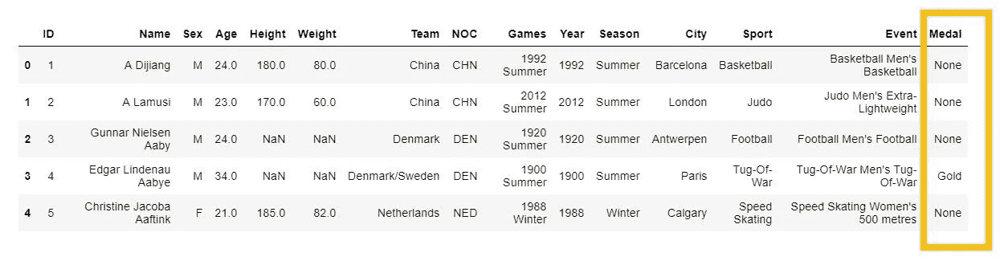
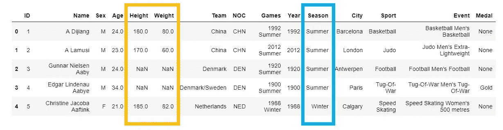
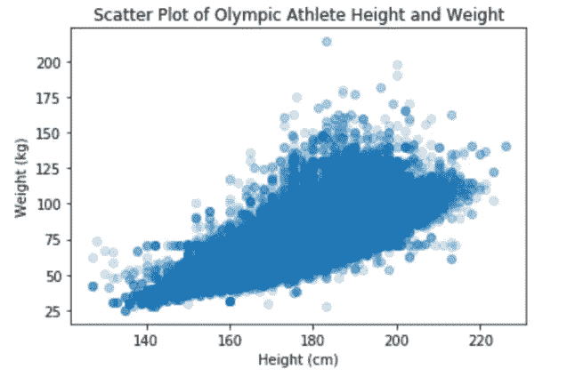
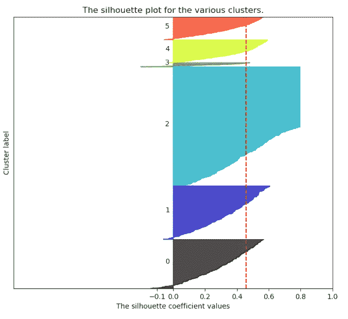
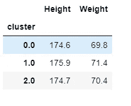

# 当聚类没有意义时

> 原文：<https://towardsdatascience.com/when-clustering-doesnt-make-sense-c6ed9a89e9e6?source=collection_archive---------2----------------------->

[Source](https://pixabay.com/illustrations/space-science-fiction-cosmos-911785/)

## *聚类前的考虑事项*

聚类是最广泛使用的无监督学习形式之一。这是一个很好的工具，可以理解未标记的数据，并将数据分组到相似的组中。一个强大的聚类算法可以破译结构和模式，在一个数据集中，不明显的人眼！总的来说，聚类是一个非常有用的工具，可以添加到您的数据科学工具包中。

但是，聚类并不总是适合您的数据集。如果您有兴趣尝试使用聚类进行无监督的机器学习，请遵循以下五个简单的指南，看看聚类是否真的是适合您的数据的解决方案:

# **1。您的数据是否已经有了潜在的类别标签？**

在数据中使用现有的类标签通常比尝试通过聚类为数据创建新标签更好。如果你可以选择，有监督的机器学习在分类任务中几乎总是胜过无监督的学习。

For this Olympic athlete data, the Medal attribute is an obvious choice for a class label.

如果您有数据，但无法将数据组织成有意义的组，那么集群就有意义。但是，如果您的数据集中已经有一个直观的类标签，那么由聚类分析创建的标签的性能可能不如原始的类标签。

# **2。你的数据是分类的还是连续的？**

许多聚类算法(如 DBSCAN 或 K-Means)使用距离度量来计算观察值之间的相似性。因此，某些聚类算法在处理连续属性时会表现得更好。但是，如果有分类数据，可以对属性进行一次性编码，或者使用为分类数据构建的聚类算法，如 K-Modes。应该注意，计算二进制变量之间的距离没有太大意义。

了解不同的聚类算法在不同的数据类型上的表现对于决定聚类对您的数据是否有意义是至关重要的。

Height and weight are continuous attributes while Season is a categorical attribute.

# **3。你的数据是什么样的？**

通过散点图对数据进行简单的可视化，可以深入了解数据是否非常适合聚类。例如，下面是奥运会运动员身高和体重的散点图。很明显，这两个属性有很强的正相关性，除了一些异常值之外，形成了一个密集的中心分组。

Scatter plot for height and weight

在对这些数据运行了几个聚类算法之后，没有形成明显的或有意义的组，并且确定这些属性不太适合聚类！然而，通过在分析的早期简单地可视化数据，这个结论可以更快地得出。

如果可视化显示您的数据没有大量的分离或不同的组，那么聚类可能不合适。

# **4。你有办法验证你的聚类算法吗？**

为了信任聚类分析算法的结果，您必须有一种测量算法性能的方法。可以使用内部或外部验证指标来验证聚类算法的性能。

内部验证的一个例子是剪影得分，这是一种衡量每个观察值聚集程度的方法。轮廓图显示了聚类的相对大小、平均轮廓得分以及观察值是否被错误地聚类。下图中的红线表示六个聚类的平均轮廓分数:大约 0.45(1 表示完美，0.45 不是很好的分数)。

Silhouette plot using [K-Means](https://scikit-learn.org/stable/auto_examples/cluster/plot_kmeans_silhouette_analysis.html#sphx-glr-auto-examples-cluster-plot-kmeans-silhouette-analysis-py) for Olympic athlete data

外部验证的一个例子是，数据集的类标签是已知的，但您想要测试特定的聚类分析算法在预测现有类时的表现如何。对外部验证方法的一个值得注意的警告是，如果数据已经有了类标签，就没有很大的聚类用例！

要对您的机器学习模型有信心，您必须有一个一致的衡量模型性能的指标。集群也不例外。您必须有一种方法来定量评估模型对数据的聚类效果。

在进行聚类分析之前，考虑哪种类型的验证和哪种指标对您的数据最有意义。某些算法可能在某些验证指标下表现得很好，因此您可能需要使用性能指标的组合来消除这个问题。如果您的模型性能一直很差，那么聚类就不适合您的数据。

# **5。聚类是否提供了对数据的新见解？**

假设您满足了上述所有考虑因素:您有没有类标签的连续数据，您将数据可视化并且有一些分离，并且您选择了对您的分析有意义的验证度量。您对数据运行聚类算法，并获得相当高的轮廓分数。激动人心！不幸的是，你的工作还没有完成。

执行聚类分析后，检查单个聚类中的观察结果至关重要。这一步允许您评估集群是否提供了对数据的任何新见解。该算法真的找到了相似的观察组并最大化组内相似性，同时最小化组间相似性吗？

检查聚类的一种简单方法是计算每个聚类中观察值的简单统计量，例如平均值。下面是作为 K-Means 聚类结果的三个聚类的平均奥林匹克运动员身高和体重。

Individual Cluster Means

注意到什么奇怪的事了吗？平均身高和体重几乎相同。这表明，虽然该算法确实对数据进行了聚类，但这些聚类彼此之间并没有实质性的不同！如果聚类无法对您的数据产生任何新的或有用的见解，那么您的数据不太适合聚类。

# **结论**

与任何数据科学任务一样，你不能只向数据扔算法。你必须了解你的数据，了解算法的初衷。即使您的数据不太适合聚类，您仍然可以尝试一下。探索你的数据永远不会有坏处，你永远不知道；你可以学到新的东西！

感谢阅读。用作示例的数据集可以在[这里](https://www.kaggle.com/heesoo37/120-years-of-olympic-history-athletes-and-results)找到。请随时留下任何建设性的反馈或与我联系！