# 当数据稀缺时…获取有价值见解的方法

> 原文：<https://towardsdatascience.com/when-data-is-scarce-ways-to-extract-valuable-insights-f73eca652009?source=collection_archive---------12----------------------->


Photo credit: Pixabay

## [现实世界中的数据科学](https://medium.com/towards-data-science/data-science-in-the-real-world/home)

## 描述性统计、探索性数据分析和自然语言处理(NLP)技术来理解您的数据。

最近，我偶然发现滑铁卢地区的[开放数据](https://rowopendata-rmw.opendata.arcgis.com/)项目及其信息自由请求数据集。我的同事[斯科特·琼斯](https://medium.com/u/7ec43ca7275c?source=post_page-----f73eca652009--------------------------------)已经在一系列[帖子](https://towardsdatascience.com/@scottcurtisjones)中使用机器学习(ML)技术对其进行了分析。ML 表现不佳是因为数据不足。虽然斯科特做了在这种情况下应该做的事情，即*找到更多数据*，但我很好奇这些数据还能告诉我什么，尽管很少。毕竟数据*总有*有价值。

在我带你进入这个 8 分钟的阅读之旅之前，我应该让你知道在 github 上的 jupyter 笔记本有所有的代码和更多关于这些数据的见解，所有这些都不能在这里讨论。如果你不想看笔记本，全套的图形结果可以在这个[文件](https://github.com/brodriguezmilla/foir/blob/master/foir_all_figures.pdf)中找到。

在这里，我向你展示一些分析的要点。

# 了解数据

为此，我们使用了 pandas 库，下面是在 Open Data 中找到的一个文件的样子:

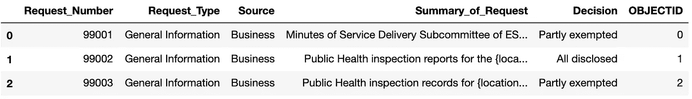

Sample of the 1999 Freedom of Information Request File

我们有 26 个文件，每年一个，从 1991 年到 2016 年，总共有 902 个请求，令人惊讶的是，所有的请求都有相同的 6 列。我们将只处理三个主要列，*源*、S *请求摘要、*和*决策。*

*   *来源。这是提出请求的实体，也称为*请求者*。通过查看多年来的信息，我能够将这些类别合并为“业务”、“个人”、“代理人的个人”、“媒体”、“代理人的业务”和“受抚养人的个人”。*
*   *请求摘要。*包含请求，该请求已经由职员编辑。
*   *决定。*合并后的类别为:“所有信息披露”、“部分信息披露”、“无记录”、“请求撤销”、“部分不存在”、“无信息披露”、“已转让”、“已放弃”、“拒绝更正”、“批准更正”、“无额外记录”和“提交异议声明”。

这些列是如何关联的？

# 描述性统计和探索性数据分析

在本节中，我们将重点关注列*来源*和*决策*。稍后，我们将使用一些 NLP 工具来分析这些请求。以下是数据的分布情况:

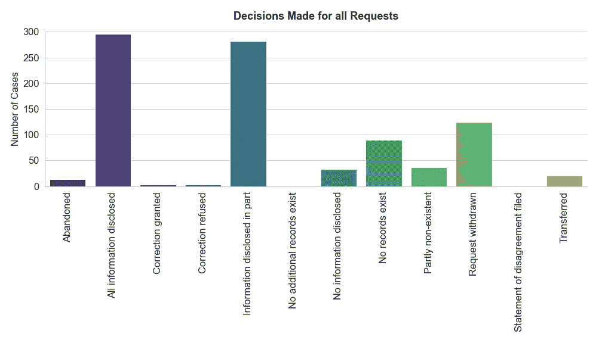

大约 64%的请求是“全部信息公开”或“部分信息公开”。少于 25 个实例的决策有六种类型。一种重要的类型，“没有信息披露”，只占 4%。因此，我们不仅只有有限的数据，我们还有一个不平衡的案例。这对 ML 来说看起来不太好。

从数据的另一个角度来看，*源*对*决策*，我们看到大多数请求是由“企业”、“个人”和“个人代理”发出的。

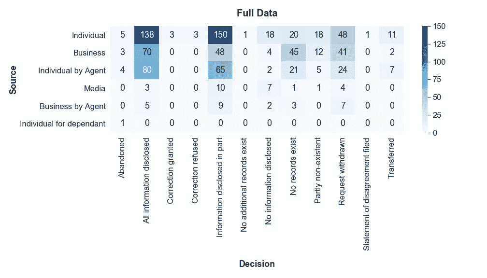

将每个来源的这些数字标准化，即每行加 1，我们看到三个主要来源的情况都很好，因为“所有披露的信息”都超过 30%，而“部分披露的信息”又增加了 20%至 36%，使它们超过 50%。还有，‘代理个人’比‘个人’成功率高。“媒体”的请求很少，表现不佳，只有 12%的请求得到了“所有信息披露”。

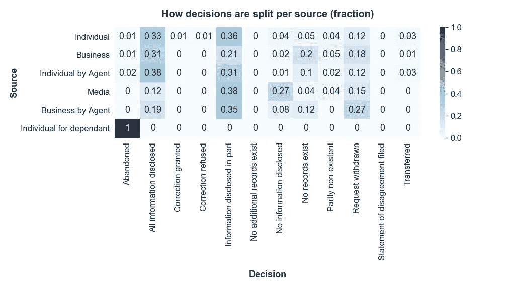

# 自然语言处理

现在我们开始分析实际的'*请求概要'*。为此，我们求助于自然语言处理库，如 NLTK 和 spaCy，以及 scikit-learn 的帮助。

概括地说，在分析任何文本之前，有几个步骤需要做(见 Susan Li 的[帖子](/topic-modelling-in-python-with-nltk-and-gensim-4ef03213cd21)):

*   将文本标记化:将文本分成单个特殊实体/单词，即标记。
*   删除任何不需要的字符，如回车符' \n '和标点符号，如'-'、'…'、' " '。
*   删除 URL 或用一个单词替换它们，例如“URL”。
*   移除屏幕名称或用一个单词替换“@”，例如“屏幕名称”。
*   删除单词的大写。
*   删除包含 *n* 或更少字符的单词。这种情况下， *n = 3* 。
*   去除*停用词*，即语言中意义不大的词。这些词可能对我们的文本分类没有帮助。例如“a”、“the”、“and”等单词。没有一个通用的停用词列表。
*   词元化，这是将一个单词的词尾变化形式组合在一起的过程，这样它们就可以作为一个单独的项目进行分析，通过单词的词元或词典形式来识别。

因此，在编写了单一用途的函数之后，我们可以用

```
def prepare_text_tlc(the_text):
    text = clean_text(the_text)
    text = parse_text(text)
    tokens = tokenize(text)
    tokens = replace_urls(tokens)
    tokens = replace_screen_names(tokens)
    tokens = lemmatize_tokens(tokens)
    tokens = remove_short_strings(tokens, 3)
    tokens = remove_stop_words(tokens)
    tokens = remove_symbols(tokens)
    return tokens
```

由于我们将不断地处理这些文本，我们只是将这些预处理过的文本作为一个新列“Edited_Summary”添加到数据帧中。

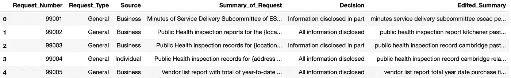

## **N-grams 和 WordCloud**

我们还能如何分析和可视化我们的文本？作为第一步，我们可以找到哪些单词和短语是最常用的，即，我们可以获得单个单词(单个单词)和一般的 n 个单词(n 个单词的组合)及其在文本中的频率。

```
def display_top_grams(gram, gram_length, num_grams):

    gram_counter = Counter(gram)

    if gram_length is 1:
        name = 'unigrams'
    elif gram_length is 2:
        name = 'bigrams'
    elif gram_length is 3:
        name = 'trigrams'
    else:
        name = str(gram_length) + '-grams'

    print("No. of unique {0}: {1}".format(name, len(gram_counter)))for grams in gram_counter.most_common(num_grams):
        print(grams)
    return None
```

所以对于我们的单字来说，


并使用 [WordCloud](https://amueller.github.io/word_cloud/) :

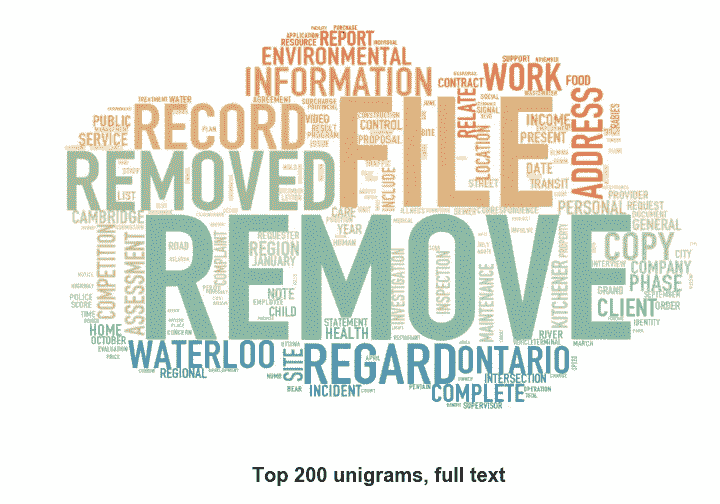

那么为什么‘移除’这个词如此突出呢？事实证明，出于隐私原因，原始请求上写的所有姓名、日期和位置都已被删除，并在开放数据文件中替换为诸如“位置已删除。}”或“{删除日期}”。这个有 30 多种变化。使用正则表达式(regEx)来清理文本，我们得到了一个更好的词云。这一次，我们也将允许二元模型。


看着上面的单词云和三元模型，

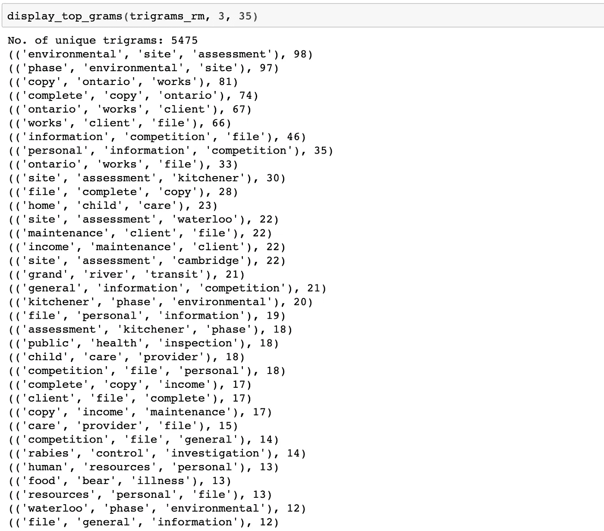

我们看到有一些常见的短语，如“安大略省工厂”、“环境现场”、“格兰德河运输”、“狂犬病控制”、“公共卫生”、“家庭儿童(护理)”和“食物中毒”(如在*“食源性疾病”*——记得我们对我们的令牌进行了词条化)。那么，这些短语在我们的文本中有多常见呢？用这样的短语请求信息会决定请求被批准的机会吗？事实证明，我们的数据中有 34%是这种类型的请求，只有很少一部分是“无信息披露”的决定，而且有明显的趋势:

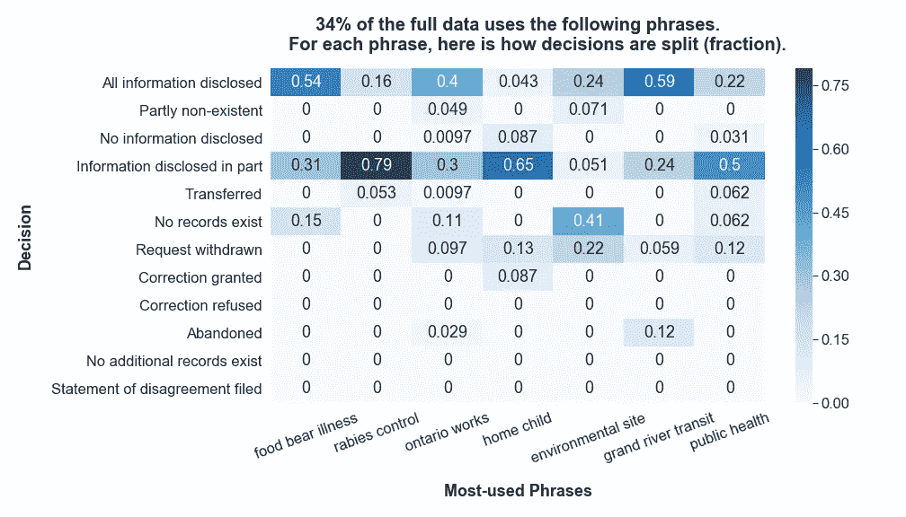

例如，*“狂犬病控制”*有 95%的病例全部或部分公开，而有 5%的病例被转移。

## 请求摘要和已编辑摘要统计

我们已经知道我们的数据量是有限的，但是*有限*有多少呢？嗯，全文超过 100 字的请求只有 7 个，标记化文本只有 1 个。尽管中值是 14，但全文平均每个请求 18 个单词，而标记化文本平均 8 个单词，中值是 6。

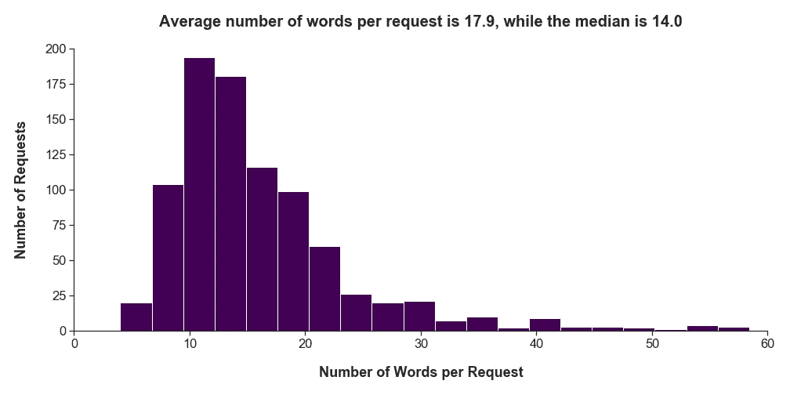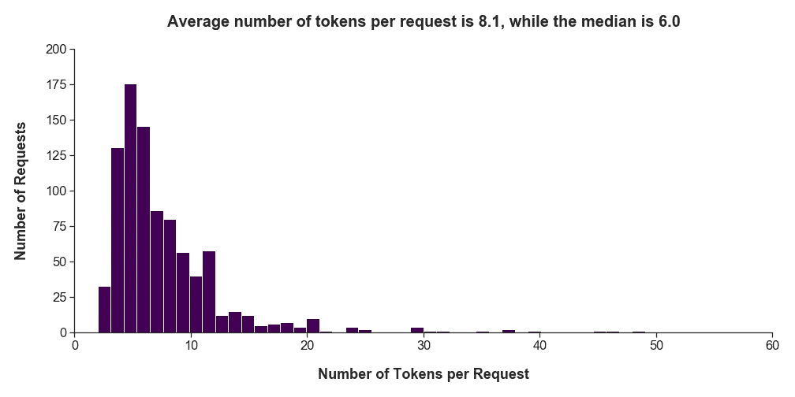

## 词性标注

这里我们使用空间来标识我们的文本是如何由名词、动词、形容词等组成的。我们还使用函数 *spacy.explain( )* 来找出这些标签的含义。

```
full_text_nlp = nlp(full_text)    # spaCy nlp()tags = [] for token in full_text_nlp:
    tags.append(token.tag_)tags_df = pd.DataFrame(data=tags, columns=['Tags'])print("Number of unique tag values:\
      {0}".format(tags_df['Tags'].nunique()))
print("Total number of words: {0}".format(len(tags_df['Tags'])))# Make a dataframe out of unique values
tags_value_counts = tags_df['Tags'].value_counts(dropna=True,
                    sort=True)
tags_value_counts_df = tags_value_counts.rename_axis(
                       'Unique_Values').reset_index(name='Counts')# And normalizing the count values
tags_value_counts_df['Normalized_Count'] = tags_value_counts_df['Counts'] / len(tags_df['Tags'])uv_decoded = []for val in tags_value_counts_df['Unique_Values']:
    uv_decoded.append(spacy.explain(val))tags_value_counts_df['Decoded'] = uv_decoded
tags_value_counts_df.head(10)
```

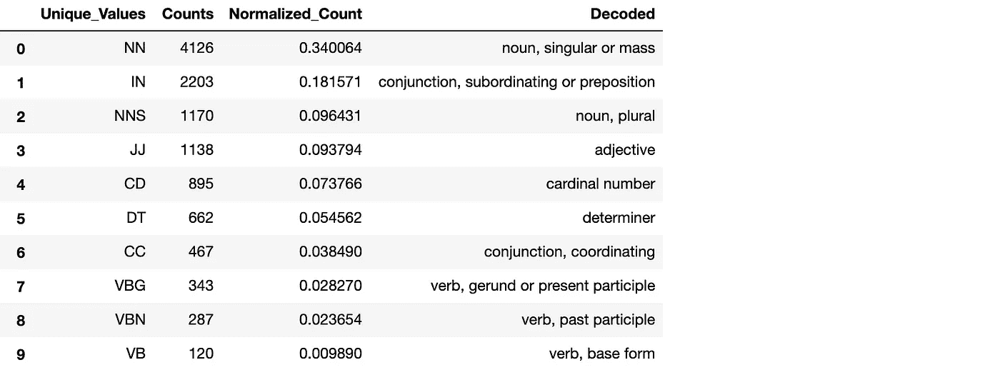

合并类别，如“名词，单数或复数”和“名词，复数”，以形成一个通用版本，下面是我们的请求是如何组成的:

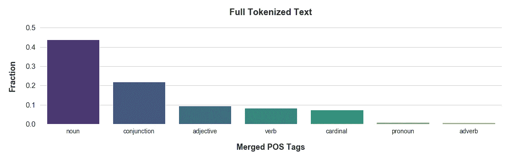

## 使用 scikit-learn、散景和 t-SNE 的主题建模

在笔记本中，我们使用不同的技术进行主题建模，包括 scikit-learn 的潜在狄利克雷分配(LDA)函数，潜在语义分析(LSA)，比较 *CountVectorizer( )* 和 *TfidfVectorizer( )* ，gensim 与 LDA，使用 t-分布式随机邻居嵌入(t-SNE)进行降维，以及 Bokeh 和 pyLDAvis 进行可视化。我们不会添加这里使用的完整代码，我们鼓励您看一看笔记本。鉴于我们的数据有限，所有工具都做得不错。这里有一个亮点，

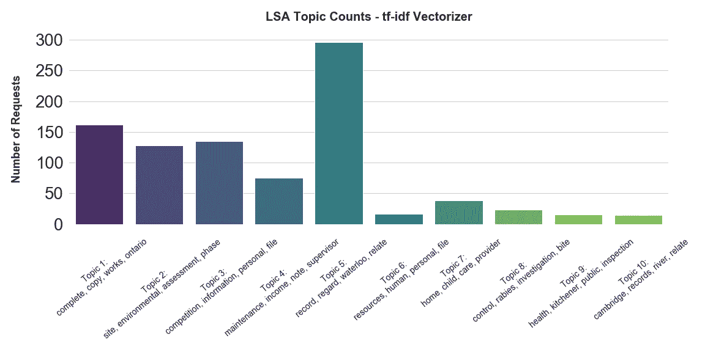

几乎所有最常用的短语都出现在主题中。正如所料，一些主题是明确的，如“安大略作品”或“环境网站”，而其他集群没有这样定义。

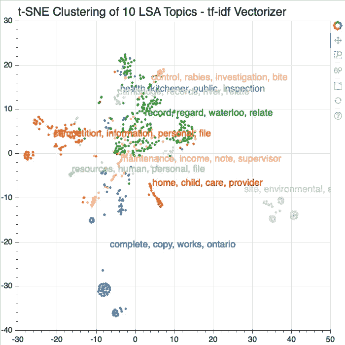

# 机器学习

我们已经知道 ML 不会很好地工作，但是，考虑到这是一个学习练习，我们还是继续下去。在笔记本中，我们针对三种不同的情况比较了八种不同的 ML 模型。我们无法直接比较全部数据，因为有些案例的实例很少。例如，只有一个请求得到了“批准更正”，所以当我们训练我们的模型时，该案例将只存在于训练集或测试集中。只有一个案例并不能提供一个好的基础。我们几乎没有选择，

*   我们可以丢弃少于 15 个实例的请求，称之为“超过 15”。
*   我们将我们的全套决策分为三个基本类别:
    *所有披露的信息(加上“批准的更正”)。)
    *部分披露的信息(加上‘部分不存在’。)
    *未披露任何信息(加上“已转移”、“无记录”、“拒绝更正”、“无额外记录”、“提交异议声明”、“撤回”和“放弃”)。)这反过来会使我们的设置*平衡*。
*   我们可以放弃少于 15 个实例的请求，并放弃没有做出实际决定的决定，即撤销或放弃的案例，称之为“独立的”。

这是结果，

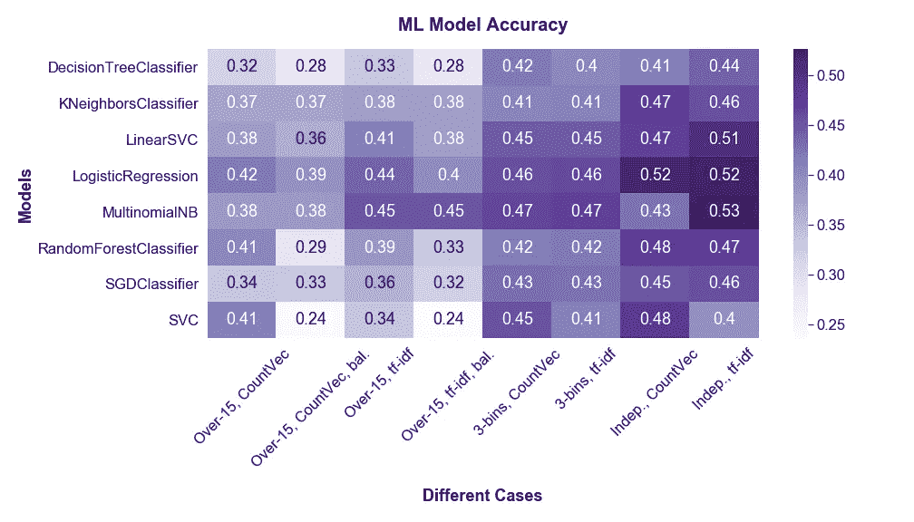

总的来说，逻辑回归和多项式朴素贝叶斯分类器，结合 tf-idf 给出了更好的结果。而宁滨我们的班级似乎是最合乎逻辑的方法。

代码和全套结果可以在[这里](https://github.com/brodriguezmilla/foir)找到。