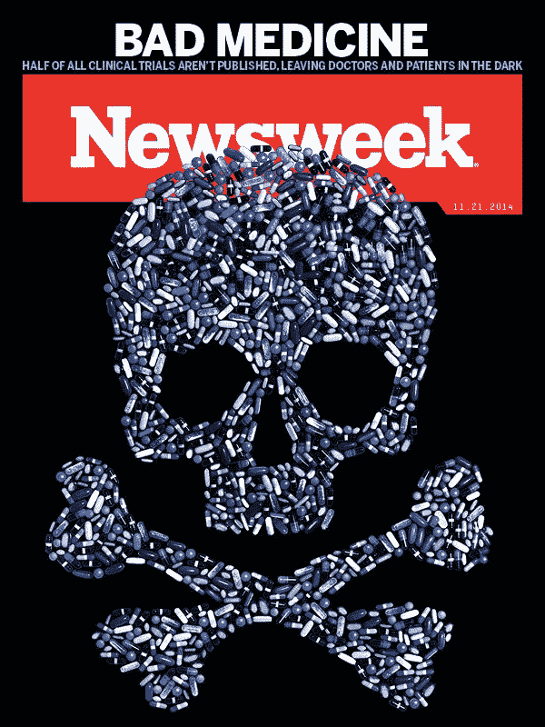

# 当伦理是不够的:临床试验下和误报和不信任的癌症

> 原文：<https://towardsdatascience.com/when-ethics-arent-enough-clinical-trials-under-and-misreporting-and-the-cancer-of-distrust-7c392bf753c0?source=collection_archive---------25----------------------->

Ben Goldacre 是牛津学院的校友，拥有医学学位和哲学高级学位，是一名认证医师和精神病学家。他还是英国一家顶级医疗机构的流行病学研究员。尽管有这些学术和专业的荣誉，他今天最出名的是一个报纸专栏和一本书，名字像邦·乔维的一首歌，“坏制药”[【1】](https://uma.umassonline.net/webapps/discussionboard/do/message?action=list_messages&course_id=_13501_1&nav=discussion_board_entry&conf_id=_52381_1&forum_id=_185074_1&message_id=_3266343_1#_ftn1)(gold acre，2013)。

Goldacre 认为，用药品治疗患者的那部分药物是一种假象，因为制造商平均隐藏了 50%的试验数据，医生没有时间或途径获得完整和真实的数据，监管机构也不关心。说监管者不关心可能是一种二分法思维错误。至少在英国，他们足够关心开始跟踪制造商发布的部分试验数据，但不足以迫使他们发布更多的数据(Goldacre，2013)。

此外，Goldacre 和他的同事后来写道，即使制药商确实公布了他们的试验数据，也往往是以一种几乎不可能有意义地解释和实施到患者护理中的方式进行的。这通常是因为使用了复合数据、主观终点和替代物(Heneghan，2017)。

至少在英国，监管者正在采取行动改善公众对公共卫生的信任和质量。今年 1 月，在 Goldacre 的第一本书出版 7 年后，下议院的科学技术委员会向 41 所英国大学发出了监控信，要求他们在 6 个月内改善临床试验数据的报告，或者预计被传唤到委员会解释为什么还没有更好(Dunn，2019)。

当如此多的金钱在药品销售中发挥作用时，民主国家受到企业游说者及其选民的影响一样多，人们很容易得出结论，利润只是被优先于知识诚信；然而，动机很少是单一的。在临床试验报告不完整的情况下，一些数据表明，非营利大学比制药商更糟糕。

2018 年，在一项回顾性队列研究中，由 Goldacre 领导的牛津大学团队发现，90%的英国大学未能按要求向欧盟临床试验注册机构报告完成后 12 个月内的临床试验数据。事实上，商业试验赞助商报告的结果比非商业试验赞助商多 6 倍(68%比 11%)，较大的试验赞助商比较小的试验赞助商更有可能及时报告结果(78%比 18%) (Goldacre，2018)。

Goldacre 和他的同事认为，至少有一些失败是不明确的政策和沟通的结果。虽然法律要求申办者报告调查结果，但这是委托给首席研究员或行政人员，他们可能不知道(Goldacre，2018)。

作为一个案例研究，有人可能会说，这表明公共卫生或生物伦理的三个主要理论是不够的，即使全部应用。功利主义出现在审判中，表面上是为了确定什么是更大的利益。原则主义是存在的，因为审判是按照一套规则和标准进行的。此外，结果主义存在于那些让制造商和赞助商为未能遵循功利主义原则负责的法规中。

就社会后果而言，这一案例也可以作为不再相信政府的仁慈和效力的幻灭公众的素材，至少在美国有一半的公众是如此。即使不是大多数，也有多数美国人认为公司只为他们自己谋利，不信任科学和专家，政府无力纠正这种情况。

作为数字和公共卫生数据的消费者，我们可能会创造性地寻找方法，稳步向决策者和患者传达这一问题。与此同时，我们必须对试验数据持怀疑态度，除非我们对数据的完整性和证实结果的时间有信心。

# 参考

邓恩，W. (2019 年 1 月 24 日)。*国会议员对缺失的临床试验结果采取行动。*检索自《新政治家》:[https://www . newstatesman . com/spot light/health care/2019/01/MPs-take-action-missing-clinical-trial-results](https://www.newstatesman.com/spotlight/healthcare/2019/01/mps-take-action-missing-clinical-trial-results)

b . gold acre(2013 年)。*不良制药公司:制药公司如何误导医生和伤害病人。伦敦:费伯。*

Goldacre，b .，DeVito，n .，Heneghan，c .，Iriving，f .，Bacon，S. Fleminger，J .，& Curtis，H. (2018)。符合欧盟临床试验注册报告结果的要求:队列研究和网络资源。BMJ 362:3218。

Heneghan，c .，Goldacre，b .，Mahtani，K. (2017 年)。为什么临床试验结果不能转化为患者的利益。*审判*，18: 122。

托威博士(2014 年 1 月 3 日)。为什么公共账目委员会关于达菲的报告对我们所有人都很重要。*赫芬顿邮报*。