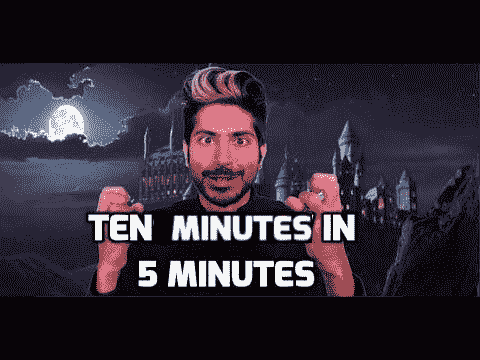
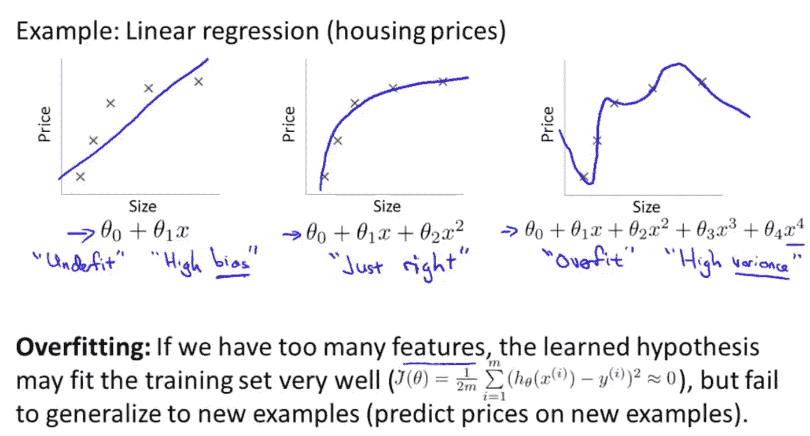

# 当“成长的烦恼”遭遇“成长的痛苦”

> 原文：<https://towardsdatascience.com/when-growth-hacks-meets-growing-pain-6baa4e3d8776?source=collection_archive---------15----------------------->

## 我对 Siraj Raval 最近备受争议的“ML 课程”的看法

## **发生了什么**

在一个[影响者经济](https://medium.com/@matthewbiggins/welcome-to-the-influencer-economy-5a69be520a10)的时代，像 [Siraj Raval](https://medium.com/u/54526471f9bf?source=post_page-----6baa4e3d8776--------------------------------) 这样的知名 Youtubers 用户被认为在传播信息和启发新人进入有些令人生畏的人工智能世界方面非常成功。截至目前，他的 YouTube 频道已经有了 692，000，000 的订阅者，这很了不起。他的内容非常广泛。他的“在 5 分钟内做 X”教程视频非常受欢迎，这有一个迷因:

但是最近，他遇到了一些问题。他的新课程“用机器学习赚钱”收费 200 美元。收取 200 美元的课程费用完全没问题，有争议的部分是人们抱怨他使用了其他人的 GitHub repo 的一些代码，而且他接受的学生比他承诺的多得多，可以在不降低体验的情况下妥善处理。当一些人寻求退款时，他们也遇到了一些麻烦。

## **“成长的烦恼”与“成长的痛苦”**

有些人指控他欺诈，对此我没有把握。在我看来，这更像是一个诚实的错误，因为缺乏扩大规模和进入他不熟悉的领域的经验。

看，他的大多数更受欢迎的视频都是带有一点‘娱乐’的入门级教程(说唱、滑稽模仿等)。)的元素。他在这方面非常自然，这使得人工智能或机器学习不那么无聊或可怕。而我相信这也是人们最喜欢他的内容的原因。然而，当涉及到更严肃的教育时，特别是当你想收取 200 美元的费用时，人们期望某些标准，而他可能并不完全清楚这些标准是什么。例如，你需要拥有你的内容，如果你想使用其他人的内容，比如代码片段或图表，给予信任，而且是非常恰当的信任。

我记得 fast.ai 的[杰瑞米·霍华德](https://medium.com/u/34ab754f8c5e?source=post_page-----6baa4e3d8776--------------------------------)在教“[程序员机器学习入门](http://course18.fast.ai/ml)课程的时候。他用了一个“过度适应和欠适应”的图表，并把它归功于 Quora。

Photo Credit: Andrew Ng’s Machine Learning course on Coursera.

但事实证明，上面的图片最初来自[吴恩达](https://medium.com/u/592ce2a67248?source=post_page-----6baa4e3d8776--------------------------------)的[斯坦福机器学习课程](https://www.coursera.org/courses?query=machine%20learning%20andrew%20ng)。所以[杰瑞米·霍华德](https://medium.com/u/34ab754f8c5e?source=post_page-----6baa4e3d8776--------------------------------)实际上在他的下一次演讲中特别纠正了这个错误，并特意表扬了[吴恩达](https://medium.com/u/592ce2a67248?source=post_page-----6baa4e3d8776--------------------------------)的教学风格。我认为这是各自的处理方式。我不认为 Siraj Raval 是故意不给学分的，他可能不太习惯学术界给推荐信的惯例，等等。如果你在 YouTube 上做免费视频并使用他们的代码，人们不会抱怨，但如果你试图对正式教育节目的内容收费，那就完全是另一回事了。

关于比他承诺的接收更多学生的指责，我认为这主要是一个规模上的挑战。当成功来得太快而你又没有准备好的时候，你肯定会跌倒。可以理解。然而，之后你如何处理将会有很大的不同。你可以得到更多的帮助，或者适当地为你没有达到的服务水平退款，只是不要逃避或者试图用更多的错误来解决一个错误。这样至少可以挽回名声，获得第二次改过的机会。

## 最后的想法

形势仍在发展，我们将看看他如何处理这件事。我想说我们假定他是无辜的。这个家伙为 AI 社区做了很多，帮助人们开始使用 AI/ML，毕竟让很多人笑了。我的建议？

> 直接面对问题，承认他犯了一个错误，并适当地补偿人们，然后在 YouTube 上制作一个视频，介绍他是如何处理缩放和进行损害控制的！化危机为机遇。从技术负责人的[剧本中吸取一页。一有机会就要赚钱，对吧？](https://www.youtube.com/watch?v=2pIJoPkh9IU)

How ‘The Tech Lead’ handles his crisis? Make a YouTube video and monetize from it!