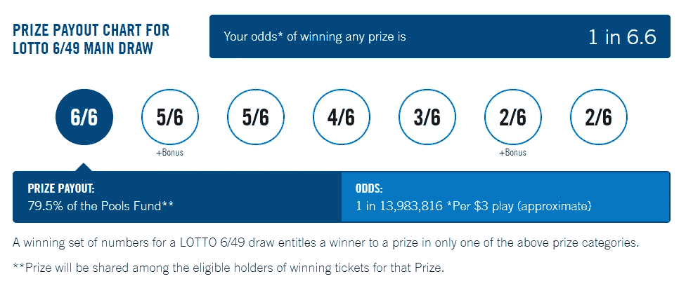
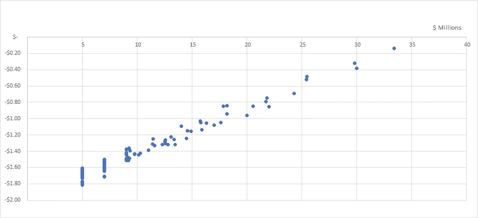
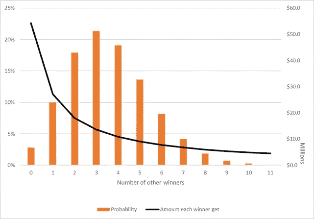

# 买彩票的最佳时机是什么时候？

> 原文：<https://towardsdatascience.com/when-is-the-best-time-to-buy-lottery-tickets-7735191b3c76?source=collection_archive---------1----------------------->

## 根据理性(或统计)分析

Photo by [Alain Pham](https://unsplash.com/@alain_pham?utm_source=medium&utm_medium=referral) on [Unsplash](https://unsplash.com?utm_source=medium&utm_medium=referral)

> 彩票的预期回报会是正的吗？
> 
> 当头奖金额较大时，更多的人倾向于购买彩票。这有道理吗？

本文旨在通过统计分析来回答这些问题。

## 介绍

我们在这里研究的彩票是加拿大最受欢迎的彩票游戏之一——乐透 6/49。像许多其他彩票游戏一样，当抽奖中没有中奖彩票时，6/49 乐透也可以滚动累积奖金。在过去的一年里，出现了几次超过 2000 万美元的大奖。

Jackpot size for Lotto 6/49 over the past year

加拿大彩票史上最大的单笔头奖也来自乐透 6/49。[2015 年 10 月 17 日开奖，累积奖金 6400 万美元](https://www.toronto.com/news-story/6391005-mississauga-woman-wins-64m-largest-canadian-jackpot-ever/)。头奖是由在安大略购买的一张彩票赢得的。这还不到美国历史上最大的头奖——[【强力球](https://abc7news.com/society/10-largest-lottery-jackpots-in-history/2317638/)7.684 亿美元头奖的 10%。但它对应的是加拿大人口与美国人口的比例。

根据号码匹配，主抽奖有 7 种不同的奖品。还有一个 100 万美元的保证抽奖活动，其中一张彩票将获得奖金。赢得任何奖项(最有可能是另一次免费游戏)的几率是 6.6 分之一。

但是，买彩票没有人是针对小奖的。主要的头奖是我们主要感兴趣的。

赢得乐透 6/49 主头奖的几率是 1/13，983，816！这意味着，我们有更大的机会:

*   被雷劈——114195 年中的 [1。](https://www.sheknows.com/living/articles/1023453/what-are-the-odds-21-statistics-that-will-surprise-you/)
*   成为电影明星—[119 万里挑一](https://www.sheknows.com/living/articles/1023453/what-are-the-odds-21-statistics-that-will-surprise-you/)。
*   被鲨鱼袭击——3，748，067 人中的 1 人。

## 分析前要考虑的事项

*   **税收和货币的时间价值**

幸运的是，加拿大的彩票中奖者不必为奖金缴税——只需为其产生的收入缴税。获胜者似乎可以选择在申请后一次性获得报酬。因此，没有必要考虑中奖金额的时间价值和税收，这可能会减少实际奖金。

与强力球不同，乐透 6/49 头奖金额就是赢家获得的金额！

*   **数据**

由于数据限制，只有一年的乐透 6/49 历史可供分析。其他数据是从新闻报道中读到的。

*   **使用的型号**

最后，我们还假设头奖赢家的数量遵循泊松分布。泊松分布是一种概率分布，通常用于模拟在特定时间间隔(如时间)内观察到的罕见事件的数量。

这不是一个完美的模型，但它很简单，可以作为一个很好的代理。关于申请的细节可以在[这里](http://users.stat.umn.edu/~geyer/lottery/)找到。

## 数学

什么时候是买彩票的最佳时机？

为了回答这个问题，我们用预期收益作为标准的衡量标准。

** * * *** * * **如果对计算不感兴趣，可以跳过这一部分***** ***

*我们提到一张彩票赢得头奖的几率是 13，983，816 分之一。每张票都被认为是相互独立的，所以我们假设这是不变的。*

****主奖头奖*** *的预期收益计算为:**

**(假设您赢了，预期的赢款金额)* (1/13983816)。**

**假设你赢了，预期的赢款金额是从我们假设的泊松分布中得出的。**

**除了主头奖* *之外，主抽奖* ***的预期奖金回报简单计算如下:****

**(中奖金额)*(该特定奖品的中奖几率)。**

*****保底 100 万美元大奖*** *的预期回报计算为:***

***100 万*(1/售出门票总数)。***

**********************************************************************

**每张票的购买价格是 3 美元。因此，总预期收益= sum(不同奖项的预期收益)-3 美元。**

**下面是一个图表，显示了过去一年的预期总回报和累积奖金的大小。**

****

**Plot of jackpot size (x-axis) and expected total return (y-axis)**

**这种关系看起来是线性的。3300 万美元的累积奖金(过去一年中最大的累积奖金)的预期回报高达-0.14 美元。**

> **头奖越高，预期收益越好？**

**这是否意味着随着更高的头奖，它将达到 0 甚至是正的，这将使彩票成为一个好的赌注？**

**为了回答这个问题，让我们看看 2005 年发生的一次更大的累积奖金。头奖是 5430 万美元，比 3300 万美元大得多，更接近 6400 万美元的最高纪录。选择这个特别的抽签是因为可以从新闻报道中获得数据。**

**当时的彩票每张 2 美元，所以它被认为是一个巨大的头奖，相当于今天的 8145 万美元。即便如此，预期收益为-0.14 美元，与过去一年的最高预期值相同。**

***为什么会这样？***

**因为这次头奖售出了将近 5000 万张彩票。这与过去一年的平均抽签(490 万)相比是十倍以上。人们肯定很兴奋，会买更多这些更大的头奖的门票！而这是拉低预期收益的主要因素。**

> **是的，彩票的预期回报确实会随着累积奖金的增加而增加。**
> 
> **当头奖变大时，是买彩票的好时机。**
> 
> **但是，由于这些巨额累积奖金造成的乐透狂热，它将永远不会成为一项理性投资(具有正预期回报)!**

**此外，售出的门票越多，中奖者就越有可能与其他人分享奖金。这将大大降低价值，即使你赢得了头奖。所以让我们转到另一个问题。**

****当累积奖金越来越大时，你与他人分享奖金的可能性有多大？****

*   ****中大奖****

**首先，看看 3300 万美元的累积奖金——去年最大的一笔。售出的门票数量估计为 760 万张。**

**鉴于我们无法改变赢得头奖的几率。令人担心的是，如果我真的赢了，可能会有多个赢家，我必须与他们分享奖金。**

**基于以上信息，我们能够计算出不同情况下的概率，假设你中了彩票。**

****

**The scenarios and distribution given you already won $33 million**

**这看起来非常好。很有可能(58%)你是唯一的赢家，奖金将是 3300 万美元。**

**但如前所述，随着头奖越来越大，售出的门票数量将以非线性关系增长。**

*   ****历史巨奖****

**让我们再次以 2005 年发生的 5430 万美元的累积奖金为例。**

****

**The scenarios and distribution given you already won $53.4 million**

**现在情况完全不同了。这张图表显示，最有可能的情况是，你将不得不在 2-4 名其他赢家之间分配奖金，这将大大减少你可以申请的金额，即使你真的赢得了头奖。**

> **累积奖金越大，你就越有可能与其他赢家分享奖金。**
> 
> **受欢迎的抽奖将会给你很小的机会独自把全部奖品带回家！**

## **摘要**

**以上分析是在加拿大乐透 6/49 上做的。然而，类似的想法/结果应该适用于其他彩票游戏，如美国的强力球。**

**总之，彩票从来都不是理性投资。最佳购买时机是头奖非常大的时候！**

*****注来自《走向数据科学》的编辑:*** *虽然我们允许独立作者根据我们的* [*规则和指导方针*](/questions-96667b06af5) *发表文章，但我们不认可每个作者的贡献。你不应该在没有寻求专业建议的情况下依赖一个作者的作品。详见我们的* [*读者术语*](/readers-terms-b5d780a700a4) *。***

**数据是从[乐透 6/49](https://lottery.olg.ca/en-ca/winning-numbers/lotto-649/winning-numbers) 官网刮来的。目前只有一年的数据。**

**由于数据限制，我们使用了乐透 6/49 官方网站[上描述的公式，根据中奖人数和奖金数额来估算售出的彩票总数。](https://lottery.olg.ca/en-ca/winning-numbers/lotto-649/winning-numbers)**

**由于数据的限制，除了主大奖之外，其他奖项的期望值是按照过去一年抽奖的平均值计算的。**

** [## 根据模拟，30 岁退休需要多少钱

### 很多人年纪轻轻就有辞掉工作的梦想，活在世上没有经济上的牵挂。怎么…

towardsdatascience.com](/how-much-do-you-need-to-retire-at-age-30-based-on-simulation-424fa9e0922b)  [## 我将如何在我的狗身上花费 6 万多美元

### 我以前从未试图给我们的狗贴上价格标签。但是根据简单的分析，我最后会花…

medium.com](https://medium.com/@liannewriting/how-im-going-to-spend-over-60-000-on-my-dog-4860e5d8935c)  [## 在多伦多购买新房——数据驱动的方式

### 作为一个数据驱动的人，我一直想分析多伦多的房地产数据，因为我知道这样的工作…

medium.com](https://medium.com/swlh/buying-a-new-home-in-toronto-a-data-driven-way-693773d97d86)**