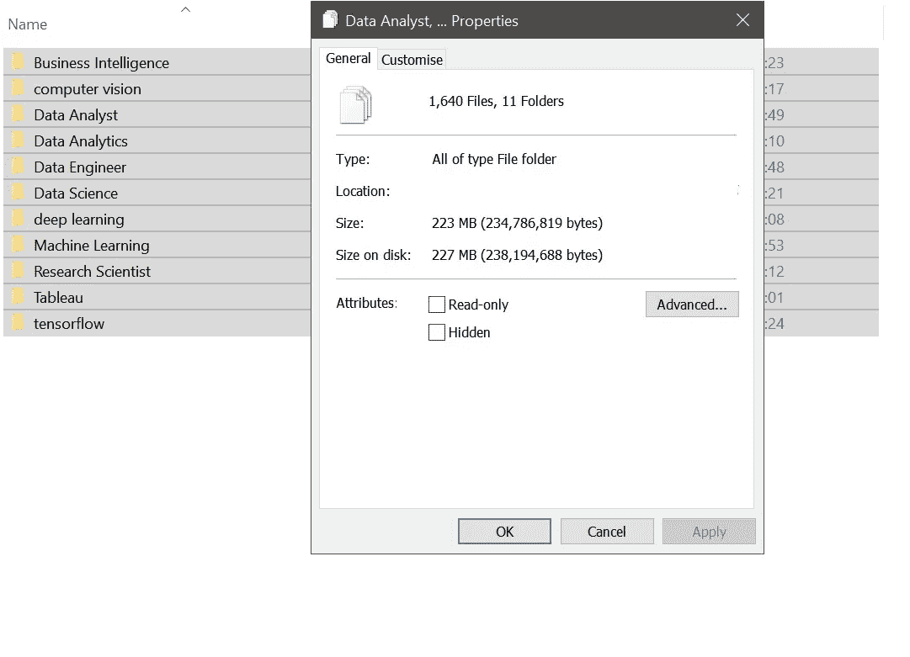
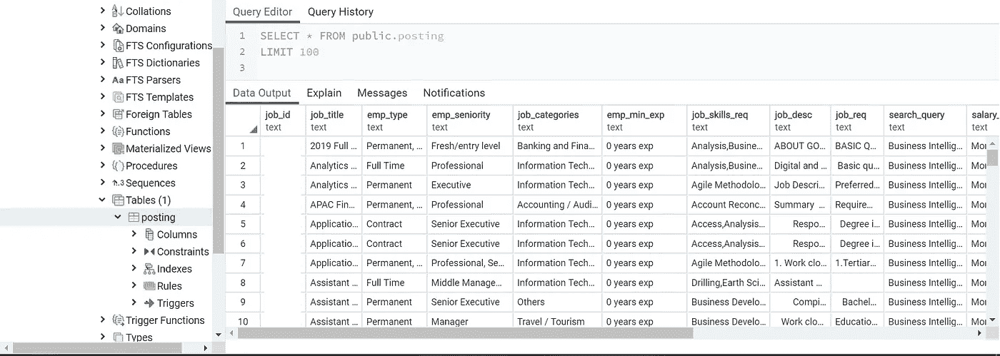

# 当求职遇到数据科学(第一部分)

> 原文：<https://towardsdatascience.com/when-job-hunting-meets-data-science-part-1-e8f64867d8c?source=collection_archive---------26----------------------->

## 从业务理解到模型评估，这个数据科学项目帮助我在找工作时变得非常清晰。


“Should I do my Data Science project or writing my Cover Letter? Why not both?” Photo by [Markus Spiske](https://unsplash.com/@markusspiske?utm_source=medium&utm_medium=referral) on [Unsplash](https://unsplash.com?utm_source=medium&utm_medium=referral)

无尽的挑战。我们就是这样成长的。在我们的数据科学沉浸式项目中，顶点之前的最后一个主要项目是为求职的各个方面建立预测模型，如工资和工作类别。这个项目类似于真实世界的场景:你的老板给了你一个目标和/或一个问题陈述，你找到了完成它的方法。

# 商业理解

## 那么这个项目有什么问题呢？


2 个问题:
-调查影响薪资的因素
-调查区分工作类别的因素

## 还有一个问题，数据？

没错，资料中没有提供任何数据。这难道不是真实世界的风格，我们必须从某个地方寻找我们自己的数据吗？在这种情况下，我们可以执行网页抓取来提取在线数据！因此，我决定刮掉这个叫做…M 网站的在线工作平台！(身份被掩盖，以便网站创建者不使网站在未来更难刮。)

# 数据理解

## 数据的范围

我把范围缩小到与数据相关的招聘信息，并扩展到需要使用数据相关软件的工作。

```
# Keywords used for search query
[‘Research Scientist’, ‘Business Intelligence’, ‘Data Engineer’, ‘Tableau’, ‘deep learning’, ‘computer vision’, ‘tensorflow’]
```

## 网页抓取工具，要抓取什么？

[Selenium](https://www.seleniumhq.org) 和 [Scrapy](https://scrapy.org) 都出色地从大量使用 JavaScript 的网站中提取了必要的信息。

由于该网站不断更新其帖子，运行同一组请求可能会获取不同组的帖子。因此，我下载了所需的源代码，并在离线模式下处理它们。

另一个问题随之而来:存储。下载每次发布的源代码可能会占用大量磁盘空间。幸运的是，Python 提供了一个 [gzip](https://docs.python.org/3/library/gzip.html) 库来分别在存储和加载期间压缩和解压缩数据。

下面是搜索和搜索每个关键字的不同结果页面的代码，后面是下载每个职位发布的源代码并以压缩格式存储它们的代码:

Search using keywords and crawl across all results pages

Download each job posting’s source code and save the compressed version



1,640 job postings (possibly with duplicates) occupying relatively large disk space even after compression

## 使用 PostgreSQL 的数据存储

存储源代码后，我离线检索源代码并提取我需要的原始数据。为了磨练我的 SQL 技能，并体验如何在 Amazon Web Services (AWS)上创建 PostgreSQL 数据库，我决定将我的原始数据存储在 AWS 免费层[关系数据库服务(RDS)](https://aws.amazon.com/rds/) 。

```
# These are the raw features used in extracting the data
  ['job_id','job_title','emp_type','emp_seniority','job_categories','emp_min_exp','job_skills_req','job_desc','job_req','search_query','salary_freq', 'salary_low', 'salary_high', 'company_name', 'company_info', 'link']
```

Uncompress and extract the relevant data before populating a new SQL Table.



Querying the data using pgAdmin. Looks like everything is in now!

# 我能做得更好吗？

肯定是的！

在抓取招聘信息的链接时，我可以使用 Scrapy 而不是 Selenium 来提取所有的链接。当时我还不知道那种方法。

而不是将链接列表转换为 Pandas DataFrame 并调用内置方法。to_csv()，也许我可以使用 python csv 库将列表输出到一个. CSV 文件中。然而，我发现执行前一步要容易得多。

有一个问题，尽管可能性极小，一个工作发布的 HTML 源代码由于过长的文件名而无法下载。也许代码可以在创建输出文件之前修剪文件名。

Elasticsearch 可用于存储和接收 HTML 源代码文件，使其成为 PostgreSQL 方法的替代方案。

如果代码有任何问题，或者我可以以任何方式提高我的编码技能或文章写作技能，请在下面留下您的评论，以便我可以从社区学习最佳实践和经验法则。

**感谢您的阅读！敬请关注** [**第二部分**](/when-job-hunting-meets-data-science-part-2-675f154269c7) **，在这里我们访问数据库，获取数据并进行分析！**

*一个接一个的项目，我着迷于使用收集到的数据和基于这些数据建立的模型来解决事情，并通过部署模型来解决现实生活中的问题。你可以通过我的*[*LinkedIn*](http://www.linkedin.com/in/JackieTanSG)*联系我。*