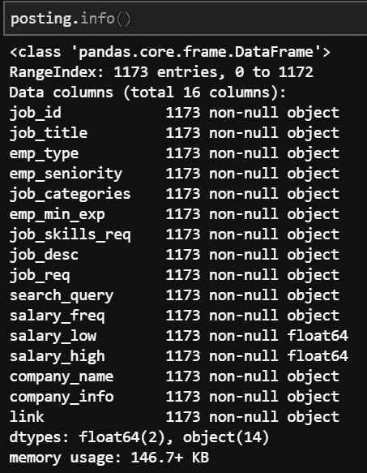
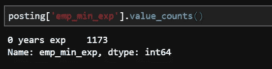
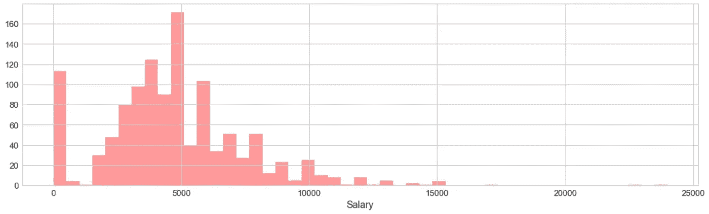
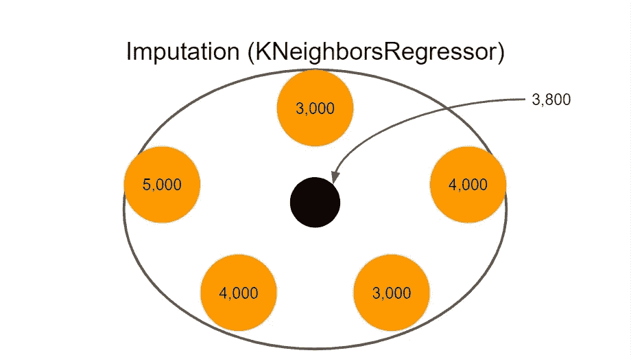
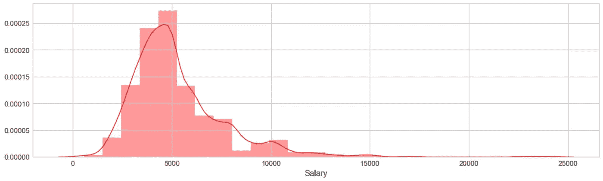
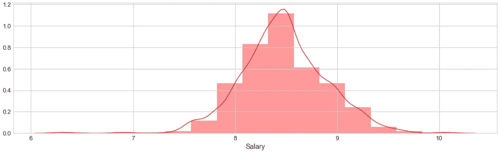
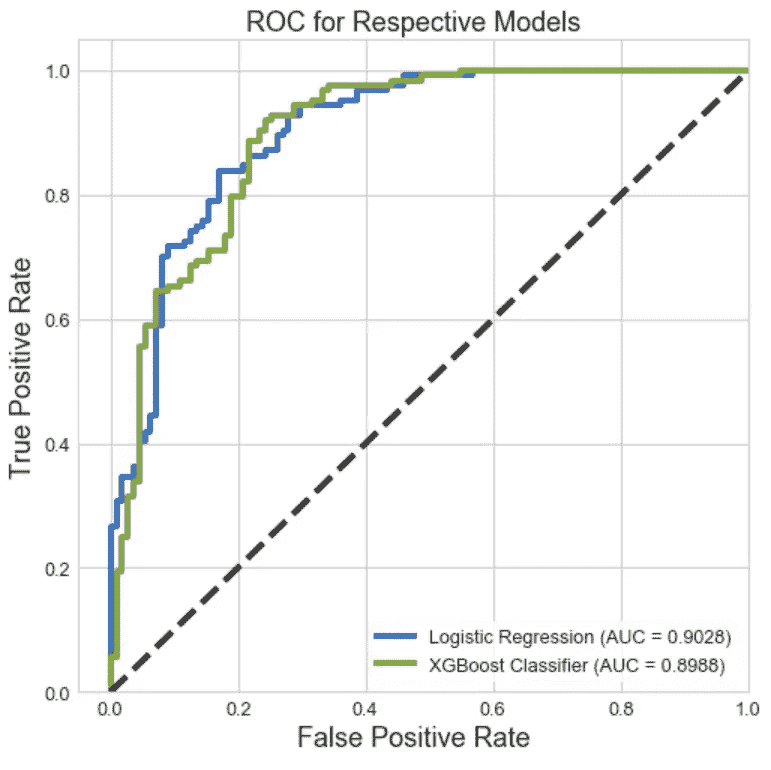

# 当求职遇到数据科学(第二部分)

> 原文：<https://towardsdatascience.com/when-job-hunting-meets-data-science-part-2-675f154269c7?source=collection_archive---------15----------------------->

## 从业务理解到模型评估，这个数据科学项目帮助我在找工作时变得非常清晰。


Payday! Image found on GIPHY by andersonpaak.com

*这是第一部分*[](/when-job-hunting-meets-data-science-part-1-e8f64867d8c)**的延续，我在这里经历了业务理解和数据理解的步骤。所采取的行动是制定问题陈述、网络搜集数据并将数据存储在数据库中。**

*对于第 2 部分，我们关注数据准备和数据建模！*

*显然，我们首先从存储数据的数据库中提取数据，并随机抽取 5 个职业数据的观察值。*

```
*engine = create_engine('postgresql://[username]:[[password]@[database].ap-southeast-1.rds.amazonaws.com](mailto:qFH95+yw+ppY9tRm@careers.c0ocff1wef7u.ap-southeast-1.rds.amazonaws.com):5432/postgres', echo=True)
query = """
        SELECT * FROM posting;
        """
posting = pd.read_sql(query, engine)
posting.sample(5)*
```

*"让我们开始做模特吧！"我知道我们对模特有多渴望。但是，让我们在开始之前先回顾一下业务问题并执行探索性数据分析(EDA)。*

# *业务理解(重访)*

*商业问题是调查影响工资的因素。我们想知道可以用来预测工资的特征。更具体地说，给定一个由我们确定的截止工资(可能是所有职位发布工资的中间值或平均值)，有哪些特征可能预测工资是高于还是低于截止工资。*

# *数据准备、数据清理*

*总共有 1，173 个观察值和 16 个特征。一些特征将不会用于建模，例如发布 id、公司名称、公司信息和发布链接。*

**

*Great! No null value hidden in our dataset (really ‘Great’? Think again!)*

*有趣的是，在“要求的经验年数”下没有捕捉到任何信息。因此，此功能将被删除。*

**

*Constants like this don’t give any value for analysis and modelling, DROP!*

```
*# Drop features that don't give any value for modelling or don't make any sense to be used for modellingposting['emp_min_exp'].value_counts()
posting = posting.drop(columns=['job_id','emp_min_exp','company_name','company_info','link'])*
```

*其余的特征要么是分类的，要么是文本的。对于文本特征，我们通过转换为小写、删除不必要的特殊字符和转义序列(\n，\t)来清理数据。*

```
*# Clean up the text data
posting.replace(r'\n', '', regex = True, inplace = True)
posting.replace(r'\t', '', regex = True, inplace = True)
for header in ['job_desc', 'job_req', 'job_title']:
    posting[header] = posting[header].map(lambda text: ''.join([char for char in text.lower() if char in string.ascii_lowercase + " /'-"]))
    posting[header] = posting[header].map(lambda text: text.replace('-', ' '))
    posting[header] = posting[header].map(lambda text: text.replace('/', ' '))*
```

*有些工资是以年频率而不是月频率引用的。我们将这些工资除以 12，并删除“工资频率”功能。*

```
*# Convert all salary to monthly salary
posting.loc[posting['salary_freq'] == 'Annually','salary_low'] /= 12
posting.drop(columns='salary_freq', inplace = True)
posting.sample(5)*
```

*此时，我们要决定如何制定我们的目标，也就是工资。一个简单的方法是取高低端点之间的平均值，并将其作为我们的目标。但是，考虑这 2 个场景:
1。4，000 美元到 6，000 美元
2。3，000 美元—7，000 美元
确定两者的平均值为 5，000 美元并不重要，但两者的范围非常不同。*

*因此，我决定使用工资的低端点作为目标。(另一个实际原因是，老板们通常希望将成本降至最低，这意味着……)*

*现在，我们专注于我们的目标，薪水。我们绘制了一个柱状图来看工资是如何分布的。*

```
*plt.figure(figsize=(18,5))
sns.distplot(posting['salary_low'], kde=False, axlabel='Salary', color='red');*
```

**

*When can I reach the right hand side of this graph?*

*从这个分布观察到的 3 点:
1。没有负面价值观(谢天谢地，你没有付钱让你的老板为他/她工作)
2。数量可观的 0 美元薪水(这不是慈善工作，只是薪水在贴子里没有公开)
3。在最右边出现异常值(我想要的位置)*

*为了解决第 2 点，我们可以执行**插补**来插补 113 个＄0 值。为此，我们首先使用 CountVectorizer 函数将所有特征转换成一个单词包。然后，我们使用基于 k 近邻的**回归**来估算$0 值。该算法将首先获取一个工资为 0 美元的数据点，在其周围寻找 5 个最近的点，并根据这 5 个最近点的平均工资估算值。*

```
*#Init CountVectorizer with stop words and use 0/1 to denote presence
cvec = CountVectorizer(stop_words='english', binary=True)# Transform all text features into bag of words and concatenate
X = [cvec.fit_transform(posting[i]).todense() for i in posting.columns[:-1]]
X = np.concatenate(X, axis=1)# Draw references to observations where salary = 0 vs =/= 0
salary0_index = posting[posting['salary_low'] == 0].index
salary_not0_index = posting[posting['salary_low'] != 0].index# Init KNeighborsRegressor with 5 neighbors to impute $0 salary
neigh = KNeighborsRegressor(n_neighbors=5)
neigh.fit(X[salary_not0_index], posting.loc[salary_not0_index, 'salary_low'])
posting.loc[salary0_index, 'salary_low'] = neigh.predict(X[salary0_index])*
```

**

*KNeighborsRegressor with 5 neighbors and uniform weights a.k.a. just take the average of the 5 neighbors!*

*有了更新后的薪水列表，我们可以再次绘制一个直方图来查看新的分布。*

**

*Don’t you think I look like lognormal distribution?*

*因为它呈现对数正态分布，并且它没有 0 值，所以我们可以执行对数变换，使它看起来像正态分布。*

**

*Do I look normal now?*

*然后，我们确定 1173 个观察值中的 590 个等于或高于正态分布的平均值，而 583 个观察值不等于或高于正态分布的平均值。显然，这种情况下的截断点是对数(工资)的平均值。使用**零规则算法**，可以预测 all 为多数类，等于或高于 log(salary)的均值，基线为 590/1173 = 0.503。*

# *数据建模*

*准备好数据后，我们拆分数据，将 80%用于训练，20%用作维持集。*

*我们采用两种模型来完成分类任务:**逻辑回归**和 **XGBoost 分类器**。*

# *模型评估*

*虽然我们可以使用准确性作为衡量标准，但我们将使用 ROC-AUC 作为衡量模型性能的关键指标。*

*理想情况下，我们希望真阳性率为 100%，假阳性率为 0%。然而，在现实中，这几乎是不可能的。因此，通过改变阈值，我们可以使用相应的真阳性率和假阳性率绘制受试者工作特征(ROC)曲线。然后，曲线下面积(AUC)将告诉我们我们的模型能够在两个类别之间分离得有多好。AUC 越高，该模型就越能更好地预测真 0 为 0，真 1 为 1。*

*在维持集上，
逻辑回归:AUC = 0.9028
XGBoost 分类器:AUC = 0.8988*

**

*ROC for Logistic Regression and XGBoost Classifier*

# *简而言之…*

*使用给我们的所有特征，一个好的 ol' Logistic 回归模型在维持集上的表现比 XGBoost 分类器稍好。有了这个模型，我们可以预测日志(工资)是高于还是低于平均值，给定工作发布的信息。对于提供职位匹配服务的公司，该模型可以帮助管理雇主和雇员双方的薪资期望。*

*完整代码如下:*

*Code for everything discussed in this story!*

# ***更加卖力！***

1.  *除了插补，我们还可以删除那些价值为 0 美元的记录。请注意，该组代表了大约 10%的观察结果，在业务环境中删除它们可能不是一个可行的选项。*
2.  *除了使用 k-最近邻回归量进行插补，我们还可以使用其他技术，例如*
3.  *在这个项目中，NLP 被大量使用，并且由函数生成的矩阵主要是稀疏的。因此，我们应该找到舒适地处理稀疏矩阵的方法，比如使用专门为稀疏矩阵构建的函数，而不是转换和处理密集矩阵。*
4.  *此外，有些算法可能不适用于稀疏矩阵。它们在低维空间(很少特征)可能做得很好，但是在高维空间它们的性能是次优的。我们应该意识到这样的算法。*
5.  *更多的超参数调整可以获得更高的度量分数。然而，我们需要注意的是，这种调整可能只会对总体分数产生微小的改善。*
6.  *因此，与看似无止境的超参数调整相比，基于领域专业知识(在本例中，人力资源)的更好的特征提取和特征工程策略可能有利于提高分数。*
7.  *我们还可以努力找出哪些词对薪水有更高的预测能力。需要注意的是，为了欺骗系统，帖子可能只包含某些具有高预测能力的词(如数据科学家)，但会形成不正确的句子。例如，“优秀的数据科学家，优秀的数据科学家，完美的数据科学家”。*

*感谢阅读，我希望你能像我写的一样喜欢这个故事！如果我可以以任何方式提高我的编码或文章写作技能，请在下面留下您的评论，以便我可以从社区学习最佳实践和经验法则。(^^,)*

*一个接一个的项目，我着迷于事物如何使用收集的数据和建立在其上的模型工作，并通过部署模型来解决现实生活中的问题。你可以通过我的 [*LinkedIn*](http://www.linkedin.com/in/JackieTanSG) *联系我。**