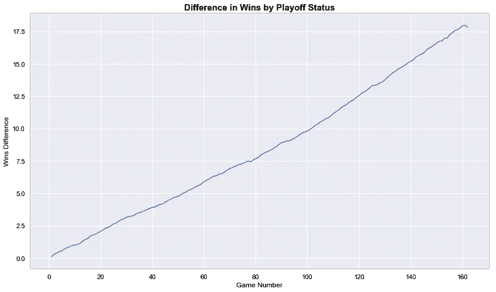
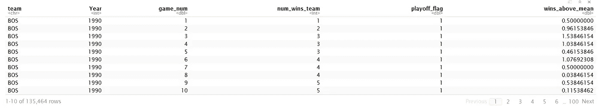
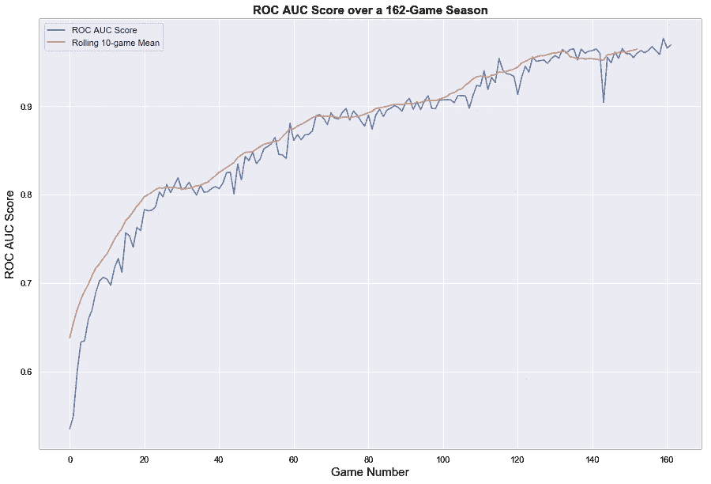
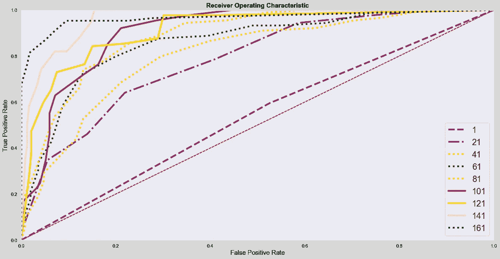

# 当较少的数据是足够的数据时

> 原文：<https://towardsdatascience.com/when-less-data-is-enough-data-78720d605bc0?source=collection_archive---------33----------------------->

## [**现实世界中的数据科学**](https://medium.com/towards-data-science/data-science-in-the-real-world/home)


世界发展越来越快，我们需要实时的答案，或者至少是比猜测更好的答案。我经常遇到的一个问题是，一个样本什么时候达到足以定罪的临界质量？介于数据的 0%和 100%之间。但是在哪里？

举个例子，让我们以美国职业棒球大联盟赛季为例。每个队的目标都是进入季后赛。然而，作为一个球迷，一个赛季有 162 场比赛，我在什么时候才能对我的球队是否会成为竞争者有信心呢？

如果我们想知道季节什么时候“重要”呢？在赛季的哪一点上，我们可以合理确定地预测球队是否会进入季后赛？

交流数据就是说两种语言——一种是给那些只想知道结论的人，另一种是给那些想知道细节和过程的人。前者不关心数学和过程——他们只想要答案，并知道他们可以信任那个答案——而后者不知道过程就不会相信结论。说两种语言是我们的工作。

这篇文章将从粉丝的角度开始，实际上是对调查结果的执行摘要，然后是对我们如何得出这些调查结果的更详细的分析师观点。

**粉丝:我什么时候该关心？**

简短的回答是，即使在一场比赛之后，季后赛和非季后赛球队之间已经有了区分。在一个所有球队在第一场比赛中都是平等的世界里，季后赛和非季后赛球队的平均胜率都是 0.5。相反，季后赛球队平均 0.59 胜，非季后赛球队 1 场后 0.47 胜。随着赛季的进行，球队之间的差距只会越来越大:



赛季进行到大约四分之一的时候(大约 40 场比赛)，季后赛和非季后赛球队的平均胜场已经有大约 4 场的差距。如果你的球队赢了 23 场或更多，他们看起来相当不错。如果他们有 19 个或更少，嗯，没有那么多。仅仅使用球队的胜场数，有大约 80%的机会，一个模型将会正确地将一支球队分类为是否进入了季后赛。

继续点击下面的互动图表，查看每个游戏号码的中奖情况:

在全明星赛期间(赛季进行到一半时)，该模型有 87%的机会正确地将一个正值分类，并且胜利的数量开始显示出那些注定要进入季后赛的和那些没有进入季后赛的之间的清晰界限。季后赛球队在这一点上平均有大约 8 场胜利，并且分布显示了“较低季后赛球队”(季后赛球队胜利的第 25 个百分点)与“较高非季后赛球队”(非季后赛球队胜利的第 75 个百分点)之间的分离。

九月那段呢？球队在九月要打大约 25 场比赛，所以这相当于从上图中的第 135–140 场比赛开始。到目前为止，平均有大约 15 场胜利的差距，我们的可预测性增加到大约 95%。

所以，如果你想对你的球队能否进入季后赛有 80%的信心，检查一下他们在第 40 场比赛前是否有 23+的胜场数。如果他们在全明星赛前获得 46+的胜利，事情看起来真的很好。而且，如果进入冲刺阶段，你的球队已经赢了 80+场，放松下来，等待季后赛，因为你很有可能会参加十月棒球赛。

**分析师:让我们来看看技术问题**

*用于数据操作的 R 和用于建模/可视化的 Python 中的项目代码是* [*在 GitHub 这里有*](https://github.com/jordanbean/Playoff-Win-Probabilities) *。*

*创建“完美”数据集*

有效的问题解决始于准确地提出问题和准备数据。我知道我想回答的问题— *大概需要多少场比赛来培养对一支球队能否进入季后赛的信心？我只是还不知道如何回答。*

在我现在参加的 [MSBA 项目](http://onlinebusiness.wfu.edu)的课程中，我们将讨论概率分布和量化不确定性。我想知道采用概率方法是最好的，还是建模方法更好。

最终，经过大量的数据准备和清理，我决定将随机森林分类模型与数据相匹配。理想的数据集应该是:

在一个赛季的任何一个时间点，一支球队有多少胜场，这支球队在那一年进入了季后赛吗？然后，有了这个数据集，我们可以为每个游戏号码建立一个模型，并根据它计算准确性指标，以达到我们期望的置信度。经过多次反复试验，我找到了一个如下所示的数据集:



对于 1990 年到 2018 年的每一年，以及每支球队，我们都有比赛编号，到那时的胜利数，他们是否进入了季后赛，我添加了一个“高于平均值的胜利数”列，计算胜利数减去该年的平均值和比赛编号。

*建模及结果解释*

这个问题的性质很适合于一个分类问题；每年，一支球队要么进入季后赛，要么出局。虽然测试了许多分类模型——KNN、梯度推进、逻辑回归——但我选择了随机森林，因为它功能强大、可解释且相对较快。

我首先创建了一个单一的模型，并计算 ROC AUC 得分(这有一个令人惊讶的非直观的意义，因为我在研究如何解释它时了解到了这一点)。结果如下:



接下来，我绘制了各种游戏数量的 ROC 曲线，以观察随着游戏样本量的增加，曲线如何变化。红色虚线代表完全随机的猜测，越靠左上方，模型的表现越好:



现在，这个模型和由此产生的计算仅仅是基于一个单一的模型。每次运行它，我们都会得到不同的结果。为了说明这一点，我决定运行一系列模拟模型，以更好地了解每个游戏号码的数据分布。

我分别运行了 500 次，每次都选择不同的数据分区(一种“随机”的随机状态)，使用一系列随机选择的模型参数:

```
num_runs = 0
desired_runs = 500while num_runs <= desired_runs:

    for game_number in range(1, 163):

        wins_game_num = wins[wins.game_num == game_number] x_train, x_test, y_train, y_test =            train_test_split(wins_game_num[['num_wins_team']], 
                           test_size = 0.4, 
                           random_state = random.randint(0, 100),
                           stratify = wins_game_num['playoff_flag']) rf_classifier = RandomForestClassifier(
                           n_estimators= random.randint(15,500), 
                           max_depth = random.randint(10,100), 
                           max_features = 
                           random.choice(['auto','sqrt','log2', 
                           None]),                                             
                           min_samples_leaf = random.randint(1, 25))
...
<Remaining code>
```

这导致 500 个模型模拟计算 ROC AUC 分数，从中我们可以绘制平均分数以及每个游戏号码的分数范围:

随着比赛次数的增加，可变性降低，这表明我们的结果更加确定，总的来说，我们可以快速改进随机猜测(0.5)，根据获胜次数区分季后赛和非季后赛球队。

**结论**

在我在 [Stax Inc.](https://medium.com/u/65883aa08f61?source=post_page-----78720d605bc0--------------------------------) 的工作中，我们一直在寻找更快获得推论和见解的方法。私人股本市场竞争激烈，管理团队需要更快地做出反应和适应，我们的工作需要反映这种对速度的更高要求。

在这里，我们可以在查看大约 25%的数据时获得大约 80%的预测能力。这并不是说这个比率总是通用的，而是说在许多情况下，在收集和分析 100%的数据之前，就可以做出推断。