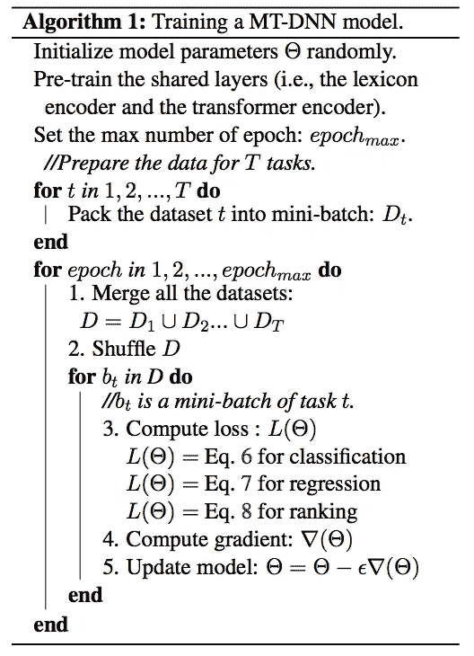
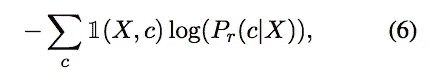
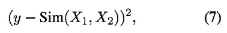
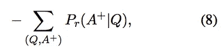
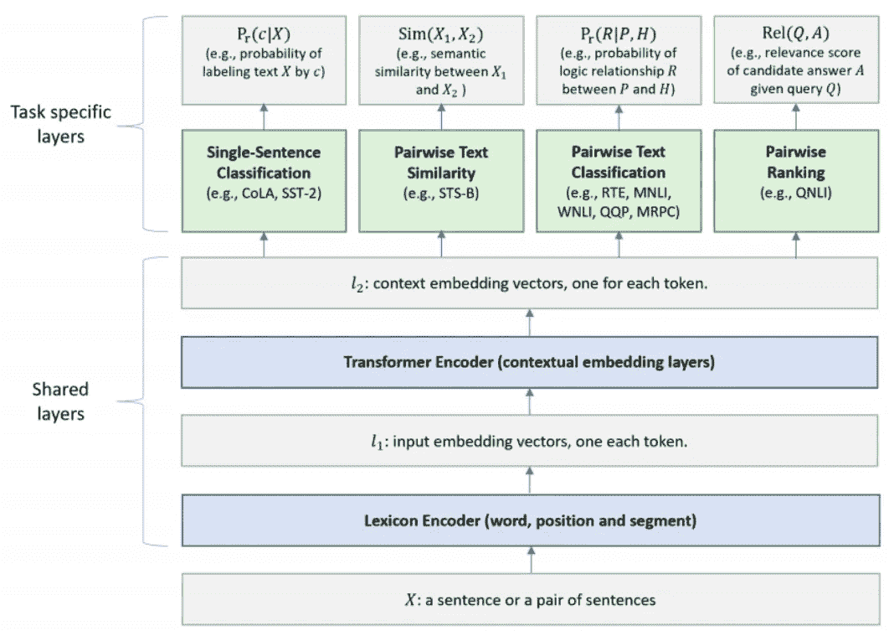
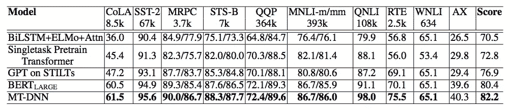
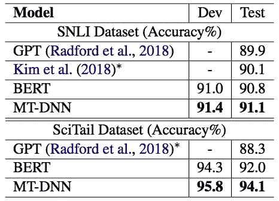

# 当多任务学习遇到 BERT 时

> 原文：<https://towardsdatascience.com/when-multi-task-learning-meet-with-bert-d1c49cc40a0c?source=collection_archive---------7----------------------->

## 面向自然语言理解的多任务深度神经网络简介

Photo by [Edward Ma](https://unsplash.com/@makcedward?utm_source=medium&utm_medium=referral) on [Unsplash](https://unsplash.com?utm_source=medium&utm_medium=referral)

[BERT](/how-bert-leverage-attention-mechanism-and-transformer-to-learn-word-contextual-relations-5bbee1b6dbdb) (Devlin et al .，2018)在多个 NLP 问题中得到了 2018 年最先进的结果。它利用 transformer 架构来学习`contextualized word embeddings`,以便这些向量在不同的领域问题中代表更好的含义。为了扩展 BERT 的使用范围，刘等人提出了用`Multi-Task Deep Neural Networks` ( `MT-DNN`)在多个自然语言处理问题中取得最新的结果。 [BERT](/how-bert-leverage-attention-mechanism-and-transformer-to-learn-word-contextual-relations-5bbee1b6dbdb) 在`MT-DNN`中帮助构建了一个共享文本表示，同时微调部分利用了多任务学习。

本故事将讨论用于自然语言理解的[多任务深度神经网络](https://arxiv.org/pdf/1901.11504.pdf)(刘等，2019)，并将涵盖以下内容:

*   多任务学习
*   数据
*   体系结构
*   实验

# 多任务学习

`Multi-task learning`是迁移学习的一种。当从多种事物中学习知识时，我们不需要从头开始学习一切，但是我们可以应用从其他任务中学到的知识来缩短学习曲线。

Photo by [Edward Ma](https://unsplash.com/@makcedward?utm_source=medium&utm_medium=referral) on [Unsplash](https://unsplash.com?utm_source=medium&utm_medium=referral)

以滑雪和滑雪板为例，如果你已经掌握了滑雪，你不需要花很多时间去学习滑雪板。这是因为两项运动都有一些相同的技巧，你只需要理解不同的部分就可以了。最近，我听朋友说他是滑雪高手。他只花了一个月就掌握了滑雪。

回到数据科学，研究人员和科学家认为，学习文本表示时可以应用迁移学习。 [GenSen](/learning-generic-sentence-representation-by-various-nlp-tasks-df39ce4e81d7) (Sandeep 等人，2018)证明了多任务学习改善了句子嵌入。可以从不同任务中学习部分文本表示，并且可以将那些共享参数传播回去以学习更好的权重。

# 数据

输入是一个单词序列，可以是一个单句，也可以是用分隔符将两个句子组合在一起。与 [BERT](/how-bert-leverage-attention-mechanism-and-transformer-to-learn-word-contextual-relations-5bbee1b6dbdb) 相同，句子将被标记化并转化为初始单词嵌入、片段嵌入和位置嵌入。此后，多双向变换器将用于学习上下文单词嵌入。不同的部分是利用多任务来学习文本表示，并在微调阶段将其应用到单个任务中。

# DNN 山的建筑

训练模型需要经过两个阶段。第一阶段包括词典编码器和变换编码器的预训练。通过跟随[伯特](/how-bert-leverage-attention-mechanism-and-transformer-to-learn-word-contextual-relations-5bbee1b6dbdb)，两个编码器都通过掩蔽语言建模和下一句预测来训练。第二阶段是微调部分。应用基于小批量随机梯度下降(SGD)。

与单一任务学习不同，MT-DNN 将计算不同任务之间的损失，并同时将变化应用到模型中。

Training Procedure of MT-DNN (Liu et al., 2019)

不同任务的损失是不同的。对于分类任务，这是一个二元分类问题，所以使用交叉熵损失。对于文本相似性任务，使用均方误差。对于分级任务，使用负对数似然。

Eq. 6 for classification (Liu et al., 2019)

Eq. 6 for regression (Liu et al., 2019)

Eq. 6 for ranking (Liu et al., 2019)

从下面的架构图来看，共享层通过 [BERT](/how-bert-leverage-attention-mechanism-and-transformer-to-learn-word-contextual-relations-5bbee1b6dbdb) 将文本转换为上下文嵌入。在共享层之后，它将通过不同的子流程来学习每个特定任务的表示。任务特定层被训练用于特定的任务问题，例如单句分类和成对文本相似性。

Architecture of MT-DNN (Liu et al., 2019)

# 实验

`MT-DNN`基于 BERT 的 [PyTorch 实现，超参数为:](https://github.com/huggingface/pytorch-pretrained-BERT)

*   优化器:Adamax
*   学习率:53–5
*   批量:32
*   最大历元:5
*   辍学率:0.1

GLUE test set result (Liu et al., 2019)

SNLI and SciTail result (Lit et al., 2019)

# 拿走

*   即使是类似的架构(即 [BERT](/how-bert-leverage-attention-mechanism-and-transformer-to-learn-word-contextual-relations-5bbee1b6dbdb) )，也可以通过多个 NLP 问题学习更好的文本表示。

# 关于我

我是湾区的数据科学家。专注于数据科学、人工智能，尤其是 NLP 和平台相关领域的最新发展。你可以通过[媒体博客](http://medium.com/@makcedward/)、 [LinkedIn](https://www.linkedin.com/in/edwardma1026) 或 [Github](https://github.com/makcedward) 联系我。

# 延伸阅读

[变压器的双向编码器表示(BERT)](/how-bert-leverage-attention-mechanism-and-transformer-to-learn-word-contextual-relations-5bbee1b6dbdb)

[通用分布式语句表示(GenSen)](/learning-generic-sentence-representation-by-various-nlp-tasks-df39ce4e81d7)

# 参考

Devlin J .，Chang M. W .，Lee K .，Toutanova K .，2018 年。 [BERT:用于语言理解的深度双向转换器的预训练](https://arxiv.org/pdf/1810.04805.pdf)

Sandeep S .、Adam T .、Yoshua B .、Christopher J . p .[通过大规模多任务学习学习通用分布式句子表示](https://arxiv.org/pdf/1804.00079.pdf)。2018

刘小东，何炳春，陈伟志，高建峰 2019。[用于自然语言理解的多任务深度神经网络](https://arxiv.org/pdf/1901.11504.pdf)