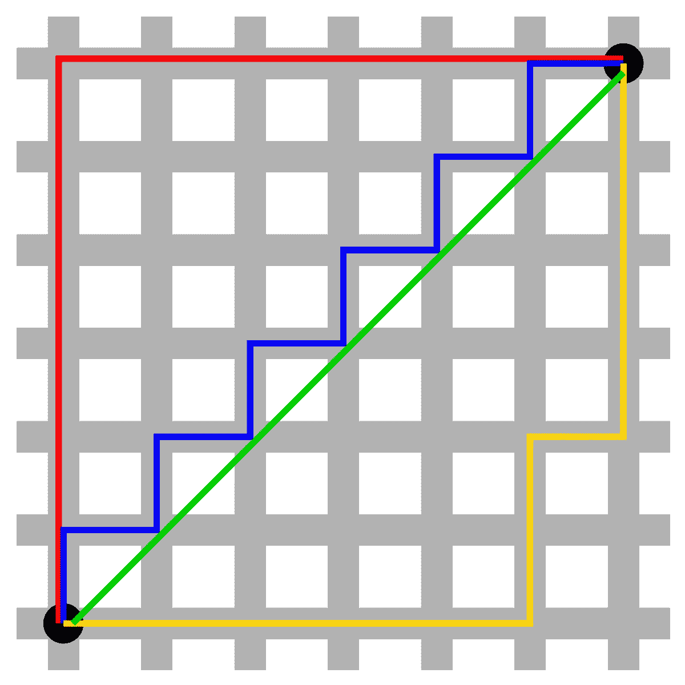
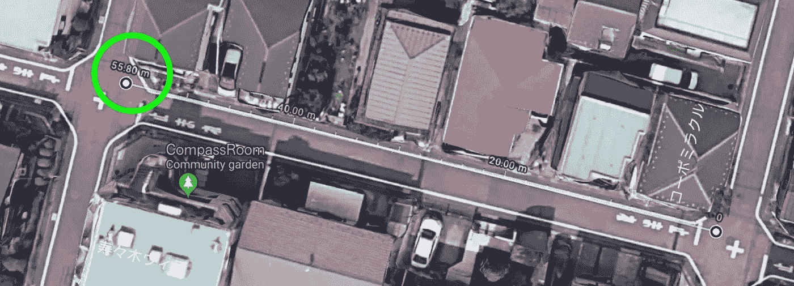
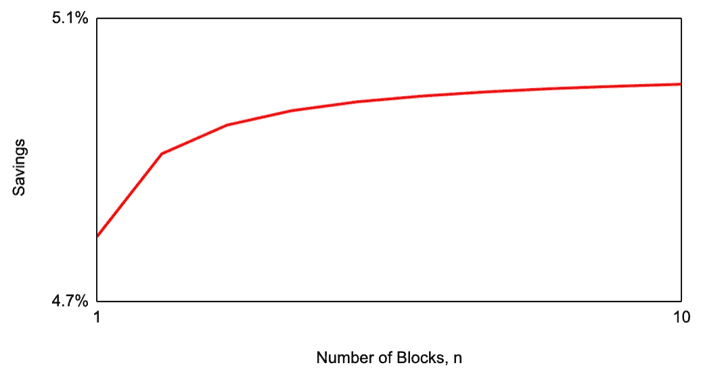

# 当曼哈顿的距离不够的时候

> 原文：<https://towardsdatascience.com/when-the-manhattan-distance-isnt-enough-4339f7c57b82?source=collection_archive---------34----------------------->

## 寻找最佳路线


Photo credit: [Jaanus Jagomägi](https://unsplash.com/@jaanus?utm_source=unsplash&utm_medium=referral&utm_content=creditCopyText).

晚上，我沿着安静的街区里几个漂亮的长方形街区散步回家。当我第一次搬进我的公寓时，我每天会沿着不同的路线随意漫步，探索这片土地，但过了一段时间后，我开始迷恋上一条曲折的道路——但这是为什么呢？

因为是**最短的**。

让我们来探究为什么会这样，以及以这种方式走路可以节省多少时间。我们将进行一些基本的数学建模，并找出在极端情况下会发生什么——让我们开始工作吧！

# 什么距离？

当我们谈论两个事物之间的距离时，我们通常会谈论“直线距离”或曼哈顿距离。前者是到达那里的直接路线，而后者是如果你必须沿着一个严格的网格模式走的距离。您可以在下图中看到这些表示。



Difference distance measurements: as the bird flies (green), and the Manhattan distance (red, blue or yellow). Credit: [Wikpedia](https://en.wikipedia.org/wiki/Taxicab_geometry).

这种定义距离的方式有很多应用，从国际象棋到纯数学到计算生物学。你会注意到一个缺点，真实的街道是有宽度的。

人类相当懒惰，或者，换句话说，*我们抄近路*。这意味着当我们在街上行走时，我们有时会沿着对角线行走，以减少行走的总距离。这仅仅是因为切割一个角的距离比跟随一个形状的外部要短。你可以在这里看到勾股定理[的简单证明](http://jwilson.coe.uga.edu/emt669/Student.Folders/Morris.Stephanie/EMT.669/Essay.1/Pythagorean.html)。

因此，如果我们考虑一条有宽度的道路，那么现在两点之间的最短距离是多少？

# 让我们来看看数学

在这两个极端中，我们有上图所示的红线和蓝线，让我们在一个较小的 2x2 模块上计算它们的性能。我们假设从左下角开始，希望在右上角结束。道路的宽度将是 w，两条道路之间的距离将是 l。


A simple 2x2 street block depicting the optimal route (green), the longer routes (red) and the best possible route (blue).

请注意，最短的路线(绿线)可以表示为:

```
Distance (optimal) = sqrt( 2 x (2l+3w)^2 )
```

首先，对于红线，我们假设还是不偷工减料。那么测量的距离将是

```
Distance (red, long) = [ 2 x (l+w) + w ] x 2
                     = 4l + 6w
```

现在让我们只切一个角，在到达终点之前，向左上角前进。

```
Distance (red, short) = sqrt( (2x(l+w))^2 + w^2 ) x 2
                      = sqrt( 4l^2 + 5w^2 + 4lw ) x 2
```

这有点复杂，但希望您仍然能够理解。

我们现在可以看一下蓝线，它允许我们切掉尽可能多的角，从而得到公式:

```
Distance (blue) = ( sqrt((l+w)^2+w^2) + sqrt(l^2+w^2) ) x 2
```

那很好，但是这些公式如何比较？我们能节省多少时间？

# 数据

为了进行计算，我们需要道路的平均长度和宽度。在谷歌地图上用距离计算器测量我家附近的距离，我发现平均长度为 55 米，宽度为 3 米。我敢肯定，这在世界各地甚至在不同的社区都有所不同，所以请随意尝试您自己的数字。



Measuring street sizes with Google Maps, 55m long and 3m wide, on average.

将这些代入我们上面的公式得到以下结果:长红色距离= 238 米，短红色距离= 232 米，蓝色距离= 226 米，最佳距离= 168 米。这意味着，我们的最短路线将是沿着蓝色路径抄近路，节省 12 米的距离，即 5%！

正如文章开头所提到的，我的房子离车站有四个街区远，也就是说公式必须根据更多的街区进行调整。这样做的结果是最长距离为 470 米，最短距离为 447 米。这仍然是 5%的适度节省，但现在相当于节省了 2300 万英镑——这只是一种方式！

通过遵循之字形方法，我可以每天节省将近 5000 万英镑，或者每月节省 1.5 公里。这听起来可能不算多，但是以人类平均 5 公里/小时的行走速度，每个月可以节省将近 20 分钟！

# 更多，更多！

我的街区只有四个宽和四个高，但是更大的街区呢？随着我们看到越来越大的区域，我们能节省多少？

让我们考虑一下，随着块数 n 向无穷大增加，我们的公式会发生什么变化。我们必须将上述公式推广到 n 个区块，给出:

```
Distance (blue) = sqrt((l+w)^2+w^2) x 2 + sqrt(l^2+w^2) x (n-1) x 2
```

随着 n 的增加，左边的项变得无关紧要，留给我们:

```
Distance (blue) = sqrt(l^2+w^2) x n x 2
```

让我们将这种情况与广义的最差解决方案进行比较。

```
Distance (red, long) = [ n x (l+w) + w ] x 2
```

更大的 n，重新排列，得到:

```
Distance (red, long) = (l+w) x n x 2
```

所以我们能走的最长距离和最短距离的比率是:

```
Distance (blue) / Distance (red, long) = sqrt(l^2+w^2) / (l+w)
```

将我所在街道的数字代入，得出 5%，与我们之前对四个街区的计算非常相似。这是一个有趣的结果，它告诉我们，无论我们走多少个街区，我们仍然只能节省最大距离的 5%。



As the number of blocks increases, we hit a limit to the amount of savings we can have. For streets with length of 55m and width of 3m, this is around 5%.

然而，我们可以看到，不同的道路宽度和长度值可以节省更多的成本。例如，如果我走过的路的宽度是两倍，那么节省的成本几乎是 10%。

# 抄近路

这篇文章展示了抄近路的好处。我们不仅应该在有意义的时候在业务中这样做(尤其是在初创公司，想象一下成本降低 5%！)，要在个人生活中做到，才能获得真正的积蓄。

它还显示了如何将简单的建模和估计应用于问题，以发现有趣的关系，例如走过的街区数量与节省的时间之间的无关性。

最后，我希望你已经学会了一两件关于走路的事情，下次你决定走哪条路回家时，你会三思而行。

**注意**:斜过马路请小心；我住在一个安静的街区，但这种行为在繁忙的街道上肯定不太好。在节省时间之前，保持安全！