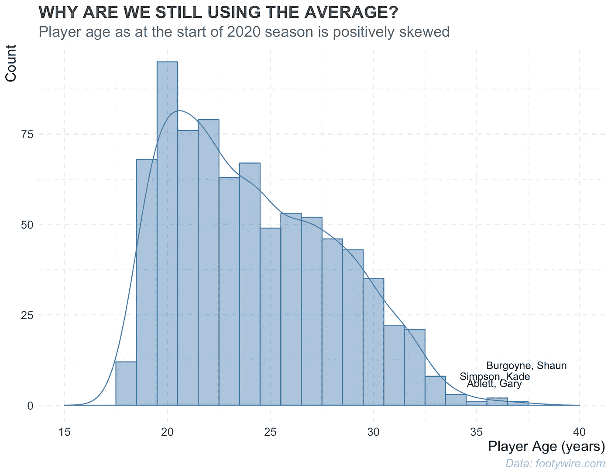
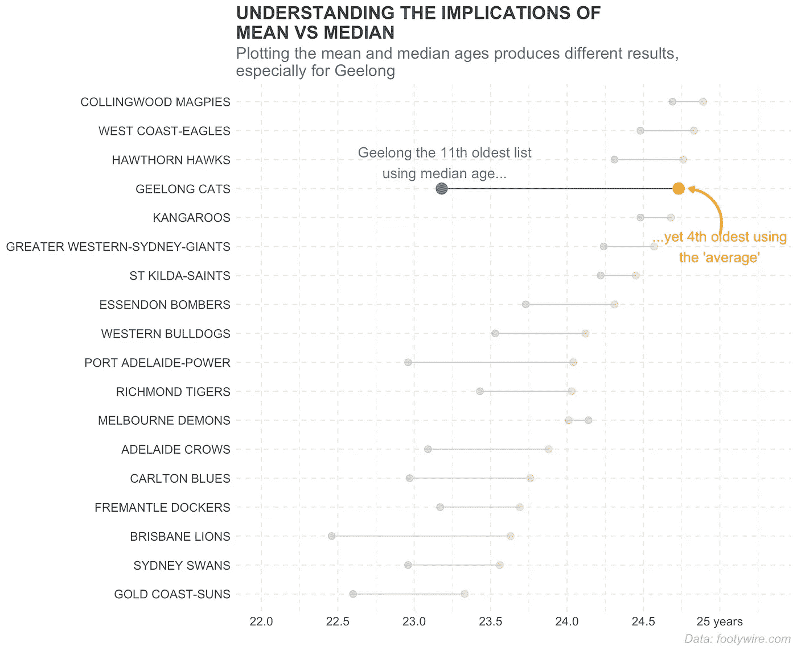

# 当使用的统计数据改变了 2020 年美国劳工联合会的年龄叙述

> 原文：<https://towardsdatascience.com/when-the-statistic-used-changes-the-afl-age-narrative-for-2020-954e938076ef?source=collection_archive---------39----------------------->

## 我们应该使用平均值还是中位数？

在看到我心爱的 Hawthorn Hawks 在他们的网站上发布了一篇关于每个球队球员年龄的文章后，媒体喜欢引用 Champion Data 的“平均年龄”作为他们的衡量标准，这让我感到愤怒。

从 2020 年 AFL 超级联赛赛季开始时球员的年龄分布可以看出，这个数字将被名单上的老球员扭曲，特别是像肖恩·伯格因、凯德·辛普森、小加里·阿布莱特这样的球员…

Would the mean or median be a better measure with this distribution?

# 意思是，中间值…那又怎么样？

*的意思是*，来自[维基](https://en.wikipedia.org/wiki/Mean)；

> 对于数据集，算术平均值，也称为数学期望或平均值，是一组离散数字的中心值:具体来说，是值的总和除以值的个数。

*中位*，亦[维基](https://en.wikipedia.org/wiki/Median)；

> 中位数是将数据样本(总体或概率分布)的上半部分与下半部分分开的值。对于一个数据集，它可以被认为是“中间”值。例如，在数据集{1，3，3，6，7，8，9}中，中位数是 6，样本中第四大也是第四小的数。对于一个连续的概率分布，中值是这样一个值，使得一个数有相等的可能落在它之上或之下。

当数据不是正态分布在平均值周围时(就像这里的情况)，用它来描述中心的度量是误导的。在这种情况下，中位数提供了更具代表性的统计数据。对于如上图所示的正偏态分布，统计 101 告诉我们，中值将小于平均值，而当分布为负偏态时，情况正好相反。

2020 年 AFL 超级联赛赛季球队名单上所有球员的平均年龄是 24.17 岁，而平均年龄是 23.6 岁。

# 那么为什么他们仍然报告平均值呢？

我怀疑媒体报道平均年龄有两个原因；

1.  谁会费心去解释均值和中值之间的细微差别；或者更有可能，
2.  对于一些团队来说，平均水平更倾向于将这个数字拉得更高，从而推动他们想要运行的叙事。

# 不同措施的影响

当我们绘制每个团队的平均年龄和中值年龄时，我们可以看到我们得到了一些非常不同的结果。

我们相信吉朗猫队拥有第四古老的名单，但当使用中位数作为统计数据时，他们是第 11 古老的比赛名单，袋鼠，GWS，圣徒，魔鬼，轰炸机，牛头犬和老虎都比他们有更古老的名单。

其他一些影响:

*   布里斯班雄狮队拥有 2020 赛季最年轻的名单，而不是黄金海岸队
*   老鹰队实际上是第四老的名单，北墨尔本是第三
*   恶魔是第七古老的名单，而不是第十二古老的
*   权力是第三(与天鹅)最年轻的名单，而不是第十老

Orange points represent the mean, while blue points the median

# 这些有什么关系呢？

这个数字是如何报告的最终可能无关紧要；当谈到英超成功的最终荣耀时，比赛名单的年龄可能并不那么重要，正如我们可以在这个伟大的分析中看到的最近英超球队的不同年龄分布。

除此之外，如果能看到这个数字报告得更准确一点，那就更好了。

咆哮。完毕。

*这个帖子的数据和用来刮的代码可以在这里***找到。**

****本帖原创，发布在不怪数据博客***[***https://www.dontblamethedata.com***](https://www.dontblamethedata.com/)*