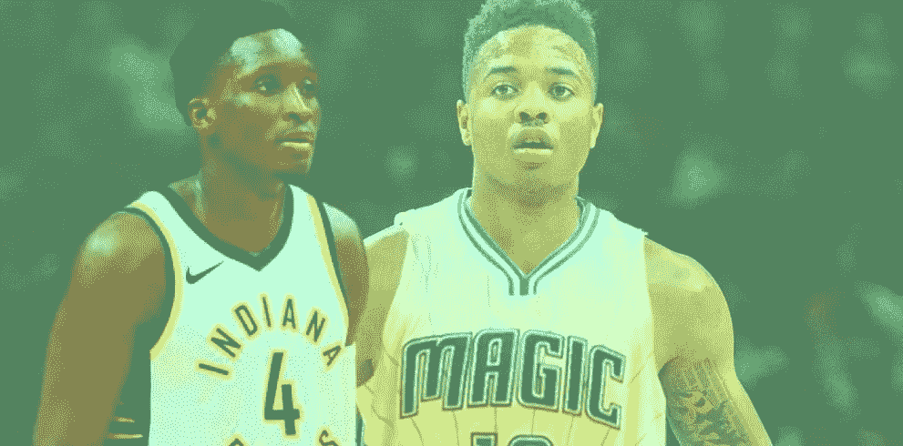
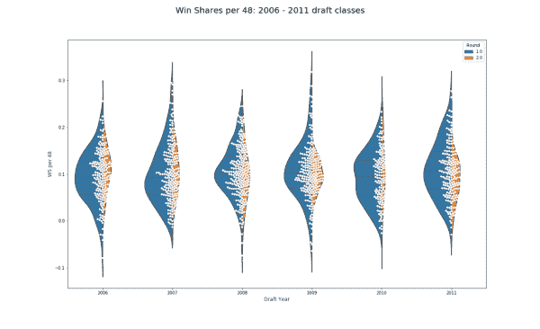
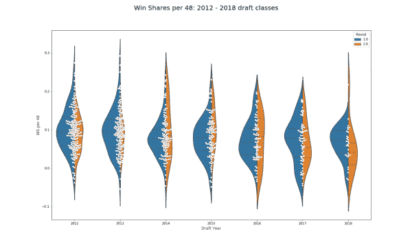
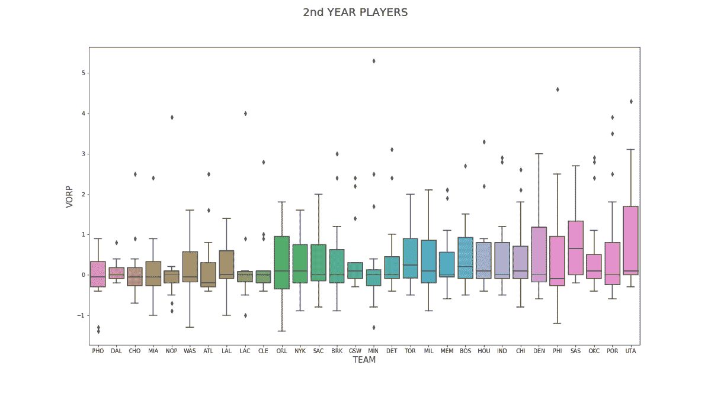

# 什么时候放弃？

> 原文：<https://towardsdatascience.com/when-to-give-up-117e2e2acdc9?source=collection_archive---------36----------------------->

## 对 NBA 球员相对于选秀状态的价值，他们成功的可能性，以及如何确定资产价值的检查。

当魔术队把维克多·奥拉迪波交易到俄克拉荷马雷霆队换来赛尔吉·伊巴卡时，他们放弃了他。七年来，伊巴卡一直是雷霆队的核心球员，但在很大程度上走了下坡路，而奥拉迪波理论上是魔术队的未来。奥拉迪波在 2013 年 NBA 选秀中被选为第二顺位，在联盟的第一年是一名稳定的球员，他的球员效率评分为 13.6 [，投篮命中率为 51.4%，使用率为 24.4%。奥拉迪波在那个赛季的防守上也是一个怪物，创造了 2.8 个防守赢球份额和 1.71 的](https://en.wikipedia.org/wiki/Player_efficiency_rating)[德雷蒙德评分](https://fivethirtyeight.com/features/a-better-way-to-evaluate-nba-defense/)。

简而言之，奥拉迪波的思路是正确的。他以你希望的方式生产你的新秀彩票选秀权。那么，为什么仅仅两年后，魔术队就要让他打包走人，因为这个大个子不能从外线投篮，也没有达到他 22 岁、23 岁和 24 岁时的水平？

我不会冒昧地知道魔术放弃奥拉迪波的全部原因，但我会猜测，当奥拉迪波准备进入他在联盟的第四个赛季时，有人认为奥拉迪波已经是他将要成为的球员；他已经展示了自己的能力，但还没有明显的进步。两年后的另一次交易，这次是印第安纳步行者，奥拉迪波度过了一个爆发的赛季，入选 2018 年全明星队，并带领步行者队进入季后赛。

当然，并不是每个选秀权都有这种跳跃，NBA 前台的工作就是正确评估谁会有更多的跳跃。但是我们如何做出这个决定呢？一个前第一轮选秀权在 NBA 的第二年比第二轮选秀权更有可能实现未来的飞跃吗？来个前 10 名的选秀怎么样？最高选秀权是否比第一轮中后期选上的人更有可能实现未来的飞跃？我们都认为自己知道这些答案，但是数据支持我们的信念吗？

当一个球员被选中时，他的选择本质上是对他在 NBA 成功可能性的评估；较高的选择者被认为比较低的选择者更有可能成功。这大体上是真的。如果你看看按选秀顺位分列的 PER(上场时间超过 1000 分钟的球员)分布；很明显，生产和草稿状态之间存在关系。

问题是，一旦一个球员在联盟呆了一段时间，并且表现稳定，不管他的表现如何，有没有办法预测他未来的成长？我们能想到奥拉迪波会在表演上有巨大的飞跃吗？魔术最近交易了前状元秀马克尔·富尔茨。有没有办法确定富尔茨能否东山再起？如果有，如何实现？线索是否在于他的年龄，选秀位置，统计的表现数据，他效力的球队？人们认为继续投资一个前 10 名的球员会更好，但从 20 多岁或 30 多岁的球员继续前进也许没问题。他们是正确的吗？让我们更深入地研究一下数据。

*The distribution of WS/48 (Win Shares per 48 minutes) of each draft class going back to 2006.*

上面你可以看看自 2006 年以来，每名至少打了 500 分钟的 NBA 球员的 WS/48(每 48 分钟的赢球份额)的分布情况。这些是小提琴图，表达了 WS/48 的分布，其中每个图的蓝色半部分显示了第一轮(前 30 名)选秀中选出的球员，橙色半部分显示了第二轮(第 31-60 名)选秀中选出的球员。每把小提琴代表一年，第一个图表显示 2006-2011 年的选秀课程，第二个图表显示 2012-2018 年的选秀课程。小提琴内部的白点各代表一名演奏者。如果你仔细观察，你会发现每把小提琴内有三条虚线。中间的线代表该特定吃水深度等级的 WS/48 中值，而上下虚线给出了该特定吃水深度年份数据的四分位数范围的界限。这些图表起初看起来可能不寻常或令人生畏，但是如果你把这些图翻转过来，它们可能看起来更熟悉一些，就像概率分布。

有什么跳出来了？首先，对于最近的草案，WS/48 的发行版正在减少。这意味着经验不足的玩家生产的 WS 更少。不奇怪。然而，值得注意的是，随着我们离 2006 年越来越远，离 2018 年越来越近，第二轮选秀权所拥有的分配份额也在增加。这是我们将来可以深入研究的事情。要更仔细地观察，请查看下表:

*   *请注意，图像显示的是“DRAFT_YEAR + 1”。所以这里的 2019 指的是 2018 年选秀的球员，2018 指的是 2017 年选秀的球员等等*

在 2014 年，2016 年，2017 年和 2018 年的选秀中，第二轮选秀权有 25-35%的分配份额，这意味着他们中更多的人在比赛，贡献和获得机会。此外，就 WS/48 而言，在过去三年中，第二轮选秀权的表现几乎与第一轮选秀权一样好。这种解释显然存在一些问题。样本量非常小，一些异常值如尼克斯队的米切尔·罗宾逊对数据有重大影响。但是，当查看任何一年的草案数据时，总是会有局限性，所以现在我们只看数据是什么。

如果你回顾一下 2006-2010 年，你会注意到平均来说，第二轮选秀权的 WS/48 和第一轮选秀权差不多。然而，样本中的首轮选秀权要多得多，大约是第一轮选秀权的五倍。也许第二轮选秀权只有在他们生产的情况下才会被保留，而第一轮选秀权会被给予更长的期限，因为他们认为未来会有回报？事实上，与第一轮选秀相比，第二轮选秀的 WS/48 标准差要低得多，当我们进入青少年选秀时，这种关系与第二轮选秀相反，表现出更多的差异。

但这仅仅是开始。这些数字让你一瞥组织可能如何评估他们的球员，他们认为谁是值得花更多时间发展的资产，谁是他们认为不值得未来的球员。我很想知道年龄、选秀位置和球队等因素对一名 NBA 球员未来的成功有多大影响。这些因素对改善有预测力吗？如果有，多少？

这是一系列帖子的第一部分，这些帖子将更深入地探讨 NBA 球队何时应该继续投资，何时应该从他们的球员名单上转移。希望这些帖子可以帮助我们更好地评估人才，并在辞职、交易和裁掉球员时做出更好的决定。

下一次，我们将看看哪些球队从他们的年轻人才中获得了最多的产量，正如下图所示的 2019 年二年级球员。

请随意查看这个博客的数据，位于 [GitHub。](https://github.com/pwalesdi/NBA_Player_Prediction)