# 当主题建模是文本预处理的一部分时

> 原文：<https://towardsdatascience.com/when-topic-modeling-is-part-of-the-text-pre-processing-294b58d35514?source=collection_archive---------14----------------------->


Photo credit: Unsplash

## 如何有效和创造性地预处理文本数据

几个月前，我们使用相对干净的文本数据集构建了一个基于内容的推荐系统。因为我自己收集了酒店的描述，所以我确信这些描述对我们将要完成的目标是有用的。然而，现实世界中的文本数据从来都不是干净的，不同的目标有不同的预处理方法和步骤。

NLP 中的主题建模很少是我在分析中的最终目标，我经常使用它来探索数据或作为一种工具来使我的最终模型更加准确。让我告诉你我的意思。

# 数据

我们仍然在使用我之前收集的[西雅图酒店描述数据集](https://raw.githubusercontent.com/susanli2016/NLP-with-Python/master/data/Seattle_Hotels_dirty.csv)，这次我把它变得更加混乱了。我们将跳过所有的 EDA 过程，我想尽快提出建议。

如果你读过我的[上一篇文章](/building-a-content-based-recommender-system-for-hotels-in-seattle-d724f0a32070)，我相信你理解下面的代码脚本。是的，根据酒店描述文本，我们正在寻找与“西雅图市中心希尔顿花园酒店”(除了它自己)最相似的前 5 家酒店。

# 提出建议

dirty_hotel_rec.py

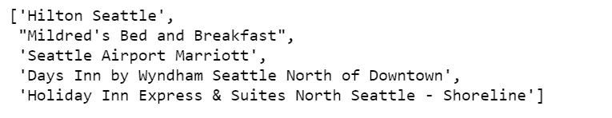

Figure 1

我们的模型返回上述 5 家酒店，并认为它们是与“希尔顿花园酒店西雅图市中心”最相似的前 5 家酒店。我敢肯定你不同意，我也不同意，先说为什么模型看这些描述会觉得它们很相似。

```
df.loc['Hilton Garden Inn Seattle Downtown'].desc
```

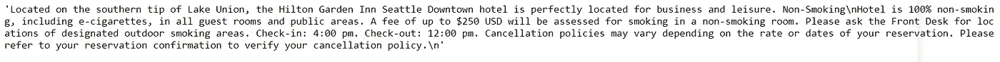

```
df.loc["Mildred's Bed and Breakfast"].desc
```

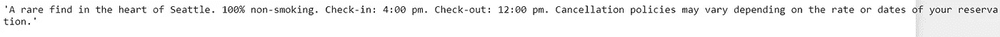

```
df.loc["Seattle Airport Marriott"].desc
```


发现什么有趣的东西了吗？是的，在这三家酒店的描述中确实有一些共同点，他们都有相同的入住和退房时间，并且他们都有相似的吸烟政策。但是它们重要吗？我们能仅仅因为两家酒店都是“无烟”就宣称它们是相似的吗？当然不是，这些不是重要的特征，我们不应该在这些文本的向量空间中测量相似性。

我们需要找到一种方法，通过编程安全地删除这些文本，同时不删除任何其他有用的特征。

主题建模拯救了我们。但在此之前，我们需要将数据转换成正确的格式。

*   将每个描述分成句子。因此，举例来说，希尔顿花园酒店西雅图市中心的整个描述将分为 7 个句子。

split_desc.py

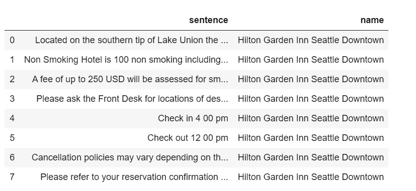

Table 1

# 主题建模

*   我们将一起为所有的句子建立主题模型。经过几次实验，我决定有 40 个题目。

sent_topic_model.py

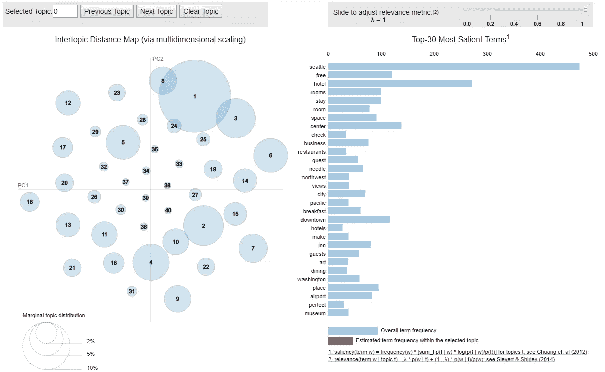

Figure 2

不算太坏，没有太多重叠。

以下关于如何显示每个主题中的热门关键词，以及如何找到每个文档中的主导主题的代码脚本，都是借用了这个优秀的[教程](https://www.machinelearningplus.com/nlp/topic-modeling-python-sklearn-examples/)。

*   为了更好地理解，您可能需要调查每个主题中的前 20 个单词。

top_20_words.py

我们将有 40 个主题，每个主题显示 20 个关键词。很难打印出整个表格，我将只展示其中的一小部分。

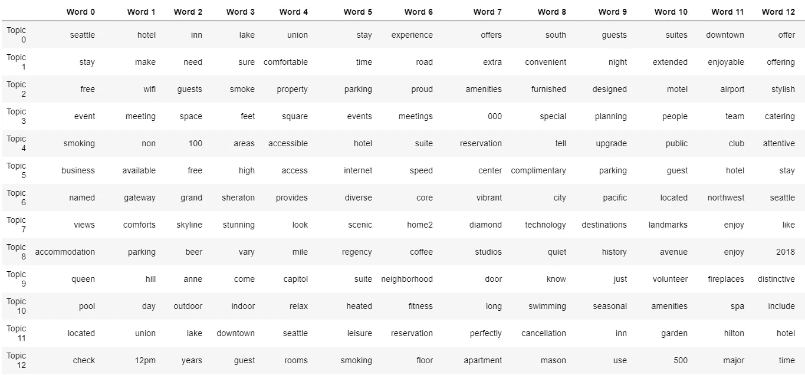

Table 2

通过盯着表格，我们可以猜测，至少话题 12 应该是我们想要忽略的话题之一，因为它包含了几个对我们的目的毫无意义的单词。

在下面的代码脚本中，我们:

*   创建文档-主题矩阵。
*   创建一个数据框，其中每个文档为一行，每列为一个主题。
*   每个主题的权重被分配给每个文档。
*   最后一列是该文档的主导主题，在其中它的权重最大。
*   当我们将这个数据框架合并到前面的句子数据框架时。我们能够找到每个主题在每个句子中的权重，以及每个句子的主导主题。

sent_topic.py

*   现在，我们可以直观地检查“希尔顿花园酒店西雅图市中心”的每个句子的主导主题分配。

```
df_sent_topic.loc[df_sent_topic['name'] == 'Hilton Garden Inn Seattle Downtown'][['sentence', 'dominant_topic']]
```

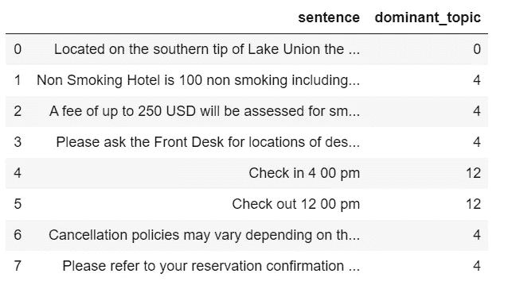

Table 3

*   通过盯着上表，我的假设是，如果一个句子的主导话题是话题 4 或话题 12，那么这个句子很可能是无用的。
*   让我们再看几个以话题 4 或话题 12 为主导话题的例句。

```
df_sent_topic.loc[df_sent_topic['dominant_topic'] == 4][['sentence', 'dominant_topic']].sample(20)
```

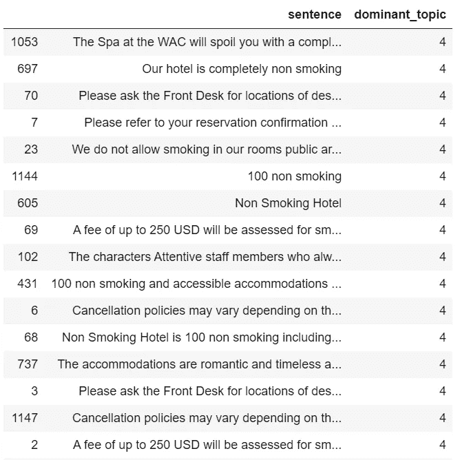

Table 4

```
df_sent_topic.loc[df_sent_topic['dominant_topic'] == 12][['sentence', 'dominant_topic']].sample(10)
```

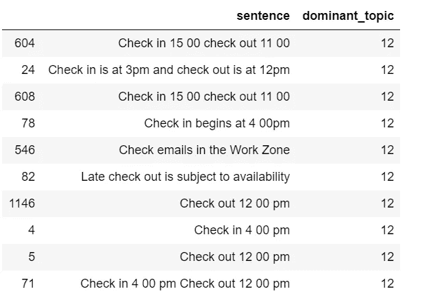

Table 5

*   在查看了上面两个表格后，我决定删除所有以话题 4 或话题 12 为主导话题的句子。

```
print('There are', len(df_sent_topic.loc[df_sent_topic['dominant_topic'] == 4]), 'sentences that belong to topic 4 and we will remove')
print('There are', len(df_sent_topic.loc[df_sent_topic['dominant_topic'] == 12]), 'sentences that belong to topic 12 and we will remove')
```

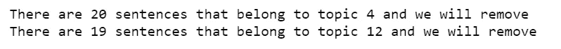

```
df_sent_topic_clean = df_sent_topic.drop(df_sent_topic[(df_sent_topic.dominant_topic == 4) | (df_sent_topic.dominant_topic == 12)].index)
```

*   接下来，我们将把干净的句子连在一起进行描述。也就是说，使其回到每个酒店的一个描述。

```
df_description = df_sent_topic_clean[['sentence','name']]
df_description = df_description.groupby('name')['sentence'].agg(lambda col: ' '.join(col)).reset_index()
```

*   让我们看看“西雅图市区希尔顿花园酒店”还剩下什么

```
df_description['sentence'][45]
```

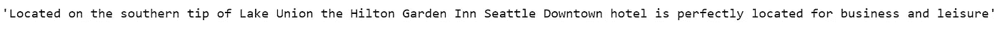

只剩下一句话，是关于酒店的位置，这是我所期待的。

# 提出建议

使用相同的余弦相似性度量，我们将根据清理后的酒店描述文本，找到与“西雅图市中心希尔顿花园酒店”(除了它自己)最相似的前 5 家酒店。

clean_desc_rec.py

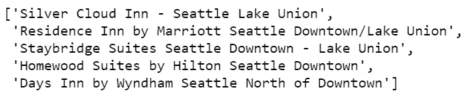

Figure 3

不错！我们的方法成功了！

[Jupyter 笔记本](https://github.com/susanli2016/NLP-with-Python/blob/master/Topic%20Modeling%20for%20Data%20Preprocessing.ipynb)可以在 [Github](https://github.com/susanli2016/NLP-with-Python/blob/master/Topic%20Modeling%20for%20Data%20Preprocessing.ipynb) 上找到。周末愉快！