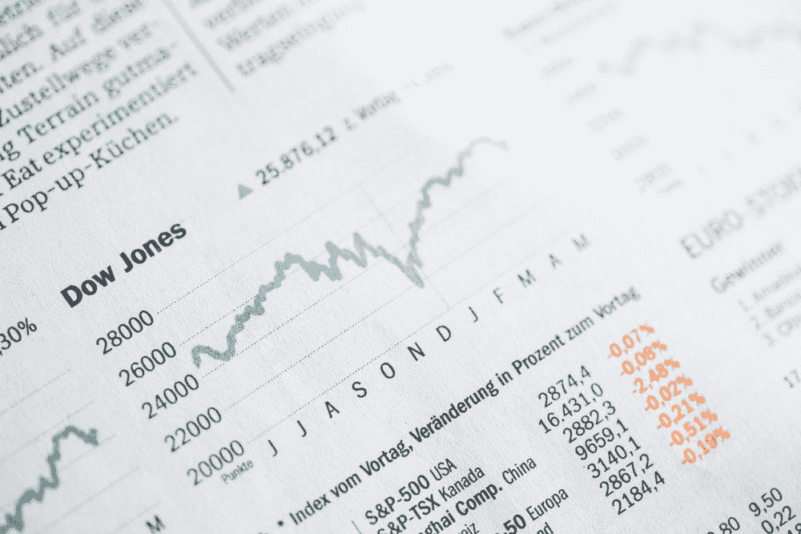
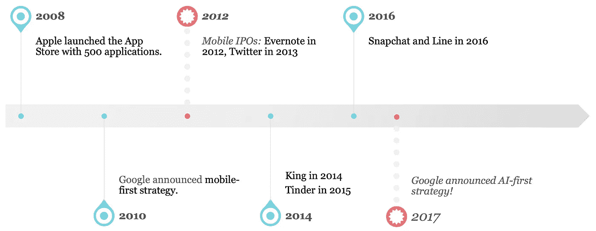
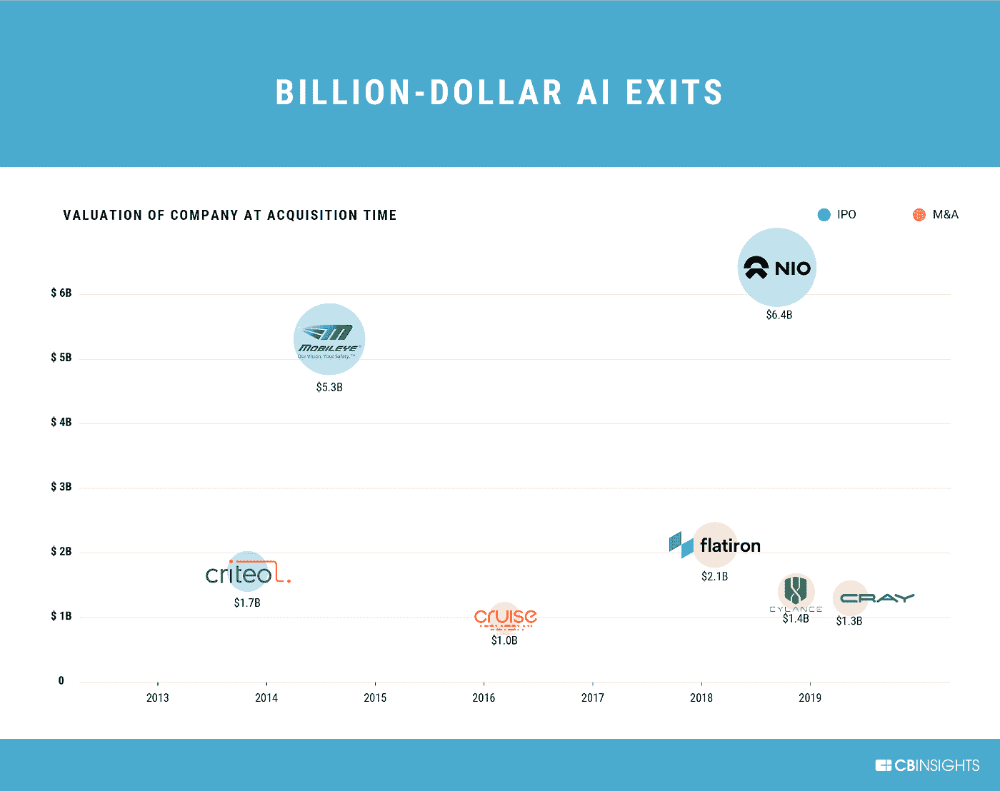
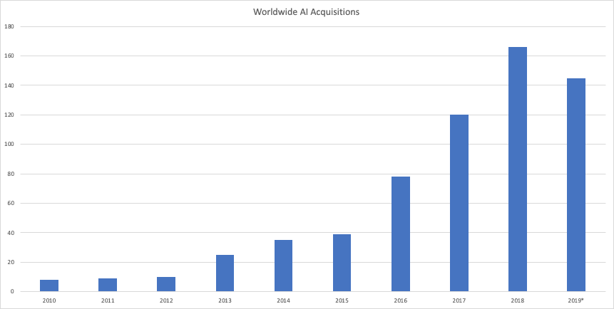
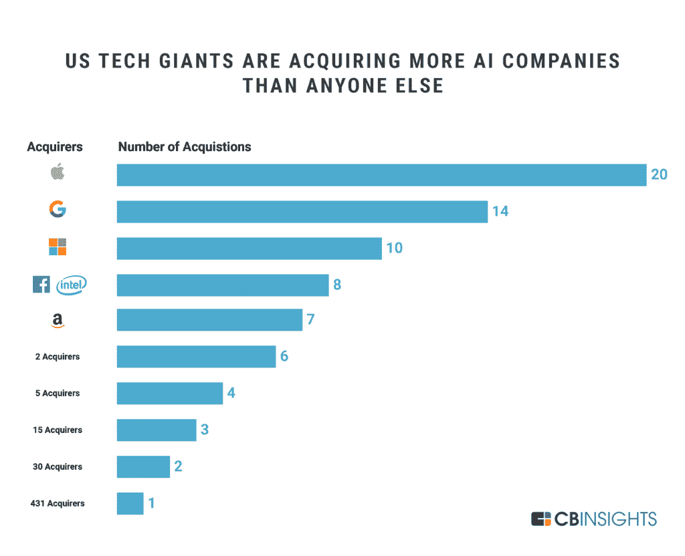
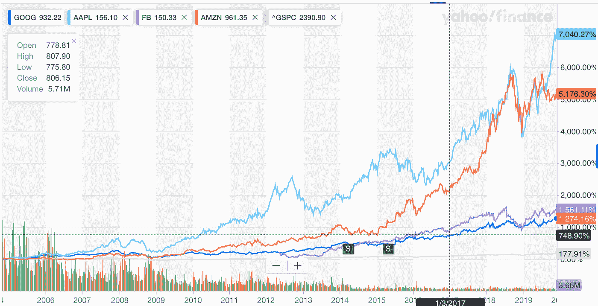

# 我们什么时候会看到第一波人工智能 IPO？

> 原文：<https://towardsdatascience.com/when-will-we-see-the-first-wave-of-ai-ipos-8ab4ddda6657?source=collection_archive---------28----------------------->

## 我们已经看到 7 家人工智能公司以$1B+的价值退出。这是一波巨大 IPO 浪潮的第一个信号吗？为什么美国的 AI IPOs 很少？美国在人工智能统治地位的竞赛中落后了吗？

2008 年 7 月 10 日，苹果推出了 App Store，最初只有 500 个应用程序。此后不久，谷歌在 2010 年宣布了移动优先战略。从那以后，我们看到了一波大规模的移动应用 IPO:2012 年的 Evernote，2013 年的 Twitter，2014 年的 King(糖果粉碎背后的公司)，2015 年的 Tinder，2016 年的 Snapchat 和 Line。

快进到 2017 年，谷歌首席执行官桑德尔·皮帅宣布了从移动优先到人工智能优先战略的转变。他后来补充说[人工智能将比历史上一些最普遍的创新如火或电](https://www.cnbc.com/2018/02/01/google-ceo-sundar-pichai-ai-is-more-important-than-fire-electricity.html)对世界产生更大的影响。两年后的今天，我们看到“ [7 家人工智能公司通过 IPO 或价值$1B+](https://www.cbinsights.com/research/billion-dollar-artificial-intelligence-exits/) 的并购退出——其中四家发生在过去两年里。”这是一波巨大 IPO 浪潮的第一个信号吗？

source: Bastiane Huang

有趣的是，尽管[美国人工智能初创公司获得了创纪录的高资金，但](https://www.cbinsights.com/research/artificial-intelligence-funding-venture-capital-2018/)我们看到较少的美国公司正在 IPO。这两起人工智能 IPO 的估值都超过了 1B: NIO 是一家中国电动自动驾驶汽车制造商。Mobileye 是一家以色列公司，生产摄像头和帮助汽车避免事故的软件。如果你用谷歌搜索“人工智能 IPO”，你会看到类似“中国人工智能初创公司旷视科技计划 IPO”的新闻以及“南韩的 JLK 检查要公开了。”但是在第一页没有提到美国的创业公司。

为什么美国的 AI IPOs 比较少？只是时间问题吗？还是美国在人工智能统治地位的竞赛中落后了？

source: CB Insights

**美国在人工智能创业领域领先，但在 IPO 领域不领先。为什么？**

答案是“绝对不会。”事实上，美国在人工智能创业领域处于领先地位:前 100 家人工智能创业公司中有 77 家来自美国。相比之下，只有 8 家中国公司上榜。此外，根据美国国家风险投资协会的数据，美国 965 家人工智能相关公司在今年前 9 个月筹集了 135 亿美元。美国人工智能初创公司有望在 2019 年打破融资记录。那么，为什么没有更多的初创公司申请 IPO 呢？

答案？收购！

人工智能初创公司的收购数量在 2016 年翻了一番，在随后的几年中平均增长了 46%。美国科技巨头正在主导人工智能初创公司的收购:根据 CB Insights 的数据，苹果(迄今已收购 20 家初创公司)、谷歌(14 家)、微软(10 家)、脸书(8 家)、英特尔(8 家)和亚马逊(7 家)是人工智能初创公司最积极的收购者。另一方面，绝大多数收购方(431 家)只收购了一家 AI 公司。

Number of artificial intelligence (AI) start-up company acquisitions worldwide from 2010 to 2019 source: Statista (as of August 31, 2019)

CB Insights

但更有趣的是，当你看到这些科技巨头市值的变化时:过去几年来，尤其是自 2017 年以来，价值大幅增加，当时你开始看到人工智能收购的激增。这解释了为什么我们在美国以外的地方看到了更多的人工智能 IPO。这里的人工智能初创公司更有可能在 IPO 之前被收购。

2013 年，苹果、微软、谷歌和英特尔已经跻身《T2》全球十大最有价值公司之列。但直到最近几年，它们与标准普尔 500 指数(^GSPC，上面的灰色线)的差距并不大。科技巨头在过去几年里扩大了他们的差距。

**这对初创公司和其他公司意味着什么？**

在过去，每次有技术创新，我们都会看到重大的行业洗牌。小公司颠覆了现有公司，推出了手机、个人电脑、数码照片和流媒体视频。

但是这次不一样！

谷歌、脸书、苹果和亚马逊等科技巨头比任何人都准备得更充分。他们在数据、资本和人才方面拥有优势，不仅可以击败创新型创业公司，还可以颠覆传统行业。其中，零售和 CPG 的人工智能收购数量最多(自 2010 年以来共 67 起)，其次是媒体和娱乐、医疗保健、金融和保险以及运输和物流。

到目前为止，谷歌、苹果和微软都收购了 10 多家人工智能初创公司。最近，传统企业开始慢慢做出反应:罗氏收购了熨斗健康公司。耐克收购了人工智能库存管理初创公司 Celect。以及麦当劳收购个性化平台 Dynamic Yield。

让传统行业参与者更加棘手的是，人工智能是隐形的。有了以前的技术创新，比如互联网和移动应用，我们可以很容易地分辨好的/创新的产品和坏的产品。但用 AI 产品做到这一点并不总是那么容易。例如，你真的不知道在你的大楼里巡逻的安全机器人是由人工智能完全自主供电还是由人类远程控制。

尽管大肆宣传，但事实是市场上还没有那么多人工智能产品。超过 80%的公司都在研究人工智能，但是他们中的大部分仍然试图找出能够创造实际价值的用例。我们只是最近才开始看到人工智能机器人部署在现场。风险投资公司 MMC 声称 [40%的欧洲人工智能初创公司实际上并不使用人工智能。外人很难知道到底发生了什么。](https://www.theverge.com/2019/3/5/18251326/ai-startups-europe-fake-40-percent-mmc-report)

毫无疑问，人工智能将对各行各业产生巨大影响，但“人工智能作为一种产品”仍处于起步阶段。现在断言第一波人工智能 IPO 可能还为时过早。但很明显，传统的现任者这次面临着比以往任何时候都多的挑战，不仅来自灵活的初创公司，也来自人工智能技术巨头。如果你正在为一家传统公司工作，并试图采用人工智能，那么专注于你可以利用你的领域专业知识并创造实际价值的地方。“AI 是新电。它将改变每个行业，创造巨大的经济价值，”吴恩达说。但是，你不一定要成为一个电力公司来开发价值。你只需要知道如何将技术应用到你的优势上。

如果你想看更多这样的文章，请点击这里！

Bastiane Huang 是 OSARO 的产品经理，OSARO 是一家总部位于旧金山的初创公司，致力于开发软件定义的机器人技术。她曾在亚马逊的 Alexa 小组和哈佛商业评论以及该大学的未来工作倡议中工作。她写关于人工智能、机器人和产品管理的文章。跟着她到这里 。