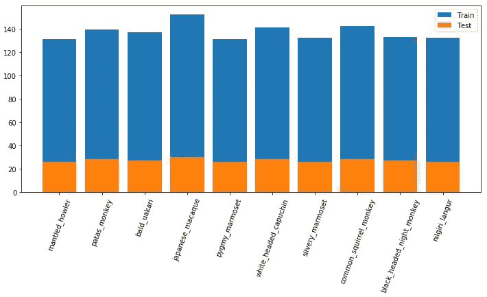
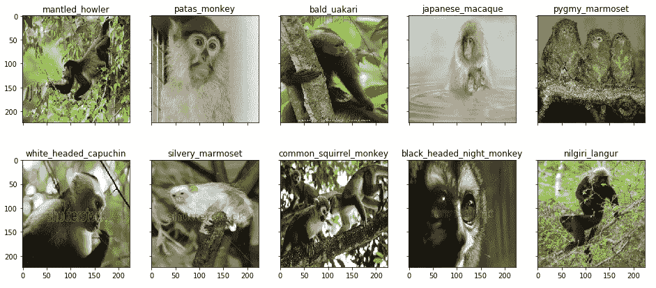
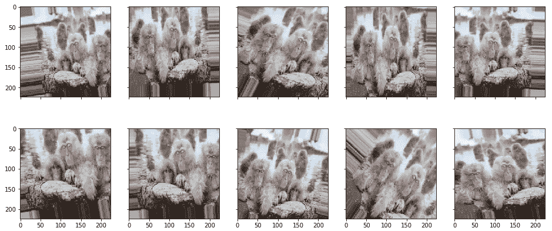
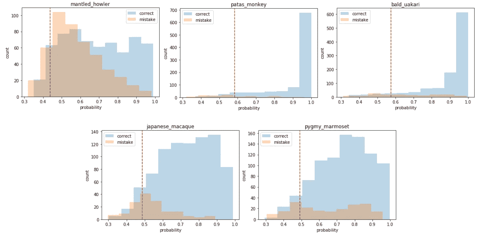
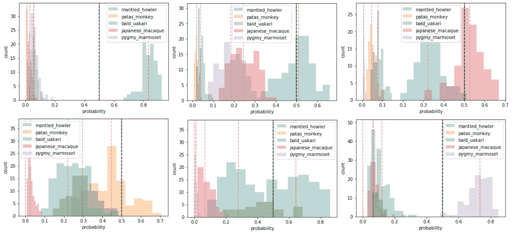

# 当你的神经网络不知道:一个贝叶斯方法与 Keras

> 原文：<https://towardsdatascience.com/when-your-neural-net-doesnt-know-a-bayesian-approach-with-keras-4782c0818624?source=collection_archive---------11----------------------->

## 深度学习中模型不确定性的表示


Photo by [Rob Schreckhise](https://unsplash.com/@robschreckhise?utm_source=medium&utm_medium=referral) on [Unsplash](https://unsplash.com?utm_source=medium&utm_medium=referral)

每个试图拟合分类模型并检查其性能的人都面临着这样的问题:不仅要验证 KPI(如准确度、精确度和召回率)，还要验证*模型对它所说的内容有多有信心*。用来验证预测可靠性的最直观的工具是寻找各种类别的概率。

概率越高，可信度越高。这并不意味着更高的准确性。很有可能出现错误分类。

我们现在所做的是从我们拟合的模型中提取最佳结果，研究概率分布，并试图在我们的神经网络被迫做出决定时限制错误。我们以两种方式完成这项任务:

*   验证数据概率的经典研究，目的是建立阈值以避免错误分类。
*   最近的一种方法是基于贝叶斯理论的概率推断，在神经网络框架内有一个“*排列*，称为**蒙特卡洛退出，它几乎免费提供不确定性估计**，如本文中的[所示。](https://arxiv.org/abs/1506.02142)

# 数据

我在 Kaggle 上找到了这个实验的数据。我选择了一个有趣的数据集，其中包含了 10 种猴子的图片。*数据集由两个文件组成，训练和验证。每个文件夹包含 10 个子文件夹，标记为 n0~n9，每个对应一个物种形成* [*维基百科的猴子进化树*](https://en.wikipedia.org/wiki/Monkey) *。*



Image distribution of monkey species among train and validation folders

这些图像质量很好，并且在各个类别之间保持平衡。



Samples of monkey images from each species

我们用 Keras 'ImageDataGenerator '装载它们，在火车上执行数据扩充。在此过程中，我们存储 10%的训练集作为验证，这将有助于我们尝试按照标准方法建立概率阈值。根据本帖的范围，我们限定了目标类，只考虑前五种猴子。

# 模型

我们想要使用的神经网络结构是由简单的卷积层、最大池块和漏失构成的。最后一个是正则化训练的基础，稍后当我们用贝叶斯过程解释神经网络的不确定性时会派上用场。

```
inp = Input(shape=SHAPE+tuple([3]))x = Conv2D(32, (3, 3), activation='relu')(inp)
x = MaxPooling2D(pool_size=(2, 2))(x)
x = Conv2D(32, (3, 3), activation='relu')(x)
x = MaxPooling2D(pool_size=(2, 2))(x)
x = Dropout(0.5)(x, training = True)x = Conv2D(64, (3, 3), activation='relu')(x)
x = MaxPooling2D(pool_size=(2, 2))(x)
x = Conv2D(64, (3, 3), activation='relu')(x)
x = MaxPooling2D(pool_size=(2, 2))(x)
x = Dropout(0.5)(x, training = True)x = Flatten()(x)
x = Dense(512, activation='relu')(x)
x = Dropout(0.3)(x, training = True)out = Dense(5, activation='softmax')(x)model = Model(inp, out)
model.compile(loss='categorical_crossentropy', optimizer='adam', metrics=['accuracy'])
```

在训练之后，测试的准确度在 0.79 左右，迫使我们的模型对所有进行分类。

## 标准阈值的不确定性

我们介绍的第一种方法是基于对验证集上计算的概率的简单研究。这个过程使我们能够知道我们的神经网络何时失败，以及每类错误的置信度。通过这种方式，我们创建了与模型的最终预测结合使用的阈值:如果预测的标签低于相关类别的阈值，则我们拒绝进行预测。

我们的验证由 10%的训练图像组成。为了有足够的概率分布来建立有意义的阈值，我们在验证时适当地操作数据扩充:在预测阶段，每个图像被扩充 100 倍，即每个样本多 100 个概率。



在使用我们的扩充数据的预测步骤结束时，我们有 3 种不同的分数分布:每个类别的概率分数、错误分类样本的概率分数(在每个类别中)、正确分类样本的概率分数(在每个类别中)。



Probability Distributions on validation data with augmentation

我们将每个类别的三个引用分布中的第一个作为第 10 个百分位数来计算阈值。预测概率低于能力阈值的测试图像被标记为“*未分类为*”。抑制未分类的*图像(共 20 张)，精度从 0.79 提高到 0.82。*

## *贝叶斯理论的不确定性*

**贝叶斯概率理论提供了基于数学的工具来推理模型的不确定性，但这些通常伴随着令人望而却步的计算成本*。*令人惊讶的是，可以在不改变任何东西的情况下，将最近的深度学习工具转换为贝叶斯模型！*解决方案是使用神经网络中的漏失作为贝叶斯近似。*

*具体来说，在每个隐藏层之后应用随机漏失，因此模型输出可以近似地视为从后验预测分布生成的随机样本。因此，模型的不确定性可以通过位置指数或其他从几次重复的预测中获得的统计数据来估计。这个过程特别吸引人，因为它易于实现，并且可以直接应用于任何现有的神经网络而不会损失性能。*

*给定一个新的输入图像，我们激活 dropout，将其设置为 0.5(在训练结束时由 Keras 关闭)并计算预测。当我们重新激活辍学生时，我们改变了我们的神经网络结构，结果也是随机的。很明显，如果我们对每个测试样本重复预测 100 次，我们将能够**建立每个类别中每个样本的概率分布**。都可以用一些丰富多彩的情节来澄清。*

**

*examples of Probability Distributions on test images*

*在这一点上，评估很容易…如果在多个概率样本中，该图像的中值概率同时高于其他中值(上图中的红色虚线)并且至少为 0.5(上图中的绿色虚线)，我们希望神经网络输出一个猴子物种作为推荐。否则，我们将该图像标记为未分类为的*。抑制未分类的*图像(共 16 张)，精度从 0.79 提高到 0.83***

# **摘要**

**在这篇文章中，我们评估了两种不同的评估神经网络可信度的方法。一种标准的方法是保留部分数据作为验证，以便研究概率分布和设置阈值。这是每种型号的通用程序。另一种方法建议应用随机退出，以建立概率分布并研究它们的差异。这两种技术都有助于避免错误分类，放松我们的神经网络，在没有太多信心的时候做出预测。**

**[**查看我的 GITHUB 回购**](https://github.com/cerlymarco/MEDIUM_NoteBook)**

**保持联系: [Linkedin](https://www.linkedin.com/in/marco-cerliani-b0bba714b/)**

****参考文献****

**贝叶斯近似下的辍学:表现深度学习中的模型不确定性:亚林·加尔，邹斌·格拉马尼**