# 现代艺术中的女性都去哪了？

> 原文：<https://towardsdatascience.com/where-are-all-the-women-in-modern-art-7c5fd08ea1cd?source=collection_archive---------20----------------------->

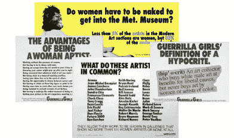

在最精英的艺术机构中，艺术策展严重偏向于支持男性代表。1985 年，一群匿名的美国女艺术家“游击队女孩”在纽约市张贴了 30 张不同的海报。事实上，这个团体是在现代艺术博物馆(MoMA)举办展览时成立的，在该展览中，女性艺术家的比例不到 10%。他们的工作试图激励[“博物馆、经销商、策展人、评论家和艺术家，他们觉得这些人对……主流展览和出版物排斥女性和非白人艺术家负有积极责任”。](https://www.tate.org.uk/art/artworks/guerrilla-girls-do-women-have-to-be-naked-to-get-into-the-met-museum-p78793)

他们是从哪里得到这 5%的数据的？他们从博物馆报告和杂志中创建了自己的数据集。那是近 30 年前的事了，我们可以利用今天可用的数据做得更好。我们可以从激发游击队女孩行动号召的博物馆开始分析。

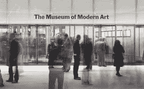

自 1929 年以来，现代艺术博物馆已经获得了超过 200，000 件艺术品，其中 138，567 件已被编入 Github 上发布的[数据集。](https://github.com/MuseumofModernArt/collection)

与其他博物馆的开放数据集不同，如[泰特美术馆](https://github.com/tategallery/collection)(最近更新于 2014 年)和[库珀休伊特美术馆](https://github.com/cooperhewitt/collection) (2016 年)，MoMA 每月自动更新其数据。MoMA 是世界上最大和最有影响力的现代艺术博物馆之一。其收藏侧重于现代和当代艺术，包括素描、版画、摄影、建筑、设计、电影、绘画、雕塑、媒体和表演等类别。

令人惊讶的是，尽管该数据集自 2015 年以来一直在发布，但只有少数个人和团体对其进行了轻度探索。纽约现代艺术博物馆的 2229 幅画作缩小了范围；研究员 Florian krutli 发表了高水平的[时序分析](http://research.kraeutli.com/index.php/2015/09/moma-on-github/?source=post_page---------------------------)；其他艺术爱好者针对他们提出的特定问题制作了一次性图表(例如:[现代有多现代？](https://twitter.com/lubar/status/626349654830092289?source=post_page---------------------------)[MoMA 保鲜](https://twitter.com/freakonometrics/status/626274944293449728?source=post_page---------------------------)】。其他人甚至创建了 Twitter 机器人，使用来自 MoMA 的数据来创建假设的艺术描述。

那么，自 20 世纪 80 年代以来，情况有所改善吗？或者，正如批评家和学者继续争论的那样，几乎没有什么变化？

这些数据来自两个独立的 CSV 文件:第一个包含艺术品的基本元数据，第二个(也小得多)包含艺术家的人口统计信息。我的分析侧重于 artworks.csv 文件，但我必须合并数据集，以包括来自 artist.csv 的艺术家性别信息。快速查看合并的数据集有 114，372 件个人艺术作品，其中 13.64%由女性艺术家创作。假设这一比例适用于尚未编入开放数据库的 90，000 多件作品，鉴于时间的推移，这并不能很好地说明现代艺术博物馆在性别平等方面取得的进展。

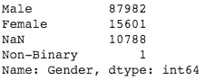

我想从历史上了解收购趋势，特别是一件新作品被现代艺术博物馆收购需要多长时间。使用 seaborn 散点图，我可以很快地按性别分组。这张图表强调了这个系列是多么的男性化。我们看到，随着时间的推移，女性艺术家对艺术的获取有所增加。

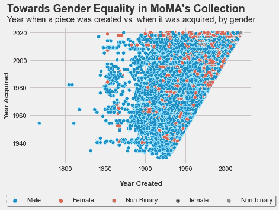

在创造年份和获得年份之间也有明显的滞后，但不清楚这是否在性别之间有所不同。为了回答这个问题，我创建了一个新的特性——艺术时代，方法是从获得年份中减去创造年份。然后，我为交叉列表创建了艺术时代箱。我们可以看到一个轻微的趋势:大部分女性艺术品(68%)是在创作后 20 年内获得的，而男性艺术家的这一比例为 53%。均值柱状图更清楚地说明了这一点:男性艺术家平均需要 25 年才能获得自己的艺术作品，而女性艺术家平均需要 17.5 年。

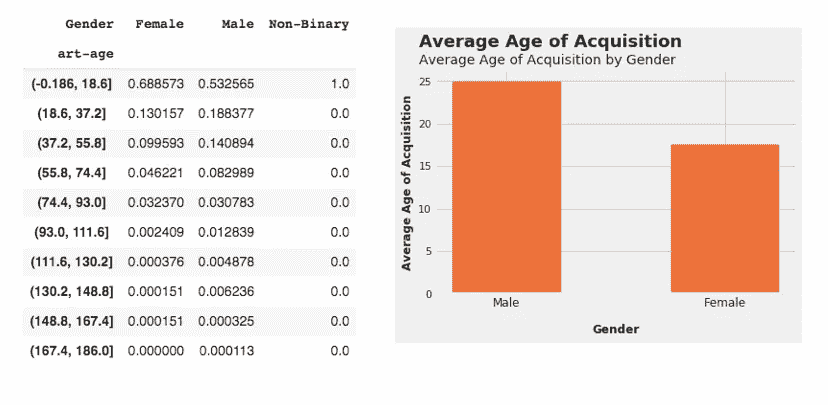

博物馆收购哪些类别的艺术品有区别吗？该数据集为我们提供了三个日益细化的艺术品类别选项:部门、分类和中等。我选择了 Department，因为它对探索性分析所必需的 7 个最广泛的艺术类别进行了高度概括。最受男性和女性艺术家欢迎的类别是绘画和版画。

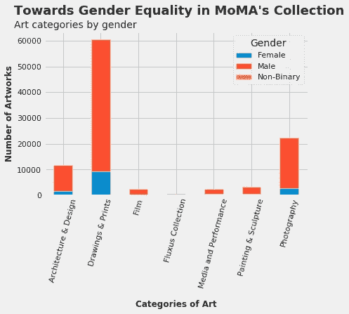

收购趋势如何按艺术类别细分？我们在下面的两个图表中看到，绘画和印刷以及建筑和设计在两个分组中都占主导地位，因此很难看出较小类别的趋势。在男性艺术家中，我们看到了 20 世纪 60 年代的两年，当时 MoMA 可能通过礼物捐赠获得了大量收藏。我们也看到类似的情况，但女性艺术家的收购数量更大，几十年来收购数量越来越稳定。

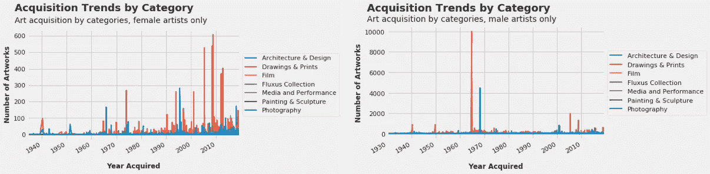

这些艺术品的创作日期呢？我们再次看到，80 年代后创作的大量绘画和版画，无论男女，都有着相似的总体趋势。建筑与设计小组看起来略有不同:女性艺术家的收购作品在 20 世纪 20 年代和 30 年代急剧上升，而男性艺术家的收购率在 20 世纪初和 70 年代后期飙升。

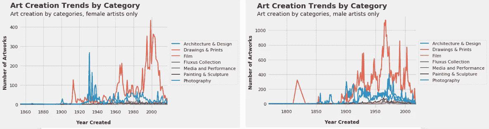

游击女孩和他们那个时代的其他激进组织并不仅仅关注性别平等。他们也对种族平等感兴趣。数据集为我们提供了艺术家的国籍，其中有 125 个。国籍并不能很好地代表种族，所以我想回答的问题需要稍微修改一下:MoMA 有多美国化？

为了做到这一点，我创造了一个新的功能，将美国创作的艺术作品与非美国创作的艺术作品分开。令人惊讶的是，我们看到外国出生的艺术家创作的艺术品主导了博物馆的收藏。

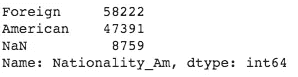

在第一张图中，我们看到了与性别细分分析相似的趋势。在艺术品被收购之前有大约 20 年的滞后期。

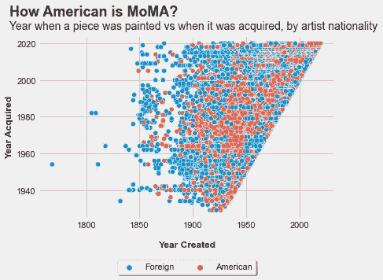

这两个群体最受欢迎的作品是绘画和版画，其次是摄影、建筑和设计。

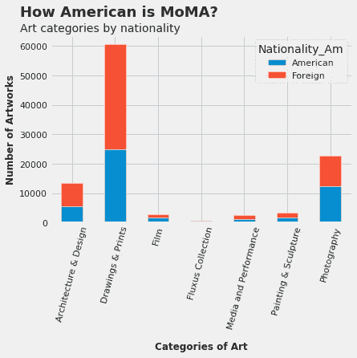

数据集非常丰富，我们还可以问更多的问题:

*   捐赠者:他们是谁？它们在捐款规模、喜欢的艺术家类型(包括性别和国籍)方面有所不同吗？这尤其困难，因为有 6722 个独特的捐赠者要重新分类到更小的箱中。
*   尺寸:数据集为每件艺术品提供尺寸和其他细节。艺术家们在艺术项目的实际范围上是否因性别、国籍或年龄而有所不同？
*   年龄:我们可以计算出艺术家创作一件艺术品的年龄，艺术创作是否在人生的某个时期集群？这是否因性别而异？