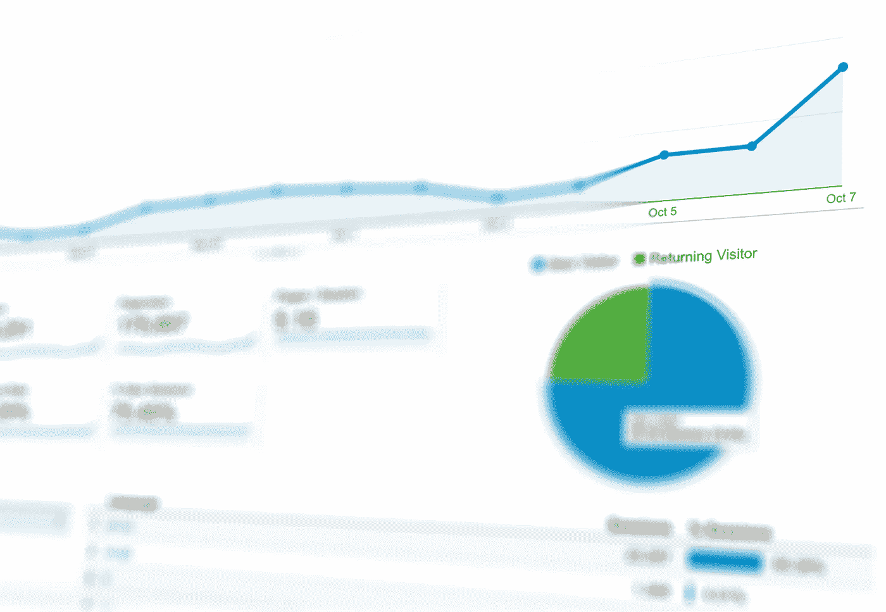
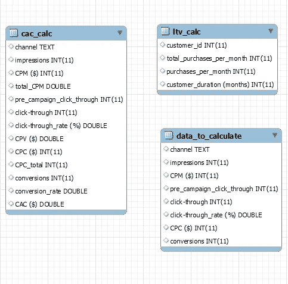
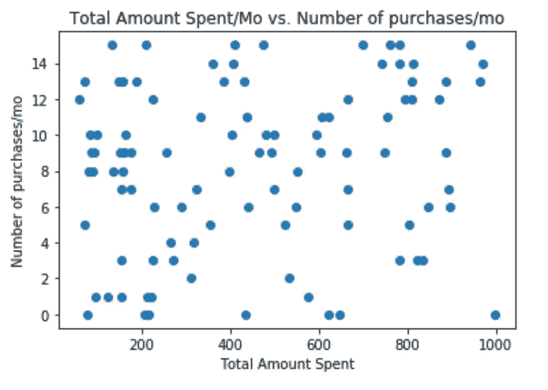
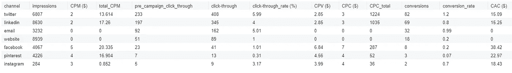

# 最好的客户在哪里？SQL 和 Python 中的营销分析

> 原文：<https://towardsdatascience.com/where-are-the-best-customers-marketing-analytics-in-sql-and-python-a20ca16968ea?source=collection_archive---------15----------------------->

我从事营销工作，所以我想探索如何使用编程工具来探索客户数据，并计算关键的营销指标，如客户终身价值(LTV)和每获得一个客户的成本(CAC)。

这些指标对于理解和跟踪每个营销渠道至关重要。这些指标可能因渠道而异(例如，社交媒体的印象和参与度、电子邮件的打开率和点击率等)，但对于企业来说，这些指标都很有价值。

通过查看这些数据点，您可以根据它们进行排序和筛选，从而根据您获得的客户数量(CTR)和每位客户获得的客户数量(CAC)来确定给定渠道的绩效。强大的东西！

让我们开始吧。

点击这里查看回购[，如果你喜欢的话，可以阅读`/02_code`中的 SQL 脚本和笔记本。](https://github.com/rileypredum/marketing_analytics_sql)

数据以`.csv`格式保存在`/01_data`文件夹中。首先，您需要在您选择的 SQL 客户机中创建一个数据库(我使用 MySQL)。如果你不确定，你可以在这里[阅读如何做到这一点。](https://dev.mysql.com/doc/refman/8.0/en/creating-database.html)

一旦你拥有并正在使用数据库(`use [database_name]`，你需要将`.csv`文件导入数据库。我使用了 MySQL 的导入表向导，它很适合这个数据集，因为它很小(尽管它对于大的数据表效率不高)。

为了熟悉数据库及其表，查看模式或增强的实体关系(EER)图是很有用的:

Table schema for the different tables in this data base

在这种情况下，它没有那么有用，因为这些表之间没有关系。但是，如果您有一个更复杂的数据库，有许多不同的关系，您会发现自己经常要返回到模式中去整理东西。

继续尝试这里的每一段代码，看看在您的控制台中返回了哪些计算/列。在 SQL 中，查询的结尾由一个`;`分隔。

Code for calculating each metric

接下来，启动 Jupyter 笔记本，用第一个电池做好准备。如果您从 repo 中的位置运行笔记本，则不需要更改目录。为此设置的代码如下:

然后，您可以使用下面的代码直观地显示每个客户每月花费的总额以及他们每月购买的数量:

Code for plot of purchase amount (in USD) against number of purchases per month

Purchase amount (in USD) against number of purchases per month

这里没有很强的相关性，但观察这些点如何下落并确定是否有关联仍然很有趣。知道没有关联和发现有关联一样有价值！

这是令人难以置信的强大的东西，因为你可以看到最大数量的廉价获取客户来自什么营销渠道。接下来我将展示 SQL 代码的输出。

Table of conversions, ordered by conversions in descending order.

在这种情况下，尽管 Twitter 活动的印象较低，但它带来了更多的点击率和最多的转化。它的人均消费成本最低，为 15.09 美元。凭借 34，448 美元的 LTV，这是一笔非常值得的投资！Twitter 有些事情进展顺利。

您可以很快看到这会产生多大的影响，以及如何利用它来推动业务和营销决策和战略。当你有疑问时，看看数据吧！

喜欢你读的吗？我还有[多篇文章](https://medium.com/@rileypredum)。

想看更多的编码项目？我也有[更多的那种](https://github.com/rileypredum)。

如果你觉得这篇文章有用或者学到了新的东西，[可以考虑捐赠](https://www.patreon.com/rileypredum)任何数量的钱来支付给下一个学习者！

感谢阅读和快乐编码！

奢侈的生活