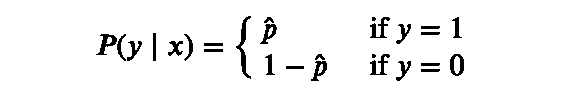
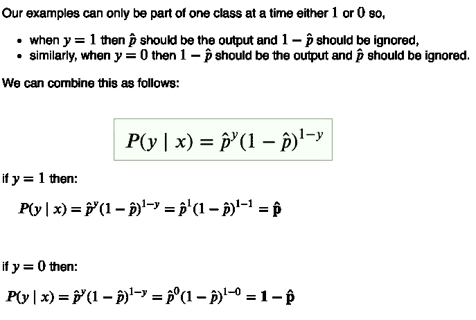
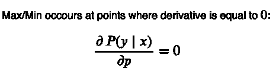
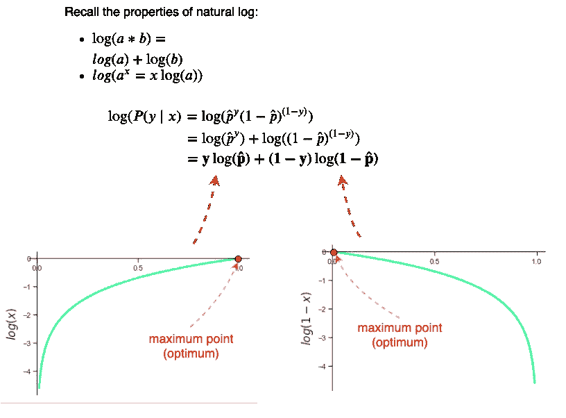
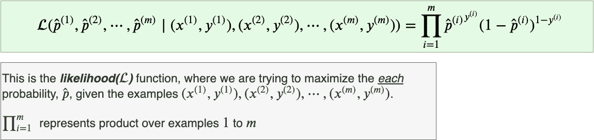
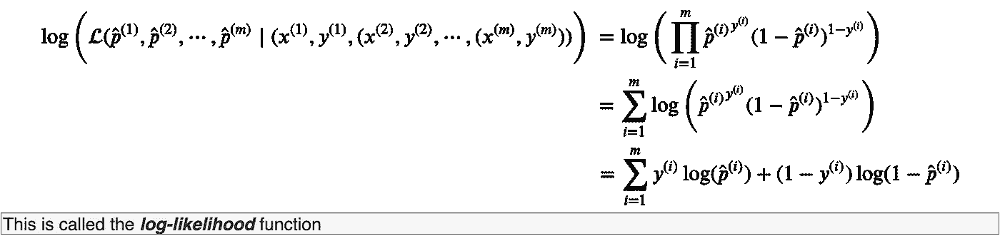
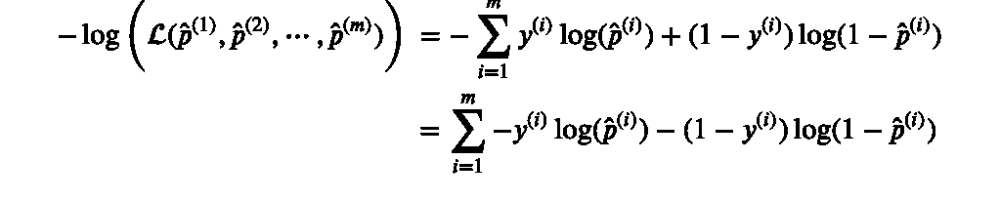
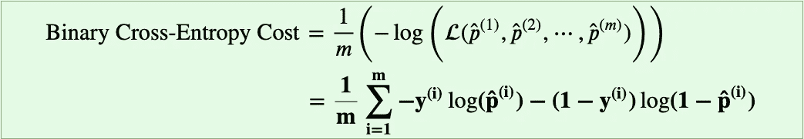

# 二元交叉熵损失函数从何而来？

> 原文：<https://towardsdatascience.com/where-did-the-binary-cross-entropy-loss-function-come-from-ac3de349a715?source=collection_archive---------4----------------------->

*博文补充部分"* [*无非 NumPy:理解&从零开始用计算图创建二分类神经网络*](https://medium.com/@rafayak/nothing-but-numpy-understanding-creating-binary-classification-neural-networks-with-e746423c8d5c)

*二元分类提出了一个独特的问题，其中:*

1.  **每个例子(* **x** *，* **y** *)都属于* ***两个*** *互补类*、*
2.  **每个示例相互独立(即一个示例的结果不会影响另一个示例的结果)并且*，*
3.  **所有生成的示例都来自相同的底层分布/过程(即，如果我们为“猫对非猫”检测创建数据集，那么我们输入神经网络用于训练“猫对非猫”的所有示例都应该来自相同的数据集，而不是来自不同的不相关数据集，例如“狗对非狗”的数据集)。**

*在统计学和概率论中，属性 *2* 和 *3* 统称为 ***i.i.d(独立同分布)。******I . I . d .***假设有助于使许多计算简单得多。*

*此外，我们只需要预测正类*即****p(y = 1 | x)=p̂***因为负类的概率可以从中导出*即****p(y = 0 | x)= 1-p(y = 1 | x)=1-p̂***。*

**

*Fig 1\. Piecewise probability expression*

*一个好的二进制分类器应该产生一个 ***高*** 值的*当例子有一个正标签( ***y=1*** ) **。**另一方面，对于一个负标签的例子( **y=0** )，分类器应该产生一个 ***低******p̂*的值。** 换句话说:**

*   ***最大化* ***p̂*** 当 ***y=1*** 和**
*   ***最大化* ***1-p̂*** 当 ***y=0 时。*****

**让我们看看如何将这种直觉结合成一个单一的表达:**

****

**Fig 2\. Bernoulli Distribution expression**

**原来我们想出来的单行表达式，在上图中，叫做*伯努利分布，计算它为*单个数据点*叫做 ***伯努利试验*** 。我们需要*最大化****伯努利分布*** *对于每一次试验*，我们该如何做呢？这很简单，回想一下你的高中时代，任何凸函数(u 形函数)的最大值(或最小值)都出现在 1ˢᵗ导数等于零的点上。***

****

**Fig 3\. At min/max of a function, the derivative is zero**

**使用 ***伯努利分布*** 表达式及其导数的计算在其当前形式下可能会有点麻烦，更不用说小值的乘法和幂运算可能会在数值上不稳定，并可能导致数值溢出。幸运的是，**(由“* log *”表示，而不是“*ln*”*)可以在这里帮到我们。***

****

**Fig 4\. Taking log of Bernoulli Distribution**

***请注意，在将自然对数应用于伯努利分布后，我们将表达式简化为概率对数的总和**。此外，请注意，这个简化的表达式非常类似于二元交叉熵损失函数，但符号相反。为了通过数值方法达到伯努利分布 的 ***对数的最大点(即朝着最优点的方向迭代移动)，我们需要执行 ***【梯度上升】*** *，因为对数函数的曲线向上弯曲(* ***图 4*** *)，即凹形* ***。*** 在神经网络中，我们更喜欢用 ***梯度下降*** 而不是 ***上升*** 来寻找最优点。我们这样做是因为神经网络的学习/优化被设定为一个"*损失最小化"*问题，所以这是我们将负号添加到伯努利分布*** *的 ***对数的地方，结果是二元交叉熵损失函数:*******

**

*Fig 5\. Taking negative of the log of Bernoulli Distribution*

***注意*最大化*伯努利分布的*对数与*最小化*伯努利分布的*负对数相同。**** *最小点和最大点出现在同一点，现在我们可以很容易地应用梯度下降，沿着曲线向下移动到最佳点。**

*使用一个叫做 ***最大似然估计(MLE)*** 的概念，我们可以扩展伯努利分布，得出*二元交叉熵成本*函数。回想一下，对于单个数据点，我们将最大化一次伯努利试验，*对于多个数据点，我们将最大化多次伯努利试验的乘积。**

*考虑以下示例，其中我们有两个分类器 A 和 B，它们对三个**I . I . d .**示例进行概率预测:*

*   *分类器-A : P(X₁),P(X₂),P(X₃) = 0.7，0.8，0.9*
*   *分类器-B : P(X₁),P(X₂),P(X₃) = 0.8，0.8，0.8*

*那么对于我们的三个例子 X₁，X₂和 X₃，哪个分类器更有可能是更好的分类器呢？*

*根据 MLE，具有最高概率乘积的分类器**可能**是更高级的分类器。让我们检查一下:*

*   *分类器-a:p(x₁)×p(x₂)×p(x₃)= 0.7×0.8×0.9 = 0.504*
*   *分类器-b:p(x₁)×p(x₂)×p(x₃)= 0.8×0.8×0.8 = 0.512*

*所以分类器-B 是 ***更可能是*** 更好的分类器。*

*将此概念应用于多个独立伯努利试验(*具有多个独立伯努利试验的分布被称为* ***二项式分布*** )并最大化数据集/批次中每个***【m】***示例的概率，我们得到:*

**

*Fig 6\. The Likelihood function*

*当前形式的 ***似然*** 函数容易因为多个乘积而出现数值溢出。所以我们将改为取似然函数的 ***自然对数。****

**

*Fig 7\. Log of the likelihood function*

*回想一下，最大化一个函数与最小化该函数的负值是一样的。*

**

*Fig 8\. The negative Log-likelihood function of the Bernoulli Trails*

*由于 ***缩放函数不会改变函数的最大值或最小值*** 点(例如， ***y=x*** 和 ***y=4x*** 位于 ***(0，0)*** 处)，所以最后，我们将*负对数似然*函数除以示例总数( ***原来是我们一直在用的二元交叉熵(BCE)代价函数。****

**

*Fig 9\. Binary Cross-Entropy Function is Negative Log-Likelihood scaled by the reciprocal of the number of examples(m)*

*最后，我们假设基础数据服从伯努利分布，这使得我们可以使用最大似然法并得出一个合适的成本函数。 ***数据的这种假设/知识在贝叶斯统计中称为“先验”。****

*如有任何问题，请随时在[Twitter](https://twitter.com/RafayAK)[**@**RafayAK](https://twitter.com/RafayAK)上联系我，并查看“[二元分类](https://medium.com/@rafayak/nothing-but-numpy-understanding-creating-binary-classification-neural-networks-with-e746423c8d5c)上的其余帖子。*

*

If you enjoyed it!*