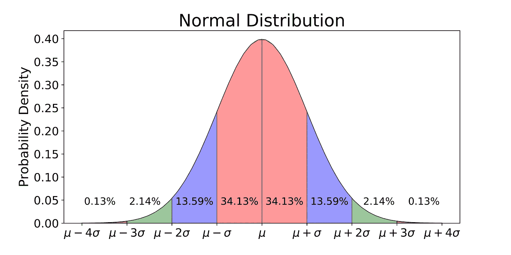

# 你在数据科学分布中处于什么位置？

> 原文：<https://towardsdatascience.com/where-do-you-fall-on-the-data-science-distribution-d289b8de6970?source=collection_archive---------29----------------------->

你有没有过这样的感觉:你毁了一次求职面试，最终没有得到这份工作。或者完全炸毁一个技术屏幕并仍然进入下一轮怎么样？你并不孤单，招聘标准充其量是令人困惑的，但它仍然回避了一个问题:你如何知道与你的同行相比，你表现得有多好？

本周单词是**校准**。招聘人员、面试官和公司使用校准来描述他们在理解和优化面试漏斗方面的匹配程度。这是我一个沮丧的老同事的例子。

我的同事 Bob 是 X 公司的产品经理，他正在通过外部招聘机构招聘工程师。Bob 感到沮丧的是，招聘机构发送的工程候选人中只有 10%通过了技术面试。在这种情况下，招聘机构没有按照公司和 Bob 的标准进行校准，不了解 X 公司在他们的候选人身上寻找什么信号。他们也可能在最初的电话筛选中不够努力，不了解候选人背景的哪些部分不适合这个角色。

在[面试提问](https://www.interviewquery.com/)中，我们发现招聘的概念有点令人着迷。每天都有一名数据科学家在一家公司接受面试，面试问题应该是**通过噪音**检测信号，这是一种衡量谁将成为高效员工、谁不会的方法。可以想象，这个过程并不总是 100%准确。即使前面例子中的招聘机构只送来了出色的候选人，他们以优异的成绩通过了每一次面试，面试仍然可能有缺陷，因为**面试可能太容易了**，潜在地导致最终糟糕的聘用。

我们有兴趣在数据科学家中测试一些与我们自己的校准相关的东西。本周，我们**从科技公司收集了八个面试问题**，涵盖了数据科学的许多不同主题，并将其纳入了一个[多项选择和自由形式的测验](https://interviewquery.typeform.com/to/t6mTPN)。测验应该不到 20 分钟，在测验结束时，在我们收到足够多的结果后，我们将通过电子邮件向您发送您的分数，以及与参加测试的其他数据科学家相比，您在该分布中的排名**如何。**

这对你有什么好处？如果我们的测验足够准确，假设没有其他人作弊或在测验中花费异常长的时间，你将了解自己与参加测试的其他数据科学家相比的排名。

两周后，我们将通过另一封每周邮件跟进测试发行版的结果。我们真正想知道的是，小测验中的面试问题在多大程度上分散了结果的分布？我们的测试是不是太简单了，我们会看到平均 90%左右的准确率，还是测试太难了？

[**在这里试试我们的**](https://interviewquery.typeform.com/to/t6mTPN) **！**

*有兴趣在下一次数据科学面试中脱颖而出吗？* [***退房面试查询***](https://www.interviewquery.com/) ***！***

在我的[博客](https://www.racketracer.com/)中有更多类似的数据科学故事。