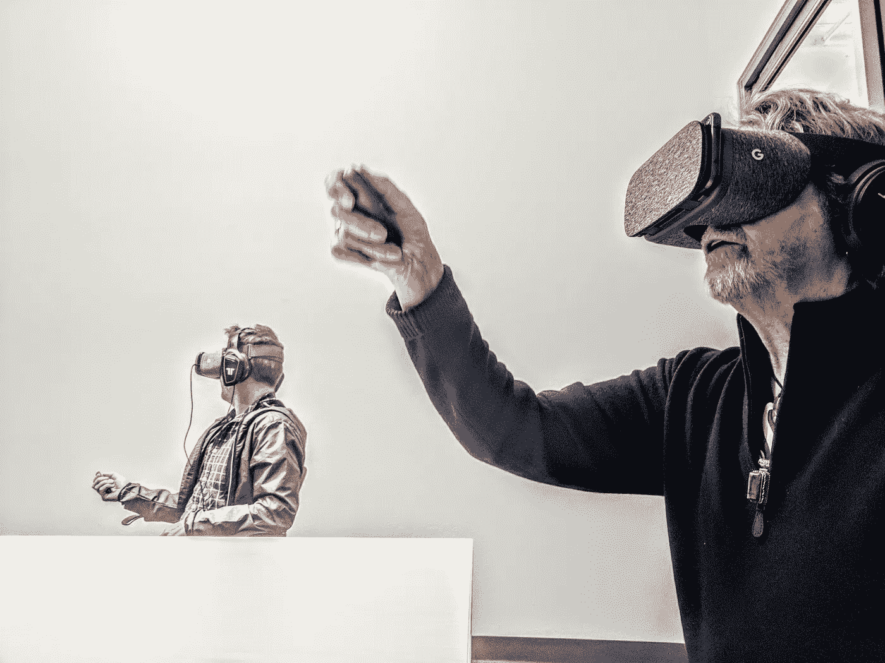
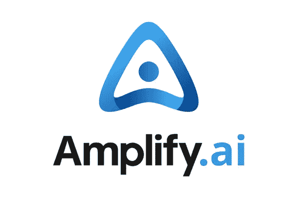
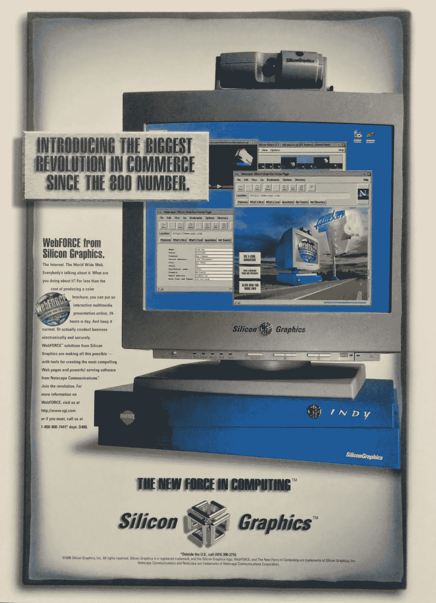
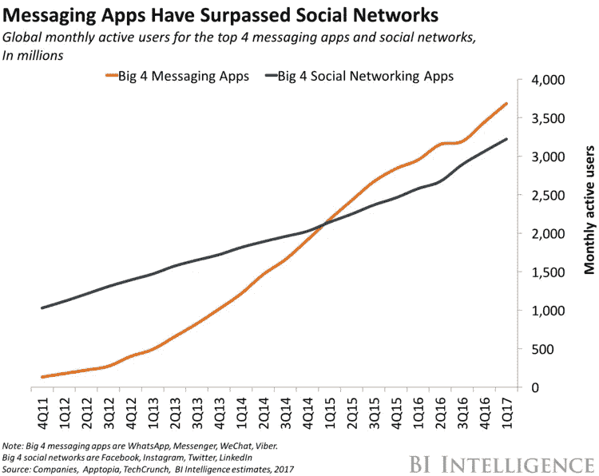

# 我降落的地方

> 原文：<https://towardsdatascience.com/where-i-landed-a569b4d0182d?source=collection_archive---------37----------------------->

**【也是自网络以来最大的商业革命】**

一年多前，我在这里写了关于[“我的虚拟现实创业公司的生与死”](https://virtualrealitypop.com/on-the-life-and-death-of-my-virtual-reality-startup-ethereal-f9106b8c6db1)，并被我得到的回复震惊了。其中一封电子邮件让我见到了一位真正的摇滚明星，并向他演示了我们的平台:进步摇滚乐队的乔恩·安德森，是的！

通过我们的虚拟现实软件，让他以身临其境、互动和社交的方式体验他正在制作的新专辑中的[，这是一种荣誉和激动。](https://www.youtube.com/watch?v=sGJrBbg3QkU)

Legendary rockstar, Jon Anderson (right) in Ethereal, together with rockstar 3D artist, Adrian Ludley (left)

尽管如此，我还是在去年 4 月关闭了 Ethereal，正如我的帖子所说，我开始思考自己的下一步。

过去的经验告诉我，寻找新机会的最佳第一步是环顾四周，看看地平线上是否有任何技术“大浪”。你看，我过去有幸骑过其中的两辆。1994 年，当我在硅谷开始职业生涯时，我在正确的时间和正确的地点发现网络是一个真正巨大的浪潮，并在硅图形公司兴致勃勃地驾驭它。2007 年，在 Plaxo，我乘着社交网络的浪潮取得了巨大的成功。

去年，我环顾四周，很明显，一个巨大的浪潮已经形成，不是在远处，而是在我周围:人工智能(AI)。我对人工智能超级明星吴恩达的这句话产生了共鸣，“就像 100 年前电力改变了一个又一个行业一样，我认为人工智能现在也会这样做。”像*电*那么大的事？算我一个！

所以我去寻找需要 CMO 的早期人工智能软件初创公司。一路上，我和老朋友[葛瑞格·桑斯](http://www.costanoavc.com/team/greg-sands/)在[科斯塔诺阿风险投资](http://www.costanoavc.com/)重新取得了联系。事实证明，他的一家投资组合公司正在对话式人工智能和消息传递的交叉领域做一些非常有趣的事情。(不止一个，而是*两个*大浪！)而且他们没有合适的营销主管。

在被介绍给首席执行官马希·德·席尔瓦(Mahi de Silva)的几天内，我开始向他们咨询(这是一个潜在员工了解团队和公司的好方法，反之亦然)。令我高兴的是，第一个项目是营销人员的梦想:为公司想出一个新名字(以及一个新标志)。

幸运的是，这两个项目和随后的一系列项目都很顺利，我最终被团队、市场机会、技术和牵引力所折服，最终我跳上了船，现在我就是 CMO。公司是 [Amplify.ai](https://www.amplify.ai) 。(顺便说一句，我很惊讶也很高兴我们能用几千美元买下那个域名，考虑到“放大人类的努力”对人工智能的故事是多么重要！)

在深入讨论我们要做的事情之前，请允许我设置一些更广泛的背景。当我乘坐我的第一个大浪时，我有一种深刻的，发自内心的感觉，网络将会改变，嗯，*一切*。当我们在 1995 年 1 月推出 WebFORCE 时，我们在《华尔街日报》、《连线》和许多早已过时的技术行业印刷出版物上刊登了整版广告，宣布引入“自 800 号码以来最大的商业革命”。

“Introducing the biggest revolution in commerce since the 800 number”

事后看来，我们做到了。事实上，自从免费电话号码在全国范围内消除了电话互动的摩擦以来，网络确实成为企业与潜在客户和客户互动方式的最大变化。在这个过程中，网络给我们带来了数字化的、自助式的、即时的信息访问，在这个过程中，我们越来越不能容忍交互式语音应答系统和穆萨茨式的等待。

快进到现在。现在是 2019 年，消息传递已经赢得了数字通信渠道战争。Facebook Messenger、WhatsApp 和其他通讯应用是人们相互沟通的主要数字方式，也越来越成为人们喜欢与购买产品和服务的公司沟通的方式。在使用方面，短信不仅仅让电话和电子邮件黯然失色；据 Business Insider 报道，消息传递甚至已经超过了社交网络！(有趣的是:在脸书以 190 亿美元收购 WhatsApp 大约一年后，即时通讯超过了社交。)

Messaging has overtaken phone, email, and even social networking! [Source: BI Intelligence, 2017]

这对各种规模和类型的 B2C 企业都有重大影响。忽略消息传递的代价会越来越高。对于中小型企业来说，让一个人来回复入站消息可能是可行的。但是对于大品牌来说，没有一种经济的方法可以雇佣人来实时回应潜在客户和顾客的每一个询问。

这就是 Amplify.ai 的用武之地。两年来，我们一直在开发业界第一个也是唯一一个企业级的“人工智能驱动的互动平台”，以在超人的规模上实现所有“对话表面”之间持久、个性化、基于消息的互动。我们让营销和客户支持团队能够在整个客户旅程中拥有即时有效的自助交互，仅在必要时移交给人工。

基于消息传递的“对话式商务”是真正的游戏规则改变者。除此之外，它为数字营销人员提供了一个新的渠道，可以看到 80%以上的打开率！我认为我们正在看的是自网络以来商业领域最大的变化。该领域的另一家公司 LivePerson 的首席执行官在[最近的收益电话会议](https://www.fool.com/earnings/call-transcripts/2019/02/22/liveperson-lpsn-q4-2018-earnings-conference-call-t.aspx)上提出了一个令人信服的案例，即对话式商务是一个价值 2000 亿美元的市场机会！

在过去的一年里，我们已经证明了这种新的消费者参与方式能够大规模发挥作用。代表我们的客户，我们的人工智能驱动平台已经处理了全球超过 1.5 亿消费者的超过 20 亿次交易。现在，它每秒钟(平均)捕捉、评分并采取行动 60 次新的消费者参与*！我们只是在第一局。*

正如你们所知，我对我的硅谷之旅的下一个篇章感到非常兴奋。感谢您的关注！