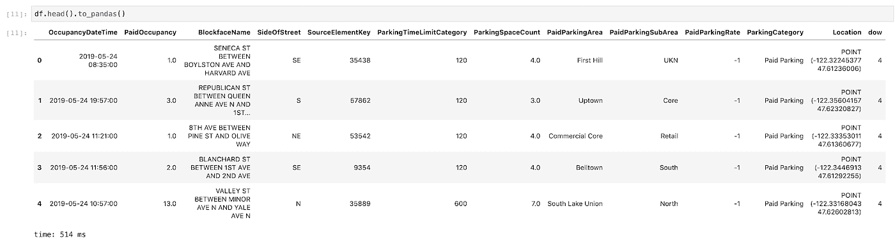
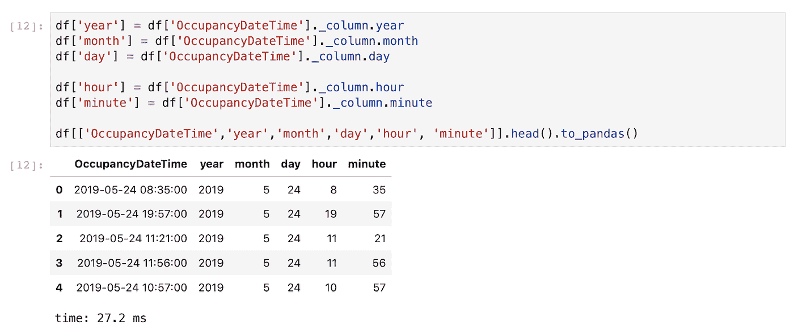
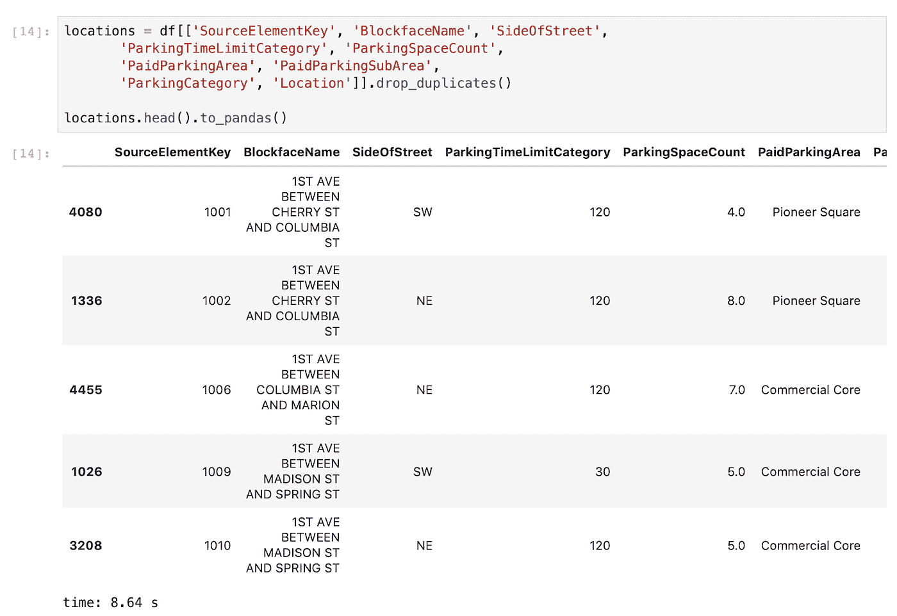
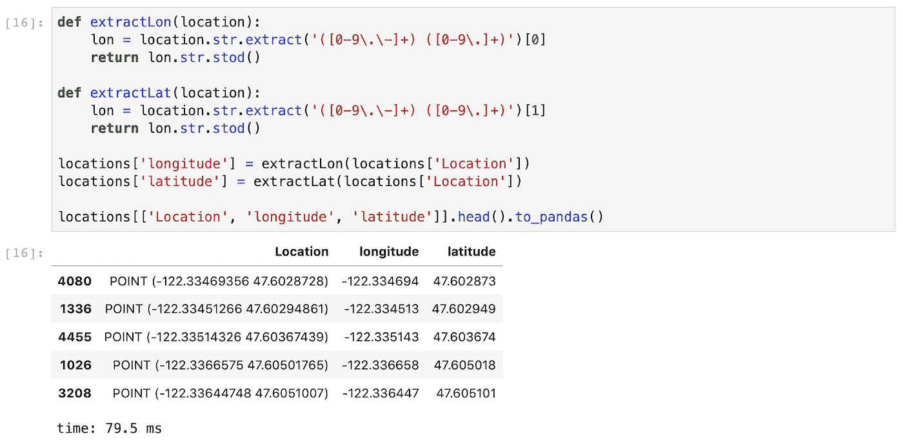
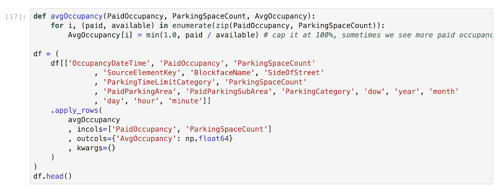
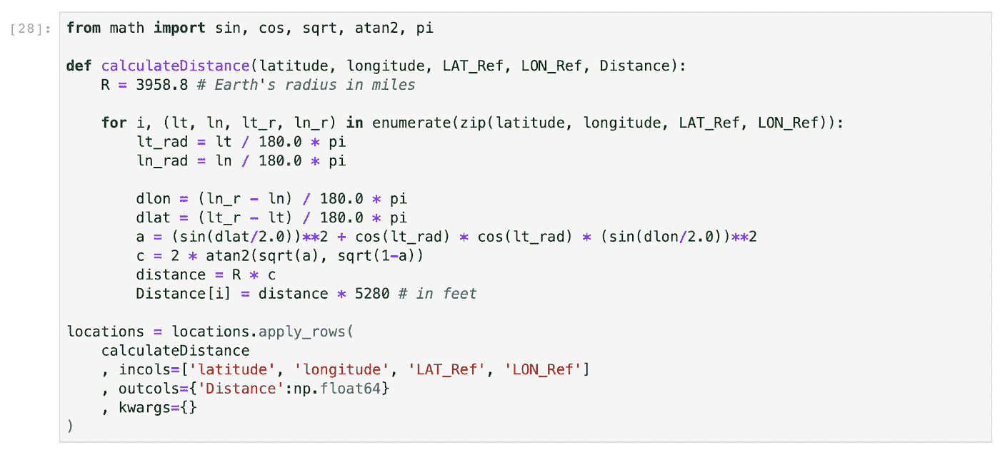
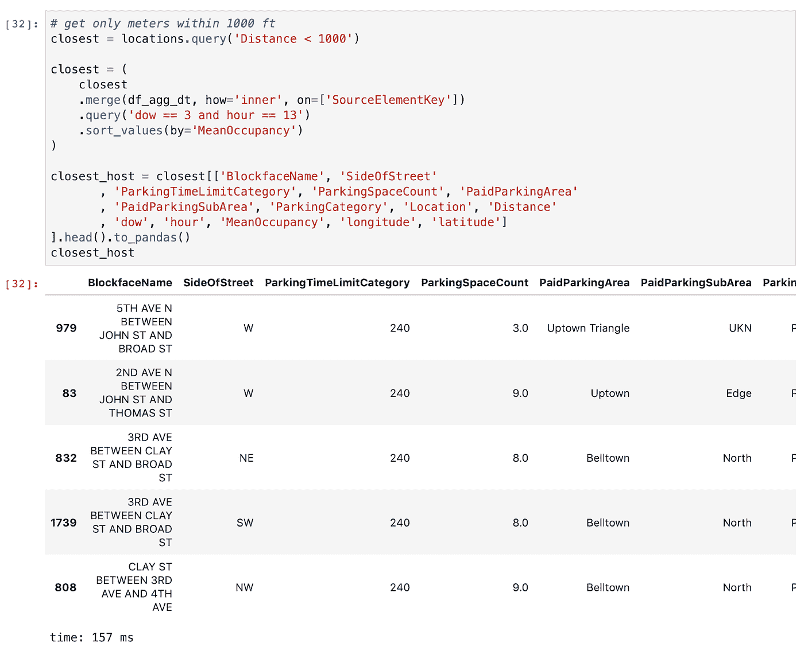
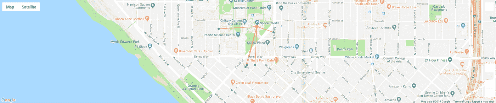

# 我应该在哪里停车？！

> 原文：<https://towardsdatascience.com/where-should-i-park-29e8da95265a?source=collection_archive---------35----------------------->

## 使用 NVIDIA RAPIDS 挖掘西雅图停车数据

“Seattle from Kerry Park” by Tom Drabas

在西雅图开车正迅速变得与在旧金山、硅谷或洛杉矶等城市开车非常相似:越来越多的公司选择在西雅图定居或开设办公室，以便能够进入西雅图提供的技术社区。因此，在西雅图停车一天比一天难。

[西雅图市交通局提供的付费停车占用率](https://data.seattle.gov/Transportation/2019-Paid-Parking-Occupancy-Year-to-date-/qktt-2bsy)数据集提供了每年约 3 亿次停车交易的视图，这些交易来自约 1500 个街区的约 12000 个停车位。该数据集不包括周日的任何交易，因为没有付费停车。大多数停车点有 2 小时的限制。

我对数据集进行了子集划分，以包括 2019 年 5 月和 6 月的所有交易，因此它非常适合配备 24GB VRAM 的[英伟达泰坦 RTX](https://www.nvidia.com/en-us/titan/titan-rtx/)；数据集的大小大约为 7GB，一旦加载到 GPU 的内存中，就会扩展到大约 12GB。我们将使用的数据集可以从[这里](http://tomdrabas.com/data/seattle_parking/parking_MayJun2019.tar.gz)下载，下面讨论的所有代码(以及更多！)可以在 [Github](https://github.com/drabastomek/rapids-notebooks/blob/master/codes/rapids_seattleParking.ipynb) 上找到。

# **数据探索**

我创建的停车数据集包含近 4900 万条记录(平均每天约 95.5 万条)和 13 列。每一行代表一个单独的交易及其所有的元数据，例如交易时的已付占用率或区块名称。它还包含以 WKT(众所周知的文本)格式编码的停车场的确切位置。请参见下面的数据集示例。

# **特征工程**

RAPIDS 是一个很棒的框架，它几乎不需要修改 vanilla pandas 的代码就能工作(API 99.9%兼容)，并且比运行在 CPU 上的任何代码都实现了巨大的加速。这就是为什么使用 RAPIDS 的特征工程如此简单和容易。事实上，这也挑战了人们的信念(或抱怨，取决于你如何看待它)，即数据科学家 80–90%的时间都花在数据清理和探索上，只有 10–20%的时间花在构建实际的机器学习或深度学习模型上:使用 RAPIDS，这些比例可以明显向构建模型的有趣部分*倾斜。*

## **提取日期元素**

首先，我们将*将日期*分解成基本元素，如年、月、日、小时和分钟，这样以后我们在搜索停车地点时，实际上可以汇总一周中的每一天和每一小时。

27 毫秒后，我们得到了结果。是的，这不是打字错误:在**的 27 毫秒**中，我们提取了几乎 4900 万条记录的OccupancyDateTime 列的基本组成部分！光速！

“Speed of light” by [allenhimself](https://www.flickr.com/photos/allenhimself/14267437660) licensed under [CC BY 2.0](https://creativecommons.org/licenses/by/2.0/) (aspect ratio changed)

## **停车地点**

西雅图有 1528 个停车场。与 pandas 类似，为了从数据帧中提取不同的行列表，我们使用 drop_duplicates(…)方法。

完成以上工作后，我们现在可以将目光转向从 Location 列中提取经度和纬度。RAPIDS 0.6 增加了对字符串的初始支持，现在在 0.9 版中我们有了对正则表达式的支持，为什么不使用它呢？！下面的模式主要是在一个字符串中搜索两个浮点数，并将第一个浮点数作为经度返回，第二个浮点数作为纬度返回。

[stod()](https://rapidsai.github.io/projects/nvstrings/en/0.9.0/api.html#nvstrings.nvstrings.stod) 方法将提取的字符串转换成十进制数。

## **计算平均付费入住率**

为了提高速度，apply_rows(…)方法允许我们扫描所有的行并应用一些转换。全部使用普通 Python 代码完成！没有必要玩 CUDA 来利用 GPU 的能力！

上面的代码需要大约 1.7 秒来计算 48M 行的平均占用率。剩下的工作是汇总每个停车位标识符(SourceElementKey 列)、星期几和小时。

# **寻找最佳停车位**

最后一步，让我们检查我们应该停在哪里？我正在使用 [geopy](https://geopy.readthedocs.io/) 框架和 nomim 地址编码器来检索[太空针](http://www.spaceneedle.com/)的地理坐标！顺便说一下，这些是(122.349304W，47.620513N)。

使用哈弗辛公式，我们现在可以计算从太空针到数据集中每个停车位置的距离。

现在，假设我们想在周三下午 1 点左右参观太空针塔(这样我们可以避免排长队……)，我们可以快速合并我们之前创建的聚合数据集，并将其子集化为 1000 英尺以内的停车位。

检索到最近的位置后，让我们在地图上可视化它们，以便在参观西雅图的标志性场所时更容易找到它(它离西雅图的另一个标志性场所[派克市场](http://pikeplacemarket.org/)不远！)

# **总结**

以上所有，端到端，大约需要 20 秒；推理部分本身只需要大约 1.6 秒，一旦完成所有的聚合，这些聚合可以重复使用，直到第二天新的停车交易可以用于更新停车位的占用率。

急流的力量(特别是在泰坦 RTX 上运行，它有 24GB 的 VRAM！！！)而 GPU 是巨大的，我们现在只是触及了它的皮毛。愿(通用)部队(或者更好的，RTX)与你们所有人同在！